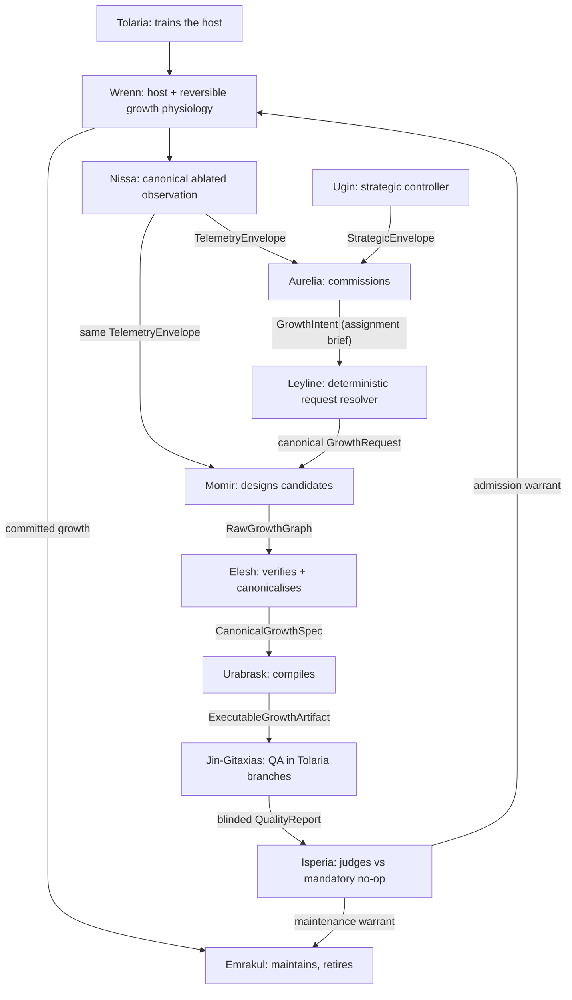

# Simic Architecture

A one-page digest of the system shape, for orientation. It is **derived**
from the canonical HLD chapter set under [`docs/design/`](docs/design/00-INDEX.md)
— chiefly [`04-architecture.md`](docs/design/04-architecture.md) and
[`02-constitution.md`](docs/design/02-constitution.md). If this file
disagrees with those chapters, they win.

Simic grows a neural network at runtime by **generating** new structure from
the live state of the host — not selecting it from a menu of human-authored
blueprints — then testing that structure in matched counterfactual branches
and admitting it only if it beats doing nothing. The architecture exists to
keep four questions separate: *what* to build, *whether* it is sound,
*whether* it helps, and *who* decides.

## Planes

Authority is split across fourteen bounded domains, grouped into planes.
Three domains are infrastructure (named with prepositions: *under* Leyline,
*in* Tolaria, *from* Urborg); eleven are agents (named with verbs). A
subsystem acting contrary to its verb is exercising authority it must not
have — the names are an architecture linter.

| Plane | Domains | Purpose |
|---|---|---|
| Constitutional infrastructure | Leyline | Contracts, grammar profiles, compatibility, the deterministic request resolver |
| Training and execution infrastructure | Tolaria | Trains the live host; executes deterministic ordinary, replay and branch worlds |
| Historical infrastructure | Urborg | Append-only history: lineages, outcomes, failures, split-safe datasets |
| Strategic agency | Ugin | Allocates regional resources, permissions and risk over long horizons |
| Tactical commissioning | Aurelia | Decides whether and where to commission growth; pre-commit lifecycle actions |
| Observation | Nissa | Publishes what the host is doing without prescribing what to build |
| Synthesis | Momir, Elesh, Urabrask | Designs, canonicalises and compiles growth |
| Assurance and adjudication | Jin-Gitaxias, Isperia | Establishes empirical evidence, then judges it independently |
| Embodiment and maintenance | Wrenn, Emrakul | Introduces growth safely; removes obsolete committed structure |
| Witness | Tamiyo | Exposes an auditable account without steering anything |

## The pipeline

Every stage also appends its records to Urborg and projects events to
Tamiyo; those edges are omitted above for legibility. Two details in the
diagram are load-bearing:

- **Nissa publishes the same observation identity independently to Aurelia
  and Momir.** Aurelia is not a telemetry proxy: a `GrowthIntent` carries
  scope and operational constraints only — diagnosis, topology and ancestry
  hints are schema-invalid (INV-07, INV-09).
- **The request resolver is not a fifteenth agent.** It is a pure Leyline
  service that combines `GrowthIntent` + `StrategicEnvelope` + Wrenn's
  `RegionContract` + the active `GrammarProfile` into one canonical
  `GrowthRequest`, can only narrow authority, and fails closed on
  incompatibility (INV-10, INV-11).

The assurance loop: Jin-Gitaxias builds a blinded `TestPlan`; Tolaria restores a
common snapshot and runs candidate branches, controls, and a **mandatory
no-op branch** over identical future data; Jin-Gitaxias certifies the evidence
into a `QualityReport` without issuing a verdict; Isperia applies
eligibility, budget, risk and utility policy and returns one of
`ADMIT / NO_OP / REJECT / DEFER / REQUIRE_RETEST`. Admitted growth
germinates at zero influence, matures, blends in reversibly, and at commit
passes from Aurelia's ownership to Emrakul's, where it must keep earning its
tenancy through periodic counterfactual review (`RETAIN / RETEST / SEDATE /
DECAY / LYSE`).

## The fourteen domains

The canonical sentence: *Under Leyline, Ugin plans, Aurelia commissions and
acts, Nissa observes, Momir designs, Elesh conforms, Urabrask compiles,
Jin-Gitaxias tests in Tolaria, Isperia judges, Wrenn embodies, Emrakul
destroys, and Tamiyo reveals; every precedent is kept in Urborg.*

| Domain | Key outputs | Explicitly does not own |
|---|---|---|
| **Leyline** | Versioned contracts, validators, resolved requests | Case-specific policy, diagnosis, execution |
| **Tolaria** | `Snapshot`, `BranchResult`, execution manifests | Utility weights, candidate preference, verdicts |
| **Urborg** | `GrowthRecord`, retrieval sets, lineage graphs | Live-host mutation, self-approval |
| **Ugin** | `StrategicEnvelope` | Local action timing, candidate choice |
| **Aurelia** | `GrowthIntent`, `LifecycleCommand` | Diagnosis, topology hints, post-commit structure |
| **Nissa** | `TelemetryEnvelope` | `should_grow`, structural recommendations, verdicts |
| **Momir** | `RawGrowthGraph` | Intervention timing, approval, testing |
| **Elesh** | `CanonicalGrowthSpec`, structural reports | Runtime QA, task utility, lifecycle policy |
| **Urabrask** | `ExecutableGrowthArtifact`, compilation manifest | Semantic topology changes, QA, admission |
| **Jin-Gitaxias** | `TestPlan`, `QualityReport` | Verdicts, warrants, lifecycle commands |
| **Isperia** | `AdmissionDecision`, `MaintenanceDecision`, warrants | Test execution, compilation, host mutation |
| **Wrenn** | `RegionContract`, embodied state, lifecycle events | Whether a growth deserves admission |
| **Emrakul** | Maintenance requests, warranted lifecycle commands | Candidate construction, judgement |
| **Tamiyo** | Operator views, flight recorder, audit bundles | Training control, source-of-truth schemas |

## Authority model

Control flows down a narrow hierarchy — Ugin sets the `StrategicEnvelope`;
Aurelia chooses local pre-commit actions inside it; after `COMMIT`, ordinary
ownership transfers to Emrakul for post-commit maintenance. Three authorities
sit deliberately **outside** that hierarchy:

- **Jin-Gitaxias and Isperia are independent** of the command chain: Jin-Gitaxias
  certifies evidence but never issues verdicts or warrants; Isperia judges
  but never executes or alters tests (INV-18). Neither ever sees candidate
  provenance — blinding is by construction, with source fields absent rather
  than ignored (INV-17, INV-37).
- **Tolaria is beneath the hierarchy** as neutral execution infrastructure:
  it applies no utility weights and issues no verdicts (INV-03).
- **Tamiyo and Urborg are outside the control path**: disconnecting Tamiyo
  cannot change training (INV-35), and Urborg's history is append-only and
  retains failures, rejected pools, no-op wins and abstentions — never
  winners-only (INV-31, INV-36).

No influence without a warrant: Wrenn cannot raise a newborn growth above
zero influence without a valid Isperia admission warrant (INV-26), and
ordinary post-commit decay or lysis requires a maintenance warrant (INV-27).
Every artefact, QA report, decision and embodiment references the same
canonical semantic hash (INV-20).

## Where the detail lives

All 44 invariants: [`docs/design/02-constitution.md`](docs/design/02-constitution.md)
(always load it when working here). Contract shapes:
[`docs/design/05-leyline-contracts.md`](docs/design/05-leyline-contracts.md).
Growth levels and the lifecycle FSM:
[`docs/design/06-growth-model.md`](docs/design/06-growth-model.md).
Branch pools, QA and no-op anchoring:
[`docs/design/07-counterfactual-engine.md`](docs/design/07-counterfactual-engine.md).
Per-domain specifications: [`docs/design/domains/`](docs/design/domains/README.md).
Target code layout: [`docs/design/ops/repo-structure.md`](docs/design/ops/repo-structure.md).
The full chapter map and reading paths:
[`docs/design/00-INDEX.md`](docs/design/00-INDEX.md).

Citation convention for new text: invariants as **INV-nn**, contracts by
**name** (`GrowthIntent`), chapters by **path#anchor** — never bare
§-numbers, which died with the v4.1 monolith renumbering.
