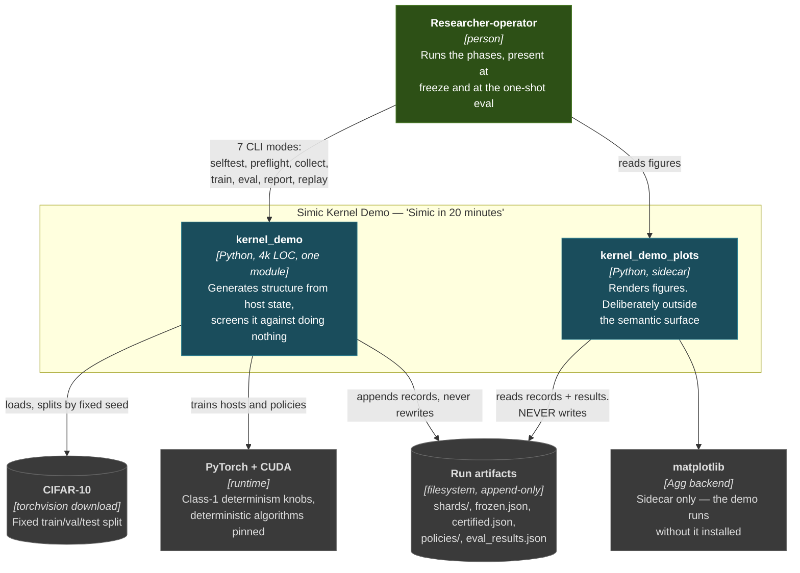
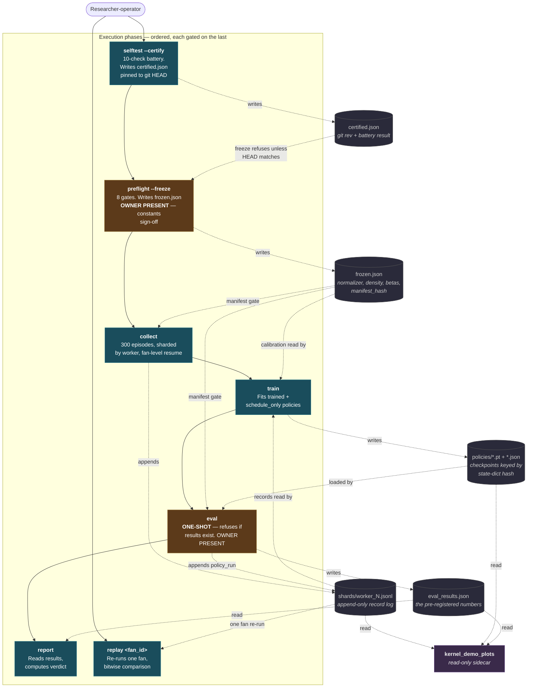
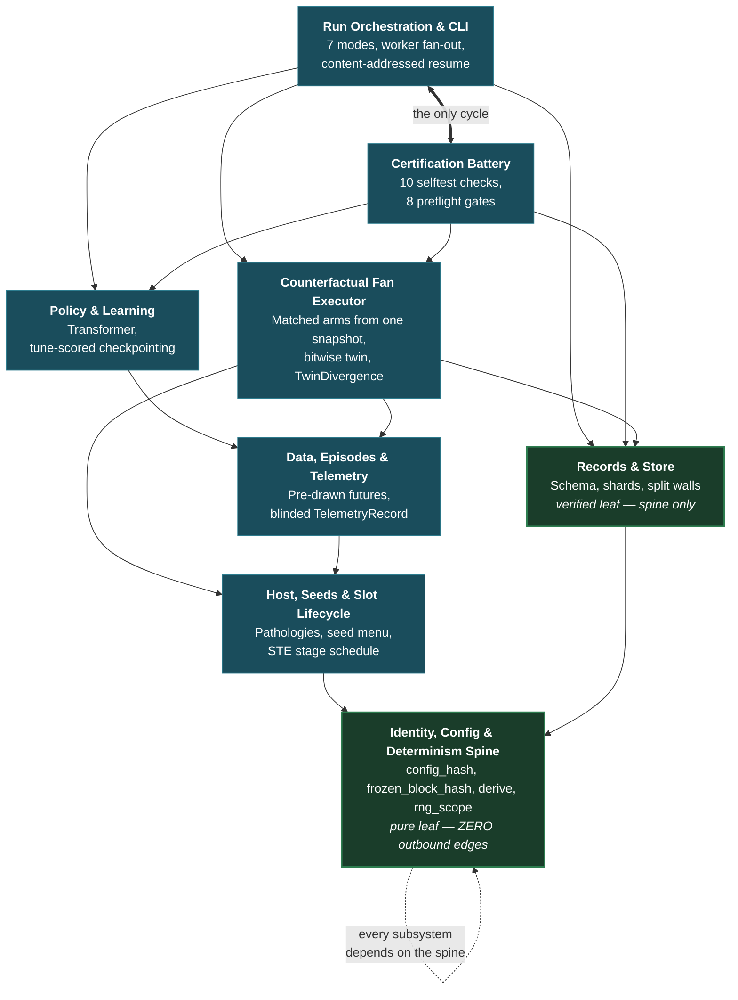
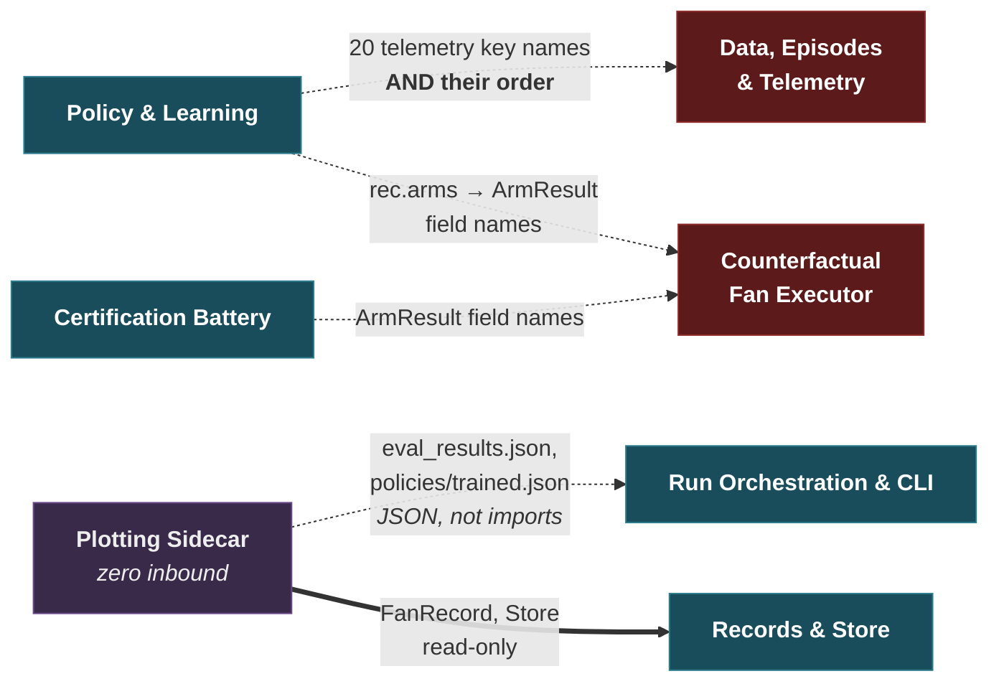

# 03 — C4 Diagrams

**Target:** `experiments/` (the Simic kernel demo)
**Date:** 2026-08-10
**Version anchor:** `experiments/kernel_demo.py` at `c666a4c` plus the three pre-data
guards (PR #11); `experiments/kernel_demo_plots.py` at `aa86388` (PR #10). Both PRs are
open at time of writing — the structure below is unaffected by either, since neither adds
or removes a subsystem or an edge.

Every edge is taken from the dependency blocks in
[`02-subsystem-catalog.md`](02-subsystem-catalog.md), which derived them by AST walk over
the assigned line ranges rather than by reading declarations. No edge here was inferred
from prose. Where the catalog labels an edge `serialized-shape` (a consumer reading field
*names* out of a dict it did not construct) that is drawn distinctly, because those are
the edges no type checker can see.

Diagrams are Mermaid rather than Structurizr: this workspace is standalone markdown, and
these render in GitHub, in the wiki pipeline, and in a plain editor without the pinned
`structurizr-cli`/`plantuml` jars.

---

## Level 1 — System Context

The demo is an offline, single-process research harness. It has no network surface, no
auth, and no external service dependency; that is why the security-surface and
dependency-analysis options were deliberately omitted from this analysis
([`00-coordination.md`](00-coordination.md)).

**The load-bearing context fact:** the arrow from `kernel_demo_plots` to the store is
one-way and read-only, and there is no arrow back. The sidecar cannot influence any
recorded number. That is the property the separate module exists to guarantee, and it is
enforced by absence — the sidecar carries no `@semantic`/`semantic_const` registration, so
it is not in `config_hash`.

---

## Level 2 — Containers

"Container" here means an independently invocable execution unit — the CLI modes — plus
the persistent stores they exchange state through. The modes are strictly ordered: each
refuses to run until its predecessor's artifact exists and matches.

**Amber = owner-present.** `preflight --freeze` takes the constants sign-off; `eval` is
pre-registered and unrepeatable — a second run requires `--void-preregistration`, which
writes a permanent `void_event`.

**The gap this analysis found is on the `frozen.json → train` edge.** `train` read
calibration from `frozen.json` and records from `shards/` as two independent reads, with
nothing tying them to the same manifest generation, while `freeze_manifest` overwrites
`frozen.json` in place. Now refused (PR #11, finding F6).

---

## Level 3 — Components

The nine subsystems. Solid = `call`, dashed = `serialized-shape` (field names read out of
a dict the consumer did not build — invisible to mypy, and the edge class most likely to
break silently).

Drawn as two views. Every subsystem depends on the spine, so drawing those eight edges
explicitly buries the structure under crossings — they are stated once below instead. The
second view isolates the `serialized-shape` edges, which is where the risk actually sits.

### 3a — Dependency layers

Edges to the spine from `RUN`, `CERT`, `FAN`, `DATA` and `POL` are omitted for legibility;
all five exist and are `call`-kind. `HOST → SPINE` and `REC → SPINE` are drawn because they
are those subsystems' *only* outbound edges.

### 3b — The edges no type checker can see

Three `serialized-shape` edges carry field *names* across boundaries. A rename on either
side type-checks cleanly and fails at runtime — or worse, reads a default. The sidecar's
edge is drawn too: it crosses a process boundary via JSON files rather than imports.

### What the shape shows

**Two verified leaves, green.** The spine has *zero* outbound edges within the file — it
references no symbol defined later in the narrative order. Records & Store depends on the
spine and on nothing else, while six of the seven other subsystems depend on it. That is
the dependency-direction property the parent programme states as a rule (contracts import
nothing from their consumers), achieved here by discipline rather than by enforcement:
the single-file layout is a locked spec decision, so there is no import gate keeping it
true and no linter would catch a future edit that reached from the store range into the
fan or telemetry sections. It currently holds completely.

**The sidecar has no inbound edge at all.** Its only importer anywhere is its own test
module. Combined with its absence from the semantic surface, this is what makes "plots
never touch the recorded numbers" a structural fact rather than a convention.

**`Certification Battery ↔ Run Orchestration` is the only cycle.** It is genuine, not an
artifact: `run_preflight` calls the shared episode machinery, and the CLI dispatches into
the battery. Both live in the author's own section map.

**The dashed edges are where the risk concentrates.** Three `serialized-shape` edges carry
field names across boundaries with no type checking: `Policy & Learning` reads 20
telemetry key names *and depends on their order*; two consumers read `ArmResult` field
names out of `rec.arms`. A rename on either side type-checks cleanly and fails at runtime,
or worse, reads a default.

---

## Caveats

These carry over from [`02-subsystem-catalog.md`](02-subsystem-catalog.md) and
[`04-final-report.md`](04-final-report.md), and they bound how much weight the pictures
can take:

1. **The partition cuts mid-section in 9 of 15 boundaries.** Subsystems were derived by
   line-range partition over one 4k-line module, and the author's own section map does not
   align with the range boundaries everywhere. One phantom edge was caught and removed.
   The 1142 boundary is a confirmed section-internal case: the `Fan Executor ↔ Data` edge
   is real at citation level but intra-section under the author's map, so it **inflates
   apparent coupling** in the Level 3 diagram without hiding anything.

2. **Edge counts are not shown.** The catalog carries per-edge counts (e.g. `call(29)`);
   the diagrams show presence only. A thin edge and a 29-call edge look identical here.

3. **Level 2 shows the intended ordering, not every reachable path.** `--resume-eval`
   appears in `run_eval`'s signature and nowhere else — it is dead, and no edge is drawn
   for it. `report` and `replay` can be run at any time after their inputs exist.

4. **All four diagrams were rendered and visually inspected** before this file was
   committed (`mmdc` against system Chrome, 1500px). The Level 3 view was restructured
   after the first render: drawing all eight spine edges explicitly produced a crossing
   mess that buried the layering, so those edges are stated in prose instead. Note this
   means the *rendering* is verified, not the *claims* — every edge still traces to
   [`02-subsystem-catalog.md`](02-subsystem-catalog.md), and a wrong edge there is a wrong
   edge here.

5. **The host-hash experiment is no longer outstanding.** [`04-final-report.md`](04-final-report.md)
   lists it as the one open item that could change a finding's severity. It was run on
   2026-08-10: twelve `make_episode` pairs reconstructed from one episode seed each,
   comparing `state_hash` of the no-op baseline host against the treated arm's —
   **12/12 matched, 0 differed**. So the lift path's prefixes do agree, and F2
   (`host_init_hash=""`) is an integrity/provenance gap rather than a live wrong-number
   defect. The assumption is now also checked at runtime rather than inferred (PR #11).
