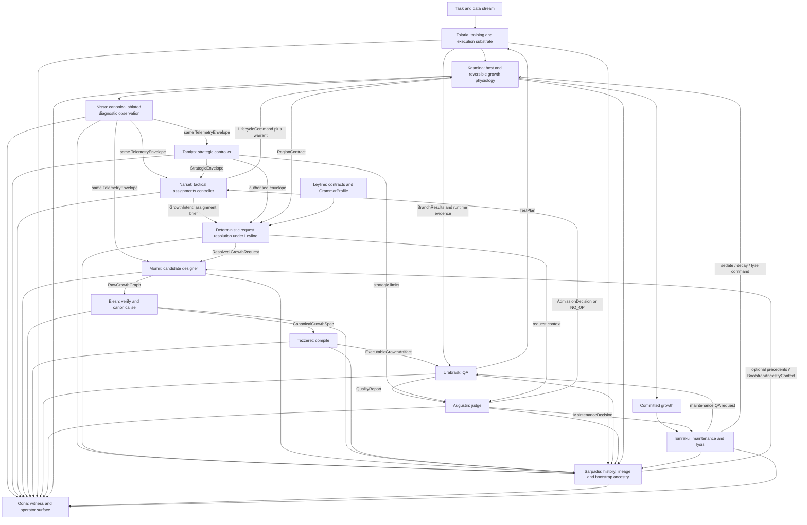

# High-Level Design: Counterfactual Generative Morphogenesis

**Working architecture:** Simic Engine with Phyrexian Orthodoxy and independent adjudication  
**Status:** Final repository-handoff target architecture  
**Architecture version:** 4.1  
**Namespec:** 1.0 — locked  
**Supersedes:** Version 3.0, Version 2.0, and the temporary lettered subsystem design  
**Working package root:** `src/simic/`; the umbrella project name remains separable from the subsystem names.

---

## 1. Executive Summary

This design describes a lifecycle-driven neural training system in which new computational structure is **designed from the live state of a host network**, rather than selected permanently from a fixed menu of human-authored module blueprints.

The existing morphogenetic chassis remains intact: a growth can begin at zero influence, mature behind the host, blend in gradually, hold for qualification, enter active service, become committed structure, or be sedated and lysed when it no longer earns its cost. What changes is the source of growth and the discipline with which observation, commissioning, design, conformance, compilation, testing, judgement, embodiment, memory, and maintenance are kept separate.

The system is divided into fourteen bounded domains:

- **Leyline** defines the contracts, schemas, grammar profiles, policy records, compatibility rules, and ordering invariants through which every other subsystem communicates.
- **Tolaria** is the deterministic training and execution substrate in which the host, ordinary training runs, QA trials, flash clones, replays, and counterfactual worlds execute.
- **Sarpadia** is the persistent historical substrate in which candidate lineages, reference ancestry, counterfactual outcomes, failures, abstentions, and retrieval indices are retained.
- **Tamiyo** is the strategic controller. It allocates long-horizon developmental resources, permissions, risk, and capacity across regions.
- **Narset** is the tactical controller. It decides whether and where to commission local growth, and manages the pre-commit lifecycle inside Tamiyo's active strategic envelope.
- **Nissa** observes the host and publishes one canonical, typed diagnostic record directly to every authorised consumer, including Narset and Momir, without embedding policy or editorial interpretation.
- **Momir** designs raw candidate growth graphs, parameters, mutations, and recombinations from Nissa's diagnostic context and a separately resolved assignment contract.
- **Elesh** verifies and canonicalises those designs into structurally legal, shape-safe, gradient-safe, semantically stable specifications.
- **Tezzeret** compiles canonical specifications into efficient executable artefacts without changing their meaning.
- **Urabrask** performs quality assurance. It designs test plans, requests execution in Tolaria, detects defects, measures behaviour, and produces certified evidence.
- **Augustin** is the judge. It applies admission and continued-tenancy policy to Urabrask's evidence, compares every candidate against no intervention, and issues decisions or warrants.
- **Kasmina** embodies admitted growth inside the host through reversible slots, isolated maturation, alpha blending, and lifecycle mechanics.
- **Emrakul** safely sedates, decays, consolidates, or lyses committed structure after Augustin has judged that continued tenancy is no longer justified.
- **Oona** reveals the system's account through event projections, flight recording, operator interfaces, audit bundles, and alerts.

The ordinary host-training loop and the growth loop share one execution reality:

```text
Task and data configuration
        ↓
Tolaria trains the Kasmina host
        ↓
Nissa publishes one canonical TelemetryEnvelope
        ├──→ Narset decides whether and where to commission growth
        └──→ Momir receives the same uncaptioned diagnostic evidence directly
        ↓
Tamiyo authorises strategic resources
        ↓
Narset emits a narrow GrowthIntent: the assignment brief
        ↓
Leyline and Kasmina deterministically resolve the legal GrowthRequest
        ↓
Sarpadia may supply temporary bootstrap ancestry or ordinary precedents
        ↓
Momir designs → Elesh conforms → Tezzeret compiles
        ↓
Urabrask specifies QA; Tolaria executes the tests
        ↓
Urabrask certifies the evidence
        ↓
Augustin judges candidate versus no-op
        ↓
Kasmina embodies an admitted growth
        ↓
Emrakul later removes what Augustin judges no longer earns its place
        ↓
Every success, failure, abstention, and lineage is retained in Sarpadia
        ↓
Oona reveals the complete account
```

The locked narrative grammar is:

> **Under Leyline, Tamiyo plans, Narset commissions and acts, Nissa observes, Momir designs, Elesh conforms, Tezzeret compiles, Urabrask tests in Tolaria, Augustin judges, Kasmina embodies, Emrakul destroys, and Oona reveals; every precedent is kept in Sarpadia.**

The deliberately goofy names are not decorative aliases. They encode which parts of the system are allowed to exercise agency, which parts must remain neutral infrastructure, and which sentences should sound architecturally wrong. The naming layer therefore acts as a lightweight responsibility and dependency lint.

The architecture also resembles a newsroom for a non-coincidental reason: both systems must keep source observation, commissioning, authorship, standards review, production, fact-checking, publication judgement, integration, correction, archival memory, and presentation distinct. The central newsroom rule is load-bearing here:

> **Nissa sends the photograph directly. Narset sends only the assignment brief. Momir must never receive reality through Narset's caption.**

The newsroom analogy is documented as an explanatory aid in §5.5 and Appendix E. The actual enforcement remains contractual: direct evidence publication, a narrow `GrowthIntent`, deterministic request resolution, immutable provenance, and tests that reject diagnostic or structural hints in Narset's channel.

A uniform **Scaffold Withdrawal Pattern** governs how the architecture learns under initially noisy, variable, or sparse conditions. Tolaria first establishes causal ground truth under an Academy profile with bitwise-exact replay, Narset first learns on repeated host trajectories, and Momir first learns near a viable Sarpadian reference population. Each scaffold then passes through controlled relaxation and an independent withdrawal gate. Withdrawal removes the scaffold as an ordinary production dependency while retaining it as a reference, calibration, regression, or escalation capability. Exact replay is therefore Tolaria's metrology laboratory—not a requirement that every future field execution remain bitwise identical.

## 2. Problem Statement

A fixed-blueprint morphogenetic controller must solve too many coupled decisions at once:

- determine whether the host needs intervention;
- identify the correct insertion region;
- select a module family such as normalisation, convolution, or attention;
- initialise and train the module;
- decide when it is mature enough to blend;
- control its blend schedule;
- decide whether its contribution is temporary or persistent;
- and eventually retain, fossilise, sedate, prune, or recycle it.

This coupling creates several recurring failure modes.

### 2.1 The moving-target problem

The host continues to learn while a component is being constructed. A structure designed for host state \(s_t\) may be integrated into a materially different state \(s_{t+\delta}\). If construction is slow, component quality and component freshness become opposing objectives.

### 2.2 The curriculum problem

A controller exposed immediately to broad, unrelated training trajectories must discover the entire causal language of intervention through sparse exploration. It is asked to generalise before it has learned stable primitives such as:

- wait when the host is healthy;
- request growth only when the deficit is repairable;
- reject an entire candidate pool;
- blend cautiously;
- abort stale growth;
- and remove structure that no longer pays rent.

### 2.3 The blueprint problem

A human-authored blueprint catalogue limits growth to structures the designer anticipated. It also forces a tactical policy to learn a categorical ontology that may not align with the actual functional deficit in the host.

### 2.4 The attribution problem

A host that has trained with a component may become dependent on it. Removing that component from the same host measures both the component’s intrinsic value and the host’s acquired dependence. Reliable admission and retention therefore require matched no-intervention branches, not same-host ablation alone.

### 2.5 The authority problem

When generation, validation, screening, deployment, and retention are implemented in one intelligent controller, the system can no longer explain why an intervention succeeded or failed. It also becomes easy for one subsystem to approve its own work, modify evaluation criteria, or hide policy inside telemetry.

This design addresses those failures by decomposing developmental intent, structural invention, structural legality, compilation, causal evaluation, embodiment, memory, and maintenance into separate authorities.

---

## 3. Goals

The architecture has ten primary goals.

1. **Replace fixed blueprint selection with generated growth.** Production growth should be conditioned on the host’s functional state rather than restricted to a predefined semantic menu.
2. **Preserve reversible lifecycle mechanics.** Generated structures must remain isolatable, blendable, measurable, removable, and recyclable.
3. **Separate strategic and tactical control.** Slow allocation decisions and local lifecycle actions must not collapse into one policy.
4. **Make structural legality independent from task utility.** A candidate may be perfectly legal and completely useless; the system must preserve that distinction.
5. **Ground admission and retention in causal comparisons.** Candidates should be evaluated against matched no-op futures wherever the decision justifies the cost.
6. **Make abstention first-class.** Every candidate pool must be allowed to lose against doing nothing.
7. **Retain complete evolutionary history.** Failures, rejected pools, stale candidates, and abstentions are training data, not logging noise.
8. **Make resource use mechanical and auditable.** Budgets are declared at subsystem boundaries and spend is measured rather than inferred.
9. **Teach elementary intervention grammar before broad generalisation.** Static and repeated counterfactual curricula precede unrestricted environments.
10. **Use the naming scheme as an architecture linting language.** Each subsystem has explicit authorities and explicit forbidden knowledge.

---

## 4. Non-Goals

The initial implementation does not attempt:

- unrestricted source-code generation;
- arbitrary whole-network rewriting;
- autonomous modification of the training runtime;
- unbounded or Turing-complete growth grammars;
- learned control of every lifecycle and economy parameter from the outset;
- simultaneous growth across many regions before single-region reliability is established;
- continual learning without forgetting as a guaranteed property;
- replacement of ordinary host optimisation;
- or proof that generated growth is superior at every scale.

The first defensible claim is narrower:

> Given a typed insertion contract and a measured host deficit, can the system generate, verify, compile, causally screen, and safely integrate a useful constrained growth more quickly and reliably than comparable online construction, retrieval, random search, analytic construction, or static over-provisioning?

---


## 5. Locked Naming Constitution

### 5.1 Why the names are deliberately goofy

The subsystem names are deliberately non-obvious to an outsider. This is useful for five reasons.

First, the names provide **cognitive compression**. “Urabrask tests; Augustin judges” is easier to retain and repeat than a long explanation of the distinction between evidence production and policy adjudication.

Second, the names create a **sentence test**. A sentence that sounds wrong in the project's narrative grammar often describes a real responsibility leak:

- “Tolaria rejected the candidate” sounds wrong because a training substrate should not judge.
- “Augustin ran the CUDA probe” sounds wrong because a judge should not gather its own evidence.
- “Momir admitted its design” sounds wrong because a designer should not approve its own work.
- “Nissa said `should_grow=True`” sounds wrong because observation should not conceal policy.
- “Narset told Momir to use attention” sounds wrong because an assignments editor should not pre-write the answer.
- “Sarpadia deployed the module” sounds wrong because history should not mutate the present.
- “Oona changed alpha” sounds wrong because a witness should not steer the process.

Third, the names create a **neutral review vocabulary**. Engineers can say “this makes Elesh too political,” “Narset has added an editorial angle,” or “Tolaria has acquired opinions” without making the discussion personal. The metaphor points at the boundary violation rather than the author.

Fourth, the names define a small **architectural grammar**. People and entities exercise agency; infrastructure supplies contexts. The project can reason in verbs and prepositions rather than memorising an arbitrary package map.

Fifth, uniform opacity is preferable to a mixed scheme in which one package is obvious and every other package is lore. The system therefore uses one intentionally idiosyncratic internal vocabulary, backed by explicit plain-English documentation. The joke works only if an outsider can infer approximately zero package responsibilities from the names alone.

The codenames do **not** replace proper API names. Cross-boundary records remain things such as `TelemetryEnvelope`, `GrowthIntent`, `GrowthRequest`, `QualityReport`, `AdmissionDecision`, and `TrainingRunSpec`. Every package README must begin with a plain-English role statement. The names are not security by obscurity and should not be relied on to conceal behaviour.

### 5.2 The grammar: actors have verbs; infrastructure has prepositions

The locked convention distinguishes **agents** from **infrastructure**.

People and entities represent agents. They observe, plan, commission, act, design, conform, compile, test, judge, embody, destroy, or reveal.

Places, systems, and phenomena represent infrastructure. They are the contexts **under**, **in**, or **from** which the agents operate.

#### Agent names

| Agent | Narrative verb | Architectural authority | Must not become |
|---|---|---|---|
| **Tamiyo** | Plans | Strategic allocation, regional permissions, long-horizon budgets and risk | A local action selector |
| **Narset** | Commissions and acts | Tactical intervention timing, insertion-region choice, operational constraints, and pre-commit lifecycle control | A co-designer or source of unallocated authority |
| **Nissa** | Observes and reports | Typed host diagnostics, direct evidence publication, and provenance | A hidden controller or editorial intermediary |
| **Momir** | Designs | Candidate topology, parameters, mutation and recombination | The approver of its own work |
| **Elesh** | Conforms | Structural legality, canonicalisation and semantic identity | A utility predictor or task judge |
| **Tezzeret** | Compiles | Lowering and executable realisation | A semantic graph designer |
| **Urabrask** | Tests | Dynamic QA, regression, runtime conformance and evidence certification | The admission judge |
| **Augustin** | Judges | Admission, no-op comparison, policy utility and continued-tenancy rulings | A test runner or compiler |
| **Kasmina** | Embodies | Host topology, slots, maturation, blending and physical lifecycle | A candidate selector or blueprint catalogue |
| **Emrakul** | Destroys | Safe post-commit sedation, decay, consolidation and lysis | A constructor or newborn judge |
| **Oona** | Reveals | Flight recording, projections, operator surfaces and audit | A control-plane backchannel |

#### Infrastructure names

| Infrastructure | Grammatical use | Neutral service | Must not own |
|---|---|---|---|
| **Leyline** | *under/through Leyline* | Contracts, schemas, grammar profiles, versions, invariants and policy record formats | Case-specific decisions or subsystem policy |
| **Tolaria** | *trained/executed/tested in Tolaria* | Host training, data and optimiser execution, devices, snapshots, replay, branching and rollback | Preferences, utility weights or verdicts |
| **Sarpadia** | *recorded in/retrieved from Sarpadia* | History, lineage, bootstrap ancestry, counterfactual outcomes, retrieval and datasets | Live-host mutation or self-approval |

Infrastructure can be highly active software. “Infrastructure” means it provides a neutral capability rather than exercising a preference about what ought to happen.

### 5.3 The canonical sentence

The architecture should remain intelligible as a sentence:

> **Nissa observes and reports. Tamiyo plans. Narset commissions and acts. Momir designs. Elesh conforms. Tezzeret compiles. Urabrask tests the compiled result in Tolaria. Augustin judges the resulting evidence under Leyline. Kasmina embodies the admitted growth. Emrakul destroys what no longer earns continued tenancy. Sarpadia retains every precedent. Oona reveals the account.**

This sentence is a compact authority map.

### 5.4 The sentence test

The following sentences are healthy:

```text
Nissa published the same TelemetryEnvelope to Narset and Momir.
Narset issued a GrowthIntent for Region A under Tamiyo's envelope.
Leyline resolved the legal GrowthRequest from the intent and Kasmina region contract.
Momir used compatible ancestors retrieved from Sarpadia during the bootstrap curriculum.
Urabrask requested a deterministic trial in Tolaria.
Tolaria returned branch measurements.
Augustin selected no-op from the certified evidence.
Kasmina rejected a lifecycle command whose Augustin warrant was invalid.
Oona displayed the rejection without altering the run.
```

The following sentences should trigger review:

```text
Narset forwarded a captioned telemetry summary to Momir.
Narset requested an attention-like topology.
Nissa recommended a wide bottleneck.
Tolaria rejected the candidate.
Urabrask issued the admission token.
Augustin reran the branch with a more favourable batch.
Momir filtered out designs that scored poorly in the current live trial.
Elesh used future task reward to reject a legal graph.
Tezzeret inserted a new semantic node during optimisation.
Sarpadia installed the nearest historical candidate.
Oona changed the learning rate directly.
Leyline imported Narset to decide a default action.
```

The sentence test is not a proof, but it is an intentionally cheap architecture lint.

### 5.5 The newsroom principle

> **Sidebar — Why the architecture resembles a newsroom**
>
> The similarity is structural rather than decorative. A newsroom separates source observation, assignment, authorship, standards review, production, fact-checking, publication judgement, placement, correction, archive, and presentation because allowing one desk to control the complete chain corrupts both evidence and accountability.
>
> In this architecture:
>
> - Nissa is the reporting, photography, and data desk: it publishes what was observed.
> - Tamiyo is the editor-in-chief or managing editor: it allocates desks, time, and strategic resources.
> - Narset is the assignments editor: it decides whether there is a story, which beat owns it, what scope and deadline apply, and what resources may be spent.
> - Momir is the writer or investigative journalist: it determines the substantive answer from the evidence and commission.
> - Elesh is the copy and standards desk: it enforces structural, typed, and house-form conformity without deciding whether the story is valuable.
> - Tezzeret is production: it turns canonical copy into an executable edition without changing meaning.
> - Urabrask is fact-checking and QA: it establishes what the finished artefact actually does.
> - Augustin is the publishing editor: it decides whether the evidence justifies running, returning, deferring, or spiking the story.
> - Kasmina integrates accepted material into the live edition.
> - Emrakul handles correction, withdrawal, and retirement after publication.
> - Sarpadia is the morgue and archive, including corrections, failed investigations, and abandoned drafts.
> - Oona is presentation: front page, broadcast desk, dashboards, and public account.
> - Leyline is the stylebook, editorial constitution, and record format.
> - Tolaria is the newsroom production environment, CMS, presses, and test editions.
>
> The load-bearing rule is: **Narset does not send the photograph. Nissa sends the photograph directly to Momir. Narset sends only the assignment brief.**
>
> The code-review question is therefore: **does this field belong in an assignment brief, or does it impose an editorial angle?** Scope, region, resource class, deadline, maturity mode, and assurance class are assignment fields. A deficit diagnosis, topology preference, ancestor choice, expected mechanism, or proposed solution is an editorial angle and is prohibited from Narset's channel.
>
> Appendix E develops the analogy, its smell tests, and its limits. The metaphor is never the enforcement mechanism; Leyline contracts and authority tests are.

### 5.6 Dependency consequence

The naming grammar implies two dependency rules:

1. Agents may consume neutral services from Leyline, Tolaria, and Sarpadia through typed interfaces.
2. Infrastructure must not import agent policy or encode agent-specific preferences.

Examples:

```text
urabrask → tolaria protocol                 healthy
augustin → leyline contracts                healthy
momir → sarpadia retrieval API              healthy
nissa → leyline telemetry schema            healthy
narset → leyline GrowthIntent schema        healthy

tolaria → augustin policy                   suspect
sarpadia → momir training code              suspect
leyline → narset implementation             prohibited
narset → momir graph grammar implementation prohibited
momir → narset hidden state                 prohibited
```

Tolaria may execute a Kasmina host through a neutral host-runtime protocol. Sarpadia may store Momir records as opaque contract values. Neither requires ownership of the corresponding agent's policy.

### 5.7 Change control

Namespec 1.0 is considered locked for this design:

```text
Leyline
Tolaria
Sarpadia
Tamiyo
Narset
Nissa
Momir
Elesh
Tezzeret
Urabrask
Augustin
Kasmina
Emrakul
Oona
```

Changing a codename or moving an authority between names requires an architecture decision record because it changes the project's shared responsibility grammar, package paths, telemetry names, tests, and operational language.

## 6. Design Principles

### 6.1 Strategy and tactics are separate

Tamiyo determines where developmental resources may be spent over a slow horizon. Narset decides what local action to take at a particular state. Tamiyo cannot choose a candidate or issue an alpha tick. Narset cannot create capacity that is absent from Tamiyo's envelope.

> **Tamiyo establishes what may be spent and where. Narset decides what to do with it now.**

### 6.2 Observation, commissioning, and interpretation are separate

Nissa produces one canonical, typed, versioned `TelemetryEnvelope` for a particular host observation and publishes it independently to every authorised consumer. Narset and Momir receive the same evidence by identity, not a copy interpreted or rewritten by another agent.

Narset may interpret the observation to decide whether and where to commission work. Momir independently interprets the same observation to decide what phenotype to design. Nissa must not smuggle a lifecycle decision or structural recommendation into telemetry.

> **Nissa sends the photograph directly. Narset sends only the assignment brief.**

“Raw telemetry” means uncaptioned by Narset, not untyped or unconstrained. Nissa may perform neutral normalisation, alignment, missing-value masking, stable feature construction, and provenance attachment. It may not emit `deficit_type`, `recommended_structure`, or equivalent prescriptions.

### 6.3 Developmental intent and phenotype are separate

Narset authors a narrow `GrowthIntent`. It may specify:

- the insertion region;
- a resource or urgency class inside Tamiyo's envelope;
- one-shot versus nursery maturation;
- assurance class;
- and tactical deadline or escalation context.

It must not specify:

- a preferred topology family;
- a diagnosis such as `RANK_COLLAPSE`;
- a suggested ancestor;
- an expected mechanism;
- rank, width, gate, operator, or connectivity hints;
- or any field whose practical purpose is to steer Momir toward a structural answer.

Leyline and Kasmina deterministically resolve the selected region and active capabilities into a `GrowthRequest`. This attaches the tensor contract, grammar profile, exact derived budgets, and compatibility information as system constraints rather than Narset-authored design hints.

> **Narset constrains the feasible solution space. Momir chooses a point within it.**

Coarse enumerated classes are preferred over arbitrary continuous request values. This reduces the opportunity for jointly trained Narset and Momir to invent a covert design code through harmless-looking budget, latency, ordering, or candidate-count fields.

### 6.4 Design, conformance, and compilation are separate

Momir creates possibilities. Elesh establishes structural legality and canonical semantic identity. Tezzeret realises that identity efficiently for a target runtime.

> **Momir establishes possibility. Elesh establishes identity. Tezzeret establishes execution.**

### 6.5 QA and judgement are separate

Urabrask establishes the facts that can only be learned by executing a candidate: runtime conformance, numerical safety, gradients, cost, trajectory behaviour, shock, regression and uncertainty.

Augustin applies policy to those facts: eligibility, budget, risk, utility weights, no-op anchoring, admission margins and continued tenancy.

> **Leyline contains the law. Urabrask establishes the evidence. Augustin applies the law.**

Urabrask may report that a mandatory QA test failed. It must not decide which otherwise eligible candidate deserves admission. Augustin may reject every candidate. It must not alter the test plan, future data or measured result.

### 6.6 Kasmina and Tolaria are different substrates

Kasmina is the **model physiology**: the host network, insertion regions, reversible slots, gradients, alpha and lifecycle state.

Tolaria is the **training and execution reality**: data movement, optimiser stepping, devices, precision, distributed scheduling, checkpointing, snapshots, replay, branch execution and rollback.

> **Kasmina is what is trained. Tolaria is where and how it is trained.**

There must be one Tolaria execution path for the live host and counterfactual branches wherever practical. A special branch-only trainer would undermine paired comparisons.

### 6.7 Static validity and dynamic validity are separate

Elesh answers whether a design is legal in principle. Urabrask answers whether Tezzeret's artefact behaves correctly in practice. Static verification does not replace execution, and passing runtime tests does not excuse a structurally illegal graph.

### 6.8 Every intervention is reversible

A growth begins at zero or negligible influence. Influence is controlled through explicit lifecycle state and blend coefficients. Removal is normally a measured blend-out, not an abrupt discontinuity.

### 6.9 Doing nothing is a real competitor

Every adjudication includes a mandatory no-intervention alternative whose policy utility is exactly zero. A growth request does not imply that any growth must be admitted. In newsroom terms, every story may be spiked.

### 6.10 Paired branches differ only in the intervention

Counterfactual branches begin from the same complete snapshot, receive the same future minibatches, and use the same resource accounting. Candidate source must not alter the QA protocol.

### 6.11 The tested object and embodied semantics are identical

The canonical semantic identity tested by Urabrask, selected by Augustin, and embodied by Kasmina must be the same. Compilation may change execution strategy but not meaning.

### 6.12 Costs are contractual

Every constructor, compiler, QA plan, training run, branch, maturation process and maintenance probe receives a declared budget and reports measured spend. Over-budget work is an explicit failure.

### 6.13 Experience includes failures

Every candidate, structural rejection, compilation failure, QA defect, adjudication rejection, no-op victory, stale integration, lifecycle reversal and lysis event is recorded in Sarpadia.

### 6.14 Generalisation follows acquisition

Exact repetition and controlled one-axis variation precede composed variation, unseen host seeds, multiple regions and image-scale tasks.

### 6.15 Observability is read-only

Oona may subscribe to, persist, aggregate and present events. It cannot create actions, mutate budgets or become a hidden dependency of the training path.

### 6.16 Infrastructure remains neutral

Leyline defines records; Tolaria executes requests; Sarpadia retains history. None decides which candidate should live.

### 6.17 Bootstrap ancestry is temporary; controls endure

Conventional Norm, Attention, Convolution, low-rank, and gated-residual seeds may be retained in Sarpadia as a **reference population** for Momir's initial curriculum. They are demonstrations, ancestral material, and counterfactual controls—not Kasmina-owned production blueprints and not Narset actions.

The ancestry context is progressively withdrawn from Momir's proposal input. The same reference seeds may remain permanently in the experimental harness as blinded competitors. Removing a scaffold is not the same as deleting a baseline.

### 6.18 Independent channels preserve attribution

Momir receives three conceptually distinct inputs:

1. diagnostic evidence directly from Nissa;
2. operational constraints through the resolved `GrowthRequest`;
3. optional historical ancestry or retrieval context from Sarpadia.

These channels preserve separate provenance and may be independently ablated. Narset's hidden state, commentary, and diagnostic interpretation are never Momir inputs. This permits failures to be attributed to observation, commissioning, design, conformance, compilation, QA, judgement, embodiment, or maintenance rather than to an inseparable controller-generator pair.

### 6.19 Scaffolds are explicit, independently gated and retained as references

When a learning or measurement problem is initially too noisy, variable, or sparse for reliable causal acquisition, the architecture may introduce an explicit epistemic scaffold. Every scaffold must declare:

- the failure mode it protects against;
- the constrained acquisition regime;
- one or more controlled relaxation regimes;
- a measurable withdrawal gate;
- the authority responsible for certifying that gate;
- its retained reference, calibration, regression, or escalation role;
- and known interactions with other scaffolds.

Scaffolds advance independently. A subsystem does not lose its scaffold merely because another subsystem has passed its own gate. A confirmatory transition changes one scaffold dimension at a time unless the interaction itself is the declared experiment and the corresponding single-withdrawal controls already exist.

> **Constrain until signal is identifiable; calibrate under controlled relaxation; withdraw the dependency; verify that the invariant remains.**

Withdrawal does not imply deletion. Academy-exact Tolaria, repeated acquisition trajectories, and traditional seed references remain available as trusted oracles and controls after ordinary operation no longer depends on them.

## 7. System Context and Architectural Planes

The system operates inside nested learning and execution loops:

- Tolaria continuously runs ordinary host training against the task and data stream;
- Nissa publishes canonical observations at defined decision points;
- Narset acts at local developmental decision points;
- Tamiyo updates strategic envelopes at a slower cadence;
- Momir, Elesh and Tezzeret construct candidate artefacts;
- Urabrask defines QA plans and requests candidate trials in Tolaria;
- Augustin adjudicates the certified reports;
- Kasmina embodies admitted growth;
- Emrakul manages committed structure under continued-tenancy warrants;
- Sarpadia accumulates the complete causal history;
- and Oona exposes the account without becoming part of the control path.

| Plane | Subsystems | Purpose |
|---|---|---|
| **Constitutional infrastructure** | Leyline | Defines contracts, grammar profiles, compatibility, policy records and invariants |
| **Training and execution infrastructure** | Tolaria | Trains the live host and executes deterministic ordinary, replay and branch worlds |
| **Historical infrastructure** | Sarpadia | Retains lineages, reference ancestry, outcomes, failures and split-safe datasets |
| **Strategic agency** | Tamiyo | Allocates regional resources, permissions and risk over long horizons |
| **Tactical commissioning** | Narset | Decides whether and where to commission growth and manages pre-commit actions |
| **Observation** | Nissa | Publishes what the host is doing without prescribing what should be built |
| **Synthesis** | Momir, Elesh, Tezzeret | Designs, canonicalises and compiles growth |
| **Assurance and adjudication** | Urabrask, Augustin | Establishes empirical evidence, then judges it independently |
| **Embodiment and maintenance** | Kasmina, Emrakul | Introduces growth safely and removes obsolete committed structure |
| **Witness** | Oona | Exposes an auditable account without steering it |

### 7.1 Logical architecture



The two Nissa arrows to Narset and Momir are independent publications of the same observation identity. Narset is not a telemetry proxy. The request resolver is deterministic contract assembly, not a fifteenth agent: it applies Leyline compatibility rules to Narset's intent, Tamiyo's envelope, and Kasmina's region declaration.

### 7.2 Ordinary training loop

Tolaria owns the operational loop that trains the host:

```text
load or create TrainingRunSpec
        ↓
materialise data stream and device topology
        ↓
execute Kasmina host forward pass
        ↓
compute task loss
        ↓
perform host optimiser step
        ↓
advance schedulers and logical time
        ↓
Nissa captures and publishes a canonical observation
        ↓
invoke permitted strategic/tactical decision points
        ↓
checkpoint, snapshot or continue
```

Tamiyo and Narset govern developmental actions around this loop. They do not perform SGD. Kasmina supplies the model and its growth mechanics. Tolaria performs the execution.

### 7.3 Observation and commissioning loop

```text
Nissa observes Snapshot S at decision point T
        ↓
Nissa publishes TelemetryEnvelope O
        ├──→ Narset: should work be commissioned, where, and under what class?
        └──→ Momir: what structure would address this observed state?

Tamiyo supplies StrategicEnvelope E
Narset emits GrowthIntent I referencing O and E
Kasmina supplies RegionContract R
Leyline supplies compatible GrammarProfile G
        ↓
pure request resolution: (O, E, I, R, G) → GrowthRequest Q
        ↓
Momir receives O and Q separately
```

Momir rejects a call where the observation, snapshot, region, or compatibility identifiers do not reconcile. A `GrowthIntent` never contains a copy of telemetry.

### 7.4 Candidate assurance and adjudication loop

```text
Tezzeret artefact
        ↓
Urabrask builds a blinded TestPlan
        ↓
Tolaria restores a common Snapshot and executes:
        candidate branches + controls + mandatory no-op
        ↓
Urabrask verifies runtime conformance and certifies measurements
        ↓
QualityReport
        ↓
Augustin applies eligibility, budget, risk and utility policy
        ↓
ADMIT one / REJECT / DEFER / REQUIRE_RETEST / NO_OP
```

### 7.5 Control hierarchy

```text
Tamiyo
  └── establishes StrategicEnvelope
        └── Narset chooses local actions
              ├── WAIT
              ├── COMMISSION_GROWTH → GrowthIntent
              ├── BEGIN_MATURATION
              ├── REQUEST_QA
              ├── REQUEST_ADJUDICATION
              ├── BEGIN_BLEND
              ├── HOLD
              ├── ABORT
              └── COMMIT

After COMMIT:
  Narset relinquishes ordinary ownership
        └── Emrakul manages physical maintenance
              ├── REQUEST_REVIEW
              ├── HOLD
              ├── SEDATE
              ├── DECAY
              └── LYSE
```

Urabrask and Augustin are independent of this command hierarchy. Urabrask certifies evidence. Augustin issues admission and maintenance warrants. Neither performs Kasmina state transitions. Tolaria is beneath the hierarchy as neutral execution infrastructure.

### 7.6 The newsroom authority model

The newsroom analogy provides an explanatory overlay, not a second architecture:

```text
Nissa reports source material
Tamiyo funds the desk
Narset commissions the assignment
Momir authors the candidate
Elesh applies standards and canonical form
Tezzeret produces the executable edition
Urabrask fact-checks and proof-tests it in Tolaria
Augustin publishes, returns, defers, or spikes it
Kasmina integrates it into the live edition
Emrakul corrects, withdraws, or retires it later
Sarpadia preserves the complete archive
Oona presents the account
Leyline supplies the editorial constitution
```

The analogy is useful because it makes an authority leak audible. “The assignments editor rewrote the source notes before the writer saw them” is the same defect as Narset mediating Nissa's evidence. Appendix E provides the full mapping and review prompts.

## 8. Subsystem Map

| Subsystem | Primary responsibility | Key outputs | Explicitly does not own |
|---|---|---|---|
| **Leyline** | Typed contracts, schema versions, grammar profiles, request resolution, compatibility, policy record formats and ordering invariants | Versioned records, validators, warrants, rule vocabularies and resolved constraints | Case-specific policy, diagnosis or execution |
| **Tolaria** | Host training and deterministic execution: data, optimisers, devices, precision, distributed scheduling, snapshots, replay, branches and rollback | `TrainingRunState`, `Snapshot`, `BranchResult`, execution manifests | Utility weights, candidate preference or verdicts |
| **Sarpadia** | Append-only history, lineage, bootstrap reference population, outcomes, retrieval and split-safe datasets | `GrowthRecord`, `BootstrapAncestryContext`, retrieval sets, lineage graphs and blinded views | Live-host mutation or self-approval |
| **Tamiyo** | Strategic budgets, regional priorities, exploration quotas, cooldowns and long-horizon risk | `StrategicEnvelope` | Local action timing or candidate choice |
| **Narset** | Tactical commissioning and pre-commit lifecycle actions | `GrowthIntent`, `LifecycleCommand`, review requests and escalations | Diagnostic captions, ancestor choice, topology hints, unallocated budget or structural generation |
| **Nissa** | Ablated host telemetry, direct evidence publication and diagnostic provenance | `TelemetryEnvelope` | `should_grow`, structural recommendations, reward or verdicts |
| **Momir** | Raw candidate topology, parameters, mutation and recombination | `RawGrowthGraph` | Intervention timing, structural approval, testing or admission |
| **Elesh** | Static verification, canonicalisation, semantic hashing and structural legality | `CanonicalGrowthSpec`, structural reports | Runtime QA, task utility or lifecycle policy |
| **Tezzeret** | Lowering, kernel selection, fusion, memory planning and compilation | `ExecutableGrowthArtifact`, compilation manifest | Semantic topology changes, QA or admission |
| **Urabrask** | Dynamic QA, runtime conformance, regression, branch measurement and evidence certification | `TestPlan`, `QualityReport` | Admission, no-op policy or lifecycle commands |
| **Augustin** | Provider-blind admission and continued-tenancy adjudication | `AdmissionDecision`, `MaintenanceDecision`, warrants | Test execution, compilation or host mutation |
| **Kasmina** | Host model, insertion-region declarations, slots, gradient routing, maturation, blending and physical lifecycle | `RegionContract`, embodied state and lifecycle events | Stock blueprint ontology or whether a growth deserves admission |
| **Emrakul** | Safe post-commit sedation, decay, consolidation and lysis | Maintenance requests and warranted lifecycle commands | Candidate construction or judgement |
| **Oona** | Event projections, flight recorder, TUI/dashboard adapters, audit bundles and alerts | Operator views and audit records | Training control or source-of-truth schemas |

The deterministic request resolver is a Leyline application service operating over immutable `GrowthIntent`, `StrategicEnvelope`, `RegionContract`, and `GrammarProfile` records. It performs no diagnosis and has no learned policy.

## 9. Core Contracts

Subsystem boundaries are enforced with typed, immutable or append-only records. Shared mutable objects are not passed across authority boundaries. The observation, commission, design constraints, proposal multiplicity, and optional ancestry context remain distinct records so none can become an undocumented side channel for another.

### 9.1 `StrategicEnvelope`

Issued by Tamiyo and consumed by Narset, the request resolver, Augustin, Kasmina and Emrakul.

```text
StrategicEnvelope
    envelope_id
    issued_at_step
    valid_from_step
    valid_until_step
    host_scope
    region_allocations[]
        region_id
        parameter_budget
        compute_budget
        latency_budget
        max_concurrent_growths
        max_interventions
        cooldown
        exploration_allowance
        risk_ceiling
        preferred_horizon
    global_parameter_ceiling
    global_compute_ceiling
    global_churn_ceiling
    priority_weights
    admissibility_policy_id
    maintenance_policy_id
    permitted_grammar_profiles[]
    policy_version
    schema_version
```

The envelope grants permission and constrains judgement. It does not instruct Narset to act or Augustin which candidate to select.

### 9.2 `TelemetryEnvelope`

Produced once by Nissa for a particular observation and published independently to Tamiyo, Narset, Momir, Sarpadia and Oona according to access policy.

```text
TelemetryEnvelope
    observation_id
    telemetry_id
    host_state_id
    snapshot_id
    logical_step
    region_id
    ablated_context
    task_metrics
    activation_statistics
    spectral_statistics
    local_functional_gradient
    optimisation_velocity
    lifecycle_context
    budget_context
    temporal_context
    validity_mask
    provenance
    normalization_manifest
    schema_version
```

Any change in meaning, width, basis, normalisation or provenance creates a new schema version. Nissa may normalise and align measurements, but the record contains no `should_grow`, deficit diagnosis, topology suggestion, ancestor choice, or recommended mechanism.

The same `observation_id` must be referenced by Narset's intent, Momir's conditioning input, and the Tolaria snapshot later used for counterfactual evaluation. A mismatch fails closed.

### 9.3 `GrowthIntent`

Authored by Narset under an active `StrategicEnvelope`. This is the **assignment brief**, not the design brief.

```text
GrowthIntent
    intent_id
    envelope_id
    observation_id
    host_state_id
    insertion_region_id
    requested_resource_class
    maturity_mode
    assurance_class
    urgency_class
    tactical_deadline
    escalation_context | null
    reason_code
    schema_version
```

Permitted fields describe scope, authority and operational conditions. The contract explicitly forbids:

```text
preferred_topology_family
preferred_operator
suggested_envelope
suggested_ancestor
rank_hint
width_hint
deficit_type
recommended_mechanism
expected_internal_structure
free_form_designer_message
```

Narset does not copy, summarise, annotate or forward telemetry inside the intent.

### 9.4 `GrowthRequest`

Resolved deterministically under Leyline from the `GrowthIntent`, active `StrategicEnvelope`, Kasmina `RegionContract`, and compatible `GrammarProfile`. Narset does not author the resolved fields.

```text
GrowthRequest
    request_id
    intent_id
    envelope_id
    observation_id
    host_state_id
    insertion_region_id
    input_output_contract
    grammar_profile_id
    grammar_version
    exact_parameter_budget
    construction_compute_budget
    compilation_budget
    qa_budget
    latency_budget
    maturity_mode
    maturity_budget
    permitted_blend_policy_class
    permitted_evaluation_horizons[]
    assurance_class
    adjudication_policy_id
    region_contract_version
    resolver_version
    schema_version
```

A request states what may legally be designed and spent. It does not contain an interpreted diagnosis, a fixed blueprint identity, a retrieval choice, or an ancestry selection. The resolver may narrow an intent to satisfy compatibility; it cannot invent a more permissive request.

### 9.5 `ProposalBatchRequest`

Execution metadata controlling how many proposals are requested and how generation spend is accounted. It is kept separate from Momir's semantic conditioning wherever possible.

```text
ProposalBatchRequest
    proposal_batch_id
    request_id
    candidate_count
    latent_sampling_policy
    generation_budget
    diversity_requirement | null
    deadline
    schema_version
```

Candidate count is not a design hint. Momir's candidate-generation function should be invariant to irrelevant batch representation and should not receive “candidate 3 of 12” unless an experiment explicitly studies coordinated set generation.

### 9.6 `BootstrapAncestryContext`

An optional, temporary curriculum record assembled from Sarpadia by the curriculum harness. Narset never selects or transmits it.

```text
BootstrapAncestryContext
    ancestry_context_id
    request_id
    reference_population_version
    compatible_ancestor_ids[]
    ancestor_canonical_specs[]
    ancestor_outcome_summaries[]
    permitted_mutation_radius
    recombination_allowed
    de_novo_fraction
    curriculum_stage
    withdrawal_schedule_id
    provenance
    schema_version
```

The context may contain conventional Norm, Attention, Convolution, low-rank, gated-residual, or other known viable microcells represented as canonical graphs. It is a removable training scaffold. Production inference must support `BootstrapAncestryContext = null`. Reference seeds may remain in the blinded control pool even after they are withdrawn from Momir's input.

### 9.7 `RawGrowthGraph`

Produced by Momir.

```text
RawGrowthGraph
    raw_candidate_id
    request_id
    raw_graph_ir
    raw_birth_parameters
    trainability_intent
    parent_lineages[]
    retrieval_provenance[]
    generator_version
    latent_code
    proposal_probability_or_score
    estimated_uncertainty
    generation_spend
```

A raw graph is not executable and not trusted.

### 9.8 `CanonicalGrowthSpec`

Produced by Elesh.

```text
CanonicalGrowthSpec
    canonical_candidate_id
    raw_candidate_id
    request_id
    canonical_graph_ir
    canonical_parameters
    input_output_contract
    trainability_mask
    zero_influence_proof
    gradient_flow_manifest
    parameter_count
    static_compute_estimate
    memory_estimate
    canonical_semantic_hash
    equivalence_class_id
    structural_pruning_report
    verification_report
    grammar_version
    canonicalizer_version
```

The canonical semantic hash identifies developmental meaning independently of compilation strategy.

### 9.9 `ExecutableGrowthArtifact`

Produced by Tezzeret.

```text
ExecutableGrowthArtifact
    artifact_id
    canonical_candidate_id
    canonical_semantic_hash
    device_target
    dtype
    compiled_module_or_graph
    kernel_manifest
    fusion_manifest
    runtime_parameter_layout
    runtime_cost_estimate
    compiler_version
    compilation_spend
    reproducibility_manifest
```

The artefact is not trusted merely because compilation succeeded. Urabrask must dynamically verify it against the canonical specification.

### 9.10 `TrainingRunSpec`

Defined under Leyline and executed by Tolaria.

```text
TrainingRunSpec
    run_id
    host_definition_reference
    task_and_data_definition
    host_optimizer_definition
    scheduler_definition
    device_topology
    dtype_and_precision_policy
    distributed_policy
    determinism_policy
    execution_regime
    calibration_profile_id | null
    scaffold_state_id
    checkpoint_policy
    decision_cadences
    maximum_steps
    random_seed_manifest
    code_and_schema_versions
```

The same execution semantics are used for the live trajectory and paired branches unless a difference is the declared experimental variable.

### 9.11 `Snapshot`

Produced by Tolaria.

```text
Snapshot
    snapshot_id
    run_id
    host_parameters
    host_optimizer_state
    host_scheduler_state
    growth_slot_states
    lifecycle_state
    economy_state
    narset_recurrent_state
    tamiyo_state_reference
    telemetry_history
    random_number_states
    dataloader_cursor
    task_configuration
    recent_batches
    fixed_future_minibatch_sequence
    device_and_determinism_manifest
    execution_regime
    scaffold_state_id
    code_and_schema_versions
```

A snapshot is complete only when it captures enough state to satisfy the Academy-exact replay contract on the supported reference profile. The same snapshot representation may be used in calibrated-stochastic and Field regimes, where repeated outcomes carry measured uncertainty rather than a false claim of bitwise identity.

### 9.12 `TestPlan`

Produced by Urabrask and consumed by Tolaria.

```text
TestPlan
    test_plan_id
    snapshot_id
    request_id
    blinded_candidate_artifacts[]
    mandatory_no_op
    control_artifacts[]
    construction_support_split
    qa_screen_split
    qa_audit_split
    retention_report_split
    future_sequence_id
    horizons[]
    required_runtime_checks[]
    required_regression_checks[]
    per_branch_budget
    required_execution_regime
    calibration_profile_id | null
    escalation_policy
    determinism_manifest
    scaffold_state_id
    qa_policy_version
```

Urabrask controls what evidence must be collected. It does not control the adjudication utility applied later.

### 9.13 `BranchResult`

Produced by Tolaria.

```text
BranchResult
    test_plan_id
    branch_id
    blinded_candidate_id
    canonical_semantic_hash
    execution_status
    execution_regime
    calibration_profile_id | null
    replicate_group_id | null
    loss_trajectory
    accuracy_trajectory
    activation_trajectory
    gradient_trajectory
    runtime_conformance_measurements
    short_horizon_effect
    long_horizon_effect
    integration_shock
    gradient_shock
    parameter_cost
    measured_compute_spend
    measured_latency
    stability_events
    lifecycle_events
    final_state_reference
    execution_uncertainty
    scaffold_state_id
    replay_digest
```

Source provenance is held outside the blinded view and reattached only after QA and adjudication.

### 9.14 `QualityReport`

Produced by Urabrask and consumed by Augustin, Sarpadia, Narset and Emrakul.

```text
QualityReport
    quality_report_id
    test_plan_id
    request_id
    execution_regime
    calibration_profile_id | null
    academy_reference_report_ids[]
    scaffold_state_id
    candidate_reports[]
        blinded_candidate_id
        canonical_semantic_hash
        structural_reference_valid
        compiled_semantics_conformant
        runtime_valid
        deterministic_replay_valid
        finite_outputs_and_gradients
        regression_results
        measured_task_trajectories
        measured_costs
        measured_shock
        uncertainty
        academy_comparison | null
        escalation_required
        hard_defects[]
        soft_warnings[]
    no_op_report
    evidence_completeness
    qa_spend
    qa_policy_version
    evidence_digest
```

A `QualityReport` establishes facts and test status. It does not contain `ADMIT` or `REJECT`.

### 9.15 `AdmissionDecision`

Produced by Augustin.

```text
AdmissionDecision
    decision_id
    quality_report_id
    request_id
    verdict                 # ADMIT | NO_OP | REJECT | DEFER | REQUIRE_RETEST
    selected_candidate_id | null
    selected_semantic_hash | null
    eligibility_results
    no_op_margin
    adjudicated_utility
    cost_breakdown
    risk_charge
    uncertainty_charge
    decision_reasons[]
    admission_warrant | null
    adjudication_policy_version
```

An admission warrant is required before Kasmina may raise a new growth above zero influence.

### 9.16 `MaintenanceDecision`

Produced by Augustin from a maintenance `QualityReport`.

```text
MaintenanceDecision
    decision_id
    quality_report_id
    target_growth_id
    verdict                 # RETAIN | RETEST | SEDATE | DECAY | LYSE
    retained_utility
    replacement_context
    cost_breakdown
    decision_reasons[]
    maintenance_warrant | null
    adjudication_policy_version
```

Emrakul decides how to execute an authorised safe transition. It does not rewrite the verdict.

### 9.17 `LifecycleCommand`

Issued by Narset before commitment or Emrakul after commitment.

```text
LifecycleCommand
    command_id
    authority               # NARSET or EMRAKUL
    target_growth_id
    requested_transition
    admission_warrant | null
    maintenance_warrant | null
    evidence_reference
    strategic_envelope_id
    budget
    reason
```

Kasmina validates the command against authority, state, warrant, budget and transition rules.

### 9.18 `GrowthRecord`

Stored by Sarpadia.

```text
GrowthRecord
    base_host_trajectory_id
    snapshot_id
    telemetry
    strategic_envelope
    growth_intent
    growth_request
    proposal_batch_request
    scaffold_state
    bootstrap_ancestry_context | null
    raw_growth_graph
    canonical_growth_spec
    executable_artifact_manifest
    test_plan
    branch_results[]
    quality_report
    admission_decision
    selected_or_rejected
    rejection_reason
    maturation_history
    blend_history
    retained_contribution
    maintenance_decisions[]
    maintenance_history
    terminal_outcome
    failure_mode
    lineage_edges
    split_membership
```

The full candidate pool is stored, including stock-reference controls, structurally rejected candidates, scaffold-free de novo pools, and pools in which Augustin selects no-op.

### 9.19 `EventEnvelope`

Defined by Leyline and published by every subsystem for Oona.

```text
EventEnvelope
    event_id
    event_type
    producer
    host_state_id
    correlation_id
    causal_parent_ids[]
    logical_step
    payload_schema_version
    payload
    integrity_digest
```

Oona consumes these events but does not define their source-of-truth semantics.

### 9.20 `ScaffoldManifest` and `ScaffoldState`

Defined by Leyline and included in every curriculum and confirmatory run manifest.

```text
ScaffoldManifest
    scaffold_id
    protected_failure_mode
    constrained_regime
    relaxation_regimes[]
    withdrawal_gate
    gate_owner
    retained_reference_role
    escalation_path
    interaction_risks[]
    version

ScaffoldState
    state_id
    execution_regime
        ACADEMY_EXACT | CALIBRATED_STOCHASTIC | FIELD
    host_distribution_regime
        REPEATED_ACQUISITION | HELD_OUT_IN_FAMILY | OPEN_DISTRIBUTION
    design_prior_regime
        REFERENCE_ANCESTRY | ANCESTRY_DROPOUT | NULL_ANCESTRY
    active_scaffold_ids[]
    passed_gate_evidence_ids[]
    retained_reference_capabilities[]
    interaction_experiment_id | null
    policy_version
    provenance
```

The three regime fields are independent axes, not aliases for one global curriculum stage. A transition that changes more than one axis must carry an explicit interaction experiment identifier and cite the completed single-axis controls. The run fails closed when its declared scaffold state cannot be reconciled with the active Tolaria profile, host split, or Momir ancestry context.

---

## 10. End-to-End Operating Flow

### 10.1 Ordinary host training in Tolaria

Tolaria materialises the `TrainingRunSpec`, constructs the data and device environment, and advances the Kasmina host through ordinary optimisation.

It owns:

- batch acquisition and deterministic ordering;
- host forward and backward execution;
- optimiser and scheduler stepping;
- precision and device policy;
- distributed execution;
- checkpointing;
- logical time;
- callback and decision-point scheduling;
- and measured execution spend.

Tamiyo is not “the trainer” in this sense. It is a strategic controller around a host that Tolaria trains.

### 10.2 Strategic allocation

At a slow cadence, Tamiyo consumes coarse host health, regional histories, current capacity, recent interventions and strategic objectives. It emits a `StrategicEnvelope` specifying:

- which regions may grow;
- how much parameter and compute capacity each may consume;
- maximum concurrent growth;
- acceptable risk and churn;
- exploration allowances;
- permitted grammar profiles;
- and cooldowns or embargoes.

Tamiyo may reserve capacity for anticipated future pressure, but it cannot select an immediate candidate, choose an ancestor, or issue a blend command.

### 10.3 Local observation and direct publication

Nissa observes the host at each local decision point. Germination telemetry is taken from the **ablated path**, so the condition describes the deficit without assistance from an existing growth.

Nissa constructs one canonical `TelemetryEnvelope` bound to the current Tolaria snapshot and publishes that same observation identity independently:

```text
Nissa
  ├── TelemetryEnvelope O ──→ Narset
  ├── TelemetryEnvelope O ──→ Momir
  ├── permitted summary  ───→ Tamiyo
  ├── append-only record ───→ Sarpadia
  └── event projection   ───→ Oona
```

Nissa emits measurements and provenance, not conclusions. Narset is not permitted to produce a second “designer telemetry” object.

### 10.4 Tactical commission

Narset receives Nissa's telemetry, the active `StrategicEnvelope`, Kasmina local lifecycle state, prior Augustin decisions, and compact operational history. It chooses among legal local actions:

```text
WAIT
COMMISSION_GROWTH
CONTINUE_MATURATION
REQUEST_QA
REQUEST_ADJUDICATION
BEGIN_BLEND
CONTINUE_BLEND
HOLD
ABORT
COMMIT
ESCALATE_TO_TAMIYO
```

A `COMMISSION_GROWTH` action creates a narrow `GrowthIntent`. Narset chooses whether intervention is warranted, which permitted insertion region owns the assignment, and what operational class applies. It does not select a seed family, ancestor, rank, width, operator, or diagnosis for Momir.

### 10.5 Deterministic request resolution

A pure resolver operating under Leyline combines:

```text
GrowthIntent
+ StrategicEnvelope
+ Kasmina RegionContract
+ active GrammarProfile
= GrowthRequest
```

The resolver:

- validates the intent against Tamiyo's active authority;
- obtains the region's tensor contract from Kasmina;
- selects only a grammar profile already permitted by the envelope and supported by Elesh and Tezzeret;
- derives exact bounded budgets from the requested resource class;
- binds observation, host state, snapshot, region and schema identities;
- canonicalises representation and field ordering;
- and fails closed on incompatibility.

It does not inspect task utility, choose a candidate family, or infer a structural solution.

### 10.6 Candidate design

Momir receives independent inputs with preserved provenance:

```text
TelemetryEnvelope               from Nissa
GrowthRequest                   from deterministic resolution under Leyline
ProposalBatchRequest            from orchestration
BootstrapAncestryContext | null from Sarpadia during the bootstrap curriculum
ordinary retrieval context      from Sarpadia where enabled
```

Momir may design:

- faithful reconstructions during structural literacy;
- bounded mutations of successful or failed ancestors;
- recombinations of compatible lineages;
- fresh candidates;
- deterministic proposals;
- or stochastic best-of-\(K\) pools.

Research controls such as stock Norm, Attention, Convolution, random, analytic, retrieval, online-optimised or human-designed candidates enter through the same downstream contracts and remain blinded during QA and judgement.

Momir never reads Narset hidden state or a Narset-authored diagnostic summary. Its output must remain valid when bootstrap ancestry is absent.

### 10.7 Structural conformance

Elesh performs:

- graph grammar validation;
- tensor shape inference and alignment;
- insertion-contract checks;
- cycle and reachability checks;
- gradient-flow analysis;
- zero-influence verification;
- static parameter and memory accounting;
- forbidden-operation detection;
- dead-node elimination;
- semantics-preserving graph simplification;
- deterministic ordering;
- canonical parameter layout;
- equivalence-class detection;
- and semantic hashing.

A failed candidate receives a structured rejection report and is stored in Sarpadia. A successful candidate becomes a `CanonicalGrowthSpec`.

Elesh may simplify only where semantic equivalence is established. Predicted usefulness is not structural equivalence.

### 10.8 Compilation

Tezzeret lowers each canonical specification for the target Tolaria runtime.

It may perform:

- kernel selection;
- operation fusion;
- layout planning;
- memory planning;
- device-specific lowering;
- eager or compiled realisation;
- and asynchronous build where supported.

It emits an `ExecutableGrowthArtifact` plus a compilation manifest linking it to the canonical semantic hash.

Compilation success does not imply runtime validity or admission.

### 10.9 QA planning and execution

Urabrask creates a blinded `TestPlan` covering:

- canonical-to-artefact runtime equivalence;
- finite outputs and gradients;
- gradient-routing conformance;
- zero-influence behaviour;
- determinism;
- budget adherence;
- immediate task effect;
- short- and longer-horizon trajectory effect;
- integration shock;
- regression tests;
- and mandatory no-op comparison.

Tolaria restores the complete snapshot and executes the requested branches over identical future data.

Urabrask certifies the returned evidence into a `QualityReport`. It may mark hard defects, incomplete evidence and uncertainty. It does not issue a verdict.

### 10.10 Independent adjudication

Augustin receives a blinded `QualityReport`, the resolved request, the active `StrategicEnvelope`, and the applicable policy version.

It first applies hard eligibility:

- structural and semantic identity valid;
- compilation conformance valid;
- runtime and gradient checks passed;
- required determinism passed;
- evidence complete enough for the assurance class;
- and measured spend inside declared budget.

It then computes policy utility, risk and uncertainty relative to no-op. It may:

```text
ADMIT
NO_OP
REJECT
DEFER
REQUIRE_RETEST
```

A growth is not entitled to publication merely because Narset commissioned it.

### 10.11 Germination and maturation

On admission, Narset issues a warranted command to Kasmina.

Kasmina:

- verifies the Augustin warrant;
- verifies the candidate semantic hash and artefact identity;
- instantiates the growth at zero influence;
- configures one-shot or nursery mode;
- isolates forward influence during maturation;
- applies the declared trainability mask;
- and records lifecycle state.

Tolaria executes any maturation steps. Maturation spend is charged to the growth.

### 10.12 Integration and commitment

Before blending, a nursery-matured growth is re-qualified against the current host state. If host drift has invalidated it, Narset aborts or requests fresh QA rather than integrating stale growth.

Kasmina applies the authorised blend schedule. Narset may hold, continue, reverse, abort or commit within its pre-commit authority and the Augustin warrant.

At commitment, ordinary ownership transfers from Narset to Emrakul.

### 10.13 Continued-tenancy review and maintenance

Emrakul schedules periodic or event-driven maintenance review.

Urabrask requests counterfactual evidence in Tolaria, including separate no-growth or re-adaptation branches where required. Augustin issues a `MaintenanceDecision`:

```text
RETAIN
RETEST
SEDATE
DECAY
LYSE
```

Emrakul executes the authorised safe physical transition through Kasmina. It cannot change the verdict or generate a replacement.

### 10.14 Memory and witness

Sarpadia stores:

- direct Nissa observation identity;
- Tamiyo envelope;
- Narset intent;
- resolved request;
- proposal-batch metadata;
- optional bootstrap ancestry;
- raw candidates and lineages;
- Elesh reports;
- Tezzeret manifests;
- Tolaria snapshots and branches;
- Urabrask plans and reports;
- Augustin decisions;
- lifecycle traces;
- spend and rent;
- determinism manifests;
- and terminal outcomes.

Oona presents the same causal chain to operators. It may show the newsroom view—source, assignment, draft, standards, production, fact check, publication decision, placement, correction and archive—but it remains read-only.

## 11. Generated Growth Model

## 11.1 Growth progression

The growth language expands only after the preceding level passes reliability gates.

### Level 1 — Generated phenotype inside a universal envelope

The first implementation uses a shape-preserving residual form:

\[
h' = h + \alpha B_\theta(h).
\]

Momir generates parameters, rank, gates, scale, permitted width, and trainability mask inside a constrained envelope such as:

- a low-rank linear update;
- a small gated residual multilayer perceptron;
- or another typed residual microcell.

This removes semantic blueprint labels while keeping the search space safe and measurable.

### Level 2 — Generated constrained genotype

Momir may choose from a safe graph grammar:

- hidden width;
- number of internal stages;
- activation family;
- gating pattern;
- residual topology;
- sparse connectivity;
- normalisation placement;
- low-rank factorisation;
- and trainability mask.

Elesh canonicalises semantically equivalent graph forms into one identity.

### Level 3 — Generated typed graph

Momir emits a small directed acyclic graph over whitelisted operators. Elesh proves contract compliance and canonicalises it. Tezzeret compiles it.

The grammar remains bounded by:

- operator whitelist;
- maximum nodes and edges;
- maximum parameter and memory cost;
- shape-preserving insertion contracts;
- deterministic execution requirements;
- reversible zero-influence behaviour;
- and declared gradient-flow rules.

Arbitrary code generation is not required.

## 11.2 One-shot and nursery modes

### One-shot mode

- Momir emits the complete final growth.
- Kasmina holds it frozen after admission.
- Only alpha and lifecycle state may change.
- This is the cleanest test of generative construction as a final answer.

### Nursery mode

- Momir emits structure, birth parameters, and a trainability mask.
- Kasmina grants bounded isolated maturation.
- Host and growth optimisation streams remain explicit and separately accounted.
- The growth is re-qualified against the current host before blending.
- Maturation spend is charged to the candidate.

Nursery mode is the default ecological configuration because it preserves safe behind-the-host maturation. One-shot mode remains a required scientific ablation.

## 11.3 Candidate identity

Three identities are distinct:

1. **Raw identity:** the exact graph Momir proposed.
2. **Canonical semantic identity:** the graph after Elesh’s semantics-preserving canonicalisation.
3. **Executable artefact identity:** Tezzeret’s device-specific implementation.

Sarpadia stores all three. Urabrask tests canonical semantics through Tezzeret’s executable artefact in Tolaria. Augustin judges the resulting evidence. Kasmina embodies the same canonical semantic identity selected by Augustin.

Two compiled artefacts may implement the same canonical growth. Two raw graphs may canonicalise to the same semantic identity. Candidate diversity is therefore measured primarily in canonical and functional space, not raw syntax or compiler artefact space.


## 11.4 Reference-seed bootstrap and scaffold withdrawal

Momir is not initially asked to invent useful neural machinery from an unrestricted grammar with no examples. The first curriculum supplies a small, versioned **reference population** of known mechanically viable microcells held in Sarpadia, such as:

- normalisation-derived cells;
- attention-derived cells;
- convolution-derived cells;
- low-rank residual cells;
- gated residual cells;
- and synthetic known-repair cells.

These are represented as canonical graphs and outcome records, not permanent blueprint enums. Kasmina can embody them because it can embody any legal warranted growth, but it does not own them as an internal stock library.

The reference population has three bootstrap roles:

1. **Demonstration:** teach graph literacy, typed flow, zero-influence structure, parameter scaling and viable initialisation.
2. **Ancestry:** give Momir local neighbourhoods in which to learn mutation and recombination before de novo invention.
3. **Counterfactual control:** remain in the branch pool so a mutation must beat its parent, compatible traditional seeds, and no-op rather than receive credit merely for functioning.

The staged progression is:

```text
M0  structural reconstruction of reference graphs
M1  prediction and imitation of reference behaviour by host context
M2  bounded local mutation around one parent
M3  recombination across compatible ancestors
M4  ancestry-optional and explicitly de novo proposals
M5  withdrawal of reference ancestry from Momir's production input
```

At every stage, Urabrask tests the child, its parent, compatible reference seeds, retrieval and analytic controls where available, and mandatory no-op under identical Tolaria futures. Sarpadia retains the ordered neighbourhood, not only the winner:

```text
child A > parent > reference B > no-op > child C
```

Momir may therefore learn three increasingly demanding margins:

\[
\Delta U_{\text{no-op}} = U(c),
\]

\[
\Delta U_{\text{parent}} = U(c) - U(p),
\]

\[
\Delta U_{\text{reference}} = U(c) - \max_{r \in \mathcal R} U(r).
\]

The scaffold is considered withdrawn when Momir is evaluated with `BootstrapAncestryContext = null`. Conventional reference seeds may remain permanently in sealed or routine experiments as blinded controls. This preserves the scientific question—whether Momir beats known alternatives—without making those alternatives an enduring production dependency.

Narset never chooses the ancestor. The curriculum harness assembles ancestry context from Sarpadia under a fixed manifest. Otherwise the old blueprint selector would simply reappear inside the tactical controller.

The analogy to Narset's own curriculum is deliberate: both subsystems first learn a restricted causal language on repeated, interpretable examples, then face the broader CIFAR-scale distribution without the classroom scaffold.

---

## 12. Lifecycle and Authority Model

The target lifecycle is:

```text
DORMANT
  → GERMINATED
  → MATURING or QUALIFYING
  → BLENDING
  → HOLDING
  → ACTIVE
  → COMMITTED
  → SEDATED or DECAYING
  → DORMANT
```

Permitted early exits include:

```text
GERMINATED → ABORTED → DORMANT
MATURING → ABORTED → DORMANT
QUALIFYING → REJECTED → DORMANT
BLENDING → DECAYING → DORMANT
HOLDING → DECAYING → DORMANT
ACTIVE → DECAYING → DORMANT
```

### 12.1 State meanings

| State | Meaning | Ordinary authority |
|---|---|---|
| **DORMANT** | Slot empty and available | Kasmina mechanics; Narset may request germination |
| **GERMINATED** | Augustin-admitted growth installed at zero influence | Narset |
| **MATURING** | Optional isolated optimisation executed in Tolaria | Narset within budget |
| **QUALIFYING** | Urabrask QA followed by Augustin adjudication or re-adjudication | Narset requests; Urabrask tests; Augustin judges |
| **BLENDING** | Alpha rises under a bounded schedule | Narset |
| **HOLDING** | Target alpha reached; grace and qualification window | Narset, constrained by current Augustin warrant |
| **ACTIVE** | Growth serves under local pre-commit lifecycle control | Narset |
| **COMMITTED** | Growth becomes maintained structure | Ownership transfers to Emrakul |
| **SEDATED** | Influence reduced while dispensability or replacement is assessed | Emrakul under a maintenance warrant |
| **DECAYING** | Alpha ramps to zero before recycling | Emrakul, or Narset before commitment |
| **DORMANT** | Slot recycled; occupant-specific state reset | Kasmina |

### 12.2 Transition authority

Kasmina is the sole executor of growth-state transitions and enforces these rules:

- Tamiyo never issues a lifecycle transition.
- Narset may issue only pre-commit transitions.
- Emrakul may issue only post-commit maintenance transitions.
- Urabrask issues QA evidence, never lifecycle authority or admission tokens.
- Augustin issues admission and maintenance warrants, never physical transitions.
- Tolaria executes optimisation and tests, never lifecycle preferences.
- A transition that raises influence requires a valid Augustin warrant.
- A transition that removes influence for ordinary economic reasons requires the appropriate authority and, post-commit, an Augustin maintenance warrant.
- Emergency containment may reduce influence without prior economic adjudication only when a declared safety invariant is breached; it must be logged as containment and reviewed.

### 12.3 Commitment handoff

Commitment is an ownership boundary, not merely a label.

Before commitment:

- Narset manages the growth as an intervention under evaluation.

After commitment:

- Emrakul manages its physical maintenance as part of the host’s established structure;
- Augustin remains the authority for continued-tenancy judgements;
- Urabrask remains the authority for certified maintenance evidence.

Narset may ask Emrakul to request review but may not directly lyse committed growth. Emrakul may identify replacement pressure but may not ask Momir for a specific replacement without a new Narset request under a valid Tamiyo envelope.

### 12.4 Grace-period protection

A growth cannot be condemned merely because low early alpha yields low measured contribution.

- utility does not accrue during initial blend unless explicitly defined;
- ordinary removal is blocked during the minimum blend and holding windows;
- QA and adjudication data partitions are declared in advance;
- and the qualification window is pre-registered.

### 12.5 QA and adjudication are not lifecycle states

Urabrask and Augustin can be invoked at several lifecycle points, but neither becomes the owner of the growth.

```text
Narset or Emrakul requests review
        ↓
Urabrask specifies and certifies tests
        ↓
Augustin issues a verdict or warrant
        ↓
Narset or Emrakul requests a legal physical transition
        ↓
Kasmina executes it in Tolaria
```

This prevents an evidence subsystem or judge from quietly becoming a lifecycle controller.

---

## 13. Detailed Subsystem Specifications

The subsystem specifications are grouped according to the naming constitution: infrastructure first, then agents.

### 13.1 Leyline — Constitutional Infrastructure

#### Responsibilities

- define every cross-subsystem record;
- define schema versions and compatibility rules;
- define canonical ordering and enum stability;
- define `GrowthIntent`, `GrowthRequest`, `RegionContract` and `GrammarProfile` vocabularies;
- provide the pure deterministic request resolver;
- validate that resolved requests remain inside Tamiyo's envelope and Kasmina's region contract;
- define lifecycle state and transition vocabulary;
- define budget, spend and cost units;
- define determinism, numerical tolerance and evidence-completeness contracts;
- define warrant and decision record formats;
- define event envelopes and provenance fields;
- and provide pure validation functions.

#### Invariants

- Leyline has no dependency on subsystem implementations.
- Schema changes are explicit and versioned.
- Unknown fields fail closed where safety or reproducibility is affected.
- A consumer cannot silently accept a schema it was not trained, compiled or calibrated against.
- Policy *formats* and deterministic compatibility resolution may live in Leyline; case-specific policy *choices* and diagnoses do not.

#### Forbidden authority

Leyline must not:

- choose candidates;
- set a case-specific verdict;
- calculate live reward;
- compile graphs;
- execute a host;
- store experiment history;
- infer a deficit or preferred phenotype;
- select reference ancestry;
- or call agent services.

#### Smell

> If Leyline imports Narset, Augustin, Momir or Kasmina—or if its resolver starts diagnosing the case—the constitution has started governing individual cases.

### 13.2 Tolaria — Training and Execution Infrastructure

#### Responsibilities

- materialise and execute `TrainingRunSpec`;
- run ordinary host forward, backward, optimiser and scheduler steps;
- manage dataloaders, batch ordering and logical time;
- manage devices, dtype, mixed precision and distributed execution;
- capture complete snapshots;
- restore exact state where the active profile requires it;
- materialise common future minibatches;
- execute QA and maintenance branches;
- support deterministic replay, rollback and branch adoption;
- characterise stochastic replay where exactness is deliberately relaxed;
- measure runtime spend, latency, uncertainty and resource use;
- and produce execution, replay and calibration digests.

#### Execution modes

**Mainline mode** runs the live host trajectory.

**Replay mode** restores and reproduces a prior trajectory.

**Branch mode** executes matched counterfactual worlds from a common snapshot.

**Acquisition mode** performs expensive multi-horizon rollouts for curriculum and research labels.

These modes describe *what Tolaria is doing*. An orthogonal execution regime describes the level of determinism and assurance under which it does it:

**Academy-exact regime** is the causal reference and metrology profile. Device, kernels, library and compiler versions, dtype, thread count, random state, optimiser state, dataloader state and future minibatches are pinned. Restore plus common future must produce bitwise-identical traces. This regime is deliberately narrow and may be slower than ordinary operation.

**Calibrated-stochastic regime** permits bounded nondeterminism while executing repeated matched branches. Tolaria measures the resulting outcome distribution, ranking stability and decision disagreement against Academy-exact results.

**Field regime** permits production-oriented kernels, mixed precision, distributed execution and other validated stochastic behaviour. Field evidence carries execution uncertainty and may be escalated to Academy-exact execution when the candidate margin is too small, risk is high, or calibration has expired.

All modes and regimes use the same host-runtime interface and, wherever possible, the same optimiser and data-path implementation. Exact replay is retained permanently as a reference capability; it is not required to be the permanent factory-floor profile.

#### Invariants

- Tolaria applies no utility weights and issues no verdicts.
- Paired branches differ only in declared interventions and explicitly modelled execution noise.
- Candidate source does not alter execution protocol.
- Restore plus common future is bit-identical under the **Academy-exact** determinism contract.
- Calibrated-stochastic and Field regimes are unavailable until their ranking, decision and tail-error gates pass against Academy-exact evidence.
- Every non-exact `BranchResult` carries execution-regime identity and uncertainty provenance.
- Mainline and branch training semantics are equivalent unless a difference is explicitly part of the experiment.
- A branch-matured candidate is deployed only by adopting the branch or replaying it under the declared validated deployment protocol from the common snapshot.
- Ambiguous or low-margin Field cases can be escalated to Academy-exact execution.
- Execution failures are reported, not interpreted as policy decisions.

#### Smell

> If Tolaria “likes,” “rejects,” or “prefers” a candidate, the training substrate has acquired opinions. If Field execution cannot be audited against Academy execution, the factory has thrown away its metrology laboratory.

### 13.3 Sarpadia — Historical Infrastructure

#### Responsibilities

- retain append-only records of observations, intents, resolved requests, candidate pools, QA evidence, decisions and lifecycle outcomes;
- maintain raw, canonical and artefact identities and lineage edges;
- hold the versioned bootstrap reference population and its curriculum manifests;
- assemble `BootstrapAncestryContext` only for authorised curriculum stages;
- provide ordinary retrieval and similarity indices without deploying results;
- preserve structural rejects, compilation failures, QA defects, no-op victories and withdrawals;
- enforce base-trajectory grouped splits;
- and expose blinded, provenance-safe views to Momir, Urabrask, Augustin and analysis.

#### Retrieval modes

- nearest compatible canonical genotype;
- nearest functional effect;
- nearest host diagnostic context;
- parent and descendant lineage;
- failed-neighbour retrieval;
- reference-population ancestry;
- and sealed control retrieval for evaluation.

#### Invariants

- Sarpadia never mutates the live host.
- A retrieval result is precedent, not a verdict.
- Failed and withdrawn records are first-class history.
- Bootstrap ancestry is versioned and removable from production inference.
- Narset cannot select an ancestor through Sarpadia.
- Branches from one base trajectory remain in one statistical split.

#### Smell

> If Sarpadia forgets the dead, history has become propaganda. If it installs a precedent, history has started governing the present.

### 13.4 Tamiyo — Strategic Controller

#### Responsibilities

- allocate parameter, compute, latency and churn budgets across regions;
- set maximum concurrent growth;
- establish global and regional cooldowns;
- balance exploitation and exploration allowances;
- set long-horizon priorities and risk ceilings;
- coordinate multiple Narset-controlled regions or cells;
- react to persistent trends rather than individual noisy steps;
- and emit versioned `StrategicEnvelope` records.

#### Inputs

- coarse Nissa summaries;
- Sarpadia history and regional performance;
- current host capacity and committed growth;
- aggregate Augustin and Emrakul outcomes;
- strategic task objectives;
- and global resource availability.

#### Outputs

- `StrategicEnvelope`;
- allocation updates;
- embargoes or emergency restrictions;
- and strategic-review requests.

#### Invariants

- Tamiyo operates on a slower cadence than Narset.
- It cannot name a candidate, graph node, kernel or blend tick.
- It cannot directly mutate alpha or issue a local lifecycle transition.
- All local resource use is traceable to an active envelope.

#### Smell

> If Tamiyo chooses the next candidate or alpha increment, strategy has collapsed into micromanagement.

### 13.5 Narset — Tactical Controller

#### Responsibilities

- interpret local telemetry only to decide whether work should be commissioned, where it belongs, and what operational class applies;
- choose among wait, commission, maturation, QA, adjudication, blend, hold, abort, commit and escalation actions;
- choose an insertion region permitted by Tamiyo;
- author a narrow `GrowthIntent` inside the strategic envelope;
- manage pre-commit lifecycle timing;
- request Urabrask QA and Augustin adjudication;
- and escalate strategic shortages or conflicts to Tamiyo.

#### Inputs

- Nissa's canonical `TelemetryEnvelope`;
- active Tamiyo envelope;
- Kasmina local lifecycle state and region identifiers;
- Urabrask evidence;
- Augustin decisions;
- aggregate operational history without candidate-family or ancestor instructions;
- and Emrakul notifications where committed structure affects local capacity.

#### Outputs

- `GrowthIntent`;
- pre-commit `LifecycleCommand`;
- QA and adjudication requests;
- strategic escalation;
- and action telemetry.

#### Invariants

- Narset cannot exceed Tamiyo's budget.
- It does not send, copy, caption or rewrite Nissa telemetry for Momir.
- It cannot include a diagnosis, topology family, ancestor choice, rank, width, operator or mechanism hint in `GrowthIntent`.
- It cannot choose a structure that bypasses Momir, Elesh and Tezzeret.
- It cannot override Augustin's no-op or rejection.
- It relinquishes ordinary ownership at commitment.
- It never exposes hidden recurrent state to Momir.

#### Smell

> If Narset tells Momir what the problem “really is” or what kind of answer to produce, the assignments editor has become a co-author.

### 13.6 Nissa — Observer and Source Desk

#### Responsibilities

- observe the host and insertion regions;
- produce ablated-path telemetry for growth decisions;
- compute typed activation, gradient, spectral, temporal and task diagnostics;
- perform neutral normalisation, alignment, validity masking and stable feature construction;
- bind every observation to the exact host state and Tolaria snapshot;
- attach provenance and normalisation manifests;
- publish the same canonical observation independently to Narset and Momir;
- provide only permitted coarse summaries to Tamiyo;
- and emit stable, versioned `TelemetryEnvelope` records.

#### Invariants

- Nissa observations do not mutate host gradients or training state.
- Germination context is measured without the contribution being diagnosed or replaced.
- Narset and Momir receive the same `observation_id`, not separately interpreted records.
- Every derived signal includes provenance and normalisation semantics.
- Task-specific information is included only when the experiment permits it.
- Nissa does not infer an editorial conclusion for either consumer.

#### Forbidden authority

Nissa must not emit:

- `should_grow`;
- `deficit_type` as a prescriptive class;
- `recommended_structure`;
- candidate rankings;
- admission recommendations;
- lifecycle actions;
- or maintenance verdicts.

#### Smell

> If Nissa captions the photograph with the answer it is supposed to prove, observation has become policy.

### 13.7 Momir — Designer and Author

#### Responsibilities

- consume Nissa's canonical diagnostic evidence directly;
- consume the independently resolved `GrowthRequest` as operational constraints;
- consume optional Sarpadian ancestry or retrieval context through a separate provenance-bearing channel;
- design raw candidate graphs and birth parameters;
- model a distribution over useful growths;
- provide latent or mixture diversity;
- reconstruct, mutate and recombine Sarpadian lineages during bootstrap;
- generate ancestry-free candidates after scaffold withdrawal;
- report generation uncertainty and measured spend;
- and preserve provenance for every proposal.

#### Candidate modes

- reference reconstruction during structural literacy;
- deterministic direct design;
- stochastic best-of-\(K\);
- retrieved-parent mutation;
- lineage recombination;
- ancestry-optional or de novo generation;
- conditional flow or diffusion only if simpler models fail;
- or human-seeded design during research acquisition.

#### Invariants

- Momir outputs raw proposals, not executable modules.
- It cannot approve, test or deploy its own work.
- It does not receive Narset hidden state, captions, diagnoses or topology hints.
- Candidate count and orchestration metadata do not become covert semantic conditioning unless explicitly studied.
- Candidate diversity is evaluated in canonical and functional space.
- A generator version is bound to compatible telemetry, request and grammar versions.
- Production inference remains valid with `BootstrapAncestryContext = null`.

#### Smell

> If Momir is merely colouring in an answer Narset already wrote, the designer has become an executor. If Momir removes candidates because it dislikes their live test results, the author is grading its own examination.

Momir may learn from historical failures offline. It must not own the live admission boundary.

### 13.8 Elesh — Structural Verifier and Canonicalizer

#### Responsibilities

- validate graph grammar;
- infer and reconcile tensor shapes;
- verify insertion contracts;
- analyse gradient reachability and declared trainability;
- prove zero-influence or function-preserving birth behaviour;
- reject forbidden operations and host references;
- enforce static parameter, memory and graph-complexity ceilings;
- remove dead or semantically redundant structure;
- canonicalise graph ordering and parameter layout;
- identify equivalent graphs;
- assign canonical semantic hashes;
- and produce structural verification reports.

#### Canonicalisation rule

Every Elesh transformation must be semantics-preserving under the declared numerical contract. Structural pruning is permitted only when it removes dead, unreachable, duplicate, identity or otherwise provably equivalent structure.

#### Invariants

- Elesh does not consume task reward or future utility.
- It does not use candidate source as a structural decision feature.
- Canonicalisation occurs before compilation.
- It does not certify dynamic runtime behaviour; that belongs to Urabrask.

#### Smell

> If Elesh rejects a legal candidate because it is predicted to perform poorly, structural orthodoxy has become the government.

### 13.9 Tezzeret — Compiler

#### Responsibilities

- lower canonical graphs into executable tensor operations;
- select kernels and layouts;
- fuse compatible operations;
- plan memory;
- compile for target hardware and dtype;
- estimate runtime cost;
- report measured compilation spend;
- and emit reproducibility manifests.

#### Invariants

- Tezzeret cannot change canonical semantic identity.
- Every optimisation is traceable in the compilation manifest.
- Compiled artefacts must pass Urabrask runtime QA.
- Compilation failure remains distinct from structural rejection and adjudication rejection.

#### Smell

> If Tezzeret invents a semantic node to improve predicted performance, the compiler has become Momir.

### 13.10 Urabrask — Quality Assurance

#### Responsibilities

- construct blinded, versioned `TestPlan` records;
- verify the compiled artefact against the canonical specification at runtime;
- test reference-output and gradient agreement;
- test zero-influence behaviour;
- test numerical stability and finite gradients;
- request deterministic replay in Tolaria;
- run regression and stress suites;
- measure immediate and multi-horizon task trajectories;
- measure integration shock, gradient shock, latency and spend;
- quantify uncertainty and evidence completeness;
- classify hard defects and soft warnings;
- and produce signed `QualityReport` records.

#### QA modes

**Academy QA** uses full or multi-horizon branch execution for research labels, regression, calibration and curriculum acquisition.

**Field QA** uses a budgeted hierarchy of local checks, learned measurement surrogates and short rollouts, escalating when uncertainty or risk requires it.

#### Invariants

- Urabrask cannot issue `ADMIT`, `REJECT`, `NO_OP` or lifecycle tokens.
- It cannot see candidate source where source could affect testing or interpretation.
- It cannot change the candidate, canonical graph or compiled artefact.
- It reports measurements, defects and uncertainty separately from policy utility.
- A test-plan version and evidence digest accompany every report.
- Mandatory tests cannot be weakened after viewing a candidate’s result.

#### Smell

> If Urabrask issues an admission token, QA has put on the judge’s robes.

### 13.11 Augustin — Independent Judge

#### Responsibilities

- consume blinded Urabrask `QualityReport` records;
- apply hard eligibility requirements;
- enforce Tamiyo’s active strategic envelope;
- calculate adjudicated utility, risk and uncertainty charges;
- compare eligible candidates against mandatory no-op;
- apply independent admission-audit rules;
- return `ADMIT`, `NO_OP`, `REJECT`, `DEFER` or `REQUIRE_RETEST`;
- issue admission warrants;
- adjudicate continued tenancy of committed structures;
- issue maintenance warrants;
- calibrate thresholds on validation trajectories only;
- and emit explicit decision reasons and policy versions.

#### Admission utility

For eligible candidate \(c\), state \(s\), and horizon \(H\):

\[
u_{\mathrm{admit}}(c,s,H)
=
\mathcal{L}_{\mathrm{no-op}}(s,H)
-
\mathcal{L}_{c}(s,H)
-
\lambda C_c
-
\mu S_c
-
\nu P_c
-
\xi R_c
-
\omega U_c,
\]

where:

- \(C_c\) is compute and latency cost;
- \(S_c\) is integration shock;
- \(P_c\) is parameter and memory cost;
- \(R_c\) is policy risk;
- \(U_c\) is uncertainty.

The no-op candidate has policy utility exactly zero.

#### Continued-tenancy utility

For a resident growth:

\[
u_{\mathrm{retain}}(c,s,H)
=
G_{c:\mathrm{no-op}}(s,H)
-
\lambda C_c
-
\nu P_c
-
\xi R_c
-
\omega U_c.
\]

Installation shock is omitted because a resident growth is no longer integrating. Shared cost terms use shared weights unless a difference is structurally justified and pre-registered.

#### Invariants

- Augustin does not execute tests, alter data, call kernels or rerun a branch.
- It cannot see candidate source during adjudication.
- It can select no-op even when Tamiyo allocated budget and Narset commissioned growth.
- Hard Urabrask defects make a candidate ineligible according to the applicable Leyline policy.
- Decision thresholds are frozen before confirmatory runs.
- Every warrant is bound to a specific evidence digest, semantic hash, envelope and policy version.

#### Smell

> If Augustin asks for a more favourable minibatch after seeing the evidence, the judge has tampered with the case.

### 13.12 Kasmina — Host and Growth Physiology

#### Responsibilities

- implement the host network and insertion regions;
- publish immutable `RegionContract` records for each insertion region;
- provide reversible growth slots;
- expose ablated and active forward paths;
- isolate gradients according to declared trainability;
- install verified executable artefacts;
- manage alpha blending and lifecycle state;
- support bounded nursery maturation;
- serialize complete host and slot state for Tolaria;
- enforce lifecycle transition authority and warrants;
- and recycle slots after removal.

#### Invariants

- Kasmina does not decide whether a growth is good.
- Kasmina owns no preferred stock blueprint or reference-seed catalogue.
- Region contracts describe attachment legality and tensor shape, not a suggested phenotype.
- It will not raise influence without a valid Augustin admission warrant.
- The embodied canonical semantic hash matches Augustin’s selected hash and Urabrask’s tested hash.
- Removal uses gradual blend-out except for declared emergency containment.
- Occupant-specific economy state resets on slot recycling.

#### Smell

> If Kasmina ranks candidates, calculates admission utility, or regains an internal Norm/Attention/Conv catalogue, physiology has acquired opinions and design authority.

### 13.13 Emrakul — Maintenance and Destruction

#### Responsibilities

- monitor committed growth over long horizons;
- schedule or request periodic continued-tenancy QA;
- detect suspected decline, redundancy or replacement pressure;
- execute warranted alpha reduction or sedation;
- initiate safe gradual decay;
- lyse obsolete structures;
- consolidate capacity where separately authorised;
- and return recycled capacity to Tamiyo’s strategic view.

#### Inputs

- Urabrask maintenance `QualityReport`;
- Augustin `MaintenanceDecision`;
- Tolaria maintenance execution;
- Kasmina lifecycle and alpha state;
- Nissa long-horizon telemetry;
- Tamiyo strategic budgets;
- and Sarpadia lineage and historical outcomes.

#### Invariants

- Emrakul acts only on committed or explicitly handed-off growth.
- It does not construct replacements.
- It does not decide continued-tenancy utility.
- It does not alter Urabrask test policy or Augustin adjudication policy.
- Sedation precedes lysis where safety permits.
- A lysis event is emitted once on a real transition.

#### Smell

> If Emrakul decides which unborn candidate should be admitted, destruction has leaked into birth.

### 13.14 Oona — Witness and Operator Surface

#### Responsibilities

- consume `EventEnvelope` streams;
- maintain append-only flight-recorder storage;
- build materialised views and projections;
- power Sanctum-style terminal interfaces and Overwatch-style dashboards;
- expose training runs, branch trees, lineages, budgets, QA and adjudication;
- generate audit bundles;
- alert on invariant breaches;
- and support replay navigation.

#### Internal separation

Oona may contain distinct internal packages for:

- event transport adapters;
- durable flight-recorder storage;
- projection builders;
- TUI adapters;
- dashboard adapters;
- and report generation.

Leyline owns event schemas. Producers own the truth of their events. Oona owns presentation and projection.

#### Invariants

- Training behaviour is unchanged when Oona is disconnected.
- Operator commands, if later introduced, pass through explicit APIs owned by the relevant authority.
- Missing UI data fails visibly rather than silently fabricating a default.
- Oona cannot mutate Tolaria, Kasmina, Narset, Tamiyo or Augustin state through a presentation backchannel.

#### Smell

> If changing a dashboard changes the training trace, the witness has become a participant.

---

## 14. Counterfactual Execution, QA and Adjudication

### 14.1 Candidate pool

For each selected host state, the pool may include:

- mandatory no-op;
- compatible stock reference seeds such as Norm, Attention, Convolution, low-rank and gated residual cells;
- the direct parent of each Momir mutation;
- fresh Momir candidates;
- ancestry-free Momir candidates;
- random candidates;
- retrieved historical candidates;
- bounded online-optimised candidates;
- gradient-SVD candidates;
- least-squares or Gauss–Newton candidates;
- deliberately harmful candidates;
- short-term-helpful but long-term-regressing candidates;
- and oracle or near-oracle candidates where available.

During the bootstrap, reference seeds may appear both in Momir's ancestry context and as independent controls. After scaffold withdrawal they remain only as blinded controls unless an experiment explicitly restores ancestry.

Urabrask and Augustin receive blinded identifiers. Candidate source and ancestry are reattached only after QA and adjudication.

### 14.2 Data separation

The target design separates four data roles:

1. **Construction support:** Momir generation, analytic fitting or nursery maturation.
2. **QA screen:** ranking and broad behavioural measurement within the candidate pool.
3. **QA audit:** an independent partition used to verify the selected evidence and detect best-of-\(K\) overfit.
4. **Retention and report:** periodic maintenance and headline reporting, untouched by construction or admission.

Augustin consumes certified summaries and does not access raw batches. This protects the evidentiary boundary while keeping the decision reproducible.

### 14.3 Academy QA

Academy QA is the high-assurance causal reference regime. It uses Tolaria's Academy-exact profile and is used for:

- multi-horizon utility evidence;
- candidate construction comparisons;
- field-QA surrogate calibration;
- execution-noise measurement;
- Augustin threshold calibration;
- Narset imitation targets;
- Tamiyo allocation outcomes;
- Emrakul maintenance cases;
- disputed or low-margin Field decisions;
- regression and divergence diagnosis;
- and Sarpadia dataset construction.

Its cost is measured as a product of snapshots, candidate families, candidates per family, horizons and rollout length. It is the system's metrology laboratory: narrow, expensive and trusted. Withdrawal from Academy as the default operating profile does not remove Academy as a reference capability.

### 14.4 Field QA

Field QA trades evidence quality against cost through a tiered process:

1. static artefact checks and local horizon-zero measurement;
2. learned measurement and uncertainty prediction;
3. repeated or short statistical branches for close or high-cost cases;
4. Academy-exact QA when required by risk, uncertainty, calibration age or policy.

The field surrogate predicts measurements and uncertainty. It does not issue Augustin's verdict. Field calibration is judged not only by numerical prediction error but by:

- candidate-ranking agreement with Academy;
- selection regret relative to Academy;
- accept/no-op decision disagreement;
- confidence-interval coverage;
- tail numerical-failure rate;
- and stability across device, precision and kernel profiles.

### 14.4.1 Execution uncertainty and adjudication margins

Once Tolaria operates outside the Academy-exact regime, Augustin judges conservative evidence rather than point estimates that pretend execution is noiseless. A representative lower-confidence utility is:

$$
U^{-}(c) = \widehat U(c) - \kappa\,\sigma_{\mathrm{exec}}(c),
$$

where $\widehat U(c)$ is estimated candidate utility, $\sigma_{\mathrm{exec}}(c)$ is execution and surrogate uncertainty, and $\kappa$ is the versioned assurance coefficient. Admission requires the conservative margin over no-op to exceed the applicable policy threshold.

A numerically imperfect Field estimate may be operationally adequate when its margin is large. A small prediction error may be unacceptable near the no-op boundary. Low-margin cases resolve to `REJECT`, `DEFER`, or `REQUIRE_RETEST`; they are never forced through merely because Field execution is cheaper.

### 14.5 No-op anchoring

Urabrask always measures a matched no-op branch. Augustin assigns no-op policy utility exactly zero.

This separation matters:

- Urabrask establishes what happened in the no-op world.
- Augustin establishes whether any candidate earns admission relative to it.

### 14.6 Branch adoption invariant

A candidate matured or evaluated inside a branch is never copied into a live host that followed a different trajectory.

Deployment occurs by either:

- adopting the winning branch’s complete state; or
- restoring the common snapshot and deterministically replaying the winning branch.

Copying only a co-adapted candidate into a divergent host is invalid.

### 14.7 Dual provider blindness

Candidate source is hidden from:

- Urabrask while constructing source-neutral tests and interpreting results;
- Augustin while applying eligibility and utility policy.

Source provenance is reattached only after the decision for research analysis and Sarpadia storage.

### 14.8 Mainline–branch parity

Tolaria must use the same training semantics for the live host and branches:

- same optimiser implementation;
- same scheduler semantics;
- same precision policy;
- same model-runtime interface;
- same data transformations;
- and same lifecycle execution.

A branch-only shortcut is permitted only as an explicitly validated approximation with measured error.

### 14.9 Statistical unit

Counterfactual branches are paired observations. The independent statistical unit is the **base host trajectory**, not the branch, candidate, intervention or epoch.

All branches derived from one base trajectory remain in the same acquisition, validation or test split.

---

## 15. Sarpadia Data Model and Learning Use

Sarpadia is both an operational archive and a research data factory.

### 15.1 Required records

For every case it stores:

- complete Tolaria run and snapshot provenance;
- Tamiyo envelope;
- Narset request and action context;
- Nissa telemetry;
- every raw Momir graph;
- every Elesh rejection and canonicalisation report;
- every Tezzeret artefact manifest;
- every Urabrask test plan and quality report;
- every Tolaria branch trace;
- every Augustin admission or maintenance decision;
- Kasmina embodiment state;
- maturation and blend history;
- Emrakul maintenance history;
- and final outcome.

### 15.2 Blinded views

Sarpadia maintains a privileged provenance map and produces separate blinded views:

```text
qa_view
    blinded candidate IDs
    no source labels
    canonical and artefact references
    allowed test metadata

adjudication_view
    quality reports
    no source labels
    active envelope and policy references

research_view
    source labels reattached
    complete lineage and experimental metadata
```

Blinding is a data product, not a promise that consumers will ignore a field.

### 15.3 Failure taxonomy

Failures are classified rather than collapsed into generic rejection:

```text
STRUCTURAL_INVALID
CONTRACT_MISMATCH
ZERO_INFLUENCE_FAILURE
GRADIENT_FLOW_FAILURE
STATIC_BUDGET_EXCEEDED
COMPILATION_FAILURE
QA_SEMANTIC_CONFORMANCE_FAILURE
QA_RUNTIME_FAILURE
QA_NUMERICAL_FAILURE
QA_DETERMINISM_FAILURE
QA_REGRESSION_FAILURE
QA_EVIDENCE_INCOMPLETE
ADJUDICATION_INELIGIBLE
ADJUDICATION_NO_OP
ADJUDICATION_BUDGET_REJECT
ADJUDICATION_RISK_REJECT
ADJUDICATION_UNCERTAINTY_RETEST
MATURED_STALE
INTEGRATION_SHOCK
HOLDING_FAILURE
CONTINUED_TENANCY_FAILURE
HOST_DEPENDENCE_ONLY
LONG_HORIZON_REGRESSION
SEDATED_REDUNDANT
LYSED_OBSOLETE
BUDGET_OVERRUN
BRANCH_TRANSPLANT_VIOLATION
```


### 15.4 Reference ancestry and scaffold status

Every bootstrap record distinguishes:

```text
reference supplied to Momir as ancestry
reference present only as a blinded control
candidate descended from a named parent
candidate generated with no supplied ancestry
```

This prevents a de novo result from being credited to a hidden reference dependency and allows three separate evaluations:

1. Momir with ancestry versus its direct parents;
2. Momir without ancestry versus the same reference controls;
3. Momir without ancestry and with stock-derived lineages excluded from the selected candidate.

The `withdrawal_schedule_id` and `curriculum_stage` are part of record provenance. A production result is not “scaffold free” unless the ancestry context is null at proposal time.

### 15.5 Retrieval

Retrieval returns evidence and candidate material, not an automatic deployment decision. Every retrieved growth must:

- satisfy current Leyline versions;
- pass Elesh compatibility and canonicalisation;
- compile through Tezzeret;
- pass Urabrask QA;
- and compete under Augustin against no-op and fresh candidates.

### 15.6 Training consumers

- **Momir** consumes successful, failed and contrasting candidate sets.
- **Narset** consumes action trajectories and regret labels.
- **Tamiyo** consumes regional allocation outcomes over long horizons.
- **Urabrask’s field surrogate** consumes Academy measurements and evidence-completeness labels.
- **Augustin** may be calibrated or later trained from adjudication cases, but the initial policy is explicit and rule-driven.
- **Emrakul** consumes maintenance, re-adaptation and safe-decay outcomes.

No consumer treats multiple branches from one base trajectory as independent validation or test examples.

---

## 16. Static-to-Counterfactual Curriculum and Scaffold Withdrawal

The curriculum teaches causal intervention grammar before broad exploration. It uses one repeatable meta-curricular pattern across three initially difficult dimensions: execution attribution, host-trajectory variance, and component-design sparsity.

### 16.1 The Scaffold Withdrawal Pattern

| Dimension | Failure mode protected against | Learn the Land | Controlled relaxation | Operational generalisation | Retained reference capability |
|---|---|---|---|---|---|
| **Execution — Tolaria** | Attribution error caused by runtime noise | Academy-exact bitwise replay and noiseless paired counterfactuals | Repeated stochastic branches and Field surrogate calibration against Academy | Full validated Field execution with uncertainty, margins and escalation | Academy-exact replay remains the causal oracle, CI profile and divergence laboratory |
| **Host trajectories — Narset curriculum** | Host trajectory variance obscuring intervention timing and lifecycle learning | Fixed, repeated host seeds and identical trajectories | Held-out initialisations from the same family and controlled one-axis changes | Unseen geometries, scales, data orders and task distributions | Acquisition trajectories remain regression and policy-language fixtures |
| **Design prior — Momir** | Generator collapse in a sparse graph search space | Reference reconstruction, imitation and bounded mutation | Ancestry dropout, recombination and partial de novo generation | Null ancestry and the full permitted grammar | Reference seeds remain blinded controls and Sarpadian precedent |

The common progression is:

$$
\text{constrain until signal is identifiable}
\rightarrow
\text{calibrate under controlled relaxation}
\rightarrow
\text{withdraw the production dependency}
\rightarrow
\text{verify retained invariants}.
$$

Each scaffold protects a different failure mode and has an independent gate. Tolaria may be ready for calibrated Field execution while Momir still needs ancestry; Momir may pass null-ancestry generation while Narset still needs repeated host trajectories. The architecture therefore records a three-axis `ScaffoldState` rather than one global `curriculum_stage` flag.

A confirmatory transition withdraws one scaffold at a time. Two or more may change together only when their interaction is the declared experiment and the corresponding single-axis controls have already been measured. This rule prevents a failed run from becoming uninterpretable.

The first withdrawal gates are:

- **Tolaria:** Field-to-Academy ranking regret, accept/no-op disagreement, uncertainty coverage and tail-failure rate remain inside declared limits; ambiguous cases can still escalate to Academy.
- **Host distribution:** Narset's intervention timing, harmful-action rate and lifecycle completion remain stable on held-out in-family initialisations before task-family expansion.
- **Momir:** structural validity, positive-candidate coverage and reference-relative utility remain acceptable with `BootstrapAncestryContext = null`.

Hidden correlations between scaffolds are tested explicitly. Fixed host seeds may be unusually deterministic, and stock reference seeds may cover only the viable repairs for those seeds. The final programme therefore measures selected interaction cells before claiming full scaffold-free operation.

### Stage 0 — Namespec, contracts, training substrate and determinism

Use a fixed host with manually constructed helpful and harmful growths.

Validate:

- Namespec package ownership and forbidden imports;
- Leyline schema round trips;
- direct Nissa publication of one observation identity to Narset and Momir;
- rejection of diagnostic or topology fields in `GrowthIntent`;
- deterministic `GrowthIntent` to `GrowthRequest` resolution;
- Tolaria ordinary host training;
- mainline–replay equivalence;
- exact snapshot and restore;
- bit-identical common-future execution under Tolaria's Academy-exact profile;
- `ScaffoldManifest` and `ScaffoldState` validation;
- rejection of multi-axis withdrawal without an interaction experiment identifier;
- Kasmina isolated maturation;
- smooth blend-in and blend-out;
- lifecycle authority enforcement;
- rollback;
- and slot recycling.

No learned controller or generator is required.

### Stage 1 — Momir reference-seed bootstrap

Freeze the host at selected snapshots. Fix the insertion site, request and budget. Build a versioned Sarpadian reference population of conventional and synthetic known-good canonical cells.

#### Stage 1A — Structural literacy

Train Momir to encode and reconstruct reference graphs without structural corruption. Measure graph validity, canonical identity, typed ports, zero-influence behaviour and parameter reconstruction before spending Tolaria rollout budget.

#### Stage 1B — Behavioural imitation and prediction

Show Momir the same Nissa context used to evaluate each reference. Train it to predict reference utility, shock, cost and lifecycle outcome, and to reproduce a compatible design. This teaches:

```text
host diagnostic context → viable known structure
```

without granting Narset a blueprint action.

#### Stage 1C — Local mutation

Allow bounded graph and parameter mutations around one ancestor. For every state, test:

```text
parent
Momir mutations
other compatible references
retrieval and analytic controls
no-op
```

Train on the ordered neighbourhood rather than only the winner.

#### Stage 1D — Recombination

Permit composition of compatible substructures from multiple ancestors. Elesh must identify malformed, redundant and equivalent combinations. Tezzeret must compile canonical meaning rather than raw syntax.

#### Stage 1E — Ancestry-optional generation

Require a declared fraction of candidates to use `parent_lineages = []`. Keep references in the control pool but stop supplying them to selected Momir calls.

#### Stage 1F — Scaffold withdrawal gate

Evaluate with `BootstrapAncestryContext = null` on held-out host states. Momir must retain acceptable structural validity, positive-candidate coverage and reference-relative performance. Stock seeds remain blinded controls; they are no longer proposal scaffolds.

### Stage 2 — Structural conformance and compilation school

Stress Momir, Elesh and Tezzeret independently with:

- malformed graphs;
- shape edge cases;
- zero-influence failures;
- illegal gradient paths;
- duplicate and equivalent graphs;
- dead structure;
- compiler fusion cases;
- memory-layout cases;
- and cross-device artefacts.

The goal is reliable canonical identity and compilation before task utility is involved.

### Stage 3 — Urabrask QA school

Use known canonical specifications and artefacts with injected defects.

Teach and test Urabrask to detect:

- semantic drift;
- wrong gradients;
- non-finite values;
- nondeterminism;
- hidden state mutation;
- budget overrun;
- performance regression;
- short-term benefit followed by long-term failure;
- and incomplete evidence.

The expected output is a reliable `QualityReport`, not an admission decision.

### Stage 4 — Augustin adjudication school

Hold Urabrask reports fixed and vary policy cases.

Teach or calibrate Augustin to:

- reject hard-defect candidates;
- choose no-op when all candidates are net harmful;
- prefer lower-cost candidates at equal benefit;
- request retest when uncertainty is excessive;
- obey Tamiyo's envelope;
- and produce stable, explicit reasons.

This isolates judgement from QA quality.

### Stage 5 — Short-horizon flash-clone school

Allow the host to move only inside matched Tolaria branches.

Teach the system to distinguish:

- immediate and trajectory benefit;
- short-term repair and long-term regression;
- component quality and integration shock;
- construction delay and staleness;
- intrinsic contribution and host dependence;
- admission value versus continued-tenancy value;
- and intervention signal versus execution noise.

This stage creates the Academy evidence used to validate Field QA and Augustin's policy. It then repeats selected candidate pools under the calibrated-stochastic profile to estimate execution variance, ranking stability and accept/no-op decision disagreement. Field execution cannot advance merely because mean loss traces look similar; its operational decisions and uncertainty coverage must meet the declared Tolaria withdrawal gate.

### Stage 6 — Narset tactical language acquisition

Use a known-good candidate source and reliable QA/adjudication so tactical failure cannot be blamed on Momir, Urabrask or Augustin.

Nissa continues to publish source evidence directly. Narset is trained only to commission and manage work:

```text
WAIT
COMMISSION_GROWTH
CONTINUE_MATURATION
REQUEST_QA
REQUEST_ADJUDICATION
BEGIN_BLEND
CONTINUE_BLEND
HOLD
ABORT
COMMIT
```

Use short action-sequence search or counterfactual enumeration to create imitation targets before reinforcement learning. The `GrowthIntent` channel remains narrow throughout; no topology or diagnosis labels are added to make the policy easier to train.

### Stage 7 — Emrakul maintenance school

Use committed structures with known utility trajectories and fixed Augustin maintenance policy.

Calibrate:

```text
REQUEST_REVIEW
HOLD
SEDATE
DECAY
LYSE
```

Include useful structures, host-dependent but replaceable structures, redundant structures, long-term regressors and regime-specific structures that become obsolete.

### Stage 8 — Tamiyo strategic allocation school

Introduce multiple regions or multiple Narset-controlled cells with constrained global resources.

Teach Tamiyo to allocate:

- capacity;
- intervention quotas;
- exploration budgets;
- cooldowns;
- permitted grammar profiles;
- adjudication risk;
- and maintenance pressure.

Local Narset, Urabrask, Augustin and Emrakul behaviour is held fixed initially so strategic failure is attributable.

### Stage 9 — Joint few-trajectory, many-variation training

Run the complete system repeatedly on a small set of base host trajectories while recording the full three-axis `ScaffoldState` for every run.

Begin with exact repetition, then vary one ordinary experimental axis at a time:

- shift timing;
- shift severity;
- host learning rate;
- insertion width;
- data order;
- observation noise;
- telemetry schema;
- maturation budget;
- generation latency;
- compilation target;
- QA horizon;
- adjudication weights;
- blend duration;
- rent;
- candidate randomness;
- request resource class;
- bootstrap ancestry present versus absent;
- execution regime;
- and regional budget pressure.

Add request-channel ablations:

- same telemetry and effective constraints, different irrelevant serialisation;
- same resolved request, different Narset implementation;
- candidate count varied outside Momir's semantic condition;
- and equivalent resource-class encodings canonicalised by the resolver.

Momir's candidate distribution should not change under semantically irrelevant request variations. Only after individual invariances are learned are multiple ordinary axes composed.

Scaffold withdrawal is governed separately from ordinary variation:

1. hold host distribution and design prior fixed while relaxing Tolaria execution;
2. hold execution and design prior fixed while relaxing host-distribution restriction;
3. hold execution and host distribution fixed while withdrawing Momir ancestry;
4. then run declared two-way interactions;
5. finally run the fully withdrawn corner.

The minimum scaffold interaction matrix is:

| Execution | Host distribution | Momir ancestry | Purpose |
|---|---|---|---|
| Academy exact | Repeated acquisition | Present | Fully scaffolded causal reference |
| Calibrated stochastic / Field | Repeated acquisition | Present | Execution withdrawal effect |
| Academy exact | Held-out in-family | Present | Host-distribution withdrawal effect |
| Academy exact | Repeated acquisition | Null | Design-prior withdrawal effect |
| Field | Held-out in-family | Present | Execution × host interaction |
| Field | Repeated acquisition | Null | Execution × design interaction |
| Academy exact | Held-out in-family | Null | Host × design interaction |
| Field | Held-out / open | Null | Fully withdrawn operating condition |

The matrix may be staged rather than run exhaustively at every scale, but the final claim must include enough intermediate cells to explain any gap between the fully scaffolded and fully withdrawn corners.

### Stage 10 — Generalisation and scaling

Evaluate on:

- unseen host initialisations;
- unseen data orders;
- unseen shift times;
- unseen task geometries;
- different insertion widths;
- no bootstrap ancestry;
- held-out reference families;
- multiple growth requests over one trajectory;
- additional insertion regions;
- small image tasks;
- and larger benchmarks.

The broad environment is the examination, not the initial classroom. Narset's repeated host-seed curriculum and Momir's reference-ancestry curriculum are both successful only if the scaffolds can be removed. Tolaria's execution curriculum is successful when Field operation remains decision-calibrated against Academy rather than when Academy is deleted. Final reporting names the exact `ScaffoldState` of every result and distinguishes scaffold-free operation from reference-assisted escalation.

## 17. Learning Responsibilities

Authority boundaries remain in force even when subsystems are learned. The MVP does not use an end-to-end objective that allows one subsystem’s gradients to silently redefine another subsystem’s mandate.

### 17.1 Momir

Candidate-design objectives may include:

- canonical parameter reconstruction;
- functional-effect matching;
- min-over-\(K\) or winner-take-all reconstruction;
- reference behaviour prediction;
- parent-relative improvement;
- reference-frontier improvement;
- no-op margin;
- utility prediction through a training-only auxiliary head;
- pairwise and listwise ranking over complete candidate neighbourhoods;
- diversity in functional space;
- lineage-conditioned mutation;
- recombination;
- ancestry-dropout training;
- and contrastive learning from successful and failed candidates.

The first generator should be a small deterministic or latent-conditioned network. Flow or diffusion models are introduced only if simpler models fail to provide useful candidate coverage.

Momir is trained to consume Nissa telemetry and the resolved request as separate inputs. During bootstrap it may additionally consume `BootstrapAncestryContext`; ancestry dropout progressively replaces this with null context. A training-only utility head does not grant Momir live admission authority. At inference, Momir proposes a pool that still passes through Elesh, Tezzeret, Urabrask and Augustin.

### 17.2 Narset

Recommended training sequence:

1. heuristic commissioning demonstrations;
2. enumerated or oracle local actions;
3. imitation pretraining;
4. targeted repeated-trajectory curriculum;
5. reinforcement-learning refinement;
6. held-out generalisation.

Narset's objective must not pay it for outcomes caused solely by Tamiyo granting a larger budget. It is evaluated on action quality inside the envelope it received.

The `GrowthIntent` action channel is deliberately coarse and canonical. Narset is never rewarded for selecting a topology family, ancestor, diagnosis, rank, width or operator. Joint training with Momir must include anti-collusion tests so the pair cannot encode structural hints in nominally irrelevant continuous values, field ordering, candidate count or aliases. Early training should hold Momir fixed or use a known-good provider so Narset learns commissioning rather than co-design.

### 17.3 Tamiyo

Tamiyo learns on a slower horizon and initially consumes aggregate regional outcomes rather than raw local telemetry.

Training may use:

- supervised allocation from oracle or search;
- contextual bandits;
- hierarchical reinforcement learning;
- constrained optimisation;
- or delayed long-horizon utility.

Tamiyo is introduced only after Narset’s local behaviour, Augustin’s adjudication and Emrakul’s maintenance are stable enough that strategic outcomes are interpretable.

### 17.4 Urabrask field surrogate

A field-QA surrogate may be trained against Academy-exact `BranchResult` and `QualityReport` labels. It predicts:

- runtime conformance risk;
- task-trajectory measurements;
- integration shock;
- cost;
- execution and model uncertainty;
- evidence incompleteness;
- and escalation need.

It does **not** predict `ADMIT` as an authoritative output. Its result is part of Urabrask's evidence process and remains auditable against Academy QA.

The surrogate's withdrawal gate is decision-aware. It must demonstrate acceptable:

- within-state rank correlation and selection regret;
- accept/no-op agreement with Academy;
- uncertainty calibration and interval coverage;
- tail failure detection;
- and stability across the declared Field device, precision and kernel profiles.

Calibration expires when the host family, grammar level, compiler backend, execution profile or evidence distribution moves outside the certified envelope. Expired or low-margin cases escalate to Academy rather than silently extending the surrogate's authority.

### 17.5 Augustin

The initial Augustin is explicit, rule-driven and pre-registered. It applies:

- hard eligibility;
- no-op anchoring;
- declared cost and risk weights;
- uncertainty margins;
- budget constraints;
- and transparent decision rules.

Later learned adjudication is possible, but only after:

- Urabrask evidence is trustworthy;
- validation and test partitions are sealed;
- decision calibration is measurable;
- reasons and policy versions remain inspectable;
- and a fixed-rule baseline is understood.

A learned Augustin still cannot inspect candidate source or collect its own evidence.

### 17.6 Emrakul

The first maintenance behaviour is fixed and pre-registered. Learned maintenance begins only after Augustin continued-tenancy decisions and Urabrask re-adaptation measurements are reliable.

Emrakul may learn *how* to execute safe sedation and decay efficiently. It does not learn to override the tenancy verdict.

### 17.7 Elesh and Tezzeret

Elesh is primarily rule-driven. Learned structural analyses may be added only where they cannot replace hard safety and type checks.

Tezzeret may use learned compilation heuristics, but semantic equivalence remains verified by Urabrask runtime QA against the Elesh canonical reference.

### 17.8 Nissa

Nissa may learn feature extractors or diagnostic embeddings only under a separately defined observation objective. It is not trained end to end through Narset's action reward or Momir's preferred output in a way that would turn the observation into an undocumented policy message.

Any learned telemetry must retain:

- stable schema and basis semantics;
- direct publication to Narset and Momir;
- observation and snapshot identity;
- provenance;
- information ablations;
- and tests showing that structurally prescriptive labels are not embedded as explicit contract fields.

The existence of useful latent information is not itself a violation; the violation is allowing one agent to rewrite or selectively expose the evidence another agent receives.

### 17.9 Tolaria, Leyline and Sarpadia

These infrastructure domains are not policy learners.

- Tolaria may autotune execution or compilation-independent scheduling, but it may not optimise for candidate preference.
- Leyline may generate code from schemas and deterministically resolve requests, but it does not learn case-specific rules or infer diagnoses.
- Sarpadia may learn retrieval indices, but retrieval remains precedent selection rather than deployment policy.
- Sarpadia's bootstrap reference population is curated and versioned by curriculum manifests; it does not become a hidden production ontology.
- Request resolution must remain a pure, reproducible transformation whose output can be recomputed from recorded inputs.
- Tolaria may learn or autotune Field execution only inside a profile calibrated against Academy-exact evidence; exact replay remains available as a non-learned reference path.
- `ScaffoldState` is declarative experiment metadata, not a policy output inferred by infrastructure.

---

## 18. Safety, Correctness and Constitutional Invariants

The following are blocking invariants.

1. **Namespec ownership:** every package has one documented authority, one narrative verb or infrastructure context, and a list of forbidden decisions.
2. **Leyline dependency direction:** contracts and schemas do not import agent implementations.
3. **Tolaria neutrality:** training and execution code applies no candidate utility weights and issues no verdicts.
4. **Mainline–branch parity:** live and counterfactual host steps use the same execution semantics unless the difference is explicitly measured.
5. **Academy exact replay:** identical snapshot plus identical future data produces bitwise-identical traces under Tolaria's Academy-exact determinism contract; non-exact profiles carry measured uncertainty rather than pretending to satisfy this invariant.
6. **Common future:** paired branches receive identical future minibatches and equivalent random streams.
7. **Direct evidence publication:** Nissa publishes one canonical observation identity independently to Narset and Momir; Narset is not the designer's telemetry intermediary.
8. **Observation binding:** `TelemetryEnvelope`, `GrowthIntent`, `GrowthRequest`, Momir proposals and Tolaria trials reconcile to the same observation, host state, region and snapshot.
9. **Assignment-brief boundary:** `GrowthIntent` contains scope and operational constraints only; diagnosis, topology, ancestry and mechanism hints are schema-invalid.
10. **Deterministic request resolution:** `GrowthRequest` is reproducible from recorded intent, envelope, region contract and grammar profile and can only narrow authority.
11. **No covert request channel:** equivalent intents resolve to one canonical request; irrelevant serialisation, aliases, candidate count and field ordering cannot steer Momir.
12. **No hidden-state coupling:** Momir cannot access Narset recurrent state or implementation-specific features.
13. **Bootstrap provenance:** ancestry context is explicit, versioned and independently supplied from Sarpadia; null ancestry is supported.
14. **Scaffold-versus-control distinction:** removal of ancestry from Momir does not remove reference candidates from blinded evaluation controls.
15. **No-op availability:** every admission and continued-tenancy case includes a measured no-intervention alternative.
16. **No-op convention:** Augustin assigns no-op policy utility exactly zero.
17. **Dual provider blindness:** neither Urabrask nor Augustin accesses candidate source during QA interpretation or adjudication.
18. **Evidence–judgement separation:** Urabrask cannot issue admission or maintenance warrants; Augustin cannot execute or alter tests.
19. **Raw-to-canonical traceability:** every canonical growth links to the exact raw proposal and Elesh report.
20. **Canonical semantic identity:** every artefact, QA report, Augustin decision and Kasmina embodiment references the same canonical semantic hash.
21. **Compiler semantic preservation:** every Tezzeret artefact passes Urabrask runtime conformance against the canonical reference.
22. **No branch transplant:** branch-matured growth is deployed only by branch adoption or exact replay.
23. **Budget enforcement:** every constructor, compiler, test plan, branch and maturation phase declares budget and reports spend.
24. **Typed compatibility:** incompatible schema, grammar, insertion, device, telemetry, QA or policy versions fail closed.
25. **Reversible influence:** every non-merged growth can be brought to zero influence without an uncontrolled discontinuity.
26. **Augustin admission warrant:** Kasmina cannot raise a newborn growth above zero influence without a valid warrant.
27. **Augustin maintenance warrant:** ordinary post-commit decay or lysis requires a valid maintenance decision.
28. **Containment distinction:** emergency safety reduction is recorded as containment, not disguised as economic judgement.
29. **Authority enforcement:** Narset cannot manage post-commit structure; Emrakul cannot manage unborn structure; Tamiyo cannot issue local transitions.
30. **Grace-period protection:** contribution-based removal cannot fire before declared blend and holding windows complete.
31. **Complete negative retention:** structural rejects, compilation failures, QA failures, adjudication rejects, no-op decisions and abstentions are stored.
32. **Grouped statistics:** branches from one base trajectory never cross splits or inflate independent sample counts.
33. **Selection–retention consistency:** shared cost terms use shared weights unless a structural difference is documented.
34. **Telemetry purity:** Nissa observation cannot perturb host training state.
35. **Oona isolation:** disconnecting Oona cannot alter training outcomes.
36. **Sarpadia append-only history:** corrections create new records rather than rewriting causal history.
37. **Blinding by construction:** source fields are absent from QA and adjudication views rather than merely ignored.
38. **Failure visibility:** invariant breaches fail loudly and are visible through Oona; no silent fallback fabricates valid-looking state.
39. **Declared scaffold state:** every curriculum, QA and confirmatory run records its execution, host-distribution and design-prior regimes.
40. **Independent withdrawal gates:** one scaffold cannot advance because a different scaffold passed its gate.
41. **One-axis confirmatory transition:** withdrawing multiple scaffolds at once requires a declared interaction experiment and completed single-axis controls.
42. **Retained reference capability:** withdrawal removes a production dependency, not the Academy replay harness, acquisition fixtures or blinded reference controls.
43. **Field calibration:** Field evidence is valid only inside a current calibration envelope and carries uncertainty and escalation provenance.
44. **Decision-aware execution gate:** Field-to-Academy accept/no-op disagreement and selection regret must remain inside declared limits, including tail cases.

## 19. Observability and Auditability

Oona exposes the system at three levels.

### 19.1 Live operational view

- current Tolaria training run, device, precision and execution regime;
- current three-axis `ScaffoldState` and gate evidence;
- host loss, optimiser progress and data cursor;
- current Tamiyo strategic envelope;
- current Nissa observation identity and publication recipients;
- current Narset GrowthIntent and resolved GrowthRequest;
- bootstrap ancestry status: supplied, withdrawn or control-only;
- Narset’s last action and legal action mask;
- Nissa health summaries;
- active requests and candidate pools;
- Elesh rejection counts and reasons;
- Tezzeret compilation state and spend;
- Urabrask test-plan progress and QA status;
- Tolaria branch progress and determinism state;
- Augustin no-op margins, verdicts and policy versions;
- Kasmina lifecycle and alpha;
- Emrakul maintenance state;
- and current global resource use.

### 19.2 Investigation view

- complete mainline and branch trees;
- common snapshot and future-sequence identifiers;
- raw, canonical and artefact hashes;
- raw-to-canonical transformations;
- compilation manifests;
- QA tests, defects, warnings and evidence completeness;
- measured versus surrogate-predicted trajectories;
- Augustin eligibility and utility decomposition;
- lineage and retrieval paths;
- lifecycle transitions;
- and divergence-localisation traces.

### 19.3 Audit bundle

For any intervention, Oona can export:

```text
TrainingRunSpec and Tolaria execution manifest
StrategicEnvelope
TelemetryEnvelope
GrowthIntent
Resolved GrowthRequest
ProposalBatchRequest
BootstrapAncestryContext or explicit null
Raw candidate pool
Elesh reports
Tezzeret manifests
Snapshot and determinism manifest
Urabrask TestPlan
Tolaria BranchResults
Urabrask QualityReport
Augustin AdmissionDecision
Kasmina lifecycle events
Urabrask maintenance QualityReports
Augustin MaintenanceDecisions
Emrakul maintenance events
Sarpadia record references
```

The bundle is sufficient to reconstruct:

- which observation was published;
- why Narset commissioned work;
- how the legal request was resolved;
- whether ancestry was supplied or withdrawn;
- what alternatives existed;
- which tests were run;
- what was measured;
- which policy was applied;
- what was spent;
- why no-op did or did not win;
- and how the growth behaved afterward.

### 19.4 Naming-smell view

Oona should surface architecture-smell events such as:

```text
FORBIDDEN_IMPORT_DETECTED
QA_ATTEMPTED_VERDICT
JUDGE_ATTEMPTED_EXECUTION
INFRASTRUCTURE_POLICY_LEAK
SOURCE_BLINDING_BREACH
UI_CONTROL_BACKCHANNEL
NAMESPEC_OWNER_MISMATCH
TELEMETRY_MEDIATION_ATTEMPT
EDITORIAL_ANGLE_IN_GROWTH_INTENT
REQUEST_CHANNEL_COLLUSION
BOOTSTRAP_SCAFFOLD_LEAK
OBSERVATION_IDENTITY_MISMATCH
```

These events do not replace static checks, but they make constitutional violations visible during integration.

---

## 20. Target Codebase Structure

```text
src/simic/
├── leyline/          # Contracts, schemas, versions, grammar profiles, request resolution, warrants
│   ├── contracts.py
│   ├── telemetry.py
│   ├── intent.py
│   ├── requests.py
│   ├── request_resolution.py
│   ├── region_contracts.py
│   ├── grammar_profiles.py
│   ├── lifecycle.py
│   ├── budgets.py
│   ├── evidence.py
│   ├── decisions.py
│   ├── events.py
│   ├── scaffolds.py
│   ├── compatibility.py
│   └── versions.py
├── tolaria/          # Universal host-training and execution substrate
│   ├── engine.py
│   ├── training.py
│   ├── optimizers.py
│   ├── schedulers.py
│   ├── data.py
│   ├── devices.py
│   ├── precision.py
│   ├── distributed.py
│   ├── checkpoints.py
│   ├── snapshots.py
│   ├── restore.py
│   ├── replay.py
│   ├── branching.py
│   ├── futures.py
│   ├── adoption.py
│   ├── profiles.py
│   ├── calibration.py
│   └── determinism.py
├── sarpadia/         # Append-only history, lineage, bootstrap ancestry, retrieval and datasets
│   ├── records.py
│   ├── store.py
│   ├── lineage.py
│   ├── equivalence.py
│   ├── blinding.py
│   ├── retrieval.py
│   ├── reference_population.py
│   ├── ancestry_context.py
│   ├── withdrawal.py
│   ├── splits.py
│   └── datasets.py
├── tamiyo/           # Strategic controller and long-horizon allocation
│   ├── allocator.py
│   ├── envelopes.py
│   ├── regional_state.py
│   ├── constraints.py
│   └── training.py
├── narset/           # Tactical commissioning and pre-commit lifecycle policy
│   ├── controller.py
│   ├── actions.py
│   ├── masks.py
│   ├── intents.py
│   ├── escalation.py
│   └── training.py
├── nissa/            # Ablated host diagnostics and direct telemetry publication
│   ├── observer.py
│   ├── publisher.py
│   ├── activations.py
│   ├── gradients.py
│   ├── spectra.py
│   ├── temporal.py
│   ├── provenance.py
│   └── normalization.py
├── momir/            # Raw candidate design, mutation and recombination
│   ├── generator.py
│   ├── conditioning.py
│   ├── grammar_client.py
│   ├── latent.py
│   ├── mutation.py
│   ├── recombination.py
│   ├── ancestry_dropout.py
│   └── training.py
├── elesh/            # Static structural verification and canonicalisation
│   ├── verifier.py
│   ├── shape_inference.py
│   ├── gradients.py
│   ├── zero_influence.py
│   ├── canonicalizer.py
│   ├── equivalence.py
│   └── reports.py
├── tezzeret/         # Lowering, fusion, compilation and artefact manifests
│   ├── lowering.py
│   ├── fusion.py
│   ├── layouts.py
│   ├── compiler.py
│   ├── costs.py
│   └── manifests.py
├── urabrask/         # Dynamic QA and evidence certification
│   ├── plans.py
│   ├── runtime_conformance.py
│   ├── numerical.py
│   ├── gradients.py
│   ├── trajectories.py
│   ├── regression.py
│   ├── uncertainty.py
│   ├── reports.py
│   └── surrogate.py
├── augustin/         # Independent adjudication and warrants
│   ├── policy.py
│   ├── eligibility.py
│   ├── utility.py
│   ├── no_op.py
│   ├── admission.py
│   ├── maintenance.py
│   ├── calibration.py
│   └── warrants.py
├── kasmina/          # Host model, insertion regions, slots and lifecycle
│   ├── host.py
│   ├── regions.py
│   ├── region_contracts.py
│   ├── slots.py
│   ├── lifecycle.py
│   ├── maturation.py
│   └── ablation.py
├── emrakul/          # Post-commit maintenance, sedation, decay and lysis
│   ├── policy.py
│   ├── review.py
│   ├── sedation.py
│   ├── decay.py
│   ├── lysis.py
│   └── training.py
├── oona/             # Event projections, flight recorder and UI adapters
│   ├── bus.py
│   ├── recorder.py
│   ├── projections.py
│   ├── newsroom_view.py
│   ├── sanctum.py
│   ├── overwatch.py
│   └── audit.py
├── controls/         # Research-only candidates and policy controls
│   ├── no_op.py
│   ├── reference_norm.py
│   ├── reference_attention.py
│   ├── reference_convolution.py
│   ├── reference_low_rank.py
│   ├── reference_gated_residual.py
│   ├── random.py
│   ├── gradient_svd.py
│   ├── least_squares.py
│   ├── online_optimised.py
│   └── oracle.py
├── curriculum/
│   ├── momir_bootstrap/
│   ├── narset_acquisition/
│   ├── scaffold_withdrawal/
│   └── manifests/
├── benchmarks/
├── experiments/
├── analysis/
└── scripts/

tests/
├── namespec/
├── contracts/
├── observation_routing/
├── request_resolution/
├── bootstrap_withdrawal/
├── scaffold_withdrawal/
├── unit/
├── integration/
├── training/
├── determinism/
├── counterfactual/
├── authority/
├── blinding/
└── end_to_end/
```

### 20.1 Package README rule

Every package README begins with:

```text
Plain-English role:
Narrative verb or infrastructure context:
Newsroom analogue, where useful:
Owns:
Does not own:
Consumes:
Produces:
Forbidden imports:
Canonical smell:
```

This preserves discoverability while retaining the deliberately opaque internal names.

### 20.2 Dependency direction

The preferred authority and evidence flow is:

```text
                                 tamiyo
                                    │ StrategicEnvelope
                                    ▼
nissa ──────────► narset ─────► GrowthIntent
   │                                │
   │ same TelemetryEnvelope         ▼
   └────────────► momir ◄──── resolved GrowthRequest
                       ▲             ▲
                       │             │
              optional ancestry   leyline resolver
               from sarpadia       + kasmina RegionContract
                       │
                       ▼
                    elesh ──► tezzeret ──► urabrask
                                               │
                                           TestPlan
                                               ▼
                                            tolaria
                                               │
                                          BranchResults
                                               ▼
                                            urabrask
                                               │
                                          QualityReport
                                               ▼
                                            augustin
                                               │
                                      decision / warrant
                                      ┌────────┴────────┐
                                      ▼                 ▼
                                   kasmina           emrakul
```

Neutral infrastructure is available across this flow:

```text
all domains → Leyline contracts
agents → Tolaria execution protocols where required
agents → Sarpadia storage/retrieval protocols where required
all domains → Oona events only; decision-critical code never imports Oona
```

### 20.3 Prohibited dependency examples

```text
tolaria importing augustin.policy                 prohibited
urabrask importing augustin.admission              prohibited
augustin importing tolaria.engine                  prohibited
sarpadia importing momir.training                  prohibited
leyline importing any agent implementation         prohibited
oona imported by training-critical code            prohibited
narset importing momir grammar or generator         prohibited
momir importing narset controller or hidden state   prohibited
narset constructing TelemetryEnvelope for Momir     prohibited
kasmina importing reference blueprint catalogue     prohibited
```

Integration occurs through Leyline records and protocols, not circular implementation imports.

## 21. Testing and Verification Strategy

### 21.1 Namespec and architecture-lint tests

- package ownership manifest is complete;
- every package declares its verb or infrastructure context;
- forbidden imports fail CI;
- Urabrask cannot import Augustin policy;
- Augustin cannot import Tolaria execution;
- Leyline imports no agent package;
- Sarpadia storage imports no agent policy;
- Oona is absent from training-critical dependency paths;
- and public cross-boundary types use plain-English names.

### 21.2 Leyline contract tests

- schema round trips;
- version incompatibility failures;
- unknown-field behaviour;
- budget-unit consistency;
- warrant binding;
- lifecycle command authority;
- evidence-digest integrity;
- and event-envelope integrity.


### 21.3 Observation routing and assignment-brief tests

- Nissa publishes one `observation_id` to Narset and Momir.
- Narset cannot construct or substitute a second Momir-facing telemetry record.
- `GrowthIntent` rejects every forbidden diagnostic, topology, ancestry and free-form design field.
- Equivalent intent representations canonicalise identically.
- Request resolution is deterministic and cannot exceed the active envelope.
- Region contracts and grammar profiles are system-derived rather than Narset-authored.
- Observation, intent, request and Tolaria snapshot mismatches fail closed.
- Replacing Narset with another controller that emits the same canonical intent does not change Momir's output distribution.
- Changing candidate count outside Momir's semantic condition does not change single-candidate semantics.

### 21.4 Tolaria training, determinism and Field-calibration gates

**Academy-exact gate:**

- ordinary host training reaches the expected deterministic trace;
- mainline and replay use the same step implementation;
- restore one snapshot twice;
- run the same $H$ steps;
- assert bit-identical loss and state traces;
- bisect to the first differing step on failure;
- report the first differing tensor;
- compare mainline and branch optimiser semantics;
- and rerun after device, library, kernel, thread-count, dtype, compiler or precision changes.

**Calibrated-stochastic and Field gates:**

- repeat identical branches and estimate the execution-noise distribution;
- compare candidate ranking against Academy-exact outcomes;
- measure selection regret and accept/no-op disagreement;
- verify uncertainty interval coverage, including tails;
- verify that low-margin cases escalate rather than silently pass;
- invalidate calibration after an out-of-envelope runtime or model change;
- and prove that Academy-exact replay remains callable as a retained reference path.

### 21.5 Momir tests

- request compliance;
- reproducible design under fixed latent and RNG;
- candidate-count guarantees;
- spend reporting;
- grammar compliance at the raw IR boundary;
- lineage provenance;
- candidate diversity in canonical and functional space;
- parent-relative and reference-frontier improvement;
- ancestry-dropout and scaffold-free generation;
- output invariance to irrelevant request serialisation and orchestration metadata;
- no dependency on Narset hidden state or captioned telemetry;
- and valid production inference with `BootstrapAncestryContext = null`.

### 21.6 Elesh tests

- shape inference;
- illegal graph rejection;
- zero-influence proof;
- gradient-flow validation;
- canonicalisation idempotence;
- equivalent-graph hash equality;
- non-equivalent-graph hash separation;
- and semantics-preserving pruning.

### 21.7 Tezzeret tests

- deterministic compilation manifests;
- canonical-hash preservation;
- cross-layout equivalence candidates;
- compile failure classification;
- measured cost reporting;
- and reproducible artefact identity.

Reference-versus-compiled behaviour is certified by Urabrask integration tests rather than trusted as a compiler self-test.

### 21.8 Urabrask QA tests

- `QualityReport` contains no admission verdict;
- candidate source is absent from the QA view;
- mandatory runtime checks cannot be omitted;
- reference and compiled outputs are compared correctly;
- gradient conformance failures are detected;
- non-finite and hidden-state failures are detected;
- deterministic replay failures are detected;
- all-harmful and short-term-regressing fixtures are measured accurately;
- QA uncertainty is calibrated;
- evidence digests bind to the exact plan and results;
- and field-surrogate error is measured against Academy QA.

### 21.9 Augustin adjudication tests

- no-op is always available and exactly zero;
- source labels are absent from the adjudication view;
- hard-defect candidates are ineligible;
- all-net-harmful pools select no-op;
- equal-benefit cases prefer lower declared cost according to policy;
- excessive uncertainty produces retest or defer;
- Tamiyo envelope limits are enforced;
- thresholds remain frozen in confirmatory mode;
- warrants bind to the selected semantic hash and evidence digest;
- and repeated identical evidence produces identical decisions.

### 21.10 Kasmina tests

- admitted hash equals embodied hash;
- no influence before an Augustin warrant;
- gradient isolation;
- blend monotonicity where required;
- smooth decay;
- state serialization;
- illegal authority rejection;
- invalid-warrant rejection;
- and occupant-state reset on recycling.

### 21.11 Sarpadia tests

- full-pool retention;
- structural-reject retention;
- QA-failure retention;
- no-op and abstention retention;
- append-only history;
- split grouping by base trajectory;
- lineage integrity;
- blinded-view field exclusion;
- retrieval compatibility filtering;
- explicit ancestry-present versus ancestry-null provenance;
- reference controls remain available after scaffold withdrawal;
- Narset cannot select or mutate ancestry context;
- and raw/canonical/artifact/evidence/decision identity linkage.

### 21.12 Tamiyo and Narset authority tests

- Tamiyo cannot issue a lifecycle command;
- Narset cannot exceed an envelope;
- Narset cannot name a raw graph implementation;
- Narset cannot include diagnosis, topology, rank, width, operator, ancestor or mechanism fields in `GrowthIntent`;
- Narset cannot construct a Momir-facing telemetry record;
- Narset cannot select bootstrap ancestors;
- canonical-equivalent intents produce identical resolved requests;
- request values cannot exceed the bandwidth allowed by declared coarse classes;
- Narset cannot bypass Urabrask or Augustin;
- and commitment removes Narset's ordinary authority.

### 21.13 Emrakul tests

- cannot act on pre-commit growth;
- cannot issue a continued-tenancy verdict;
- cannot construct replacement candidates;
- maintenance warrant is required for ordinary lysis;
- grace and patience behaviour;
- sedation before lysis where configured;
- real lysis counted once;
- and capacity return after recycling.

### 21.14 Oona isolation tests

- training trace is identical with Oona enabled and disabled;
- missing projection data fails visibly;
- audit bundle completeness;
- no direct state mutation path from UI adapters;
- and architecture-smell events are surfaced without becoming control inputs.

### 21.15 Scaffold withdrawal tests

- every scaffold has a versioned `ScaffoldManifest`;
- every run records a reconcilable three-axis `ScaffoldState`;
- each withdrawal gate can pass or fail independently;
- a multi-axis transition without an interaction experiment fails closed;
- single-axis controls exist before a declared interaction run;
- withdrawal removes the ordinary dependency while preserving the reference capability;
- Field execution can escalate disputed cases to Academy;
- acquisition trajectories remain available after host-distribution expansion;
- stock references remain blinded controls after Momir ancestry withdrawal;
- and the fully withdrawn corner can be traced back to the relevant single-axis and interaction evidence.

---

## 22. Evaluation Framework

The system is evaluated as a quality–cost–stability frontier rather than by peak accuracy alone.

### 22.1 Tolaria training, execution and scaffold withdrawal

- host-training throughput;
- optimiser-step equivalence across mainline and branch modes;
- checkpoint and restore latency;
- Academy-exact replay divergence rate;
- divergence-localisation time;
- calibrated-stochastic outcome variance;
- Field-to-Academy within-state rank correlation;
- Field selection regret;
- Field-to-Academy accept/no-op disagreement;
- uncertainty interval coverage and calibration error;
- tail numerical-failure and escalation rates;
- branch launch overhead;
- device and precision reproducibility;
- calibration-envelope age and invalidation frequency;
- Academy retest rate;
- and host-equivalent compute per trial in each execution regime.

### 22.2 Task performance

- recovery latency after a shift;
- loss area under the recovery curve;
- worst post-shift loss;
- final task quality;
- retained performance after commitment;
- and performance after lysis or capacity recycling.

### 22.3 Candidate design

- probability that a \(K\)-candidate set contains positive-evidence growth;
- best-of-\(K\) measured trajectory curve;
- canonical and functional diversity;
- duplicate rate after Elesh canonicalisation;
- structural validity with and without bootstrap ancestry;
- parent-relative utility improvement;
- reference-frontier utility improvement;
- scaffold-free positive-candidate coverage;
- de novo selection share;
- generation latency;
- structural rejection rate;
- compilation success rate;
- and total design cost.

### 22.4 Structural and compilation pipeline

- raw-to-canonical reduction ratio;
- canonicalisation stability;
- equivalence-detection precision;
- compile latency;
- runtime cost-estimation error;
- Urabrask semantic-conformance failure rate;
- gradient-conformance failure rate;
- and cross-device semantic agreement.

### 22.5 Urabrask QA quality

- defect-detection sensitivity and specificity;
- evidence reproducibility;
- within-state ranking correlation between field and Academy measurements;
- measurement error by horizon;
- uncertainty calibration;
- evidence-incompleteness detection;
- false-pass and false-fail rates;
- and QA cost–coverage Pareto frontier.

### 22.6 Augustin adjudication quality

- best-candidate selection regret;
- no-op precision and recall;
- false-intervention rate;
- harmful-admission rate;
- unnecessary-retest rate;
- decision stability under identical evidence;
- policy sensitivity to declared weights;
- provider-blindness audit results;
- and reason-code completeness.

### 22.7 Narset tactical quality

- intervention timing regret;
- unnecessary-intervention rate;
- missed-intervention rate;
- insertion-region regret;
- request correctness;
- assignment-brief purity;
- diagnostic-caption violation rate;
- covert-channel sensitivity under semantically equivalent requests;
- premature QA or blend requests;
- premature commitment;
- abort-too-late rate;
- and lifecycle completion rate.

### 22.8 Tamiyo strategic quality

- budget utilisation;
- regional starvation rate;
- capacity fragmentation;
- strategic regret against oracle allocation;
- excess churn induced by allocation;
- exploration efficiency;
- and performance under constrained global resources.

### 22.9 Integration stability

- instantaneous loss jump;
- activation change;
- gradient shock;
- recovery steps;
- alpha reversals;
- rollback frequency;
- and host divergence from no-op.

### 22.10 Maintenance quality

- continued-tenancy decision regret;
- retain-too-long rate;
- lyse-too-early rate;
- host-dependence versus intrinsic-value separation;
- successful sedation rate;
- capacity reclaimed;
- post-lysis recovery;
- and install–lyse oscillation.

### 22.11 Economy

- active and committed dynamic parameters;
- host-equivalent forward and backward passes;
- design, canonicalisation, compilation, QA, adjudication, maturation and maintenance costs;
- churn;
- rent paid;
- total accelerator time;
- offline training cost;
- and amortised cost per successful intervention.

### 22.12 Reliability

For each main endpoint report:

- mean;
- median;
- interquartile range;
- worst decile;
- failure rate;
- and confidence interval across independent base host trajectories.

Counterfactual branches are paired measurements, not additional independent hosts.

---

## 23. Current-to-Target Migration

The target is an evolution of the existing lifecycle architecture, not a wholesale rewrite.

### 23.1 Tolaria remains the training substrate

Legacy ordinary host training remains under Tolaria. Snapshotting, replay and flash cloning extend this authority; they do not replace or fork the training substrate.

Migration introduces explicit execution regimes:

1. wrap the current deterministic training path as `ACADEMY_EXACT`;
2. capture complete replay state and pass the bitwise gate on the supported reference profile;
3. add repeated stochastic branch execution and calibration records;
4. certify bounded `CALIBRATED_STOCHASTIC` profiles against Academy;
5. enable `FIELD` profiles only after decision-aware gates pass;
6. retain Academy as the CI, causal-label, disputed-case and divergence-debugging path.

The target is not bitwise validation on every future production configuration. The target is one maintained exact reference profile and a measured path from that profile to realistic execution.

### 23.2 Controller rename and split

- The existing local/tactical policy responsibility moves to **Narset**.
- **Tamiyo** becomes the strategic controller over regions, budgets, capacity and long horizons.
- Transitional code may use an explicit name such as `LegacyTamiyoController`, but the final API does not use `Tamiyo` for the local controller.
- Any prior allocator implementation migrates to Tamiyo’s target `StrategicEnvelope` interface.

### 23.3 Observation, commissioning and candidate design

- Nissa becomes the canonical source of Momir's diagnostic input and publishes the same observation identity directly to Narset and Momir.
- Narset emits `GrowthIntent`, not a complete design-bearing `GrowthRequest`.
- Leyline and Kasmina deterministically resolve tensor, grammar and budget constraints.
- Fixed blueprint selection is removed from Narset's production action space.
- **Momir** becomes the generated candidate designer.
- Legacy Norm, Attention, Convolution and related seeds migrate from Kasmina's internal blueprint library into a versioned Sarpadian reference population and research-control package.
- Those reference seeds serve as temporary Momir ancestry and permanent experimental controls, not the production ontology.
- Compatibility aliases are permitted only during migration and must not reintroduce topology fields into `GrowthIntent`.

### 23.4 Structural and compilation pipeline

- **Elesh** is inserted after design and before compilation.
- **Tezzeret** becomes the explicit compiler.
- Candidate identity is split into raw design, canonical semantic identity and executable artefact identity.

### 23.5 QA and adjudication split

Any existing combined screening/economy component is decomposed:

- **Urabrask** owns test planning, runtime checks, branch measurement, regression, uncertainty and `QualityReport`.
- **Augustin** owns hard eligibility, no-op anchoring, policy utility, admission, continued tenancy and warrants.

This split is mandatory. Renaming the old judge to Urabrask while leaving admission logic inside it does not satisfy the target design.

### 23.6 Kasmina and lifecycle

Kasmina retains host topology, reversible slots, gradient isolation, maturation, blending, commitment, decay mechanics and state serialization.

The change is constitutional:

- influence-increasing transitions require Augustin warrants;
- post-commit ordinary removal requires maintenance warrants;
- Narset and Emrakul have disjoint authority windows.

### 23.7 Memory and observability

- The static seed catalogue becomes a versioned **Sarpadian reference population** plus an episodic lineage-aware archive.
- Sarpadia records whether ancestry was supplied, withdrawn, or used only as a blinded control.
- Existing telemetry backends remain **Nissa**, with direct publication to Momir added as a locked route.
- Existing operator surfaces migrate under **Oona**.
- Oona gains a newsroom projection showing source observation, assignment, draft, standards, production, QA, judgement, placement, correction and archive.
- Event schemas remain in Leyline and training remains independent of Oona availability.

### 23.8 Namespec migration

Package moves and telemetry names are versioned. Compatibility aliases are time-limited and must be visibly marked as legacy.

The migration should include:

- an ADR locking Namespec 1.0;
- package-owner READMEs;
- import-linter rules;
- telemetry producer-name migration;
- persisted-record schema migration;
- dashboard label migration;
- and removal dates for old aliases.

---

## 24. Minimum Viable System

The first coherent implementation contains:

- one host architecture;
- one insertion region;
- one reversible growth slot;
- one universal residual growth envelope;
- Tolaria ordinary host training through one deterministic step engine;
- exact Tolaria snapshot, restore, branch and common-future replay under one Academy reference profile;
- one explicit three-axis `ScaffoldState` and scaffold manifest registry;
- a calibrated-stochastic harness capable of measuring Field-to-Academy disagreement, even if full Field operation remains disabled;
- one fixed Tamiyo strategic envelope;
- one heuristic Narset tactical controller;
- one Nissa telemetry schema published directly to Narset and Momir;
- one narrow Narset GrowthIntent and deterministic request resolver;
- one versioned Sarpadian stock-reference bootstrap corpus;
- one small deterministic or latent-conditioned Momir designer that also runs with ancestry absent;
- one rule-driven Elesh verifier and canonicaliser;
- one eager-mode Tezzeret compiler with explicit manifests;
- one rule-driven Urabrask QA suite with mandatory no-op measurement;
- one fixed, provider-blind Augustin judge;
- fixed Kasmina maturation and blend schedules;
- fixed Emrakul safe-maintenance rules;
- Sarpadia retention of complete candidate pools, evidence and decisions;
- Oona flight recording and branch inspection;
- reference-seed bootstrap, scaffold-withdrawal, static and short-horizon counterfactual curricula;
- and random, analytic, retrieval, online-optimised and no-op controls.

The MVP does **not** require:

- learned Tamiyo;
- learned Augustin;
- learned Emrakul;
- arbitrary graph generation;
- asynchronous CUDA code generation;
- diffusion;
- multiple insertion regions;
- or image-scale tasks.

---

## 25. Implementation Sequence

### Phase A — Namespec, Leyline and dependency boundaries

- record Namespec 1.0 in an ADR;
- define package ownership and forbidden authority;
- define all core contracts;
- encode lifecycle and warrant rules;
- implement budgets and spend records;
- establish versioning and compatibility;
- and add import-lint and authority tests.

### Phase B — Tolaria host-training baseline and Academy profile

- move ordinary host execution behind one Tolaria engine;
- make data, optimiser, scheduler, precision and device state explicit;
- define the Academy-exact runtime profile;
- establish deterministic mainline traces;
- implement `ScaffoldManifest` and `ScaffoldState` recording;
- and ensure Kasmina exposes a neutral host-runtime protocol.

### Phase C — Kasmina, Elesh and Tezzeret mechanics

- implement the universal growth envelope;
- define raw and canonical graph IRs;
- implement structural validation and canonical hashing;
- implement eager compilation and manifests;
- and prove raw-to-canonical-to-artefact identity.

### Phase D — Tolaria replay, branching and execution calibration

- capture host, optimiser, lifecycle, controller, RNG, dataloader, task and future state;
- implement Academy-exact restore and common-future replay;
- implement branch adoption or validated replay;
- pass the Academy determinism gate;
- add repeated calibrated-stochastic branches;
- measure ranking, decision and tail disagreement against Academy;
- and keep Field profiles disabled until the declared gate passes.

### Phase E — Urabrask QA

- implement `TestPlan`;
- implement runtime semantic and gradient conformance;
- implement numerical, determinism and regression checks;
- implement multi-horizon measurements;
- produce signed `QualityReport`;
- establish Academy versus Field QA;
- and implement escalation from uncertain Field evidence to Academy-exact retest.

### Phase F — Augustin adjudication and controls

- implement hard eligibility;
- implement mandatory no-op policy;
- implement provider-blind utility and risk;
- add screen and independent audit rules;
- bind warrants to evidence;
- add random, analytic, retrieval and bounded online controls;
- and produce the QA-cost and adjudication-regret curves.

### Phase G — Sarpadia and Momir bootstrap curriculum

- migrate legacy stock blueprints into a versioned reference population outside Kasmina;
- store complete pools, reports, decisions and no-op cases;
- implement blinded views, lineage, equivalence and ancestry records;
- collect frozen-state teachers, parents, mutations and failures;
- train structural reconstruction and behavioural prediction;
- train local mutation, recombination and ancestry dropout;
- pass Momir's independent design-prior withdrawal gate;
- retain stock seeds as blinded controls after ancestry withdrawal;
- and consume losers through ranking or utility objectives.

### Phase H — Nissa routing and Narset lifecycle integration

- publish one Nissa observation directly to Narset and Momir;
- replace blueprint actions with `GrowthIntent`;
- implement deterministic `GrowthRequest` resolution;
- train local commissioning and lifecycle behaviour with known-good candidates;
- run anti-collusion and assignment-brief tests;
- enable generated requests;
- and add nursery re-qualification.

### Phase I — Emrakul maintenance

- implement continued-tenancy QA;
- implement Augustin maintenance decisions;
- calibrate sedation, decay and lysis execution;
- and separate host dependence from intrinsic value.

### Phase J — Tamiyo strategic allocation

- introduce multiple regions or cells;
- allocate global resources;
- and train or search strategic policies after local behaviour is stable.

### Phase K — Oona and scale

- complete event projections and audit bundles;
- expose architecture-smell events;
- expand the grammar;
- add image tasks;
- and scale only after synthetic reliability gates pass.

---

## 26. Risks and Mitigations

| Risk | Consequence | Mitigation |
|---|---|---|
| **Tolaria policy creep** | Training infrastructure begins ranking or rejecting candidates | No utility imports; neutral protocols; namespec and import tests |
| **Mainline–branch divergence** | Counterfactual results do not describe live training | One step engine; parity tests; explicit approximation error |
| **Momir mode collapse** | Best-of-\(K\) candidates are functionally identical | Explicit latent, winner-take-all objective, functional diversity metrics |
| **Elesh overreach** | Structural gate pre-judges utility and biases the pool | Deny reward/future-utility inputs; rule-driven hard checks |
| **Tezzeret semantic drift** | Compiled artefact differs from canonical design | Canonical hash, manifests and Urabrask runtime conformance |
| **Urabrask judicial creep** | QA begins issuing admission recommendations or tokens | `QualityReport` schema excludes verdicts; forbidden imports; tests |
| **Augustin evidentiary creep** | Judge alters tests or gathers favourable evidence | Augustin consumes immutable reports only; no Tolaria dependency |
| **QA overfitting** | Test plans are tuned to known candidate families | Pre-versioned plans, source blindness, sealed regression fixtures |
| **Adjudication overfitting** | Thresholds are tuned after seeing confirmatory results | Validation-only calibration and frozen policy versions |
| **Provider leakage** | Candidate origin influences tests or judgement | Blinded Sarpadia views and source-absence tests |
| **Telemetry underspecification** | Different deficits appear identical | Orientation-bearing gradients, temporal context and information ablations |
| **Moving target** | Candidate becomes stale before integration | Latency budgets, staleness curves and re-qualification |
| **Counterfactual nondeterminism** | Branch differences reflect runtime noise | Academy-exact causal reference, divergence localisation, measured Field uncertainty and escalation |
| **QA cost dominance** | Evidence costs more than the adaptation it protects | Predeclared budget and QA coverage–cost Pareto curve |
| **Survivorship bias** | System cannot learn refusal or failure modes | Retain structural rejects, QA failures, no-op and long-term regressors |
| **Host co-adaptation** | Same-host ablation exaggerates value | Separate no-op and re-adaptation branches |
| **Install–lyse oscillation** | Admission and continued-tenancy policy disagree | Shared cost weights, churn metrics, cooldowns and pre-registration |
| **Tamiyo micromanagement** | Strategic controller becomes local policy | Slow cadence, aggregate inputs and interface prohibition |
| **Narset budget escape** | Tactical controller creates ungoverned capacity | Envelope validation in Leyline, Augustin and Kasmina |
| **Narset co-design / editorial angle** | Tactical policy encodes diagnosis, topology or ancestry into the assignment | Narrow `GrowthIntent`; schema-forbidden fields; direct Nissa-to-Momir route |
| **Telemetry mediation** | Momir sees Narset's interpretation rather than the host observation | One canonical Nissa publication with shared observation identity |
| **Covert request channel** | Narset and Momir encode designs through continuous budgets, aliases or candidate count | Coarse enums, deterministic canonical resolution, invariance and anti-collusion tests |
| **Bootstrap ceiling** | Momir becomes a blueprint selector or mutation table | Parent-relative and reference-frontier objectives; ancestry dropout; de novo gate |
| **Permanent scaffold dependence** | Production generation fails without stock reference seeds | Explicit null ancestry, withdrawal schedule, held-out scaffold-free evaluation |
| **Permanent bitwise burden** | Exactness requirements prevent realistic kernels, scale or hardware evolution | Treat Academy exactness as a retained metrology profile; calibrate Field execution rather than requiring universal bitwise identity |
| **Premature execution withdrawal** | Field noise changes rankings or no-op decisions before it is understood | Decision-aware Field gate, uncertainty margins and Academy escalation |
| **Lockstep scaffold withdrawal** | One subsystem loses support because another subsystem is ready | Independent three-axis `ScaffoldState` and separate gate ownership |
| **Multi-scaffold confounding** | A failure after simultaneous withdrawal cannot be attributed | One-axis confirmatory transitions and declared interaction experiments |
| **Hidden scaffold correlation** | Fixed seeds, exact execution and stock ancestry make one another look stronger than they are | Selected scaffold interaction matrix and final fully withdrawn corner |
| **Kasmina legacy blueprint creep** | Host physiology quietly regains a preferred design catalogue | Reference population lives in Sarpadia/controls; Kasmina imports no blueprint library |
| **Sarpadia leakage** | Related branches cross train/test boundaries | Group split by base host trajectory |
| **Oona control coupling** | UI or logging changes training behaviour | Read-only events and isolation tests |
| **Codename opacity** | New contributors cannot find responsibilities | Plain-English README header, glossary, typed record names and diagrams |
| **Namespec drift** | One codename accumulates multiple meanings | ADR, package ownership manifest and compatibility sunset dates |
| **Toy-task non-separability** | Methods appear equal because the space is too small | Sweep width and grammar complexity before broad conclusions |
| **Graph grammar explosion** | Design and verification become intractable | Staged grammar levels and explicit ceilings |
| **Asynchronous compilation staleness** | Candidate is obsolete before Tezzeret finishes | Compilation budget, caching and re-qualification |

---

## 27. Open Design Decisions

The subsystem names and their principal authorities are **not** open decisions. Namespec 1.0 is locked. The following implementation choices remain open.

### 27.1 Project-level name

The umbrella package or programme may remain `simic`, return to `esper`, or adopt another name. This does not change the subsystem names.

### 27.2 Default maturation mode

Should the ecological default be one-shot generation, isolated nursery training, or a mixed Narset policy after both modes are characterised?

### 27.3 Winning-branch deployment

Should live operation adopt the winning branch state directly or restore and replay it? The answer may depend on hardware placement, branch latency and checkpoint cost.

Conditionality note (2026-08-08 peer review §6, ruled at the decision gate): fast landing (flash-clone) is not required for the pivot — ordinary blending is sufficient — but if it is ever pursued, two collisions bite. A candidate matured in a branch is co-adapted to that branch, so copying it into a live host that followed a different trajectory is the transplant §14.6 forbids; fast landing therefore requires resolving this decision toward branch adoption (restore-and-replay instead pays the replay cost and reopens the staleness window). And §12.4's minimum blend and holding windows assume gradual alpha; a one-or-two-step landing trips them, so that mechanism would need re-deriving for a regime where alpha is not the thing taking time.

### 27.4 Growth grammar

What is the smallest safe grammar materially more expressive than a residual microcell without becoming unrestricted architecture search?

### 27.5 QA horizon and evidence floor

What horizon captures trajectory value before branch-divergence noise overwhelms the intervention signal? What evidence-completeness threshold should force retest?

### 27.6 Urabrask–Augustin contract

Which measurements are raw, which are certified derived facts, and which hard QA statuses make a candidate ineligible by policy? The separation is locked; the exact report surface is not.

### 27.7 Commitment semantics

Does commitment retain a named removable growth indefinitely, or may a later authorised consolidation merge it into the host while preserving lineage?

### 27.8 Retrieval similarity

Should Sarpadia retrieve by telemetry distance, learned state embeddings, gradient alignment, functional effect, task context, lineage history or a calibrated mixture?

### 27.9 Augustin–Emrakul maintenance boundary

Should Augustin issue only a tenancy verdict, or also a bounded class of permitted maintenance actions? The preferred direction is verdict plus constraints, with Emrakul selecting the safe physical schedule.

### 27.10 Oona transport boundary

Should Oona own the event bus implementation or only durable projections and operator adapters? In either case, Leyline owns schemas and training remains independent of Oona availability.

### 27.11 Request-channel granularity

Fix the smallest set of coarse `GrowthIntent` classes that gives Narset useful tactical authority without creating a high-bandwidth covert design channel to Momir.

### 27.12 Bootstrap reference population

Fix the initial reference families, canonical graph forms, mutation radii, ancestry-dropout schedule and scaffold-withdrawal gate. The corpus must be broad enough to teach structural literacy without becoming the permanent ceiling.

### 27.13 Tolaria integration boundary

Should Tolaria call a generic Kasmina host protocol, or should a thin integration adapter live outside both domains? The result must preserve infrastructure neutrality and one execution path.

### 27.14 Tolaria Field-withdrawal gate

Fix the acceptable Field-to-Academy selection regret, accept/no-op disagreement, uncertainty coverage, tail-failure rate, calibration expiry conditions and mandatory escalation policy for each assurance class.

### 27.15 Scaffold interaction budget

Fix which two-way and three-way scaffold interaction cells are required at toy, image and scaled stages. The programme must preserve interpretability without committing to an unnecessarily exhaustive Cartesian product at every scale.

---

## 28. Success Criteria

The architecture is successful at the first stage when it demonstrates that:

1. Tolaria trains the live Kasmina host reproducibly, passes one Academy-exact causal reference gate, and uses equivalent semantics for replay and counterfactual branches;
2. Momir candidate pools contain useful canonical growth at a materially higher rate than random search and at lower online cost than comparable iterative construction;
3. Elesh and Tezzeret transform raw designs into executable artefacts without silent structural or semantic drift;
4. Urabrask detects runtime defects, measures trajectories and certifies evidence with an acceptable accuracy–cost trade-off;
5. Augustin selects useful candidates with low regret, reliable no-op behaviour, stable policy and no source bias;
6. generated birth plus bounded maturation improves adaptation speed without unacceptable integration shock or harmful-intervention rate;
7. Narset learns reliable local lifecycle behaviour inside fixed strategic envelopes;
8. Emrakul safely reclaims obsolete committed capacity in accordance with Augustin tenancy decisions;
9. Sarpadia retrieval or lineage conditioning improves future design quality while preserving failures, blinding and split integrity;
10. Tamiyo allocates scarce developmental resources more effectively than uniform or heuristic allocation once multiple regions exist;
11. Oona reconstructs every case and surfaces constitutional smells without entering the control path;
12. performance transfers from repeated acquisition trajectories to held-out host seeds and controlled task variations;
13. the namespec remains semantically stable enough that code review and incident discussion use it as a reliable responsibility shorthand;
14. Field Tolaria achieves acceptable ranking and accept/no-op agreement against Academy with calibrated uncertainty and escalation;
15. execution, host-distribution and design-prior scaffolds can be withdrawn independently without losing their declared invariants;
16. the fully withdrawn operating corner is interpretable against measured single-axis and interaction controls;
17. and the complete system lies on a better quality–cost–stability frontier than small and comparably provisioned static hosts.

A negative generative result remains scientifically useful if the architecture cleanly shows that analytic construction, retrieval, bounded online optimisation or static over-provisioning dominates Momir at the tested scale.

---

## 29. Final Design Statement

> **Counterfactual Generative Morphogenesis is a hierarchical, lifecycle-driven neural adaptation architecture in which Tolaria trains the host; Nissa publishes the host's diagnostic evidence directly; Tamiyo allocates strategic developmental resources; Narset commissions and manages local work without prescribing its answer; Leyline and Kasmina resolve the legal assignment contract; Sarpadia may provide temporary ancestral precedent; Momir designs candidate growth; Elesh forces it into canonical legality; Tezzeret compiles it without changing meaning; Urabrask tests it in matched possible futures; Augustin publishes it only when the certified evidence beats doing nothing; Kasmina embodies it reversibly; Emrakul removes it when it no longer earns continued tenancy; Sarpadia preserves every accepted, rejected, failed and withdrawn lineage; and Oona reveals the complete account.**

The governing engineering principle is:

> **Every intervention must be reversible, measurable, provider-blind, and allowed to lose against doing nothing.**

The governing evidence principle is:

> **Nissa sends the photograph. Narset sends the assignment. Momir writes the answer.**

The governing curriculum principle is:

> **Constrain until the signal is identifiable, calibrate under controlled relaxation, withdraw each dependency independently, and retain the scaffold as a reference oracle.**

The governing namespec principle is:

> **Actors have verbs. Infrastructure has prepositions. A sentence that sounds wrong is an architecture smell until shown otherwise.**

## 30. Repository Handoff and Custody

This document is the authoritative target HLD for repository implementation. Namespec 1.0, the authority boundaries, the newsroom routing rule, the no-op requirement, and the Scaffold Withdrawal Principle are constitutional constraints. They may be changed only through an architecture decision record that names the displaced invariant and its replacement.

Codex or any other implementation agent may stage, simplify or defer unbuilt capabilities, but it must not represent a target capability as implemented, collapse two named authorities for convenience without an explicit adapter boundary, or silently turn an Academy scaffold into a permanent production assumption.

The first repository milestones should:

1. commit this HLD and an ADR locking Namespec 1.0;
2. create the package skeleton and forbidden-import checks;
3. define Leyline contracts, including `ScaffoldManifest` and `ScaffoldState`;
4. place ordinary host training behind Tolaria's Academy profile;
5. establish the exact replay and divergence-localisation harness;
6. preserve legacy stock blueprints only as Sarpadian bootstrap references and research controls;
7. implement each subsequent phase against explicit acceptance tests in §21;
8. record every deviation, approximation and unimplemented target in the repository status map.

The handoff rule is:

> **Implement the architecture incrementally, but preserve the evidence and authority boundaries from the first commit.**

## Appendix A — Architectural Smell Catalogue

| Observation | Likely smell |
|---|---|
| Tolaria rejects or prefers a candidate | Training infrastructure acquired policy |
| Tolaria uses a separate unvalidated trainer for branches | Mainline–counterfactual semantic drift |
| Every Field configuration is required to remain bitwise-identical forever | Academy training wheels became a permanent factory constraint |
| Academy replay is deleted after Field calibration | The factory dismantled its metrology laboratory |
| One global `curriculum_stage` withdraws execution, seed and ancestry scaffolds together | Independent competencies were collapsed into lockstep |
| A confirmatory run changes two scaffold axes without single-axis controls | The result is causally uninterpretable |
| Leyline calculates a case-specific decision | Constitution became case management |
| Leyline's resolver infers a deficit or topology | Contract assembly became design policy |
| Sarpadia deploys a retrieved candidate | History mutated the present |
| Tamiyo chooses blend ticks or candidate IDs | Strategy collapsed into micromanagement |
| Narset exceeds its envelope | Tactics escaped strategic governance |
| Narset forwards a modified telemetry object to Momir | Assignments desk rewrote the source material |
| `GrowthIntent` contains `preferred_topology_family` | Narset became a co-designer |
| `GrowthIntent` contains `deficit_type=RANK_COLLAPSE` | A diagnosis was smuggled into the assignment brief |
| Narset selects a bootstrap ancestor | The legacy blueprint selector reappeared |
| Fine-grained budget values predict topology choice | Narset and Momir formed a covert design channel |
| Nissa emits `should_grow` | Policy hidden in telemetry |
| Nissa emits `recommended_structure` | Source reporting became editorial prescription |
| Momir reads Narset hidden state | Design is coupled to controller implementation rather than contract |
| Momir approves or filters its live pool by admission outcome | Designer judging itself |
| Momir fails when ancestry context is null | Bootstrap scaffold became a production dependency |
| Elesh consumes future utility | Structural conformance contaminated by policy |
| Elesh changes non-equivalent semantics | Canonicaliser became designer |
| Tezzeret invents topology | Compiler became Momir |
| Urabrask returns `ADMIT` or issues a warrant | QA became judge |
| Urabrask changes mandatory tests after seeing results | QA tailored the examination |
| Augustin calls Tolaria or runs a tensor probe | Judge gathered its own evidence |
| Augustin changes future data or requests a favourable branch | Evidentiary tampering |
| Augustin knows candidate source | Adjudication contamination |
| Kasmina owns a preferred stock blueprint library | Host physiology regained a design ontology |
| Kasmina calculates utility | Host physiology acquired opinions |
| Kasmina raises alpha without an Augustin warrant | Constitutional admission bypass |
| Emrakul judges an unborn candidate | Maintenance leaked into admission |
| Emrakul generates a replacement genotype | Destruction became design |
| Oona changes optimiser, alpha or budget | Witness became control plane |
| Sarpadia stores only accepted growth | Survivorship bias |
| Reference seeds disappear from evaluation when withdrawn from Momir | Scaffold removal was confused with baseline deletion |
| Branch-trained growth is copied into a divergent live host | Co-adaptation transplant error |
| Candidate hash changes between QA, judgement and embodiment | Test–judge–deploy identity failure |
| Narset retains authority after commitment | Development never handed off |
| Urabrask and Augustin share one mutable policy object | Evidence and judgement are not independent |
| Candidate source is “hidden” only by convention | Blinding is not enforced by construction |
| A package name no longer supports its canonical sentence | Namespec responsibility drift |

---

## Appendix B — One-Line Namespec Invariants

**Scaffolds:** constrain acquisition, relax under measurement, withdraw independently, and remain available as references.

```text
LEYLINE
Defines what may be said, what may be requested, and how evidence and decisions are represented.
May resolve contracts deterministically.
Must not diagnose or decide an individual case.

TOLARIA
Is where the host is trained and where possible futures are executed.
Must not prefer one future.

SARPADIA
Is where precedents, failures, reference ancestry and lineages are kept.
May supply temporary ancestry and ordinary retrieval.
Must not act on the live host.

TAMIYO
Plans long-horizon developmental authority.
Must not micromanage local actions.

NARSET
Commissions and acts locally inside granted authority.
May specify scope and operational class.
Must not caption evidence, choose ancestry, or prescribe phenotype.

NISSA
Observes and reports the host directly to authorised consumers.
May normalise and attach provenance.
Must not hide decisions or structural recommendations inside observations.

MOMIR
Designs possibilities from evidence, constraints and optional precedent.
May produce bad ideas.
Must not receive Narset's hidden interpretation or approve its own work.

ELESH
Makes designs structurally legal and canonical.
May reject malformed structure.
Must not judge task utility.

TEZZERET
Compiles canonical designs into executable artefacts.
May optimise implementation.
Must not change meaning.

URABRASK
Tests artefacts and certifies evidence.
May report defects and uncertainty.
Must not issue a verdict.

AUGUSTIN
Judges certified evidence under declared policy.
May choose no-op.
Must not gather or alter evidence.

KASMINA
Embodies legal, warranted growth and declares insertion-region contracts.
Must not own a preferred blueprint catalogue or decide whether growth deserves to exist.

EMRAKUL
Safely removes committed structure that has outlived its value.
Must not design or judge newborn growth.

OONA
Reveals the system's account.
Must not steer the system through the act of observing it.
```

---

## Appendix C — Good and Bad Architecture Sentences

### Healthy

```text
The host trained in Tolaria.
Nissa published observation O-41 to Narset and Momir.
Tamiyo allocated a regional growth budget.
Narset commissioned growth in Region A under the conservative assurance class.
Leyline resolved the request from Narset's intent and Kasmina's region contract.
Sarpadia supplied bootstrap ancestry during curriculum stage M2.
Momir designed twelve candidates and three explicitly ancestry-free candidates.
Elesh canonicalised nine and rejected six as malformed or duplicate.
Tezzeret compiled the nine canonical designs.
Urabrask tested the artefacts, their parents, the stock controls and no-op in Tolaria.
Augustin selected no-op because every eligible candidate had negative policy utility.
Oona revealed the result.
Sarpadia retained the entire rejected pool and the no-op victory.
```

### Unhealthy

```text
Tolaria decided not to grow.
Nissa requested an attention module.
Narset sent Momir a summary saying rank had collapsed.
Narset chose the Attention ancestor.
Narset encoded “use convolution” by requesting 100,064 parameters.
Momir read Narset's LSTM state.
Momir admitted its best candidate.
Elesh rejected a legal graph because its predicted accuracy was low.
Tezzeret added a helpful residual path during compilation.
Urabrask issued an admission token.
Augustin reran the test on an easier batch.
Kasmina selected the cheapest candidate from its stock library.
Sarpadia installed last week's winner.
Emrakul designed a replacement.
Oona adjusted alpha from the dashboard.
Leyline imported Narset to decide what WAIT means today.
```

### Review prompt

When a proposed change is difficult to place, write it as a sentence using the subsystem names and, if useful, translate it into the newsroom analogy.

Ask:

1. Does the sentence make infrastructure opinionated?
2. Does it make an observer prescriptive?
3. Does it make an assignments editor a co-author?
4. Does it make a designer self-approving?
5. Does it make QA judicial or the judge operational?
6. Does it make history mutate the present?
7. Does it turn a temporary classroom scaffold into a production dependency?

If so, stop and review the boundary before implementing it.

---

## Appendix D — Plain-English Glossary

| Codename | Plain-English role | Newsroom shorthand |
|---|---|---|
| Leyline | Shared contracts, grammar profiles and invariants | Stylebook and editorial constitution |
| Tolaria | Host-training and deterministic execution substrate | Production environment, CMS and test presses |
| Sarpadia | Historical archive, reference ancestry, lineage store and retrieval system | Morgue and archive |
| Tamiyo | Strategic allocator | Editor-in-chief / managing editor |
| Narset | Tactical commissioning and lifecycle controller | Assignments editor |
| Nissa | Diagnostic observer and direct evidence publisher | Reporting, photography and data desk |
| Momir | Candidate growth designer | Writer / investigative journalist |
| Elesh | Structural verifier and canonicaliser | Copy and standards desk |
| Tezzeret | Compiler | Production and typesetting desk |
| Urabrask | Quality assurance | Fact-checking and proof desk |
| Augustin | Independent judge | Publishing editor |
| Kasmina | Host and reversible growth physiology | Live-edition integrator |
| Emrakul | Post-commit maintenance and lysis executor | Corrections, withdrawal and retirement desk |
| Oona | Observability, flight recorder and operator surface | Front page, broadcast and presentation |

---

## Appendix E — The Newsroom Principle

### E.1 Purpose of the analogy

The newsroom model is useful because this architecture is fundamentally concerned with **epistemic separation**: who may observe, who may commission work, who may author a solution, who may verify it, who may judge it, who may integrate it, and who may later correct or withdraw it.

A single controller that observes the host, diagnoses the deficit, selects a topology, generates parameters, evaluates itself, approves deployment and decides retention is equivalent to a newsroom in which one person assigns the story, rewrites the notes, authors the conclusion, fact-checks it, publishes it and destroys the corrections file. It may be fast, but neither evidence nor failure attribution remains trustworthy.

The newsroom analogy therefore explains why the architecture contains more roles than a minimal implementation apparently requires. It is not bureaucracy for its own sake; it is a defence against authority collapse.

### E.2 Role mapping

| System role | Newsroom analogue | Legitimate question |
|---|---|---|
| Tamiyo | Editor-in-chief / managing editor | Which desks, beats and investigations receive resources? |
| Narset | Assignments editor | Is there a story here, which region owns it, by when, and under what scope and budget? |
| Nissa | Reporting, photography and data desk | What was actually observed? |
| Momir | Writer / investigative journalist | What coherent candidate follows from the evidence and assignment? |
| Elesh | Copy, standards and house-form desk | Is the submission structurally legitimate, coherent and conformant? |
| Tezzeret | Production, layout and publishing pipeline | Can canonical copy become an executable edition without changing meaning? |
| Tolaria | Newsroom production environment, CMS and test presses | Where are ordinary and experimental editions produced and replayed? |
| Urabrask | Fact-checking and QA | Are the claims and executable behaviour supported by evidence? |
| Augustin | Publishing editor | Does this run, get returned, deferred, retested, rejected, or spiked? |
| Kasmina | Live-edition integrator | How is accepted material placed into the running edition safely? |
| Emrakul | Corrections, withdrawal and retirement | What published material should be sedated, corrected, deprecated or removed? |
| Sarpadia | Morgue and archive | What did we report, try, reject, retract and learn? |
| Oona | Front page, broadcast desk and presentation | What does the operator or reader see? |
| Leyline | Stylebook and editorial constitution | What language, records and procedures govern the newsroom? |

### E.3 Assignment brief versus editorial angle

The most important review test is:

> **Does this field specify the assignment, or does it impose an editorial angle?**

Legitimate assignment fields include:

```text
insertion region
resource class
urgency class
tactical deadline
maturity mode
assurance class
```

System-resolved constraints include:

```text
input/output tensor contract
grammar profile
exact budget derived from the authorised class
compatible compiler and verifier versions
permitted evaluation horizons
```

Prohibited editorial-angle fields include:

```text
preferred topology family
deficit diagnosis
suggested ancestor
expected mechanism
rank or width hint
attention-like / convolution-like / norm-like recommendation
free-form message to the designer
```

Narset may see Nissa's evidence because it must decide whether to commission work. It must not become the channel through which Momir sees that evidence. The assignments desk is allowed to say “investigate Region A under this scope.” It is not allowed to say “write a story proving rank collapse and conclude that attention is the answer.”

### E.4 The source-routing rule

```text
Nissa observes host state S
    ├──→ TelemetryEnvelope O ──→ Narset
    └──→ TelemetryEnvelope O ──→ Momir

Narset emits GrowthIntent I
Leyline resolves GrowthRequest Q
Sarpadia optionally emits ancestry A

Momir designs from O + Q + optional A
```

The following are constitutional failures:

- Narset forwards a rewritten observation to Momir;
- Nissa emits a recommended solution;
- Momir reads Narset hidden state;
- the request resolver infers a diagnosis;
- an ancestor is selected by Narset rather than the curriculum or retrieval policy;
- or the observation referenced by Momir differs from the one that triggered Narset's commission.

### E.5 The right to spike the story

A commissioned story does not have to run. Likewise, a `GrowthIntent` does not imply that any candidate must be admitted.

The chain contains multiple legitimate stopping points:

- Narset may choose `WAIT` and issue no assignment.
- Momir may produce no structurally viable proposal.
- Elesh may reject malformed designs.
- Tezzeret may fail to compile faithfully.
- Urabrask may find runtime defects or inadequate evidence.
- Augustin may select no-op, reject, defer or require retest.
- Narset may abort stale growth before integration.
- Emrakul may later withdraw committed growth under a maintenance warrant.

This is the editorial equivalent of spiking a story, returning copy, publishing a correction, or withdrawing an obsolete article. The architecture is intentionally not a content mill that must publish something every time an assignment is raised.

### E.6 Archive discipline

A credible newsroom archive contains accepted stories, abandoned drafts, corrections, retractions, failed investigations and source notes. Sarpadia must likewise retain:

- stock reference seeds and their outcomes;
- Momir children and parents;
- structural rejects;
- compilation failures;
- QA defects;
- Augustin rejections and no-op decisions;
- stale integrations;
- maintenance withdrawals;
- and scaffold-withdrawal status.

A winners-only Sarpadia is not institutional memory. It is mythology.

### E.7 Where the analogy stops

The newsroom model is not a literal organisational chart and should not determine implementation details by itself.

- Nissa may be automated and highly mathematical; it is not a human reporter.
- Elesh's structural proofs are stronger than ordinary copy editing.
- Tolaria is both the ordinary training substrate and the counterfactual production environment.
- Augustin's utility policy is formal and versioned, not editorial taste.
- Kasmina and Emrakul operate on a neural host, not a publication.

The analogy is used to explain and lint authority boundaries. Leyline schemas, dependency rules, tests, blinding and deterministic provenance remain the source of architectural truth.

---

## Appendix F — The Scaffold Withdrawal Pattern

### F.1 Why this is constitutional

The architecture repeatedly faces problems whose unrestricted form is initially too noisy or sparse to teach anything reliable:

- Tolaria cannot attribute branch differences while execution noise is unknown;
- Narset cannot learn intervention timing when every host trajectory diverges for unrelated reasons;
- Momir cannot learn useful design when almost every unconstrained graph proposal is invalid or useless.

The response is not to pretend the unrestricted problem is easy. It is to establish a controlled classroom in which causal signal exceeds nuisance variation, calibrate the instruments there, and then remove the classroom constraints one at a time.

This is a uniform theory of generalisation rather than three unrelated training tricks.

### F.2 The three primary scaffolds

| Scaffold | Protects against | Acquisition regime | Relaxation | Withdrawal gate | Retained role |
|---|---|---|---|---|---|
| Tolaria Academy exactness | Attribution error | Bitwise-exact paired worlds | Repeated stochastic worlds and surrogate calibration | Ranking, decision, uncertainty and tail criteria | Causal oracle, CI, regression and disputed-case retest |
| Repeated host trajectories | Host variance | Fixed acquisition seeds and identical trajectories | Held-out in-family initialisations and one-axis variation | Stable tactical timing and lifecycle outcomes | Policy-language and regression fixtures |
| Sarpadian reference ancestry | Generator collapse | Reconstruction, imitation and bounded mutation | Ancestry dropout and partial de novo design | Structural validity and positive coverage with null ancestry | Blinded controls and historical precedent |

### F.3 Tolaria's training wheels

Bitwise replay is deliberately strict because it establishes the reference equality:

$$
\text{branch difference} = \text{intervention effect}.
$$

Field execution instead operates under:

$$
\text{branch difference} = \text{intervention effect} + \epsilon,
$$

where $\epsilon$ must be measured, modelled and priced. The progression is not exactness followed by sloppiness. It is:

```text
unknown noise
    ↓
eliminated noise
    ↓
measured noise
    ↓
modelled and tolerated noise
```

Academy exactness therefore remains available after withdrawal. It defines the unit of causal measurement, calibrates Field QA, diagnoses divergence and adjudicates cases too close to call under stochastic execution.

### F.4 Independent gate ownership

The primary gate owners are:

- **Urabrask** certifies Tolaria execution and Field-surrogate evidence against Academy results;
- **Augustin** authorises use of that evidence for a declared assurance class and applies uncertainty margins;
- **Narset curriculum evaluation** certifies host-distribution generalisation;
- **Momir curriculum evaluation** certifies null-ancestry design competence;
- **Leyline** validates that the run's declared `ScaffoldState` matches the actual configuration.

No owner may certify another dimension merely because its own dimension is ready.

### F.5 One-axis withdrawal and interactions

The default confirmatory sequence is:

```text
Academy exact + repeated hosts + ancestry
    ↓ relax execution only
Field-calibrated + repeated hosts + ancestry
    ↓ relax host distribution only
Field-calibrated + held-out hosts + ancestry
    ↓ withdraw ancestry only
Field-calibrated + held-out/open hosts + null ancestry
```

The order may change, but only one scaffold changes per confirmatory transition. After the main effects are known, declared interaction experiments test whether scaffold effects are correlated.

A multi-axis transition without those controls is not necessarily unsafe, but it is scientifically uninterpretable and cannot support an attribution claim.

### F.6 Adding a fourth scaffold

Any future proposal for restricted grammar profiles, fixed blend schedules, synthetic tasks, single-slot hosts, known-rank repairs or other training wheels must answer:

```text
What failure mode does this scaffold protect against?
What is the Learn-the-Land regime?
What is the controlled relaxation path?
What measurable gate permits withdrawal?
Who owns that gate?
What remains as a reference after withdrawal?
What other scaffolds might it correlate with?
How will ambiguous Field cases escalate?
```

A scaffold proposal without those answers is an undocumented permanent assumption.

### F.7 Review shorthand

The review question is:

> **Where is the classroom, where is the graduation test, and where is the retained laboratory?**

If the classroom can never be left, the system has not generalised. If the laboratory is dismantled after graduation, the system can no longer calibrate or explain itself.

