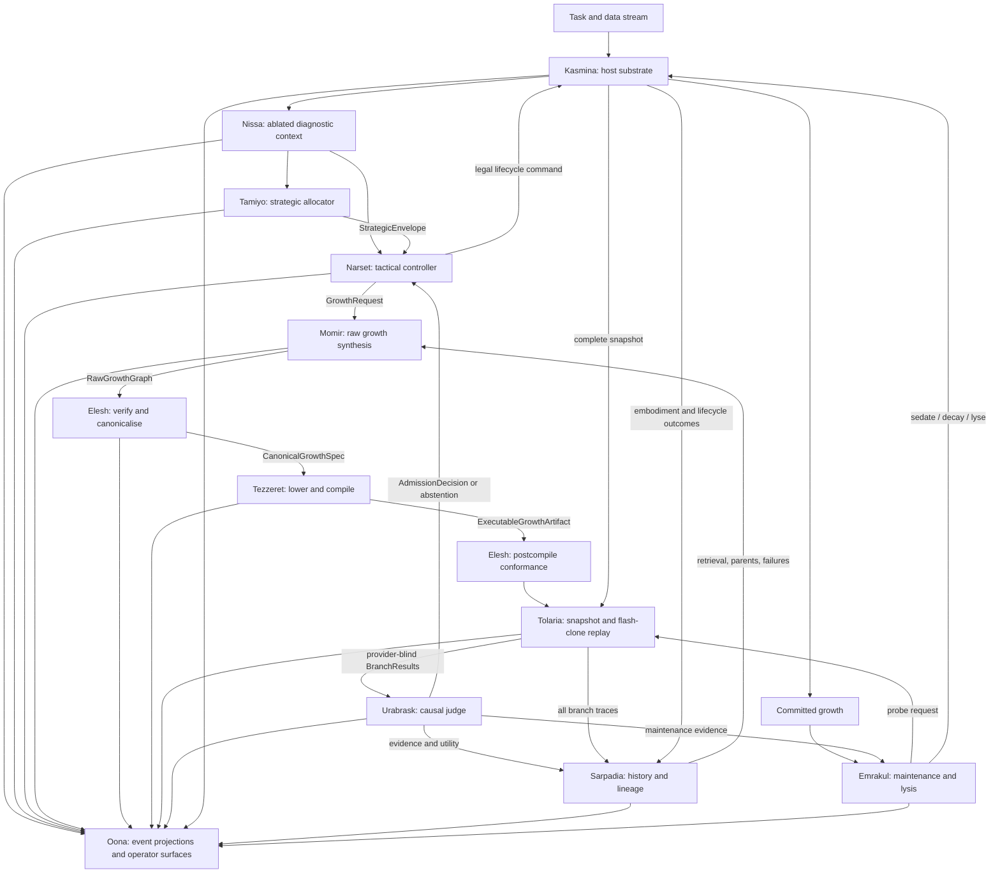

# High-Level Design: Counterfactual Generative Morphogenesis

**Working architecture:** Simic Engine with Phyrexian Orthodoxy gates  
**Status:** Target architecture / high-level design  
**Version:** 2.0  
**Supersedes:** The temporary A–I subsystem design  
**Package root:** `src/simic/` is used as the working repository layout; the project-level name may change without changing the subsystem boundaries.

---

## 1. Executive Summary

This design describes a lifecycle-driven neural training system in which new computational structure is **generated from the live state of a host network**, rather than selected from a fixed menu of human-authored module blueprints.

The existing morphogenetic chassis remains intact: growth occurs through reversible host slots; a newly born structure can begin at zero influence, mature behind the host, blend in gradually, hold for qualification, enter active service, become committed structure, or be sedated and lysed when it no longer earns its cost. What changes is the source and evaluation of that growth.

The system separates thirteen architectural authorities:

- **Leyline** defines the immutable contracts and schema rules connecting every other subsystem.
- **Tamiyo** allocates long-horizon developmental resources and strategic permissions across the host.
- **Narset** acts locally inside those permissions, deciding what the host should do now.
- **Nissa** observes the ablated host and emits typed diagnostic context.
- **Momir** generates raw candidate growth graphs and birth parameters.
- **Elesh** verifies, normalises, simplifies, and canonicalises those graphs without judging their usefulness.
- **Tezzeret** lowers canonical graphs into executable tensor programs without changing their semantics.
- **Tolaria** snapshots the entire training state, flash-clones it, and replays matched possible futures.
- **Urabrask** independently judges those futures against a mandatory no-intervention branch and may reject every candidate.
- **Kasmina** embodies an admitted candidate through reversible slots, isolated maturation, and controlled blending.
- **Sarpadia** records the complete evolutionary and counterfactual history of every candidate, including failures and abstentions.
- **Emrakul** owns the long-horizon maintenance, sedation, decay, and lysis of committed structures.
- **Oona** exposes an append-only operational account of the system through event projections, flight recorders, and operator interfaces.

The central operating loop is:

```text
Nissa observes the ablated host
        ↓
Tamiyo establishes strategic permissions and budgets
        ↓
Narset decides whether and where to request growth
        ↓
Momir generates raw candidate growths
        ↓
Elesh makes them legal, canonical, and comparable
        ↓
Tezzeret compiles them into executable artefacts
        ↓
Tolaria tests them in matched flash-cloned futures
        ↓
Urabrask admits one candidate or chooses no intervention
        ↓
Kasmina germinates, matures, blends, and embodies it
        ↓
Emrakul later retains, sedates, decays, or lyses it
        ↓
Sarpadia remembers every branch; Oona makes it visible
```

The resulting system can be stated simply:

> **Tamiyo allocates. Narset acts. Nissa observes. Momir imagines. Elesh permits. Tezzeret builds. Tolaria repeats. Urabrask judges. Kasmina embodies. Sarpadia remembers. Emrakul destroys. Oona reveals. Leyline constrains.**

The names are intentionally ludonarrative. Each codename encodes a behavioural mandate and therefore acts as an architectural smell detector. A subsystem doing something contrary to its narrative role is likely exercising authority it should not possess.

---

## 2. Problem Statement

A fixed-blueprint morphogenetic controller must solve too many coupled decisions at once:

- determine whether the host needs intervention;
- identify the correct insertion region;
- select a module family such as normalisation, convolution, or attention;
- initialise and train the module;
- decide when it is mature enough to blend;
- control its blend schedule;
- decide whether its contribution is temporary or persistent;
- and eventually retain, fossilise, sedate, prune, or recycle it.

This coupling creates several recurring failure modes.

### 2.1 The moving-target problem

The host continues to learn while a component is being constructed. A structure designed for host state \(s_t\) may be integrated into a materially different state \(s_{t+\delta}\). If construction is slow, component quality and component freshness become opposing objectives.

### 2.2 The curriculum problem

A controller exposed immediately to broad, unrelated training trajectories must discover the entire causal language of intervention through sparse exploration. It is asked to generalise before it has learned stable primitives such as:

- wait when the host is healthy;
- request growth only when the deficit is repairable;
- reject an entire candidate pool;
- blend cautiously;
- abort stale growth;
- and remove structure that no longer pays rent.

### 2.3 The blueprint problem

A human-authored blueprint catalogue limits growth to structures the designer anticipated. It also forces a tactical policy to learn a categorical ontology that may not align with the actual functional deficit in the host.

### 2.4 The attribution problem

A host that has trained with a component may become dependent on it. Removing that component from the same host measures both the component’s intrinsic value and the host’s acquired dependence. Reliable admission and retention therefore require matched no-intervention branches, not same-host ablation alone.

### 2.5 The authority problem

When generation, validation, screening, deployment, and retention are implemented in one intelligent controller, the system can no longer explain why an intervention succeeded or failed. It also becomes easy for one subsystem to approve its own work, modify evaluation criteria, or hide policy inside telemetry.

This design addresses those failures by decomposing developmental intent, structural invention, structural legality, compilation, causal evaluation, embodiment, memory, and maintenance into separate authorities.

---

## 3. Goals

The architecture has ten primary goals.

1. **Replace fixed blueprint selection with generated growth.** Production growth should be conditioned on the host’s functional state rather than restricted to a predefined semantic menu.
2. **Preserve reversible lifecycle mechanics.** Generated structures must remain isolatable, blendable, measurable, removable, and recyclable.
3. **Separate strategic and tactical control.** Slow allocation decisions and local lifecycle actions must not collapse into one policy.
4. **Make structural legality independent from task utility.** A candidate may be perfectly legal and completely useless; the system must preserve that distinction.
5. **Ground admission and retention in causal comparisons.** Candidates should be evaluated against matched no-op futures wherever the decision justifies the cost.
6. **Make abstention first-class.** Every candidate pool must be allowed to lose against doing nothing.
7. **Retain complete evolutionary history.** Failures, rejected pools, stale candidates, and abstentions are training data, not logging noise.
8. **Make resource use mechanical and auditable.** Budgets are declared at subsystem boundaries and spend is measured rather than inferred.
9. **Teach elementary intervention grammar before broad generalisation.** Static and repeated counterfactual curricula precede unrestricted environments.
10. **Use the naming scheme as an architecture linting language.** Each subsystem has explicit authorities and explicit forbidden knowledge.

---

## 4. Non-Goals

The initial implementation does not attempt:

- unrestricted source-code generation;
- arbitrary whole-network rewriting;
- autonomous modification of the training runtime;
- unbounded or Turing-complete growth grammars;
- learned control of every lifecycle and economy parameter from the outset;
- simultaneous growth across many regions before single-region reliability is established;
- continual learning without forgetting as a guaranteed property;
- replacement of ordinary host optimisation;
- or proof that generated growth is superior at every scale.

The first defensible claim is narrower:

> Given a typed insertion contract and a measured host deficit, can the system generate, verify, compile, causally screen, and safely integrate a useful constrained growth more quickly and reliably than comparable online construction, retrieval, random search, analytic construction, or static over-provisioning?

---

## 5. Naming as an Architectural Control

The naming scheme is not intended to replace normal documentation. It supplements it by assigning each subsystem a memorable behavioural archetype.

| Name | Architectural authority | Narrative verb | Must not become |
|---|---|---|---|
| **Leyline** | Contracts, schemas, versions, invariants | Constrains | A business-logic layer |
| **Tamiyo** | Strategic budgets and long-horizon developmental policy | Allocates | A local action selector |
| **Narset** | Local/tactical lifecycle controller | Acts | A source of unbudgeted authority |
| **Nissa** | Diagnostic observation and provenance | Observes | A hidden policy engine |
| **Momir** | Raw growth synthesis and variation | Imagines | The approver of its own candidates |
| **Elesh** | Structural verification and canonicalisation | Permits | A utility predictor or task judge |
| **Tezzeret** | Lowering, fusion, and compilation | Builds | A semantic graph generator |
| **Tolaria** | Snapshotting, branching, replay, rollback | Repeats | A policy or reward authority |
| **Urabrask** | Provider-blind causal judgement and admission | Judges | A generator-aware evaluator |
| **Kasmina** | Physical host, slots, gradients, blending, lifecycle mechanics | Embodies | A decision-maker |
| **Sarpadia** | Episodic history, lineage, outcomes, retrieval | Remembers | A winners-only trophy cabinet |
| **Emrakul** | Post-commit maintenance, sedation, decay, lysis | Destroys | A constructor or admission gate |
| **Oona** | Event projections, flight recorder, operator surfaces | Reveals | A control-plane backchannel |

### 5.1 Core ludonarrative invariants

- **Momir may generate bad ideas.** If Momir contains extensive rejection logic based on measured task performance, imagination and judgement have merged.
- **Elesh may reject malformed ideas.** If Elesh consumes reward, future utility, or candidate provenance, structural orthodoxy has become policy.
- **Tezzeret may optimise implementation.** If Tezzeret changes semantic topology, compilation has become generation.
- **Urabrask may reject everything.** If Urabrask cannot select no-op, the judge is compelled to reward intervention.
- **Kasmina must be opinionless.** If Kasmina calculates candidate utility, the host substrate has become policy-aware.
- **Nissa describes; Narset interprets.** If Nissa emits `should_grow=True`, policy is hidden inside telemetry.
- **Tamiyo grants authority; Narset spends it.** If Narset creates resources Tamiyo did not allocate, tactical control has escaped strategy.
- **Sarpadia remembers the dead.** If failed and rejected growths are discarded, history has become propaganda.
- **Oona witnesses but does not steer.** If disabling a dashboard changes training behaviour, observability is coupled to control.

---

## 6. Design Principles

### 6.1 Strategic permission and tactical action are separate

Tamiyo determines where developmental resources may be spent over a slow horizon. Narset decides what action to take at a particular local state. Tamiyo does not choose individual candidates or blend ticks. Narset cannot exceed Tamiyo’s envelope.

### 6.2 Developmental intent and developmental phenotype are separate

Narset requests growth by contract. Momir creates the detailed phenotype. Narset does not choose a fixed module class, and Momir does not decide whether intervention is warranted.

### 6.3 Structural validity and task utility are separate

Elesh answers whether a graph is legal, canonical, deterministic, shape-correct, gradient-correct, and statically affordable. Urabrask answers whether it improves the host’s trajectory after cost and risk are charged.

### 6.4 Canonical semantics precede compilation

Momir emits a raw graph. Elesh canonicalises it into a stable semantic identity. Tezzeret compiles that canonical object. A post-compilation conformance pass verifies that the executable artefact still implements the canonical semantics.

### 6.5 Every intervention is reversible

A growth begins at zero or negligible influence. Influence is controlled through explicit state and blend coefficients. Removal is a measured blend-out, not an abrupt structural discontinuity.

### 6.6 Doing nothing is a real competitor

Every trial includes a mandatory no-intervention branch whose utility is exactly zero. A growth request does not imply that a growth must be admitted.

### 6.7 Paired branches differ only in the intervention

Counterfactual branches begin from the same complete snapshot, receive the same future minibatches, and use the same declared resource accounting. Candidate source must not alter the trial protocol.

### 6.8 The screened object and deployed semantics are identical

The canonical growth selected by Urabrask must be the canonical growth embodied by Kasmina. Compilation may change execution strategy but not semantic identity.

### 6.9 Costs are contractual

Every constructor, compiler, screener, rollout, maturation process, and maintenance probe receives a declared budget and reports measured spend. Over-budget work is an explicit failure, not an invisible implementation detail.

### 6.10 Experience includes failures

Every candidate, rejection, abstention, stale integration, lifecycle reversal, and lysis event is recorded in Sarpadia. Learning only from survivors is prohibited by design.

### 6.11 Generalisation follows acquisition

Exact repetition and controlled one-axis variation precede composed variation, unseen host seeds, multiple regions, and image-scale tasks.

### 6.12 Observability is read-only

Oona may subscribe to, persist, aggregate, and present events. It cannot create actions, mutate budgets, or become a hidden dependency of the training path.

---

## 7. System Context and Architectural Planes

The system operates inside nested learning loops:

- an ordinary optimiser updates the host;
- Narset acts at local developmental decision points;
- Tamiyo updates strategic envelopes at a slower cadence;
- generated growth may undergo bounded maturation;
- Urabrask evaluates candidate branches;
- Emrakul periodically evaluates committed structures;
- and offline or outer-loop training updates Momir, Narset, Tamiyo, Urabrask’s local surrogate, and possibly Emrakul.

The architecture can be understood as seven planes.

| Plane | Subsystems | Purpose |
|---|---|---|
| **Constitutional** | Leyline | Defines the vocabulary, versions, ordering, and invariants of all other planes |
| **Strategic** | Tamiyo | Allocates budgets, risk, exploration, and regional permissions over long horizons |
| **Tactical** | Narset | Chooses immediate legal developmental actions inside the strategic envelope |
| **Synthesis** | Momir, Elesh, Tezzeret | Generates, validates, canonicalises, and compiles candidate growth |
| **Causal** | Nissa, Tolaria, Urabrask | Observes the host, constructs matched futures, and judges outcomes |
| **Embodiment** | Kasmina, Emrakul | Introduces growth safely and manages its long-horizon physical lifecycle |
| **Memory and witness** | Sarpadia, Oona | Retains experience and exposes an auditable account of system behaviour |

### 7.1 Logical architecture



### 7.2 Control hierarchy

```text
Tamiyo
  └── establishes StrategicEnvelope
        └── Narset selects local actions
              ├── WAIT
              ├── REQUEST_GROWTH
              ├── BEGIN_MATURATION
              ├── REQUEST_ADMISSION
              ├── BEGIN_BLEND
              ├── HOLD
              ├── ABORT
              └── COMMIT

After COMMIT:
  Narset relinquishes ordinary ownership
        └── Emrakul manages long-horizon maintenance
              ├── PROBE
              ├── HOLD
              ├── SEDATE
              ├── DECAY
              └── LYSE
```

Urabrask is not in this hierarchy. It is an independent gate. Narset and Emrakul may request decisions, but neither may override an Urabrask rejection or fabricate admission evidence.

---

## 8. Subsystem Map

| Subsystem | Primary responsibility | Key outputs | Explicitly does not own |
|---|---|---|---|
| **Leyline** | Typed contracts, schema versions, ordering invariants, compatibility rules | Versioned records and validation rules | Policy, reward, compilation, storage |
| **Tamiyo** | Strategic budgets, regional priorities, exploration quotas, global cooldowns, long-horizon risk | `StrategicEnvelope` | Local action timing or candidate choice |
| **Narset** | Local/tactical developmental policy and pre-commit lifecycle actions | `GrowthRequest`, `LifecycleCommand`, escalation requests | Unallocated budget or structural generation |
| **Nissa** | Ablated host telemetry and diagnostic provenance | `TelemetryEnvelope` | `should_grow`, reward, or admission decisions |
| **Momir** | Raw candidate topology, parameters, mutation, recombination | `RawGrowthGraph` | Structural approval or task utility |
| **Elesh** | Static graph verification, canonicalisation, semantic hashing, legality | `CanonicalGrowthSpec`, verification reports | Task reward, candidate ranking, lifecycle policy |
| **Tezzeret** | Lowering, kernel selection, fusion, code generation, compilation | `ExecutableGrowthArtifact`, compilation manifest | Semantic topology changes or admission |
| **Tolaria** | Complete snapshots, deterministic replay, branching, common futures, rollback | `Snapshot`, `BranchResult`, branch state | Utility weights or policy decisions |
| **Urabrask** | Provider-blind causal judgement, no-op comparison, admission, utility accounting | `AdmissionDecision`, `UtilityEvidence` | Candidate generation, compilation, host mutation |
| **Kasmina** | Host network, insertion regions, slots, gradients, maturation isolation, alpha blending, lifecycle mechanics | Embodied state and lifecycle events | Whether growth is desirable |
| **Sarpadia** | Episodic growth memory, lineage, outcomes, retrieval, training datasets | `GrowthRecord`, retrieval sets, lineage graphs | Live host mutation or self-approval |
| **Emrakul** | Post-commit retention, sedation, decay, and lysis policy | Maintenance commands | Candidate construction or initial admission |
| **Oona** | Append-only event transport, projections, flight recorder, TUI/dashboard adapters | Operator views and audit bundles | Training control or source-of-truth schemas |

---

## 9. Core Contracts

Subsystem boundaries are enforced with typed, immutable or append-only records. Shared mutable objects are not passed across authority boundaries.

## 9.1 `StrategicEnvelope`

Issued by Tamiyo and consumed by Narset, Urabrask, and Kasmina.

```text
StrategicEnvelope
    envelope_id
    valid_from_step
    valid_until_step
    host_scope
    region_allocations[]
        region_id
        parameter_budget
        compute_budget
        latency_budget
        max_concurrent_growths
        max_interventions
        cooldown
        exploration_allowance
        risk_ceiling
        preferred_horizon
    global_parameter_ceiling
    global_compute_ceiling
    global_churn_ceiling
    priority_weights
    policy_version
    schema_version
```

The envelope grants permission. It does not instruct Narset to act.

## 9.2 `TelemetryEnvelope`

Produced by Nissa.

```text
TelemetryEnvelope
    telemetry_id
    host_state_id
    step
    region_id
    ablated_context
    task_metrics
    activation_statistics
    spectral_statistics
    local_functional_gradient
    optimisation_velocity
    lifecycle_context
    budget_context
    temporal_context
    provenance
    normalization_manifest
    schema_version
```

Any change in meaning, width, basis, normalisation, or provenance creates a new schema version.

## 9.3 `GrowthRequest`

Issued by Narset under a valid `StrategicEnvelope`.

```text
GrowthRequest
    request_id
    envelope_id
    telemetry_id
    host_state_id
    insertion_region
    input_output_contract
    grammar_version
    parameter_budget
    construction_compute_budget
    compilation_budget
    screening_budget
    latency_budget
    candidate_count
    maturity_mode
    maturity_budget
    blend_policy_class
    evaluation_horizons
    risk_tolerance
    retrieval_policy
    request_reason
    schema_version
```

A request states what may be built and spent. It never contains a blueprint identity such as `ATTENTION` or `CONV`.

## 9.4 `RawGrowthGraph`

Produced by Momir.

```text
RawGrowthGraph
    raw_candidate_id
    request_id
    raw_graph_ir
    raw_birth_parameters
    trainability_intent
    parent_lineages[]
    retrieval_provenance[]
    generator_version
    latent_code
    proposal_probability_or_score
    estimated_uncertainty
    generation_spend
```

A raw graph is not executable and not trusted.

## 9.5 `CanonicalGrowthSpec`

Produced by Elesh.

```text
CanonicalGrowthSpec
    canonical_candidate_id
    raw_candidate_id
    request_id
    canonical_graph_ir
    canonical_parameters
    input_output_contract
    trainability_mask
    zero_influence_proof
    gradient_flow_manifest
    parameter_count
    static_compute_estimate
    memory_estimate
    canonical_semantic_hash
    equivalence_class_id
    structural_pruning_report
    verification_report
    grammar_version
    canonicalizer_version
```

The canonical semantic hash identifies the growth’s developmental semantics independent of compilation strategy.

## 9.6 `ExecutableGrowthArtifact`

Produced by Tezzeret.

```text
ExecutableGrowthArtifact
    artifact_id
    canonical_candidate_id
    canonical_semantic_hash
    device_target
    dtype
    compiled_module_or_graph
    kernel_manifest
    fusion_manifest
    runtime_parameter_layout
    runtime_cost_estimate
    compiler_version
    compilation_spend
    reproducibility_manifest
```

Elesh performs post-compilation conformance checks to verify that the artefact implements the canonical specification within the declared numerical contract.

## 9.7 `Snapshot`

Produced by Tolaria.

```text
Snapshot
    snapshot_id
    host_parameters
    host_optimizer_state
    growth_slot_states
    lifecycle_state
    economy_state
    narset_recurrent_state
    tamiyo_state_reference
    telemetry_history
    random_number_states
    dataloader_cursor
    task_configuration
    recent_batches
    fixed_future_minibatch_sequence
    device_and_determinism_manifest
    code_and_schema_versions
```

A snapshot is complete only when restoring it twice and consuming the same future produces bit-identical traces under the declared environment.

## 9.8 `TrialPlan`

Created by Tolaria from a request and candidate pool.

```text
TrialPlan
    trial_id
    snapshot_id
    request_id
    candidate_artifacts[]
    mandatory_no_op
    control_candidates[]
    support_split
    screen_split
    admission_audit_split
    retention_report_split
    future_sequence_id
    horizons[]
    per_branch_budget
    determinism_manifest
```

## 9.9 `BranchResult`

Produced by Tolaria and consumed by Urabrask and Sarpadia.

```text
BranchResult
    trial_id
    branch_id
    canonical_candidate_id
    canonical_semantic_hash
    candidate_source_class
    loss_trajectory
    accuracy_trajectory
    activation_trajectory
    gradient_trajectory
    local_score
    short_horizon_effect
    long_horizon_effect
    integration_shock
    gradient_shock
    parameter_cost
    measured_compute_spend
    measured_latency
    stability_events
    lifecycle_events
    final_state_reference
    replay_digest
```

Candidate source is retained for analysis but hidden from the provider-blind scoring path.

## 9.10 `AdmissionDecision`

Produced by Urabrask.

```text
AdmissionDecision
    decision_id
    trial_id
    selected_candidate_id | NO_OP
    selected_semantic_hash | null
    no_op_margin
    selection_utility
    admission_audit_gain
    cost_breakdown
    uncertainty
    accepted_horizon
    rejection_reason | null
    admission_token | null
    utility_policy_version
```

An admission token is required before Kasmina may raise a new growth above zero influence.

## 9.11 `LifecycleCommand`

Issued by Narset before commitment or Emrakul after commitment.

```text
LifecycleCommand
    command_id
    authority              # NARSET or EMRAKUL
    target_growth_id
    requested_transition
    admission_token | null
    evidence_reference
    strategic_envelope_id
    budget
    reason
```

Kasmina validates the command against the legal authority and state-transition table.

## 9.12 `GrowthRecord`

Stored by Sarpadia.

```text
GrowthRecord
    base_host_trajectory_id
    snapshot_id
    telemetry
    strategic_envelope
    growth_request
    raw_growth_graph
    canonical_growth_spec
    executable_artifact_manifest
    branch_result
    admission_decision
    selected_or_rejected
    rejection_reason
    no_op_margin
    maturation_history
    blend_history
    retained_contribution
    maintenance_history
    terminal_outcome
    failure_mode
    lineage_edges
    split_membership
```

The full candidate pool is stored, including pools in which no candidate is admitted.

## 9.13 `EventEnvelope`

Defined by Leyline and published by every subsystem for Oona.

```text
EventEnvelope
    event_id
    event_type
    producer
    host_state_id
    correlation_id
    causal_parent_ids[]
    timestamp_or_logical_step
    payload_schema_version
    payload
    integrity_digest
```

Oona consumes these events but does not define their source-of-truth semantics.

---

## 10. End-to-End Operating Flow

## 10.1 Strategic allocation

At a slow cadence, Tamiyo consumes coarse host health, regional histories, current capacity, recent interventions, and strategic objectives. It emits a `StrategicEnvelope` specifying:

- which regions may grow;
- how much parameter and compute capacity each may consume;
- maximum concurrent growth;
- acceptable risk and churn;
- exploration allowances;
- and cooldowns or embargoes.

Tamiyo may reserve capacity for anticipated future pressure, but it cannot select an immediate candidate or issue a blend command.

## 10.2 Local observation

Nissa observes the host at each local decision point. For germination decisions, telemetry is taken from the **ablated path**, so the condition describes the deficit without assistance from an existing growth.

Nissa emits measurements and provenance, not conclusions.

## 10.3 Tactical decision

Narset receives Nissa’s telemetry, the active `StrategicEnvelope`, local lifecycle state, and compact Sarpadia retrieval summaries. It chooses among legal local actions:

```text
WAIT
REQUEST_GROWTH
CONTINUE_MATURATION
REQUEST_ADMISSION
BEGIN_BLEND
CONTINUE_BLEND
HOLD
ABORT
COMMIT
ESCALATE_TO_TAMIYO
```

A `REQUEST_GROWTH` action creates a typed `GrowthRequest` whose budgets cannot exceed the strategic envelope.

## 10.4 Candidate synthesis

Momir receives the request, diagnostic context, and optional retrieval material from Sarpadia. It may generate:

- fresh candidates;
- mutations of successful or failed ancestors;
- recombinations of compatible lineages;
- deterministic proposals;
- or stochastic best-of-\(K\) pools.

Research controls such as random, analytic, or human-designed candidates enter through the same downstream contracts but are tagged as control sources.

## 10.5 Orthodoxy gate

Elesh processes each raw graph before compilation.

It performs:

- graph grammar validation;
- tensor shape inference and alignment;
- insertion-contract checks;
- cycle and reachability checks;
- gradient-flow analysis;
- zero-influence verification;
- static parameter and memory accounting;
- forbidden-operation detection;
- dead-node elimination;
- semantics-preserving graph simplification;
- deterministic ordering;
- canonical parameter layout;
- equivalence-class detection;
- and canonical semantic hashing.

Elesh may reject a candidate as structurally invalid. It may not reject it because it predicts poor task performance.

## 10.6 Compilation forge

Tezzeret lowers a canonical graph into an executable artefact for the target device and dtype.

It may perform:

- operator lowering;
- kernel selection;
- fusion;
- layout optimisation;
- constant folding;
- memory planning;
- compilation;
- and runtime cost estimation.

It must preserve the canonical semantic hash. After compilation, Elesh verifies conformance using reference inputs, zero-influence checks, gradient checks, and numerical tolerances declared in Leyline.

## 10.7 Flash-clone trial

Tolaria captures a complete snapshot and constructs matched branches:

- one branch for every executable candidate;
- a mandatory no-op branch;
- and any declared control candidates.

All branches receive:

- the same future minibatches;
- equivalent random streams except where candidate stochasticity is the declared variable;
- the same evaluation horizon;
- and the same cost accounting.

Tolaria reports raw branch outcomes. It does not rank candidates.

## 10.8 Independent judgement

Urabrask scores branches without access to candidate source identity. It compares each branch against no-op, charges cost and shock, and either:

- admits one candidate;
- rejects the selected candidate at the independent audit gate;
- or selects no intervention.

Urabrask may reject an entire candidate pool even when Narset requested growth and Tamiyo allocated resources.

## 10.9 Germination and maturation

Kasmina installs the admitted canonical growth at alpha zero. It verifies the admission token, canonical semantic hash, executable artefact identity, insertion contract, and lifecycle legality.

Two maturation modes are supported:

- **one-shot mode:** the growth is frozen after admission;
- **nursery mode:** the growth receives a bounded isolated maturation budget behind the host.

If nursery mode causes host or growth state to move, the candidate must be re-qualified before blend-in.

## 10.10 Integration and commitment

Narset controls the pre-commit lifecycle inside the strategic envelope:

- blend;
- pause;
- hold;
- reverse;
- abort;
- or commit.

No growth can increase influence without a valid admission token. Commitment transfers ordinary lifecycle authority from Narset to Emrakul.

## 10.11 Long-horizon maintenance

Emrakul periodically requests maintenance evidence. Tolaria creates a matched no-op or re-adaptation branch where justified; Urabrask returns provider-blind retained-utility evidence.

Emrakul may:

- retain;
- reduce alpha;
- sedate;
- initiate decay;
- or lyse.

It cannot invent replacement growth or retroactively change the original admission criteria.

## 10.12 Memory and witness

Sarpadia stores every stage of every candidate, including structurally rejected raw graphs, compiled candidates, branch outcomes, no-op wins, maturation failures, and maintenance outcomes.

Oona receives append-only events and presents:

- branch trees;
- candidate lineages;
- strategic envelopes;
- local actions;
- admission evidence;
- lifecycle traces;
- spend and rent;
- determinism manifests;
- and alerts.

---

## 11. Generated Growth Model

## 11.1 Growth progression

The growth language expands only after the preceding level passes reliability gates.

### Level 1 — Generated phenotype inside a universal envelope

The first implementation uses a shape-preserving residual form:

\[
h' = h + \alpha B_\theta(h).
\]

Momir generates parameters, rank, gates, scale, permitted width, and trainability mask inside a constrained envelope such as:

- a low-rank linear update;
- a small gated residual multilayer perceptron;
- or another typed residual microcell.

This removes semantic blueprint labels while keeping the search space safe and measurable.

### Level 2 — Generated constrained genotype

Momir may choose from a safe graph grammar:

- hidden width;
- number of internal stages;
- activation family;
- gating pattern;
- residual topology;
- sparse connectivity;
- normalisation placement;
- low-rank factorisation;
- and trainability mask.

Elesh canonicalises semantically equivalent graph forms into one identity.

### Level 3 — Generated typed graph

Momir emits a small directed acyclic graph over whitelisted operators. Elesh proves contract compliance and canonicalises it. Tezzeret compiles it.

The grammar remains bounded by:

- operator whitelist;
- maximum nodes and edges;
- maximum parameter and memory cost;
- shape-preserving insertion contracts;
- deterministic execution requirements;
- reversible zero-influence behaviour;
- and declared gradient-flow rules.

Arbitrary code generation is not required.

## 11.2 One-shot and nursery modes

### One-shot mode

- Momir emits the complete final growth.
- Kasmina holds it frozen after admission.
- Only alpha and lifecycle state may change.
- This is the cleanest test of generative construction as a final answer.

### Nursery mode

- Momir emits structure, birth parameters, and a trainability mask.
- Kasmina grants bounded isolated maturation.
- Host and growth optimisation streams remain explicit and separately accounted.
- The growth is re-qualified against the current host before blending.
- Maturation spend is charged to the candidate.

Nursery mode is the default ecological configuration because it preserves safe behind-the-host maturation. One-shot mode remains a required scientific ablation.

## 11.3 Candidate identity

Three identities are distinct:

1. **Raw identity:** the exact graph Momir proposed.
2. **Canonical semantic identity:** the graph after Elesh’s semantics-preserving canonicalisation.
3. **Executable artefact identity:** Tezzeret’s device-specific implementation.

Sarpadia stores all three. Urabrask judges canonical semantics executed through a verified artefact. Kasmina embodies the same canonical semantic identity.

Two compiled artefacts may implement the same canonical growth. Two raw graphs may canonicalise to the same semantic identity. Candidate diversity is therefore measured primarily in canonical and functional space, not raw syntax or compiler artefact space.

---

## 12. Lifecycle and Authority Model

The target lifecycle is:

```text
DORMANT
  → GERMINATED
  → MATURING or QUALIFYING
  → BLENDING
  → HOLDING
  → ACTIVE
  → COMMITTED
  → SEDATED or DECAYING
  → DORMANT
```

Permitted early exits include:

```text
GERMINATED → ABORTED → DORMANT
MATURING → ABORTED → DORMANT
QUALIFYING → REJECTED → DORMANT
BLENDING → DECAYING → DORMANT
HOLDING → DECAYING → DORMANT
ACTIVE → DECAYING → DORMANT
```

### 12.1 State meanings

| State | Meaning | Ordinary authority |
|---|---|---|
| **DORMANT** | Slot empty and available | Kasmina mechanics; Narset may request germination |
| **GERMINATED** | Admitted growth installed at zero influence | Narset |
| **MATURING** | Optional isolated local optimisation | Narset within budget |
| **QUALIFYING** | Post-birth or post-maturation evaluation | Urabrask gate; Narset requests |
| **BLENDING** | Alpha rises under a bounded schedule | Narset |
| **HOLDING** | Target alpha reached; grace and qualification window | Narset, constrained by Urabrask evidence |
| **ACTIVE** | Growth serves under local lifecycle control | Narset |
| **COMMITTED** | Growth becomes established structure | Ownership transfers to Emrakul |
| **SEDATED** | Influence reduced while replacement or dispensability is assessed | Emrakul |
| **DECAYING** | Alpha ramps to zero before recycling | Emrakul, or Narset before commitment |
| **DORMANT** | Slot recycled; occupant-specific economy state reset | Kasmina |

### 12.2 Transition authority

Kasmina is the sole executor of state transitions and enforces the following rules:

- Tamiyo does not issue lifecycle transitions.
- Narset may issue only pre-commit transitions.
- Emrakul may issue only post-commit maintenance transitions.
- Urabrask issues evidence and admission tokens, not physical transitions.
- A transition increasing influence requires a valid admission or re-qualification token.
- A transition reducing influence may be initiated for safety, but must still be logged and budgeted.

### 12.3 Commitment handoff

Commitment is an ownership boundary, not merely a label.

Before commitment:

- Narset manages the growth as an intervention under evaluation.

After commitment:

- Emrakul manages the growth as part of the host’s maintained structure.

Narset may request that Emrakul review a committed growth but may not directly lyse it. Emrakul may request replacement pressure but may not ask Momir to construct a specific replacement without a new Narset request under a Tamiyo envelope.

### 12.4 Grace-period protection

A growth cannot be condemned merely because low early alpha yields low measured contribution.

- utility does not accrue during initial blend unless explicitly defined;
- removal is blocked during the minimum blend and holding windows;
- and the qualification window is pre-registered.

---

## 13. Detailed Subsystem Specifications

## 13.1 Leyline — Contracts and Schemas

### Responsibilities

- define every cross-subsystem record;
- define schema versions and compatibility rules;
- define canonical ordering and enum stability;
- define lifecycle state and transition vocabulary;
- define cost units and budget semantics;
- define numerical tolerance and determinism contracts;
- define event envelopes and provenance fields;
- and provide pure validation functions.

### Invariants

- Leyline has no dependency on higher-level subsystem implementations.
- Schema changes are explicit and versioned.
- Unknown fields fail closed where safety or reproducibility is affected.
- A consumer cannot silently accept a schema it was not trained or compiled against.

### Forbidden authority

Leyline must not:

- choose candidates;
- calculate reward;
- compile graphs;
- access the live host;
- store experiment history;
- or call subsystem services.

### Smell

> If Leyline imports Momir, Narset, Urabrask, or Kasmina, the dependency direction is probably wrong.

## 13.2 Tamiyo — Strategic Allocator

### Responsibilities

- allocate parameter, compute, latency, and churn budgets across regions;
- set maximum concurrent growth;
- establish global and regional cooldowns;
- balance exploitation and exploration allowances;
- set long-horizon priorities and risk ceilings;
- coordinate multiple Narset-controlled regions or cells;
- react to persistent trends rather than individual noisy steps;
- and emit versioned `StrategicEnvelope` records.

### Inputs

- coarse Nissa summaries;
- Sarpadia history and regional performance;
- current host capacity and committed growth;
- Urabrask and Emrakul aggregate outcomes;
- strategic task objectives;
- and global resource availability.

### Outputs

- `StrategicEnvelope`;
- allocation updates;
- embargoes or emergency restrictions;
- and requests for strategic review.

### Invariants

- Tamiyo operates on a slower cadence than Narset.
- It cannot name a candidate, kernel, or raw graph.
- It cannot directly change alpha or issue a local lifecycle transition.
- All local resource use must be traceable to an active envelope.

### Smell

> If Tamiyo is choosing an individual candidate or deciding the next blend tick, strategy has become micromanagement.

## 13.3 Narset — Tactical Controller

### Responsibilities

- interpret local telemetry;
- decide whether to wait, request growth, mature, qualify, blend, hold, abort, or commit;
- choose an insertion region permitted by Tamiyo;
- construct `GrowthRequest` records within budget;
- manage pre-commit lifecycle timing;
- request admission and re-qualification from Urabrask;
- and escalate strategic shortages or conflicts to Tamiyo.

### Inputs

- Nissa telemetry;
- active strategic envelope;
- Kasmina local lifecycle state;
- Urabrask evidence;
- compact Sarpadia retrieval and uncertainty summaries;
- and Emrakul notifications where committed structure affects local capacity.

### Outputs

- `GrowthRequest`;
- pre-commit `LifecycleCommand`;
- strategic escalation;
- and action telemetry.

### Invariants

- Narset cannot exceed Tamiyo’s budget.
- Narset cannot choose a structure that bypasses Momir/Elesh/Tezzeret.
- Narset cannot override Urabrask’s no-op decision.
- Narset relinquishes ordinary ownership at commitment.

### Smell

> If Narset can create capacity or spend compute not present in the active envelope, local policy has escaped governance.

## 13.4 Nissa — Diagnostic Context

### Responsibilities

- observe the host and insertion regions;
- produce ablated-path telemetry for growth decisions;
- compute typed activation, gradient, spectral, temporal, and task diagnostics;
- attach provenance and normalisation manifests;
- provide coarse summaries to Tamiyo and local detail to Narset and Momir;
- and emit stable, versioned `TelemetryEnvelope` records.

### Invariants

- Nissa observations do not mutate host gradients or training state.
- Germination context is measured without the contribution being diagnosed or replaced.
- Every derived signal includes provenance and normalization semantics.
- Task-specific information is included only when the experiment permits it.

### Forbidden authority

Nissa must not emit:

- `should_grow`;
- candidate rankings;
- reward;
- lifecycle actions;
- or admission decisions.

### Smell

> If Nissa tells Narset what to do rather than what it observed, policy has been hidden in telemetry.

## 13.5 Momir — Growth Generator

### Responsibilities

- synthesise raw candidate graphs and birth parameters;
- model a distribution over useful growths;
- provide latent or mixture diversity;
- mutate and recombine Sarpadian lineages;
- incorporate diagnostic context and request constraints;
- report generation uncertainty and measured spend;
- and preserve provenance for every proposal.

### Candidate sources

Momir may operate in several modes:

- deterministic direct generation;
- stochastic best-of-\(K\);
- retrieved-parent mutation;
- lineage recombination;
- conditional flow or diffusion only if simpler models fail;
- or human-seeded search during research acquisition.

### Invariants

- Momir outputs raw proposals, not executable modules.
- Momir cannot approve or deploy its own work.
- Candidate diversity is evaluated in canonical and functional space.
- A generator version is bound to compatible telemetry and grammar versions.

### Smell

> If Momir rejects candidates because they have low measured future utility, the generator is grading its own examination.

## 13.6 Elesh — Structural Verifier and Canonicalizer

### Responsibilities

- validate graph grammar;
- infer and reconcile tensor shapes;
- verify insertion contracts;
- analyse gradient reachability and declared trainability;
- prove zero-influence or function-preserving birth behaviour;
- reject forbidden operations and host references;
- enforce static parameter, memory, and graph-complexity ceilings;
- remove dead or semantically redundant structure;
- canonicalise graph ordering and parameter layout;
- identify equivalent graphs;
- assign canonical semantic hashes;
- and verify compiled artefact conformance.

### Canonicalisation rule

Every transformation by Elesh must be semantics-preserving under the declared numerical contract. Structural pruning is permitted only when it removes dead, unreachable, duplicate, identity, or otherwise provably equivalent structure.

### Invariants

- Elesh does not consume task reward or future utility.
- Elesh does not know which constructor produced a candidate except where provenance is required for audit and excluded from decision logic.
- Canonicalisation occurs before compilation.
- Postcompile verification checks semantics but does not re-optimise the graph.

### Smell

> If Elesh rejects a legal candidate because it is predicted to perform poorly, structural orthodoxy has become the government.

## 13.7 Tezzeret — Compilation Forge

### Responsibilities

- lower canonical graphs into executable tensor operations;
- select kernels and layouts;
- fuse compatible operations;
- plan memory;
- compile for target hardware and dtype;
- estimate runtime cost;
- report measured compilation spend;
- and emit reproducibility manifests.

### Invariants

- Tezzeret cannot change canonical semantic identity.
- Every optimisation must be traceable in the compilation manifest.
- Compiled artefacts must pass Elesh postcompile conformance.
- Compilation failure is distinct from structural rejection and task rejection.

### Smell

> If Tezzeret invents a new semantic node to improve predicted performance, the compiler has become Momir.

## 13.8 Tolaria — Flash-Clone Engine

### Responsibilities

- capture complete snapshots;
- restore exact state;
- capture host, optimiser, lifecycle, controller, RNG, dataloader, and task state;
- materialise common future minibatches;
- execute matched branches;
- perform deterministic replay;
- support rollback and branch adoption;
- measure raw trajectories and spend;
- and produce replay digests.

### Evaluation modes

**Academy mode** performs full or multi-horizon counterfactual rollouts for research labels and curriculum acquisition.

**Field mode** uses a cheap local scorer, a learned surrogate, or a short rollout, escalating to fuller branching when uncertainty or stakes justify it.

### Invariants

- Paired branches differ only in declared interventions.
- Candidate source does not alter branch protocol.
- Restore plus common future must be bit-identical under the determinism contract.
- A branch-matured candidate is deployed only by adopting the winning branch or replaying it exactly from the common snapshot.

### Smell

> If two Tolaria branches receive different minibatches without that difference being the experimental variable, the counterfactual is invalid.

## 13.9 Urabrask — Independent Causal Judge

### Responsibilities

- score candidate branches against no-op;
- apply provider-blind selection;
- charge compute, latency, parameter cost, and integration shock;
- perform independent admission auditing;
- return an admitted candidate or no-op;
- calibrate abstention;
- provide retained-utility evidence for Emrakul;
- and expose uncertainty and regret estimates.

### Utility

For candidate \(c\), state \(s\), and horizon \(H\):

\[
u_{admit}(c,s,H)
=
\mathcal{L}_{no-op}(s,H)
-
\mathcal{L}_{c}(s,H)
-
\lambda C_c
-
\mu S_c
-
\nu P_c.
\]

The no-op branch has utility exactly zero.

Retention evidence omits installation shock because a resident growth is no longer integrating:

\[
u_{retain}(c,s,H)
=
G_{c:no-op}(s,H)
-
\lambda C_c
-
\nu P_c.
\]

Common cost weights remain consistent between admission and retention unless a difference is structurally justified and pre-registered.

### Invariants

- Urabrask cannot see candidate source during scoring.
- It can reject all candidates.
- It cannot mutate a candidate or the live host.
- It reports evidence separately from policy actions.
- Acceptance thresholds are calibrated on validation trajectories, not test trajectories.

### Smell

> If Urabrask knows a candidate came from Momir, retrieval, or a human while scoring it, assume evaluation contamination until proven otherwise.

## 13.10 Kasmina — Host and Growth Substrate

### Responsibilities

- implement the host network and insertion regions;
- provide reversible growth slots;
- expose ablated and active forward paths;
- isolate gradients according to declared trainability;
- install verified executable artefacts;
- manage alpha blending and lifecycle state;
- support bounded nursery maturation;
- serialize complete host and slot state;
- enforce lifecycle transition authority;
- and recycle slots after removal.

### Invariants

- Kasmina does not decide whether a growth is good.
- It will not raise influence without a valid admission token.
- The embodied canonical semantic hash matches Urabrask’s admitted hash.
- Removal uses gradual blend-out except for declared emergency safety actions.
- Occupant-specific economy state resets on slot recycling.

### Smell

> If Kasmina computes reward or chooses among candidates, the physical substrate has acquired opinions.

## 13.11 Sarpadia — Growth Memory and Lineage Archive

### Responsibilities

- retain every candidate and outcome;
- store raw, canonical, compiled, trial, embodiment, and maintenance identities;
- maintain lineage and equivalence graphs;
- index host contexts and functional effects;
- serve compatible retrieval sets;
- provide failed and successful ancestors to Momir;
- build training datasets for Momir, Narset, Tamiyo, Urabrask, and Emrakul;
- preserve split membership by base host trajectory;
- and support reproducible historical queries.

### Retrieval modes

- telemetry-nearest neighbours;
- learned host-state embeddings;
- local-gradient alignment;
- functional-effect similarity;
- task-context similarity;
- lineage-success priors;
- failure-avoidance retrieval;
- and calibrated mixtures of these modes.

### Invariants

- Rejected pools and abstentions are retained.
- Branches from one base trajectory never cross dataset splits.
- Historical records are append-only; corrections create new versions.
- Retrieval cannot bypass Elesh or Urabrask.
- Sarpadia does not mutate the live host.

### Smell

> If Sarpadia stores only winners, history has become propaganda.

## 13.12 Emrakul — Maintenance, Decay, and Lysis

### Responsibilities

- manage committed growth over long horizons;
- request periodic retained-utility probes;
- detect declining utility, redundancy, and replacement;
- reduce alpha or sedate growth;
- initiate gradual decay;
- lyse obsolete structures;
- consolidate capacity under strategic constraints;
- and return recycled capacity to Tamiyo’s strategic view.

### Inputs

- Urabrask retained-utility evidence;
- Tolaria maintenance branches;
- Kasmina lifecycle and alpha state;
- Nissa long-horizon telemetry;
- Tamiyo strategic budgets;
- and Sarpadia lineage and historical maintenance outcomes.

### Invariants

- Emrakul acts only on committed or explicitly handed-off growth.
- It does not construct replacements.
- It does not alter Urabrask’s utility policy.
- Sedation precedes lysis where safety permits.
- Lysis is a real state transition emitted once, not a repeated empty-slot event.

### Smell

> If Emrakul is evaluating unborn candidates, maintenance has leaked into admission.

## 13.13 Oona — Event Projections and Operator Surface

### Responsibilities

- consume `EventEnvelope` streams;
- maintain append-only flight-recorder storage;
- build materialised views and projections;
- power Sanctum-style terminal interfaces and Overwatch-style dashboards;
- expose branch trees, lineages, budgets, and lifecycle traces;
- generate audit bundles;
- alert on invariant breaches;
- and support replay navigation.

### Internal separation

Oona may contain distinct internal packages for:

- event transport adapters;
- durable flight-recorder storage;
- projection builders;
- TUI adapters;
- dashboard adapters;
- and report generation.

Leyline owns event schemas. Producers own the truth of their events. Oona owns presentation and projection.

### Invariants

- Training behaviour is unchanged when Oona is disconnected.
- Operator commands, if later introduced, pass through explicit control APIs owned by the relevant authority; they never mutate state through a dashboard backchannel.
- Missing UI data fails visibly rather than silently fabricating a default.

### Smell

> If changing a dashboard changes the training path, the witness has become a participant.

---

## 14. Counterfactual Execution and Evaluation

## 14.1 Candidate pool

A trial may contain:

- fresh Momir candidates;
- deterministic and stochastic Momir variants;
- Sarpadian retrieval candidates;
- mutations or recombinations;
- random controls;
- analytic controls such as gradient-SVD or linearised least squares;
- bounded online-optimised controls;
- deliberately harmful candidates;
- short-term-helpful but long-term-regressing candidates;
- known oracle repairs where available;
- and the mandatory no-op branch.

All structurally expressible candidates pass through Elesh and Tezzeret. No source receives a privileged screening path.

## 14.2 Data separation

The target design separates four data roles:

1. **Support data:** candidate construction or nursery maturation.
2. **Screen data:** candidate ranking within the pool.
3. **Admission audit data:** independent gate for the screen winner.
4. **Retention/report data:** periodic maintenance and headline reporting, untouched by construction or admission.

This prevents best-of-\(K\) overfitting and stops acceptance data from being reused as independent retention or reporting evidence.

## 14.3 Academy mode

Academy mode is used for:

- multi-horizon utility labels;
- candidate construction comparisons;
- field-screener calibration;
- Narset imitation targets;
- Tamiyo allocation outcomes;
- Emrakul maintenance labels;
- and Sarpadia dataset construction.

It may be expensive. Its cost is explicitly measured as a product of snapshots, candidate families, candidates per family, horizons, and rollout length.

## 14.4 Field mode

Field mode trades accuracy against cost through a tiered process:

1. local horizon-zero score;
2. learned utility and uncertainty estimate;
3. short rollout for close or high-cost decisions;
4. full Academy-style trial only when required by policy or risk.

The field screener is valid only to the extent that its selection regret and abstention calibration have been measured against Academy labels.

## 14.5 Branch adoption invariant

A candidate matured or evaluated inside a branch must never be copied into a live host that followed a different trajectory.

Deployment occurs by either:

- adopting the winning branch’s complete state; or
- restoring the common snapshot and deterministically replaying the winning branch.

Copying only the candidate from a co-adapted branch into a divergent host is invalid.

## 14.6 Provider blindness

Urabrask receives candidate identifiers and canonical semantics but not source labels during scoring. Source provenance is reattached after the decision for analysis and Sarpadia storage.

## 14.7 Statistical unit

Counterfactual branches are paired observations. The independent statistical unit is the **base host trajectory**, not the branch, candidate, intervention, or epoch.

All branches derived from one base trajectory remain in the same acquisition, validation, or test split.

---

## 15. Sarpadia Data Model and Learning Use

Sarpadia is both an operational archive and a research data factory.

## 15.1 Required records

For every trial it stores:

- complete snapshot provenance;
- Tamiyo envelope;
- Narset request and action context;
- Nissa telemetry;
- every raw Momir graph;
- every Elesh rejection and canonicalisation report;
- every Tezzeret artefact manifest;
- every Tolaria branch trace;
- Urabrask scores and no-op margins;
- Kasmina embodiment state;
- maturation and blend history;
- Emrakul maintenance history;
- and final outcome.

## 15.2 Failure taxonomy

Failures should be classified, not collapsed into a generic rejection:

```text
STRUCTURAL_INVALID
CONTRACT_MISMATCH
ZERO_INFLUENCE_FAILURE
GRADIENT_FLOW_FAILURE
STATIC_BUDGET_EXCEEDED
COMPILATION_FAILURE
POSTCOMPILE_CONFORMANCE_FAILURE
LOCAL_SCREEN_REJECT
ADMISSION_AUDIT_REJECT
NO_OP_WIN
MATURED_STALE
INTEGRATION_SHOCK
HOLDING_FAILURE
RENT_FAILURE
HOST_DEPENDENCE_ONLY
LONG_HORIZON_REGRESSION
SEDATED_REDUNDANT
LYSED_OBSOLETE
BUDGET_OVERRUN
DETERMINISM_FAILURE
```

## 15.3 Retrieval

Retrieval returns evidence and candidate material, not an automatic deployment decision. Every retrieved growth must:

- satisfy current Leyline versions;
- pass Elesh compatibility and canonicalisation;
- compile through Tezzeret;
- and compete under Urabrask against no-op and fresh candidates.

## 15.4 Training consumers

- **Momir** consumes successful, failed, and contrasting candidate sets.
- **Narset** consumes action trajectories and regret labels.
- **Tamiyo** consumes regional allocation outcomes over long horizons.
- **Urabrask’s field surrogate** consumes Academy utility and abstention labels.
- **Emrakul** consumes maintenance and re-adaptation outcomes.

No consumer may treat multiple branches from one base trajectory as independent examples when constructing validation or test statistics.

---

## 16. Static-to-Counterfactual Curriculum

The curriculum teaches causal intervention grammar before broad exploration.

## Stage 0 — Contracts, mechanics, and determinism

Use manually constructed helpful and harmful growths.

Validate:

- Leyline schema round trips;
- candidate identity and semantic hashing;
- Elesh canonicalisation stability;
- Tezzeret conformance;
- exact snapshot and restore;
- bit-identical replay;
- common-future execution;
- isolated maturation;
- smooth blend-in and blend-out;
- lifecycle authority enforcement;
- rollback;
- and slot recycling.

No learned controller or generator is required.

## Stage 1 — Static growth school

Freeze the host at selected snapshots. Fix the insertion site, request, and budget.

Train Momir to answer:

> Given this host state and insertion contract, what legal growth would improve the fixed host?

Teachers may come from:

- bounded online optimisation;
- analytic construction;
- oracle search;
- retrieval;
- and known repairs in synthetic tasks.

## Stage 2 — Orthodoxy and compilation school

Stress Momir, Elesh, and Tezzeret independently with:

- malformed graphs;
- shape edge cases;
- zero-influence failures;
- illegal gradient paths;
- duplicate and equivalent graphs;
- dead structure;
- compiler fusion cases;
- and cross-device conformance tests.

The purpose is to prove that structural validity and executable validity are reliable before task utility is involved.

## Stage 3 — Static ranking and abstention

At frozen states:

- generate multiple alternatives;
- include random, harmful, retrieval, analytic, marginal, and no-op candidates;
- separate support, screen, and audit data;
- train best-of-\(K\) coverage;
- train utility prediction and pairwise ranking;
- and explicitly teach refusal.

Both winners and losers are consumed.

## Stage 4 — Short-horizon flash-clone school

Allow the host to move only inside matched Tolaria branches.

Teach the distinction between:

- immediate and trajectory benefit;
- short-term repair and long-term regression;
- component quality and integration shock;
- construction delay and staleness;
- intrinsic contribution and host dependence;
- and admission value versus retention value.

This stage creates the labels used to validate field screening.

## Stage 5 — Narset tactical language acquisition

Use a known-good candidate source so tactical failure cannot be blamed on Momir.

Train Narset on:

```text
WAIT
REQUEST_GROWTH
CONTINUE_MATURATION
REQUEST_ADMISSION
BEGIN_BLEND
CONTINUE_BLEND
HOLD
ABORT
COMMIT
```

Use short action-sequence search or counterfactual enumeration to create imitation targets before reinforcement learning.

## Stage 6 — Emrakul maintenance school

Use committed structures with known utility trajectories.

Train or calibrate:

```text
PROBE
HOLD
SEDATE
DECAY
LYSE
```

Include:

- genuinely useful structures;
- host-dependent but replaceable structures;
- redundant structures;
- long-term regressors;
- and task-regime-specific structures that become obsolete.

## Stage 7 — Tamiyo strategic allocation school

Introduce multiple regions or multiple Narset-controlled cells with constrained global resources.

Teach Tamiyo to allocate:

- capacity;
- intervention quotas;
- exploration budgets;
- cooldowns;
- and risk.

Local Narset policies are held fixed initially so strategic failure can be attributed cleanly.

## Stage 8 — Joint few-trajectory, many-variation training

Run the complete system repeatedly on a small set of base host trajectories.

Begin with exact repetition, then vary one axis at a time:

- shift timing;
- shift severity;
- host learning rate;
- insertion width;
- data order;
- observation noise;
- maturation budget;
- generation latency;
- compilation target;
- screening horizon;
- blend duration;
- rent;
- candidate randomness;
- and regional budget pressure.

Only after individual invariances are learned should multiple axes be composed.

## Stage 9 — Generalisation and scaling

Evaluate on:

- unseen host initialisations;
- unseen data orders;
- unseen shift times;
- unseen task geometries;
- different insertion widths;
- multiple growth requests over one trajectory;
- additional insertion regions;
- small image tasks;
- and larger benchmarks.

The broad environment is the examination, not the initial classroom.

---

## 17. Learning Responsibilities

## 17.1 Momir

Candidate objectives may include:

- canonical parameter reconstruction;
- functional-effect matching;
- min-over-\(K\) or winner-take-all reconstruction;
- utility prediction through an auxiliary head;
- pairwise ranking;
- diversity in functional space;
- lineage-conditioned mutation;
- and contrastive learning from successful and failed candidates.

The first generator should be a small deterministic or latent-conditioned network. Flow or diffusion models are introduced only when simpler models fail to provide useful coverage.

## 17.2 Narset

Training sequence:

1. heuristic demonstrations;
2. enumerated or oracle local actions;
3. imitation pretraining;
4. targeted repeated-trajectory curriculum;
5. reinforcement-learning refinement;
6. held-out generalisation.

Narset’s reward must not pay it for outcomes caused solely by Tamiyo granting a larger budget.

## 17.3 Tamiyo

Tamiyo learns on a slower horizon and should initially consume aggregate regional outcomes rather than raw local telemetry.

Training may use:

- supervised allocation from oracle or search;
- contextual bandits;
- hierarchical reinforcement learning;
- or delayed long-horizon utility.

Tamiyo is introduced after Narset’s local behaviour is stable enough that strategic outcomes are interpretable.

## 17.4 Urabrask field surrogate

A local utility model may be trained against Academy branch labels. It reports:

- predicted utility;
- uncertainty;
- no-op probability;
- expected regret;
- and escalation recommendation.

The surrogate does not replace Urabrask’s authority. It is one evidence source inside the Urabrask subsystem.

## 17.5 Emrakul

The first maintenance policy is fixed and pre-registered. Learned maintenance begins only after counterfactual retained contribution and re-adaptation measurements are reliable.

## 17.6 Elesh and Tezzeret

Elesh is primarily rule-driven. Learned structural analyses may be added only where they cannot replace hard safety checks.

Tezzeret may use learned compilation heuristics, but semantic equivalence remains verified independently.

---

## 18. Safety and Correctness Invariants

The following are blocking invariants.

1. **Exact replay:** identical snapshot plus identical future data produces identical traces under the declared determinism contract.
2. **Common future:** paired branches receive identical future minibatches and equivalent random streams.
3. **No-op availability:** every trial contains a no-intervention branch with utility exactly zero.
4. **Provider blindness:** Urabrask cannot access candidate source while scoring.
5. **Raw-to-canonical traceability:** every canonical growth links to the exact raw proposal and canonicalisation report.
6. **Canonical semantic identity:** the candidate admitted by Urabrask and embodied by Kasmina share the same semantic hash.
7. **Compiler semantic preservation:** every executable artefact passes Elesh postcompile conformance.
8. **No branch transplant:** branch-matured growth is deployed only by branch adoption or exact replay.
9. **Budget enforcement:** every provider and trial declares budget and reports spend; overruns are explicit failures.
10. **Typed compatibility:** incompatible schema, grammar, insertion, device, or telemetry versions fail closed.
11. **Reversible influence:** every non-permanently merged growth can be brought to zero influence without an uncontrolled discontinuity.
12. **Admission token:** Kasmina cannot raise a new growth above zero influence without valid Urabrask admission evidence.
13. **Authority enforcement:** Narset cannot manage post-commit structure; Emrakul cannot manage unborn structure; Tamiyo cannot issue local transitions.
14. **Grace-period protection:** contribution-based removal cannot fire before the declared blend and holding windows complete.
15. **Complete negative retention:** rejected candidates, rejected pools, and abstentions are stored.
16. **Grouped statistics:** branches from one base trajectory never cross splits or inflate independent sample counts.
17. **Selection-retention consistency:** shared cost terms use shared weights unless a structural difference is documented.
18. **Telemetry purity:** Nissa observation cannot perturb host training state.
19. **Oona isolation:** disconnecting Oona cannot alter training outcomes.
20. **Leyline dependency direction:** contracts do not depend on subsystem implementations.
21. **Sarpadia append-only history:** corrections create new records rather than rewriting causal history.
22. **Failure visibility:** invariant breaches fail loudly and are visible through Oona; no silent fallback fabricates valid-looking state.

---

## 19. Observability and Auditability

Oona should expose the system at three levels.

## 19.1 Live operational view

- current Tamiyo strategic envelope;
- Narset’s last action and legal action mask;
- Nissa health summaries;
- active requests and candidate pools;
- Elesh rejection counts and reasons;
- Tezzeret compilation state and spend;
- Tolaria branch progress;
- Urabrask no-op margins and decisions;
- Kasmina lifecycle and alpha;
- Emrakul maintenance state;
- and current global resource use.

## 19.2 Investigation view

- complete branch trees;
- common snapshot and future sequence identifiers;
- candidate semantic and artefact hashes;
- raw-to-canonical transformations;
- predicted versus measured utility;
- lineage and retrieval paths;
- lifecycle transitions;
- and divergence-localisation traces.

## 19.3 Audit bundle

For any intervention, Oona can export:

```text
StrategicEnvelope
TelemetryEnvelope
GrowthRequest
Raw candidate pool
Elesh reports
Tezzeret manifests
Snapshot and determinism manifest
TrialPlan
BranchResults
AdmissionDecision
Kasmina lifecycle events
Emrakul maintenance events
Sarpadia record references
```

The bundle should be sufficient to reconstruct why the intervention occurred, what alternatives existed, what was spent, and how the result was measured.

---

## 20. Target Codebase Structure

```text
src/simic/
├── leyline/          # Contracts, schemas, versions, invariants, pure validators
│   ├── contracts.py
│   ├── lifecycle.py
│   ├── budgets.py
│   ├── events.py
│   ├── compatibility.py
│   └── versions.py
├── kasmina/          # Host, insertion regions, slots, gradients, blending
│   ├── host.py
│   ├── regions.py
│   ├── slots.py
│   ├── lifecycle.py
│   ├── maturation.py
│   └── ablation.py
├── tamiyo/           # Strategic allocator and long-horizon coordination
│   ├── allocator.py
│   ├── envelopes.py
│   ├── regional_state.py
│   └── training.py
├── narset/           # Tactical controller and pre-commit lifecycle policy
│   ├── controller.py
│   ├── actions.py
│   ├── masks.py
│   ├── escalation.py
│   └── training.py
├── nissa/            # Ablated host diagnostics and telemetry
│   ├── observer.py
│   ├── activations.py
│   ├── gradients.py
│   ├── spectra.py
│   ├── temporal.py
│   └── normalization.py
├── momir/            # Raw candidate generation, mutation, recombination
│   ├── generator.py
│   ├── grammar.py
│   ├── latent.py
│   ├── mutation.py
│   ├── recombination.py
│   └── training.py
├── elesh/            # Structural verification and canonicalisation
│   ├── verifier.py
│   ├── shape_inference.py
│   ├── gradients.py
│   ├── zero_influence.py
│   ├── canonicalizer.py
│   ├── equivalence.py
│   └── conformance.py
├── tezzeret/         # Lowering, fusion, compilation, runtime artefacts
│   ├── lowering.py
│   ├── fusion.py
│   ├── layouts.py
│   ├── compiler.py
│   ├── costs.py
│   └── manifests.py
├── tolaria/          # Snapshots, branching, deterministic common-future replay
│   ├── snapshots.py
│   ├── restore.py
│   ├── replay.py
│   ├── branching.py
│   ├── futures.py
│   ├── adoption.py
│   └── determinism.py
├── urabrask/         # Provider-blind causal judgement and admission economy
│   ├── utility.py
│   ├── screening.py
│   ├── audit.py
│   ├── abstention.py
│   ├── calibration.py
│   └── evidence.py
├── sarpadia/         # Episodic memory, lineage, retrieval, datasets
│   ├── records.py
│   ├── store.py
│   ├── lineage.py
│   ├── equivalence.py
│   ├── retrieval.py
│   ├── splits.py
│   └── datasets.py
├── emrakul/          # Post-commit maintenance, sedation, decay, lysis
│   ├── policy.py
│   ├── probes.py
│   ├── sedation.py
│   ├── decay.py
│   ├── lysis.py
│   └── training.py
├── oona/             # Event transport, projections, flight recorder, UI adapters
│   ├── bus.py
│   ├── recorder.py
│   ├── projections.py
│   ├── sanctum.py
│   ├── overwatch.py
│   └── audit.py
├── controls/         # Research-only random, analytic, oracle, and online baselines
│   ├── no_op.py
│   ├── random.py
│   ├── gradient_svd.py
│   ├── least_squares.py
│   ├── online_optimised.py
│   └── oracle.py
├── curriculum/       # Static, counterfactual, tactical, strategic stages
├── benchmarks/       # Known-rank repair, dynamic geometry, image shifts
├── experiments/      # Mechanics, construction, screening, staleness, closed loop
├── analysis/         # Reliability, frontiers, paired statistics, reporting
└── scripts/          # CLI entry points

tests/
├── contracts/
├── unit/
├── integration/
├── determinism/
├── counterfactual/
├── authority/
└── end_to_end/
```

### 20.1 Dependency direction

The preferred dependency flow is:

```text
leyline
   ↑
all subsystem implementations

nissa ──► narset ──► momir ──► elesh ──► tezzeret
              │                                  │
              └──────────────► tolaria ◄─────────┘
                                   │
                                   ▼
                               urabrask
                                   │
                     ┌─────────────┴─────────────┐
                     ▼                           ▼
                  kasmina                    sarpadia
                     │                           ▲
                     ▼                           │
                  emrakul ───────────────────────┘

Tamiyo constrains Narset through Leyline contracts.
Oona subscribes to events and is not imported by decision-critical code.
```

Circular imports between authority domains are prohibited. Coordination occurs through Leyline records and explicit interfaces.

---

## 21. Testing and Verification Strategy

## 21.1 Contract tests

- schema round trips;
- version incompatibility failures;
- unknown-field behaviour;
- budget unit consistency;
- lifecycle command authority;
- and event-envelope integrity.

## 21.2 Momir tests

- request compliance;
- reproducible generation under fixed latent and RNG;
- candidate-count guarantees;
- spend reporting;
- and lineage provenance.

## 21.3 Elesh tests

- shape inference;
- illegal graph rejection;
- zero-influence proof;
- gradient-flow validation;
- canonicalisation idempotence;
- equivalent-graph hash equality;
- non-equivalent-graph hash separation;
- and semantics-preserving pruning.

## 21.4 Tezzeret tests

- deterministic compilation manifests;
- semantic-hash preservation;
- cross-layout equivalence;
- reference-versus-compiled outputs;
- gradient conformance;
- and measured cost reporting.

## 21.5 Tolaria determinism gate

- restore one snapshot twice;
- run the same \(H\) steps;
- assert bit-identical loss and state traces;
- bisect to the first differing step on failure;
- report the first differing tensor;
- and rerun after device, library, kernel, thread-count, dtype, or compiler changes.

## 21.6 Urabrask tests

- no-op always present and exactly zero;
- source labels hidden during scoring;
- all-harmful pool produces abstention;
- audit split untouched by construction and screen;
- cost terms applied consistently;
- and calibration frozen during confirmatory runs.

## 21.7 Kasmina tests

- admitted hash equals embodied hash;
- no influence before admission;
- gradient isolation;
- blend monotonicity where required;
- smooth decay;
- state serialization;
- illegal authority rejection;
- and occupant-state reset on recycling.

## 21.8 Sarpadia tests

- full-pool retention;
- abstention retention;
- append-only history;
- split grouping by base trajectory;
- lineage integrity;
- retrieval compatibility filtering;
- and raw/canonical/artifact identity linkage.

## 21.9 Emrakul tests

- cannot act on pre-commit growth;
- cannot construct replacement candidates;
- grace and patience behaviour;
- sedation before lysis where configured;
- real lysis counted once;
- and capacity return after recycling.

## 21.10 Oona isolation tests

- training trace identical with Oona enabled and disabled;
- missing projection data fails visibly;
- audit bundle completeness;
- and no direct state mutation path from UI adapters.

---

## 22. Evaluation Framework

The system is evaluated as a quality–cost–stability frontier rather than by peak accuracy alone.

## 22.1 Task performance

- recovery latency after a shift;
- loss area under the recovery curve;
- worst post-shift loss;
- final task quality;
- retained performance after commitment;
- and performance after lysis or capacity recycling.

## 22.2 Candidate construction

- probability that a \(K\)-candidate set contains positive-utility growth;
- best-of-\(K\) utility curve;
- canonical and functional diversity;
- duplicate rate after Elesh canonicalisation;
- generation latency;
- structural rejection rate;
- compilation success rate;
- and total construction cost.

## 22.3 Structural pipeline

- raw-to-canonical reduction ratio;
- canonicalisation stability;
- equivalence detection precision;
- postcompile conformance failure rate;
- compile latency;
- runtime cost estimation error;
- and cross-device semantic agreement.

## 22.4 Screening and abstention

- within-state rank correlation with Academy utility;
- best-candidate regret;
- harmful-candidate sign accuracy;
- no-op precision and recall;
- admission-audit rejection rate;
- false-intervention rate;
- and calibration by uncertainty band.

## 22.5 Narset tactical quality

- intervention timing regret;
- unnecessary-intervention rate;
- missed-intervention rate;
- premature maturation or blending;
- premature commitment;
- abort-too-late rate;
- and lifecycle completion rate.

## 22.6 Tamiyo strategic quality

- budget utilisation;
- regional starvation rate;
- capacity fragmentation;
- strategic regret against oracle allocation;
- excess churn induced by allocation;
- exploration efficiency;
- and performance under constrained global resources.

## 22.7 Integration stability

- instantaneous loss jump;
- activation change;
- gradient shock;
- recovery steps;
- alpha reversals;
- rollback frequency;
- and host divergence from no-op.

## 22.8 Maintenance quality

- retain-too-long rate;
- lyse-too-early rate;
- host-dependence versus intrinsic-value separation;
- successful sedation rate;
- capacity reclaimed;
- post-lysis recovery;
- and install–lyse oscillation.

## 22.9 Economy

- active and committed dynamic parameters;
- host-equivalent forward and backward passes;
- generation, canonicalisation, compilation, screening, and maturation costs;
- maintenance-probe cost;
- churn;
- rent paid;
- total accelerator time;
- offline training cost;
- and amortised cost per successful intervention.

## 22.10 Reliability

For each main endpoint report:

- mean;
- median;
- interquartile range;
- worst decile;
- failure rate;
- and confidence interval across independent base host trajectories.

Counterfactual branches are paired measurements, not additional independent hosts.

---

## 23. Current-to-Target Migration

The current lifecycle architecture already supplies much of the chassis:

- host and reversible growth slots;
- isolated seed training;
- blending, holding, commitment, pruning, and recycling;
- local policy infrastructure;
- reward and accounting machinery;
- deterministic execution principles;
- typed telemetry;
- and operator analytics.

The target migration is evolutionary rather than a wholesale rewrite.

### 23.1 Controller rename and split

- The existing local/tactical policy responsibility moves to **Narset**.
- **Tamiyo** becomes the strategic allocator over regions, budgets, capacity, and long horizons.
- Any existing allocator implementation under another name should migrate to Tamiyo’s target interface.

### 23.2 Candidate construction

- Fixed blueprint selection is replaced by `GrowthRequest`.
- **Momir** is added as the generated candidate source.
- Existing fixed blueprints remain as research controls, teachers, and compatibility fixtures rather than the production ontology.

### 23.3 Structural pipeline

- **Elesh** is added between generation and compilation.
- **Tezzeret** is added as an explicit compilation authority.
- Candidate identity is split into raw, canonical semantic, and executable artefact identities.

### 23.4 Counterfactual execution

- **Tolaria** expands from deterministic execution principles to complete snapshot, restore, branch, common-future replay, rollback, and branch adoption.
- This is the largest new engineering item.

### 23.5 Evaluation and economy

- Admission and causal scoring move into **Urabrask**.
- Long-horizon post-commit lifecycle moves into **Emrakul**.
- Shared cost weights and no-op anchoring are made explicit.

### 23.6 Memory and observability

- The static seed catalogue becomes **Sarpadia**, an episodic lineage-aware archive.
- Existing operator surfaces migrate under **Oona**, while event schemas remain in Leyline and telemetry production remains in Nissa.

---

## 24. Minimum Viable System

The first coherent implementation contains:

- one host architecture;
- one insertion region;
- one reversible growth slot;
- one universal residual growth envelope;
- one fixed Tamiyo strategic envelope;
- one heuristic Narset tactical controller;
- one Nissa telemetry schema;
- one small deterministic or latent-conditioned Momir generator;
- one rule-driven Elesh verifier and canonicaliser;
- one eager-mode Tezzeret compiler with explicit manifests;
- exact Tolaria snapshot, restore, flash-clone, and common-future replay;
- provider-blind Urabrask scoring with mandatory no-op;
- fixed Kasmina maturation and blend schedules;
- fixed Emrakul maintenance rules;
- Sarpadia retention of complete candidate pools;
- Oona flight-recorder and branch inspection;
- static and short-horizon counterfactual curricula;
- and random, analytic, retrieval, online-optimised, and no-op controls.

The MVP does **not** require:

- learned Tamiyo;
- learned Emrakul;
- arbitrary graph generation;
- asynchronous CUDA code generation;
- diffusion;
- multiple insertion regions;
- or image-scale tasks.

---

## 25. Implementation Sequence

### Phase A — Leyline and authority boundaries

- define all core contracts;
- encode lifecycle authority rules;
- implement budgets and spend records;
- establish versioning and compatibility;
- and add authority tests.

### Phase B — Kasmina, Elesh, and Tezzeret mechanics

- implement the universal growth envelope;
- define raw and canonical graph IRs;
- implement structural validation and canonical hashing;
- implement eager compilation and conformance;
- and prove candidate identity end to end.

### Phase C — Tolaria counterfactual substrate

- capture host, optimiser, lifecycle, controller, RNG, dataloader, task, and future state;
- implement exact restore;
- implement common-future replay;
- implement branch adoption or exact replay;
- and pass the determinism gate.

### Phase D — Urabrask and controls

- implement mandatory no-op;
- implement provider-blind scoring;
- add screen and independent audit gates;
- add random, analytic, retrieval, and bounded online controls;
- and produce the accuracy-versus-cost curve for screening.

### Phase E — Sarpadia and static curriculum

- store complete pools and abstentions;
- implement lineage and equivalence records;
- collect frozen-state teachers and failures;
- train the first Momir generator;
- and consume losers through ranking or utility objectives.

### Phase F — Narset lifecycle integration

- replace blueprint actions with `GrowthRequest`;
- train local lifecycle behaviour with known-good candidates;
- enable generated requests;
- and add nursery re-qualification.

### Phase G — Emrakul maintenance

- implement counterfactual retained contribution;
- calibrate sedation, decay, and lysis;
- and separate host dependence from intrinsic component value.

### Phase H — Tamiyo strategic allocation

- introduce multiple regions or cells;
- allocate global resources;
- and train or search strategic policies after Narset behaviour is stable.

### Phase I — Oona and scale

- complete event projections and audit bundles;
- expand the grammar;
- add image tasks;
- and scale only after synthetic reliability gates pass.

---

## 26. Risks and Mitigations

| Risk | Consequence | Mitigation |
|---|---|---|
| **Momir mode collapse** | Best-of-\(K\) candidates are functionally identical | Explicit latent, winner-take-all objective, functional diversity metrics |
| **Elesh overreach** | Structural gate learns to pre-judge utility and biases the pool | Deny reward/future-utility inputs; rule-driven hard checks; audit dependencies |
| **Tezzeret semantic drift** | Compiled artefact differs from the canonical candidate | Semantic hash, reference execution, gradient conformance, postcompile Elesh pass |
| **Telemetry underspecification** | Different deficits appear identical to Momir or Narset | Include orientation-bearing gradients, temporal context, and information ablations |
| **Moving target** | Candidate becomes stale before integration | Measure staleness curves, limit construction latency, re-qualify after nursery |
| **Counterfactual nondeterminism** | Branch differences reflect runtime noise | Blocking determinism gate and divergence localisation |
| **Screening cost dominance** | Evaluation costs more than the adaptation it saves | Predeclare budget and report accuracy-versus-cost Pareto curve |
| **Provider leakage** | Urabrask favours a candidate source | Hide provenance until after scoring; test provider blindness |
| **Survivorship bias** | System cannot learn refusal or failure modes | Retain full pools, rejects, abstentions, and long-term regressors |
| **Host co-adaptation** | Same-host ablation exaggerates value | Use separate no-op and re-adaptation branches for retention evidence |
| **Install–lyse oscillation** | Selection and maintenance disagree | Shared cost weights, churn metrics, cooldowns, pre-registration |
| **Tamiyo micromanagement** | Strategic controller becomes local policy | Slow cadence, aggregate inputs, interface prohibition on local actions |
| **Narset budget escape** | Local controller creates ungoverned capacity | Envelope validation in Leyline and Kasmina; hard spend checks |
| **Sarpadia leakage** | Related branches cross train/test boundaries | Group split by base host trajectory |
| **Oona control coupling** | UI or logging changes training behaviour | Read-only event consumption and isolation tests |
| **Toy-task non-separability** | Methods appear equal because the space is too small | Sweep bottleneck width and grammar complexity before drawing broad conclusions |
| **Graph grammar explosion** | Search and verification become intractable | Staged grammar levels and explicit node, edge, and cost ceilings |
| **Asynchronous compilation staleness** | Candidate is obsolete before Tezzeret finishes | Latency budget, cached canonical artefacts, re-qualification, field-mode fallbacks |

---

## 27. Open Design Decisions

### 27.1 Project-level name

The subsystem nomenclature is stable, but the package or programme name may remain `simic`, return to `esper`, or adopt another umbrella name. The authority boundaries do not depend on that choice.

### 27.2 Default maturation mode

Should the ecological default be one-shot generation, isolated nursery training, or a mixed Narset policy after both modes are independently characterised?

### 27.3 Winning-branch deployment

Should live operation adopt the winning branch state directly or restore and replay it? The answer may depend on hardware placement, branch latency, and checkpoint cost.

### 27.4 Growth grammar

What is the smallest safe grammar that is materially more expressive than a residual microcell without becoming unrestricted architecture search?

### 27.5 Evaluation horizon

What horizon captures trajectory value before branch divergence noise overwhelms the intervention signal?

### 27.6 Commitment semantics

Does commitment retain a named removable growth indefinitely, or may a later consolidation process merge it physically into the host while preserving lineage metadata?

### 27.7 Retrieval similarity

Should Sarpadia retrieve by telemetry distance, learned state embeddings, gradient alignment, functional effect, task context, lineage history, or a calibrated mixture?

### 27.8 Urabrask and Emrakul interface

Should Emrakul consume raw retained-utility evidence, a categorical maintenance recommendation, or both? The preferred design keeps evidence and policy separate.

### 27.9 Oona transport boundary

Should Oona own the event bus implementation or only durable projections and operator adapters? In either case, Leyline owns schemas and training remains independent of Oona availability.

---

## 28. Success Criteria

The architecture is successful at the first stage when it demonstrates that:

1. Momir candidate sets contain useful canonical growth at a materially higher rate than random search and at lower online cost than equivalent iterative construction;
2. Elesh and Tezzeret transform raw candidates into executable artefacts without semantic drift or silent contract violations;
3. Tolaria produces reproducible matched futures and supports branch adoption or exact replay;
4. Urabrask selects useful candidates with low regret and reliable no-op abstention;
5. generated birth plus bounded maturation improves adaptation speed without unacceptable integration shock or harmful-intervention rate;
6. Narset learns reliable local lifecycle behaviour within fixed strategic envelopes;
7. Emrakul retains useful committed structure and reclaims obsolete capacity without install–lyse oscillation;
8. Sarpadia retrieval or lineage conditioning improves future proposal quality while preserving failures and split integrity;
9. Tamiyo allocates scarce developmental resources more effectively than uniform or heuristic allocation once multiple regions exist;
10. Oona can reconstruct every intervention without becoming part of the control path;
11. performance transfers from repeated acquisition trajectories to held-out host seeds and controlled task variations;
12. and the complete system lies on a better quality–cost–stability frontier than small and comparably provisioned static hosts.

A negative generation result remains scientifically useful if the architecture cleanly shows that analytic construction, retrieval, bounded online optimisation, or static over-provisioning dominates Momir at the tested scale.

---

## 29. Final Design Statement

> **Counterfactual Generative Morphogenesis is a hierarchical, lifecycle-driven neural adaptation architecture in which Tamiyo allocates strategic developmental resources, Narset requests and manages local growth, Nissa describes the host’s unmet needs, Momir synthesises candidate structures, Elesh forces those structures into canonical legality, Tezzeret compiles them without changing their meaning, Tolaria tests them in matched possible futures, Urabrask admits only growth that beats doing nothing, Kasmina embodies it reversibly, Emrakul later removes what no longer earns its place, Sarpadia turns every success and failure into evolutionary memory, Oona exposes the complete account, and Leyline prevents the vocabulary itself from drifting.**

> **The architecture retains the safe germinate–mature–blend–hold–commit-or-remove lifecycle of the existing system, but replaces the fixed blueprint menu with generated birth, structural orthodoxy, compiled execution, causal screening, strategic resource allocation, and lineage-aware reuse.**

---

## Appendix A — Architectural Smell Catalogue

| Observation | Likely smell |
|---|---|
| Momir rejects candidates based on measured accuracy | Generator judging itself |
| Elesh consumes reward or future utility | Structural validation contaminated by policy |
| Elesh changes non-equivalent semantics while canonicalising | Canonicaliser became generator |
| Tezzeret invents topology to improve performance | Compiler became generator |
| Tamiyo chooses blend ticks or candidates | Strategy collapsed into micromanagement |
| Narset exceeds envelope budget | Tactical policy escaped strategic governance |
| Nissa emits `should_grow` | Policy hidden in telemetry |
| Tolaria branches receive different future data | Counterfactual invalidity |
| Urabrask knows candidate source while scoring | Evaluation contamination |
| Urabrask cannot select no-op | Forced intervention |
| Kasmina calculates utility | Host mechanics became policy |
| Sarpadia stores only accepted growths | Survivorship bias |
| Emrakul acts on unborn growth | Maintenance leaked into admission |
| Oona changes training behaviour | Observability became control |
| Leyline imports subsystem implementations | Contracts layer points in the wrong direction |
| A branch-trained growth is copied into a divergent live host | Co-adaptation transplant error |
| Candidate hash changes between Urabrask and Kasmina | Screen/deploy identity failure |
| Tezzeret artefact passes without postcompile conformance | Compilation trusted without verification |
| Narset continues to own committed growth indefinitely | Developmental controller never relinquished authority |
| Emrakul selects replacement genotype directly | Maintenance became construction |

## Appendix B — One-Line Lore Invariants

```text
LEYLINE
Defines what may be said.
Must not decide what should be done.

TAMIYO
Allocates long-horizon developmental authority.
Must not micromanage local actions.

NARSET
Acts locally inside granted authority.
Must not create resources it was not given.

NISSA
Describes the host and its terrain.
Must not hide decisions inside observations.

MOMIR
Creates possibilities.
May generate bad ideas.
Must not approve its own candidates.

ELESH
Makes structures legal, canonical, and conformant.
May reject malformed structures.
Must not judge task utility.

TEZZERET
Makes canonical structures executable.
May optimise implementation.
Must not change semantics.

TOLARIA
Replays the same state through matched futures.
Must not let uncontrolled differences enter a branch.

URABRASK
Judges measured consequences.
May reject everything.
Must not care who proposed a candidate.

KASMINA
Embodies legal, admitted growth.
Must not decide whether it deserves to exist.

SARPADIA
Remembers successes, failures, and extinct lineages.
Must not rewrite history into a winners-only myth.

EMRAKUL
Removes committed structure that has outlived its value.
Must not construct or admit newborn growth.

OONA
Reveals the system’s account.
Must not steer the system through the act of observing it.
```
