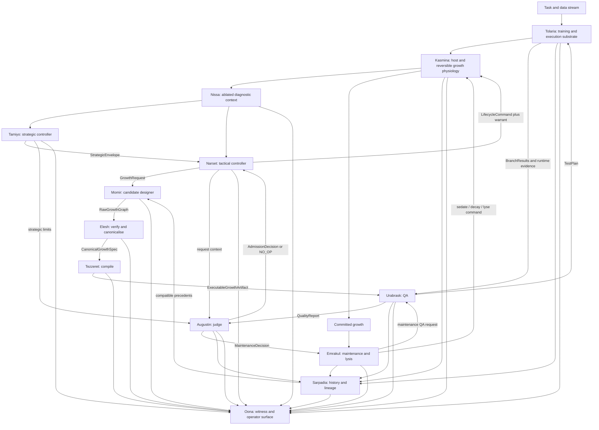

# High-Level Design: Counterfactual Generative Morphogenesis

**Working architecture:** Simic Engine with Phyrexian Orthodoxy and independent adjudication  
**Status:** Target architecture / final nomenclature pass  
**Architecture version:** 3.0  
**Namespec:** 1.0 — locked  
**Supersedes:** Version 2.0 and the temporary lettered subsystem design  
**Working package root:** `src/simic/`; the umbrella project name remains separable from the subsystem names.

---

## 1. Executive Summary

This design describes a lifecycle-driven neural training system in which new computational structure is **designed from the live state of a host network**, rather than selected from a fixed menu of human-authored module blueprints.

The existing morphogenetic chassis remains intact: a growth can begin at zero influence, mature behind the host, blend in gradually, hold for qualification, enter active service, become committed structure, or be sedated and lysed when it no longer earns its cost. What changes is the source of growth and the discipline with which it is verified, compiled, tested, judged, embodied, remembered, and maintained.

The system is divided into fourteen bounded domains:

- **Leyline** defines the contracts, schemas, policy records, compatibility rules, and ordering invariants through which every other subsystem communicates.
- **Tolaria** is the deterministic training and execution substrate in which the host, ordinary training runs, QA trials, flash clones, replays, and counterfactual worlds execute.
- **Sarpadia** is the persistent historical substrate in which candidate lineages, counterfactual outcomes, failures, abstentions, and retrieval indices are retained.
- **Tamiyo** is the strategic controller. It allocates long-horizon developmental resources, permissions, risk, and capacity across regions.
- **Narset** is the tactical controller. It decides what local action to take now inside Tamiyo’s active strategic envelope.
- **Nissa** observes the host and emits typed diagnostic facts without embedding policy.
- **Momir** designs raw candidate growth graphs, parameters, mutations, and recombinations.
- **Elesh** verifies and canonicalises those designs into structurally legal, shape-safe, gradient-safe, semantically stable specifications.
- **Tezzeret** compiles canonical specifications into efficient executable artefacts without changing their meaning.
- **Urabrask** performs quality assurance. It designs test plans, requests execution in Tolaria, detects defects, measures behaviour, and produces certified evidence.
- **Augustin** is the judge. It applies admission and continued-tenancy policy to Urabrask’s evidence, compares every candidate against no intervention, and issues decisions or warrants.
- **Kasmina** embodies admitted growth inside the host through reversible slots, isolated maturation, alpha blending, and lifecycle mechanics.
- **Emrakul** safely sedates, decays, consolidates, or lyses committed structure after Augustin has judged that continued tenancy is no longer justified.
- **Oona** reveals the system’s account through event projections, flight recording, operator interfaces, audit bundles, and alerts.

The ordinary host-training loop and the growth loop share one execution reality:

```text
Task and data configuration
        ↓
Tolaria runs the host-training process
        ↓
Kasmina supplies the host model and reversible growth physiology
        ↓
Nissa observes the ablated host
        ↓
Tamiyo plans; Narset acts
        ↓
Momir designs → Elesh conforms → Tezzeret compiles
        ↓
Urabrask specifies QA; Tolaria executes the tests
        ↓
Urabrask certifies the evidence
        ↓
Augustin judges candidate versus no-op
        ↓
Kasmina embodies an admitted growth
        ↓
Emrakul later removes what Augustin judges no longer earns its place
        ↓
Every outcome is retained in Sarpadia and revealed by Oona
```

The locked narrative grammar is:

> **Under Leyline, Tamiyo plans, Narset acts, Nissa observes, Momir designs, Elesh conforms, Tezzeret compiles, Urabrask tests in Tolaria, Augustin judges, Kasmina embodies, Emrakul destroys, and Oona reveals; every precedent is kept in Sarpadia.**

The names are intentionally opaque and slightly ridiculous. They are not decorative aliases. They encode which parts of the system are allowed to exercise agency, which parts must remain neutral infrastructure, and which sentences should sound architecturally wrong. The naming layer therefore serves as a lightweight responsibility and dependency lint.

---

## 2. Problem Statement

A fixed-blueprint morphogenetic controller must solve too many coupled decisions at once:

- determine whether the host needs intervention;
- identify the correct insertion region;
- select a module family such as normalisation, convolution, or attention;
- initialise and train the module;
- decide when it is mature enough to blend;
- control its blend schedule;
- decide whether its contribution is temporary or persistent;
- and eventually retain, fossilise, sedate, prune, or recycle it.

This coupling creates several recurring failure modes.

### 2.1 The moving-target problem

The host continues to learn while a component is being constructed. A structure designed for host state \(s_t\) may be integrated into a materially different state \(s_{t+\delta}\). If construction is slow, component quality and component freshness become opposing objectives.

### 2.2 The curriculum problem

A controller exposed immediately to broad, unrelated training trajectories must discover the entire causal language of intervention through sparse exploration. It is asked to generalise before it has learned stable primitives such as:

- wait when the host is healthy;
- request growth only when the deficit is repairable;
- reject an entire candidate pool;
- blend cautiously;
- abort stale growth;
- and remove structure that no longer pays rent.

### 2.3 The blueprint problem

A human-authored blueprint catalogue limits growth to structures the designer anticipated. It also forces a tactical policy to learn a categorical ontology that may not align with the actual functional deficit in the host.

### 2.4 The attribution problem

A host that has trained with a component may become dependent on it. Removing that component from the same host measures both the component’s intrinsic value and the host’s acquired dependence. Reliable admission and retention therefore require matched no-intervention branches, not same-host ablation alone.

### 2.5 The authority problem

When generation, validation, screening, deployment, and retention are implemented in one intelligent controller, the system can no longer explain why an intervention succeeded or failed. It also becomes easy for one subsystem to approve its own work, modify evaluation criteria, or hide policy inside telemetry.

This design addresses those failures by decomposing developmental intent, structural invention, structural legality, compilation, causal evaluation, embodiment, memory, and maintenance into separate authorities.

---

## 3. Goals

The architecture has ten primary goals.

1. **Replace fixed blueprint selection with generated growth.** Production growth should be conditioned on the host’s functional state rather than restricted to a predefined semantic menu.
2. **Preserve reversible lifecycle mechanics.** Generated structures must remain isolatable, blendable, measurable, removable, and recyclable.
3. **Separate strategic and tactical control.** Slow allocation decisions and local lifecycle actions must not collapse into one policy.
4. **Make structural legality independent from task utility.** A candidate may be perfectly legal and completely useless; the system must preserve that distinction.
5. **Ground admission and retention in causal comparisons.** Candidates should be evaluated against matched no-op futures wherever the decision justifies the cost.
6. **Make abstention first-class.** Every candidate pool must be allowed to lose against doing nothing.
7. **Retain complete evolutionary history.** Failures, rejected pools, stale candidates, and abstentions are training data, not logging noise.
8. **Make resource use mechanical and auditable.** Budgets are declared at subsystem boundaries and spend is measured rather than inferred.
9. **Teach elementary intervention grammar before broad generalisation.** Static and repeated counterfactual curricula precede unrestricted environments.
10. **Use the naming scheme as an architecture linting language.** Each subsystem has explicit authorities and explicit forbidden knowledge.

---

## 4. Non-Goals

The initial implementation does not attempt:

- unrestricted source-code generation;
- arbitrary whole-network rewriting;
- autonomous modification of the training runtime;
- unbounded or Turing-complete growth grammars;
- learned control of every lifecycle and economy parameter from the outset;
- simultaneous growth across many regions before single-region reliability is established;
- continual learning without forgetting as a guaranteed property;
- replacement of ordinary host optimisation;
- or proof that generated growth is superior at every scale.

The first defensible claim is narrower:

> Given a typed insertion contract and a measured host deficit, can the system generate, verify, compile, causally screen, and safely integrate a useful constrained growth more quickly and reliably than comparable online construction, retrieval, random search, analytic construction, or static over-provisioning?

---


## 5. Locked Naming Constitution

### 5.1 Why the names are deliberately goofy

The subsystem names are deliberately non-obvious to an outsider. This is useful for four reasons.

First, the names provide **cognitive compression**. “Urabrask tests; Augustin judges” is easier to retain and repeat than a long explanation of the distinction between evidence production and policy adjudication.

Second, the names create a **sentence test**. A sentence that sounds wrong in the project’s narrative grammar often describes a real responsibility leak:

- “Tolaria rejected the candidate” sounds wrong because a training substrate should not judge.
- “Augustin ran the CUDA probe” sounds wrong because a judge should not gather its own evidence.
- “Momir admitted its design” sounds wrong because a designer should not approve its own work.
- “Nissa said `should_grow=True`” sounds wrong because observation should not conceal policy.
- “Sarpadia deployed the module” sounds wrong because history should not mutate the present.
- “Oona changed alpha” sounds wrong because a witness should not steer the process.

Third, the names create a **neutral review vocabulary**. Engineers can say “this makes Elesh too political” or “Tolaria has acquired opinions” without making the discussion personal. The metaphor points at the boundary violation rather than the author.

Fourth, uniform opacity is preferable to a mixed scheme in which one package is obvious and every other package is lore. The system therefore uses one intentionally idiosyncratic internal vocabulary, backed by explicit plain-English documentation.

The codenames do **not** replace proper API names. Cross-boundary records remain things such as `QualityReport`, `AdmissionDecision`, `TrainingRunSpec`, and `GrowthRequest`. Every package README must begin with a plain-English role statement. The names are not security by obscurity and should not be relied on to conceal behaviour.

### 5.2 The grammar: actors have verbs; infrastructure has prepositions

The locked convention distinguishes **agents** from **infrastructure**.

People and entities represent agents. They observe, plan, act, design, conform, compile, test, judge, embody, destroy, or reveal.

Places, systems, and phenomena represent infrastructure. They are the contexts **under**, **in**, or **from** which the agents operate.

#### Agent names

| Agent | Narrative verb | Architectural authority | Must not become |
|---|---|---|---|
| **Tamiyo** | Plans | Strategic allocation, regional permissions, long-horizon budgets and risk | A local action selector |
| **Narset** | Acts | Tactical decisions and pre-commit lifecycle control | A source of unallocated authority |
| **Nissa** | Observes | Typed host diagnostics and provenance | A hidden controller |
| **Momir** | Designs | Candidate topology, parameters, mutation and recombination | The approver of its own work |
| **Elesh** | Conforms | Structural legality, canonicalisation and semantic identity | A utility predictor or task judge |
| **Tezzeret** | Compiles | Lowering and executable realisation | A semantic graph designer |
| **Urabrask** | Tests | Dynamic QA, regression, runtime conformance and evidence certification | The admission judge |
| **Augustin** | Judges | Admission, no-op comparison, policy utility and continued-tenancy rulings | A test runner or compiler |
| **Kasmina** | Embodies | Host topology, slots, maturation, blending and physical lifecycle | A candidate selector |
| **Emrakul** | Destroys | Safe post-commit sedation, decay, consolidation and lysis | A constructor or newborn judge |
| **Oona** | Reveals | Flight recording, projections, operator surfaces and audit | A control-plane backchannel |

#### Infrastructure names

| Infrastructure | Grammatical use | Neutral service | Must not own |
|---|---|---|---|
| **Leyline** | *under/through Leyline* | Contracts, schemas, versions, invariants and policy record formats | Case-specific decisions or subsystem policy |
| **Tolaria** | *trained/executed/tested in Tolaria* | Host training, data and optimiser execution, devices, snapshots, replay, branching and rollback | Preferences, utility weights or verdicts |
| **Sarpadia** | *recorded in/retrieved from Sarpadia* | History, lineage, counterfactual outcomes, retrieval and datasets | Live-host mutation or self-approval |

Infrastructure can be highly active software. “Infrastructure” means it provides a neutral capability rather than exercising a preference about what ought to happen.

### 5.3 The canonical sentence

The architecture should remain intelligible as a sentence:

> **Nissa observes. Tamiyo plans. Narset acts. Momir designs. Elesh conforms. Tezzeret compiles. Urabrask tests the compiled result in Tolaria. Augustin judges the resulting evidence under Leyline. Kasmina embodies the admitted growth. Emrakul destroys what no longer earns continued tenancy. Sarpadia retains every precedent. Oona reveals the account.**

This sentence is a compact authority map.

### 5.4 The sentence test

The following sentences are healthy:

```text
Urabrask requested a deterministic trial in Tolaria.
Tolaria returned branch measurements.
Augustin selected no-op from the certified evidence.
Narset requested a growth inside Tamiyo's envelope.
Momir used compatible ancestors retrieved from Sarpadia.
Kasmina rejected a lifecycle command whose Augustin warrant was invalid.
Oona displayed the rejection without altering the run.
```

The following sentences should trigger review:

```text
Tolaria rejected the candidate.
Urabrask issued the admission token.
Augustin reran the branch with a more favourable batch.
Momir filtered out designs that scored poorly in prior trials.
Elesh used future task reward to reject a legal graph.
Tezzeret inserted a new semantic node during optimisation.
Nissa emitted should_grow=True.
Sarpadia installed the nearest historical candidate.
Oona changed the learning rate directly.
Leyline imported Narset to decide a default action.
```

The sentence test is not a proof, but it is an intentionally cheap architecture lint.

### 5.5 Dependency consequence

The naming grammar implies two dependency rules:

1. Agents may consume neutral services from Leyline, Tolaria, and Sarpadia through typed interfaces.
2. Infrastructure must not import agent policy or encode agent-specific preferences.

Examples:

```text
urabrask → tolaria protocol       healthy
augustin → leyline contracts      healthy
momir → sarpadia retrieval API    healthy

tolaria → augustin policy         suspect
sarpadia → momir training code    suspect
leyline → narset implementation   prohibited
```

Tolaria may execute a Kasmina host through a neutral host-runtime protocol. Sarpadia may store Momir records as opaque contract values. Neither requires ownership of the corresponding agent’s policy.

### 5.6 Change control

Namespec 1.0 is considered locked for this design:

```text
Leyline
Tolaria
Sarpadia
Tamiyo
Narset
Nissa
Momir
Elesh
Tezzeret
Urabrask
Augustin
Kasmina
Emrakul
Oona
```

Changing a codename or moving an authority between names requires an architecture decision record because it changes the project’s shared responsibility grammar, package paths, telemetry names, tests, and operational language.

---

## 6. Design Principles

### 6.1 Strategy and tactics are separate

Tamiyo determines where developmental resources may be spent over a slow horizon. Narset decides what local action to take at a particular state. Tamiyo cannot choose a candidate or issue an alpha tick. Narset cannot create capacity that is absent from Tamiyo’s envelope.

> **Tamiyo establishes what may be spent and where. Narset decides what to do with it now.**

### 6.2 Observation and interpretation are separate

Nissa emits measurements, context, and provenance. Narset and Tamiyo interpret those measurements. A diagnostic signal may be rich, learned, or task-aware, but it must not smuggle a lifecycle decision into telemetry.

### 6.3 Developmental intent and phenotype are separate

Narset requests growth through a typed contract. Momir designs the detailed phenotype. Narset does not choose a fixed blueprint identity, and Momir does not decide whether intervention is warranted.

### 6.4 Design, conformance, and compilation are separate

Momir creates possibilities. Elesh establishes structural legality and canonical semantic identity. Tezzeret realises that identity efficiently for a target runtime.

> **Momir establishes possibility. Elesh establishes identity. Tezzeret establishes execution.**

### 6.5 QA and judgement are separate

Urabrask establishes the facts that can only be learned by executing a candidate: runtime conformance, numerical safety, gradients, cost, trajectory behaviour, shock, regression and uncertainty.

Augustin applies policy to those facts: eligibility, budget, risk, utility weights, no-op anchoring, admission margins and continued tenancy.

> **Leyline contains the law. Urabrask establishes the evidence. Augustin applies the law.**

Urabrask may report that a mandatory QA test failed. It must not decide which otherwise eligible candidate deserves admission. Augustin may reject every candidate. It must not alter the test plan, future data or measured result.

### 6.6 Kasmina and Tolaria are different substrates

Kasmina is the **model physiology**: the host network, insertion regions, reversible slots, gradients, alpha and lifecycle state.

Tolaria is the **training and execution reality**: data movement, optimiser stepping, devices, precision, distributed scheduling, checkpointing, snapshots, replay, branch execution and rollback.

> **Kasmina is what is trained. Tolaria is where and how it is trained.**

There must be one Tolaria execution path for the live host and counterfactual branches wherever practical. A special branch-only trainer would undermine paired comparisons.

### 6.7 Static validity and dynamic validity are separate

Elesh answers whether a design is legal in principle. Urabrask answers whether Tezzeret’s artefact behaves correctly in practice. Static verification does not replace execution, and passing runtime tests does not excuse a structurally illegal graph.

### 6.8 Every intervention is reversible

A growth begins at zero or negligible influence. Influence is controlled through explicit lifecycle state and blend coefficients. Removal is normally a measured blend-out, not an abrupt discontinuity.

### 6.9 Doing nothing is a real competitor

Every adjudication includes a mandatory no-intervention alternative whose policy utility is exactly zero. A growth request does not imply that any growth must be admitted.

### 6.10 Paired branches differ only in the intervention

Counterfactual branches begin from the same complete snapshot, receive the same future minibatches, and use the same resource accounting. Candidate source must not alter the QA protocol.

### 6.11 The tested object and embodied semantics are identical

The canonical semantic identity tested by Urabrask, selected by Augustin, and embodied by Kasmina must be the same. Compilation may change execution strategy but not meaning.

### 6.12 Costs are contractual

Every constructor, compiler, QA plan, training run, branch, maturation process and maintenance probe receives a declared budget and reports measured spend. Over-budget work is an explicit failure.

### 6.13 Experience includes failures

Every candidate, structural rejection, compilation failure, QA defect, adjudication rejection, no-op victory, stale integration, lifecycle reversal and lysis event is recorded in Sarpadia.

### 6.14 Generalisation follows acquisition

Exact repetition and controlled one-axis variation precede composed variation, unseen host seeds, multiple regions and image-scale tasks.

### 6.15 Observability is read-only

Oona may subscribe to, persist, aggregate and present events. It cannot create actions, mutate budgets or become a hidden dependency of the training path.

### 6.16 Infrastructure remains neutral

Leyline defines records; Tolaria executes requests; Sarpadia retains history. None decides which candidate should live.

---

## 7. System Context and Architectural Planes

The system operates inside nested learning and execution loops:

- Tolaria continuously runs ordinary host training against the task and data stream;
- Narset acts at local developmental decision points;
- Tamiyo updates strategic envelopes at a slower cadence;
- Momir, Elesh and Tezzeret construct candidate artefacts;
- Urabrask defines QA plans and requests candidate trials in Tolaria;
- Augustin adjudicates the certified reports;
- admitted growth may undergo bounded maturation in Tolaria through Kasmina;
- Emrakul periodically requests continued-tenancy review of committed growth;
- and outer-loop training updates Momir, Narset, Tamiyo, QA surrogates and, later, Emrakul or Augustin policies.

| Plane | Subsystems | Purpose |
|---|---|---|
| **Constitutional infrastructure** | Leyline | Defines vocabulary, versions, compatibility, budgets, warrants and invariants |
| **Execution infrastructure** | Tolaria | Runs the host, optimisers, data, devices, snapshots, replays and branches |
| **Historical infrastructure** | Sarpadia | Retains precedents, lineages, outcomes, failures and split-safe datasets |
| **Strategic agency** | Tamiyo | Allocates regional resources, permissions and risk over long horizons |
| **Tactical agency** | Narset | Chooses immediate legal developmental actions |
| **Observation** | Nissa | Describes the host without deciding what should happen |
| **Synthesis** | Momir, Elesh, Tezzeret | Designs, canonicalises and compiles growth |
| **Assurance and adjudication** | Urabrask, Augustin | Establishes empirical evidence, then judges it independently |
| **Embodiment and maintenance** | Kasmina, Emrakul | Introduces growth safely and removes obsolete committed structure |
| **Witness** | Oona | Exposes an auditable account without steering it |

### 7.1 Logical architecture



### 7.2 Ordinary training loop

Tolaria owns the operational loop that trains the host:

```text
load or create TrainingRunSpec
        ↓
materialise data stream and device topology
        ↓
execute Kasmina host forward pass
        ↓
compute task loss
        ↓
perform host optimiser step
        ↓
advance schedulers and logical time
        ↓
capture Nissa observations and subsystem events
        ↓
invoke permitted strategic/tactical decision points
        ↓
checkpoint, snapshot or continue
```

Tamiyo and Narset govern developmental actions around this loop. They do not perform SGD. Kasmina supplies the model and its growth mechanics. Tolaria performs the execution.

### 7.3 Candidate assurance and adjudication loop

```text
Tezzeret artefact
        ↓
Urabrask builds a blinded TestPlan
        ↓
Tolaria restores a common Snapshot and executes:
        candidate branches + controls + mandatory no-op
        ↓
Urabrask verifies runtime conformance and certifies measurements
        ↓
QualityReport
        ↓
Augustin applies eligibility, budget, risk and utility policy
        ↓
ADMIT one / REJECT / DEFER / REQUIRE_RETEST / NO_OP
```

### 7.4 Control hierarchy

```text
Tamiyo
  └── establishes StrategicEnvelope
        └── Narset chooses local actions
              ├── WAIT
              ├── REQUEST_GROWTH
              ├── BEGIN_MATURATION
              ├── REQUEST_QA
              ├── REQUEST_ADJUDICATION
              ├── BEGIN_BLEND
              ├── HOLD
              ├── ABORT
              └── COMMIT

After COMMIT:
  Narset relinquishes ordinary ownership
        └── Emrakul manages physical maintenance
              ├── REQUEST_REVIEW
              ├── HOLD
              ├── SEDATE
              ├── DECAY
              └── LYSE
```

Urabrask and Augustin are independent of this command hierarchy. Urabrask certifies evidence. Augustin issues admission and maintenance warrants. Neither performs Kasmina state transitions. Tolaria is beneath the hierarchy as neutral execution infrastructure.

---

## 8. Subsystem Map

| Subsystem | Primary responsibility | Key outputs | Explicitly does not own |
|---|---|---|---|
| **Leyline** | Typed contracts, schema versions, compatibility, policy record formats and ordering invariants | Versioned records, validators, warrants and rule vocabularies | Case-specific policy or execution |
| **Tolaria** | Host training and deterministic execution: data, optimisers, devices, precision, distributed scheduling, snapshots, replay, branches and rollback | `TrainingRunState`, `Snapshot`, `BranchResult`, execution manifests | Utility weights, candidate preference or verdicts |
| **Sarpadia** | Append-only history, lineage, outcomes, retrieval and split-safe datasets | `GrowthRecord`, retrieval sets, lineage graphs and blinded views | Live-host mutation or self-approval |
| **Tamiyo** | Strategic budgets, regional priorities, exploration quotas, cooldowns and long-horizon risk | `StrategicEnvelope` | Local action timing or candidate choice |
| **Narset** | Tactical developmental policy and pre-commit lifecycle actions | `GrowthRequest`, `LifecycleCommand`, review requests and escalations | Unallocated budget or structural generation |
| **Nissa** | Ablated host telemetry and diagnostic provenance | `TelemetryEnvelope` | `should_grow`, reward or verdicts |
| **Momir** | Raw candidate topology, parameters, mutation and recombination | `RawGrowthGraph` | Structural approval, testing or admission |
| **Elesh** | Static verification, canonicalisation, semantic hashing and structural legality | `CanonicalGrowthSpec`, structural reports | Runtime QA, task utility or lifecycle policy |
| **Tezzeret** | Lowering, kernel selection, fusion, memory planning and compilation | `ExecutableGrowthArtifact`, compilation manifest | Semantic topology changes, QA or admission |
| **Urabrask** | Dynamic QA, runtime conformance, regression, branch measurement and evidence certification | `TestPlan`, `QualityReport` | Admission, no-op policy or lifecycle commands |
| **Augustin** | Provider-blind admission and continued-tenancy adjudication | `AdmissionDecision`, `MaintenanceDecision`, warrants | Test execution, compilation or host mutation |
| **Kasmina** | Host model, insertion regions, slots, gradient routing, maturation, blending and physical lifecycle | Embodied state and lifecycle events | Whether a growth deserves admission |
| **Emrakul** | Safe post-commit sedation, decay, consolidation and lysis | Maintenance requests and warranted lifecycle commands | Candidate construction or judgement |
| **Oona** | Event projections, flight recorder, TUI/dashboard adapters, audit bundles and alerts | Operator views and audit records | Training control or source-of-truth schemas |

---

## 9. Core Contracts

Subsystem boundaries are enforced with typed, immutable or append-only records. Shared mutable objects are not passed across authority boundaries.

### 9.1 `StrategicEnvelope`

Issued by Tamiyo and consumed by Narset, Augustin, Kasmina and Emrakul.

```text
StrategicEnvelope
    envelope_id
    valid_from_step
    valid_until_step
    host_scope
    region_allocations[]
        region_id
        parameter_budget
        compute_budget
        latency_budget
        max_concurrent_growths
        max_interventions
        cooldown
        exploration_allowance
        risk_ceiling
        preferred_horizon
    global_parameter_ceiling
    global_compute_ceiling
    global_churn_ceiling
    priority_weights
    admissibility_policy_id
    maintenance_policy_id
    policy_version
    schema_version
```

The envelope grants permission and constrains judgement. It does not instruct Narset to act or Augustin which candidate to select.

### 9.2 `TelemetryEnvelope`

Produced by Nissa.

```text
TelemetryEnvelope
    telemetry_id
    host_state_id
    step
    region_id
    ablated_context
    task_metrics
    activation_statistics
    spectral_statistics
    local_functional_gradient
    optimisation_velocity
    lifecycle_context
    budget_context
    temporal_context
    provenance
    normalization_manifest
    schema_version
```

Any change in meaning, width, basis, normalisation or provenance creates a new schema version.

### 9.3 `GrowthRequest`

Issued by Narset under a valid `StrategicEnvelope`.

```text
GrowthRequest
    request_id
    envelope_id
    telemetry_id
    host_state_id
    insertion_region
    input_output_contract
    grammar_version
    parameter_budget
    construction_compute_budget
    compilation_budget
    qa_budget
    latency_budget
    candidate_count
    maturity_mode
    maturity_budget
    blend_policy_class
    evaluation_horizons
    risk_tolerance
    retrieval_policy
    adjudication_policy_id
    request_reason
    schema_version
```

A request states what may be designed and spent. It never contains a fixed blueprint identity such as `ATTENTION` or `CONV`.

### 9.4 `RawGrowthGraph`

Produced by Momir.

```text
RawGrowthGraph
    raw_candidate_id
    request_id
    raw_graph_ir
    raw_birth_parameters
    trainability_intent
    parent_lineages[]
    retrieval_provenance[]
    generator_version
    latent_code
    proposal_probability_or_score
    estimated_uncertainty
    generation_spend
```

A raw graph is not executable and not trusted.

### 9.5 `CanonicalGrowthSpec`

Produced by Elesh.

```text
CanonicalGrowthSpec
    canonical_candidate_id
    raw_candidate_id
    request_id
    canonical_graph_ir
    canonical_parameters
    input_output_contract
    trainability_mask
    zero_influence_proof
    gradient_flow_manifest
    parameter_count
    static_compute_estimate
    memory_estimate
    canonical_semantic_hash
    equivalence_class_id
    structural_pruning_report
    verification_report
    grammar_version
    canonicalizer_version
```

The canonical semantic hash identifies developmental meaning independently of compilation strategy.

### 9.6 `ExecutableGrowthArtifact`

Produced by Tezzeret.

```text
ExecutableGrowthArtifact
    artifact_id
    canonical_candidate_id
    canonical_semantic_hash
    device_target
    dtype
    compiled_module_or_graph
    kernel_manifest
    fusion_manifest
    runtime_parameter_layout
    runtime_cost_estimate
    compiler_version
    compilation_spend
    reproducibility_manifest
```

The artefact is not trusted merely because compilation succeeded. Urabrask must dynamically verify it against the canonical specification.

### 9.7 `TrainingRunSpec`

Defined under Leyline and executed by Tolaria.

```text
TrainingRunSpec
    run_id
    host_definition_reference
    task_and_data_definition
    host_optimizer_definition
    scheduler_definition
    device_topology
    dtype_and_precision_policy
    distributed_policy
    determinism_policy
    checkpoint_policy
    decision_cadences
    maximum_steps
    random_seed_manifest
    code_and_schema_versions
```

The same execution semantics are used for the live trajectory and paired branches unless a difference is the declared experimental variable.

### 9.8 `Snapshot`

Produced by Tolaria.

```text
Snapshot
    snapshot_id
    run_id
    host_parameters
    host_optimizer_state
    host_scheduler_state
    growth_slot_states
    lifecycle_state
    economy_state
    narset_recurrent_state
    tamiyo_state_reference
    telemetry_history
    random_number_states
    dataloader_cursor
    task_configuration
    recent_batches
    fixed_future_minibatch_sequence
    device_and_determinism_manifest
    code_and_schema_versions
```

A snapshot is complete only when restoring it twice and consuming the same future produces bit-identical traces under the declared environment.

### 9.9 `TestPlan`

Produced by Urabrask and consumed by Tolaria.

```text
TestPlan
    test_plan_id
    snapshot_id
    request_id
    blinded_candidate_artifacts[]
    mandatory_no_op
    control_artifacts[]
    construction_support_split
    qa_screen_split
    qa_audit_split
    retention_report_split
    future_sequence_id
    horizons[]
    required_runtime_checks[]
    required_regression_checks[]
    per_branch_budget
    determinism_manifest
    qa_policy_version
```

Urabrask controls what evidence must be collected. It does not control the adjudication utility applied later.

### 9.10 `BranchResult`

Produced by Tolaria.

```text
BranchResult
    test_plan_id
    branch_id
    blinded_candidate_id
    canonical_semantic_hash
    execution_status
    loss_trajectory
    accuracy_trajectory
    activation_trajectory
    gradient_trajectory
    runtime_conformance_measurements
    short_horizon_effect
    long_horizon_effect
    integration_shock
    gradient_shock
    parameter_cost
    measured_compute_spend
    measured_latency
    stability_events
    lifecycle_events
    final_state_reference
    replay_digest
```

Source provenance is held outside the blinded view and reattached only after QA and adjudication.

### 9.11 `QualityReport`

Produced by Urabrask and consumed by Augustin, Sarpadia, Narset and Emrakul.

```text
QualityReport
    quality_report_id
    test_plan_id
    request_id
    candidate_reports[]
        blinded_candidate_id
        canonical_semantic_hash
        structural_reference_valid
        compiled_semantics_conformant
        runtime_valid
        deterministic_replay_valid
        finite_outputs_and_gradients
        regression_results
        measured_task_trajectories
        measured_costs
        measured_shock
        uncertainty
        hard_defects[]
        soft_warnings[]
    no_op_report
    evidence_completeness
    qa_spend
    qa_policy_version
    evidence_digest
```

A `QualityReport` establishes facts and test status. It does not contain `ADMIT` or `REJECT`.

### 9.12 `AdmissionDecision`

Produced by Augustin.

```text
AdmissionDecision
    decision_id
    quality_report_id
    request_id
    verdict                 # ADMIT | NO_OP | REJECT | DEFER | REQUIRE_RETEST
    selected_candidate_id | null
    selected_semantic_hash | null
    eligibility_results
    no_op_margin
    adjudicated_utility
    cost_breakdown
    risk_charge
    uncertainty_charge
    decision_reasons[]
    admission_warrant | null
    adjudication_policy_version
```

An admission warrant is required before Kasmina may raise a new growth above zero influence.

### 9.13 `MaintenanceDecision`

Produced by Augustin from a maintenance `QualityReport`.

```text
MaintenanceDecision
    decision_id
    quality_report_id
    target_growth_id
    verdict                 # RETAIN | RETEST | SEDATE | DECAY | LYSE
    retained_utility
    replacement_context
    cost_breakdown
    decision_reasons[]
    maintenance_warrant | null
    adjudication_policy_version
```

Emrakul decides how to execute an authorised safe transition. It does not rewrite the verdict.

### 9.14 `LifecycleCommand`

Issued by Narset before commitment or Emrakul after commitment.

```text
LifecycleCommand
    command_id
    authority               # NARSET or EMRAKUL
    target_growth_id
    requested_transition
    admission_warrant | null
    maintenance_warrant | null
    evidence_reference
    strategic_envelope_id
    budget
    reason
```

Kasmina validates the command against authority, state, warrant, budget and transition rules.

### 9.15 `GrowthRecord`

Stored by Sarpadia.

```text
GrowthRecord
    base_host_trajectory_id
    snapshot_id
    telemetry
    strategic_envelope
    growth_request
    raw_growth_graph
    canonical_growth_spec
    executable_artifact_manifest
    test_plan
    branch_results[]
    quality_report
    admission_decision
    selected_or_rejected
    rejection_reason
    maturation_history
    blend_history
    retained_contribution
    maintenance_decisions[]
    maintenance_history
    terminal_outcome
    failure_mode
    lineage_edges
    split_membership
```

The full candidate pool is stored, including structurally rejected candidates and pools in which Augustin selects no-op.

### 9.16 `EventEnvelope`

Defined by Leyline and published by every subsystem for Oona.

```text
EventEnvelope
    event_id
    event_type
    producer
    host_state_id
    correlation_id
    causal_parent_ids[]
    logical_step
    payload_schema_version
    payload
    integrity_digest
```

Oona consumes these events but does not define their source-of-truth semantics.

---

## 10. End-to-End Operating Flow

### 10.1 Ordinary host training in Tolaria

Tolaria materialises the `TrainingRunSpec`, constructs the data and device environment, and advances the Kasmina host through ordinary optimisation.

It owns:

- batch acquisition and deterministic ordering;
- host forward and backward execution;
- optimiser and scheduler stepping;
- precision and device policy;
- distributed execution;
- checkpointing;
- logical time;
- callback and decision-point scheduling;
- and measured execution spend.

Tamiyo is not “the trainer” in this sense. It is a strategic controller around a host that Tolaria trains.

### 10.2 Strategic allocation

At a slow cadence, Tamiyo consumes coarse host health, regional histories, current capacity, recent interventions and strategic objectives. It emits a `StrategicEnvelope` specifying:

- which regions may grow;
- how much parameter and compute capacity each may consume;
- maximum concurrent growth;
- acceptable risk and churn;
- exploration allowances;
- and cooldowns or embargoes.

Tamiyo may reserve capacity for anticipated future pressure, but it cannot select an immediate candidate or issue a blend command.

### 10.3 Local observation

Nissa observes the host at each local decision point. Germination telemetry is taken from the **ablated path**, so the condition describes the deficit without assistance from an existing growth.

Nissa emits measurements and provenance, not conclusions.

### 10.4 Tactical decision

Narset receives Nissa’s telemetry, the active `StrategicEnvelope`, local lifecycle state and compact Sarpadia retrieval summaries. It chooses among legal local actions:

```text
WAIT
REQUEST_GROWTH
CONTINUE_MATURATION
REQUEST_QA
REQUEST_ADJUDICATION
BEGIN_BLEND
CONTINUE_BLEND
HOLD
ABORT
COMMIT
ESCALATE_TO_TAMIYO
```

A `REQUEST_GROWTH` action creates a typed `GrowthRequest` whose budgets cannot exceed the strategic envelope.

### 10.5 Candidate design

Momir receives the request, diagnostic context and compatible retrieval material from Sarpadia. It may design:

- fresh candidates;
- mutations of successful or failed ancestors;
- recombinations of compatible lineages;
- deterministic proposals;
- or stochastic best-of-\(K\) pools.

Research controls such as random, analytic or human-designed candidates enter through the same downstream contracts and remain blinded during QA and judgement.

### 10.6 Structural conformance

Elesh performs:

- graph grammar validation;
- tensor shape inference and alignment;
- insertion-contract checks;
- cycle and reachability checks;
- gradient-flow analysis;
- zero-influence verification;
- static parameter and memory accounting;
- forbidden-operation detection;
- dead-node elimination;
- semantics-preserving graph simplification;
- deterministic ordering;
- canonical parameter layout;
- equivalence-class detection;
- and canonical semantic hashing.

Elesh may reject a candidate as structurally invalid. It may not reject it because it predicts poor task performance.

### 10.7 Compilation

Tezzeret lowers a canonical graph into an executable artefact for the target device and dtype.

It may perform:

- operator lowering;
- kernel selection;
- fusion;
- layout optimisation;
- constant folding;
- memory planning;
- compilation;
- and runtime cost estimation.

It must preserve the canonical semantic hash and emit a complete compilation manifest. Dynamic conformance is tested later by Urabrask.

### 10.8 QA planning and execution

Urabrask creates a blinded `TestPlan` covering:

- compiled-semantics conformance;
- reference-output and gradient agreement;
- zero-influence behaviour;
- numerical stability;
- deterministic replay;
- runtime resource use;
- immediate task effect;
- trajectory effect across declared horizons;
- integration shock;
- and regression tests.

Urabrask asks Tolaria to execute the plan from a complete common snapshot. Tolaria creates:

- one branch for every candidate;
- a mandatory no-op branch;
- and any declared controls.

All branches use the same future data and equivalent random streams except where a difference is explicitly under test.

Tolaria returns raw branch results. Urabrask verifies completeness, analyses the measurements, classifies defects and signs the `QualityReport`.

### 10.9 Independent adjudication

Augustin receives:

- the blinded `QualityReport`;
- Tamiyo’s active strategic envelope;
- Narset’s request context;
- the applicable Leyline adjudication policy;
- and the mandatory no-op anchor.

Augustin first applies hard eligibility rules. It then computes policy utility, cost, risk and uncertainty for eligible candidates. It may:

- admit one candidate;
- select no-op;
- reject the request;
- defer;
- or require a new QA plan.

Augustin never reruns a branch, changes a batch or modifies the evidence.

### 10.10 Germination and maturation

Kasmina installs the admitted canonical growth at alpha zero. It verifies:

- the Augustin admission warrant;
- canonical semantic hash;
- executable artefact identity;
- insertion contract;
- budget;
- and lifecycle legality.

Two maturation modes are supported:

- **one-shot mode:** the growth is frozen after admission;
- **nursery mode:** the growth receives a bounded isolated maturation budget behind the host in Tolaria.

If nursery mode moves the host or growth materially, Narset must request fresh Urabrask QA and Augustin re-adjudication before blend-in.

### 10.11 Integration and commitment

Narset controls the pre-commit lifecycle inside the strategic envelope:

- blend;
- pause;
- hold;
- reverse;
- abort;
- or commit.

No growth can increase influence without a valid Augustin warrant. Commitment transfers ordinary lifecycle authority from Narset to Emrakul.

### 10.12 Continued-tenancy review and maintenance

Emrakul schedules or requests review of committed structures. Urabrask defines the maintenance QA plan; Tolaria executes matched no-op, re-adaptation or ablation branches; Urabrask returns a `QualityReport`; and Augustin issues a `MaintenanceDecision`.

Emrakul then chooses the safe physical execution permitted by the warrant:

- retain;
- reduce alpha;
- sedate;
- initiate decay;
- consolidate where separately authorised;
- or lyse.

An emergency numerical-safety mechanism may reduce influence immediately, but that action is classified as containment rather than an economic judgement and must be reviewed afterward.

### 10.13 Memory and witness

Sarpadia stores every stage of every candidate, including raw structural rejection, compilation failure, QA defects, Augustin no-op decisions, maturation failures and maintenance outcomes.

Oona receives append-only events and presents:

- ordinary training progress;
- branch trees;
- candidate lineages;
- strategic envelopes;
- tactical actions;
- QA evidence;
- Augustin decisions;
- lifecycle traces;
- spend and rent;
- determinism manifests;
- and alerts.

---

## 11. Generated Growth Model

## 11.1 Growth progression

The growth language expands only after the preceding level passes reliability gates.

### Level 1 — Generated phenotype inside a universal envelope

The first implementation uses a shape-preserving residual form:

\[
h' = h + \alpha B_\theta(h).
\]

Momir generates parameters, rank, gates, scale, permitted width, and trainability mask inside a constrained envelope such as:

- a low-rank linear update;
- a small gated residual multilayer perceptron;
- or another typed residual microcell.

This removes semantic blueprint labels while keeping the search space safe and measurable.

### Level 2 — Generated constrained genotype

Momir may choose from a safe graph grammar:

- hidden width;
- number of internal stages;
- activation family;
- gating pattern;
- residual topology;
- sparse connectivity;
- normalisation placement;
- low-rank factorisation;
- and trainability mask.

Elesh canonicalises semantically equivalent graph forms into one identity.

### Level 3 — Generated typed graph

Momir emits a small directed acyclic graph over whitelisted operators. Elesh proves contract compliance and canonicalises it. Tezzeret compiles it.

The grammar remains bounded by:

- operator whitelist;
- maximum nodes and edges;
- maximum parameter and memory cost;
- shape-preserving insertion contracts;
- deterministic execution requirements;
- reversible zero-influence behaviour;
- and declared gradient-flow rules.

Arbitrary code generation is not required.

## 11.2 One-shot and nursery modes

### One-shot mode

- Momir emits the complete final growth.
- Kasmina holds it frozen after admission.
- Only alpha and lifecycle state may change.
- This is the cleanest test of generative construction as a final answer.

### Nursery mode

- Momir emits structure, birth parameters, and a trainability mask.
- Kasmina grants bounded isolated maturation.
- Host and growth optimisation streams remain explicit and separately accounted.
- The growth is re-qualified against the current host before blending.
- Maturation spend is charged to the candidate.

Nursery mode is the default ecological configuration because it preserves safe behind-the-host maturation. One-shot mode remains a required scientific ablation.

## 11.3 Candidate identity

Three identities are distinct:

1. **Raw identity:** the exact graph Momir proposed.
2. **Canonical semantic identity:** the graph after Elesh’s semantics-preserving canonicalisation.
3. **Executable artefact identity:** Tezzeret’s device-specific implementation.

Sarpadia stores all three. Urabrask tests canonical semantics through Tezzeret’s executable artefact in Tolaria. Augustin judges the resulting evidence. Kasmina embodies the same canonical semantic identity selected by Augustin.

Two compiled artefacts may implement the same canonical growth. Two raw graphs may canonicalise to the same semantic identity. Candidate diversity is therefore measured primarily in canonical and functional space, not raw syntax or compiler artefact space.

---


## 12. Lifecycle and Authority Model

The target lifecycle is:

```text
DORMANT
  → GERMINATED
  → MATURING or QUALIFYING
  → BLENDING
  → HOLDING
  → ACTIVE
  → COMMITTED
  → SEDATED or DECAYING
  → DORMANT
```

Permitted early exits include:

```text
GERMINATED → ABORTED → DORMANT
MATURING → ABORTED → DORMANT
QUALIFYING → REJECTED → DORMANT
BLENDING → DECAYING → DORMANT
HOLDING → DECAYING → DORMANT
ACTIVE → DECAYING → DORMANT
```

### 12.1 State meanings

| State | Meaning | Ordinary authority |
|---|---|---|
| **DORMANT** | Slot empty and available | Kasmina mechanics; Narset may request germination |
| **GERMINATED** | Augustin-admitted growth installed at zero influence | Narset |
| **MATURING** | Optional isolated optimisation executed in Tolaria | Narset within budget |
| **QUALIFYING** | Urabrask QA followed by Augustin adjudication or re-adjudication | Narset requests; Urabrask tests; Augustin judges |
| **BLENDING** | Alpha rises under a bounded schedule | Narset |
| **HOLDING** | Target alpha reached; grace and qualification window | Narset, constrained by current Augustin warrant |
| **ACTIVE** | Growth serves under local pre-commit lifecycle control | Narset |
| **COMMITTED** | Growth becomes maintained structure | Ownership transfers to Emrakul |
| **SEDATED** | Influence reduced while dispensability or replacement is assessed | Emrakul under a maintenance warrant |
| **DECAYING** | Alpha ramps to zero before recycling | Emrakul, or Narset before commitment |
| **DORMANT** | Slot recycled; occupant-specific state reset | Kasmina |

### 12.2 Transition authority

Kasmina is the sole executor of growth-state transitions and enforces these rules:

- Tamiyo never issues a lifecycle transition.
- Narset may issue only pre-commit transitions.
- Emrakul may issue only post-commit maintenance transitions.
- Urabrask issues QA evidence, never lifecycle authority or admission tokens.
- Augustin issues admission and maintenance warrants, never physical transitions.
- Tolaria executes optimisation and tests, never lifecycle preferences.
- A transition that raises influence requires a valid Augustin warrant.
- A transition that removes influence for ordinary economic reasons requires the appropriate authority and, post-commit, an Augustin maintenance warrant.
- Emergency containment may reduce influence without prior economic adjudication only when a declared safety invariant is breached; it must be logged as containment and reviewed.

### 12.3 Commitment handoff

Commitment is an ownership boundary, not merely a label.

Before commitment:

- Narset manages the growth as an intervention under evaluation.

After commitment:

- Emrakul manages its physical maintenance as part of the host’s established structure;
- Augustin remains the authority for continued-tenancy judgements;
- Urabrask remains the authority for certified maintenance evidence.

Narset may ask Emrakul to request review but may not directly lyse committed growth. Emrakul may identify replacement pressure but may not ask Momir for a specific replacement without a new Narset request under a valid Tamiyo envelope.

### 12.4 Grace-period protection

A growth cannot be condemned merely because low early alpha yields low measured contribution.

- utility does not accrue during initial blend unless explicitly defined;
- ordinary removal is blocked during the minimum blend and holding windows;
- QA and adjudication data partitions are declared in advance;
- and the qualification window is pre-registered.

### 12.5 QA and adjudication are not lifecycle states

Urabrask and Augustin can be invoked at several lifecycle points, but neither becomes the owner of the growth.

```text
Narset or Emrakul requests review
        ↓
Urabrask specifies and certifies tests
        ↓
Augustin issues a verdict or warrant
        ↓
Narset or Emrakul requests a legal physical transition
        ↓
Kasmina executes it in Tolaria
```

This prevents an evidence subsystem or judge from quietly becoming a lifecycle controller.

---

## 13. Detailed Subsystem Specifications

The subsystem specifications are grouped according to the naming constitution: infrastructure first, then agents.

### 13.1 Leyline — Constitutional Infrastructure

#### Responsibilities

- define every cross-subsystem record;
- define schema versions and compatibility rules;
- define canonical ordering and enum stability;
- define lifecycle state and transition vocabulary;
- define budget, spend and cost units;
- define determinism, numerical tolerance and evidence-completeness contracts;
- define warrant and decision record formats;
- define event envelopes and provenance fields;
- and provide pure validation functions.

#### Invariants

- Leyline has no dependency on subsystem implementations.
- Schema changes are explicit and versioned.
- Unknown fields fail closed where safety or reproducibility is affected.
- A consumer cannot silently accept a schema it was not trained, compiled or calibrated against.
- Policy *formats* may live in Leyline; case-specific policy *choices* do not.

#### Forbidden authority

Leyline must not:

- choose candidates;
- set a case-specific verdict;
- calculate live reward;
- compile graphs;
- execute a host;
- store experiment history;
- or call agent services.

#### Smell

> If Leyline imports Narset, Augustin, Momir or Kasmina, the constitution has started governing individual cases.

### 13.2 Tolaria — Training and Execution Infrastructure

#### Responsibilities

- materialise and execute `TrainingRunSpec`;
- run ordinary host forward, backward, optimiser and scheduler steps;
- manage dataloaders, batch ordering and logical time;
- manage devices, dtype, mixed precision and distributed execution;
- capture complete snapshots;
- restore exact state;
- materialise common future minibatches;
- execute QA and maintenance branches;
- support deterministic replay, rollback and branch adoption;
- measure runtime spend, latency and resource use;
- and produce execution and replay digests.

#### Execution modes

**Mainline mode** runs the live host trajectory.

**Replay mode** restores and reproduces a prior trajectory.

**Branch mode** executes matched counterfactual worlds from a common snapshot.

**Acquisition mode** performs expensive multi-horizon rollouts for curriculum and research labels.

All modes use the same host-runtime interface and, wherever possible, the same optimiser and data-path implementation.

#### Invariants

- Tolaria applies no utility weights and issues no verdicts.
- Paired branches differ only in declared interventions.
- Candidate source does not alter execution protocol.
- Restore plus common future is bit-identical under the declared determinism contract.
- Mainline and branch training semantics are equivalent unless a difference is explicitly part of the experiment.
- A branch-matured candidate is deployed only by adopting the branch or exactly replaying it from the common snapshot.
- Execution failures are reported, not interpreted as policy decisions.

#### Smell

> If Tolaria “likes,” “rejects,” or “prefers” a candidate, the training substrate has acquired opinions.

### 13.3 Sarpadia — Historical Infrastructure

#### Responsibilities

- retain every candidate and outcome;
- store raw, canonical, compiled, test, adjudication, embodiment and maintenance identities;
- maintain lineage and equivalence graphs;
- index host contexts and functional effects;
- serve compatible retrieval sets;
- retain both successful and failed ancestors;
- build split-safe datasets for Momir, Narset, Tamiyo, Urabrask, Augustin and Emrakul;
- preserve blinded and unblinded views;
- and support reproducible historical queries.

#### Retrieval modes

- telemetry-nearest neighbours;
- learned host-state embeddings;
- local-gradient alignment;
- functional-effect similarity;
- task-context similarity;
- lineage-success priors;
- failure-avoidance retrieval;
- and calibrated mixtures of these modes.

#### Invariants

- Rejected pools and no-op decisions are retained.
- Branches from one base trajectory never cross dataset splits.
- Historical records are append-only; corrections create new versions.
- Retrieval cannot bypass Elesh, Tezzeret, Urabrask or Augustin.
- Sarpadia does not mutate the live host.
- Source mappings are inaccessible to blinded QA and adjudication views.

#### Smell

> If Sarpadia forgets the dead, history has become propaganda.

### 13.4 Tamiyo — Strategic Controller

#### Responsibilities

- allocate parameter, compute, latency and churn budgets across regions;
- set maximum concurrent growth;
- establish global and regional cooldowns;
- balance exploitation and exploration allowances;
- set long-horizon priorities and risk ceilings;
- coordinate multiple Narset-controlled regions or cells;
- react to persistent trends rather than individual noisy steps;
- and emit versioned `StrategicEnvelope` records.

#### Inputs

- coarse Nissa summaries;
- Sarpadia history and regional performance;
- current host capacity and committed growth;
- aggregate Augustin and Emrakul outcomes;
- strategic task objectives;
- and global resource availability.

#### Outputs

- `StrategicEnvelope`;
- allocation updates;
- embargoes or emergency restrictions;
- and strategic-review requests.

#### Invariants

- Tamiyo operates on a slower cadence than Narset.
- It cannot name a candidate, graph node, kernel or blend tick.
- It cannot directly mutate alpha or issue a local lifecycle transition.
- All local resource use is traceable to an active envelope.

#### Smell

> If Tamiyo chooses the next candidate or alpha increment, strategy has collapsed into micromanagement.

### 13.5 Narset — Tactical Controller

#### Responsibilities

- interpret local telemetry;
- decide whether to wait, request growth, mature, request QA, request adjudication, blend, hold, abort or commit;
- choose an insertion region permitted by Tamiyo;
- construct `GrowthRequest` records within budget;
- manage pre-commit lifecycle timing;
- request Urabrask QA and Augustin adjudication;
- and escalate strategic shortages or conflicts to Tamiyo.

#### Inputs

- Nissa telemetry;
- active Tamiyo envelope;
- Kasmina local lifecycle state;
- Urabrask evidence;
- Augustin decisions;
- compact Sarpadia retrieval and uncertainty summaries;
- and Emrakul notifications where committed structure affects local capacity.

#### Outputs

- `GrowthRequest`;
- pre-commit `LifecycleCommand`;
- QA and adjudication requests;
- strategic escalation;
- and action telemetry.

#### Invariants

- Narset cannot exceed Tamiyo’s budget.
- It cannot choose a structure that bypasses Momir, Elesh and Tezzeret.
- It cannot override Augustin’s no-op or rejection.
- It relinquishes ordinary ownership at commitment.

#### Smell

> If Narset can create capacity not present in the active envelope, tactics have escaped strategy.

### 13.6 Nissa — Observer

#### Responsibilities

- observe the host and insertion regions;
- produce ablated-path telemetry for growth decisions;
- compute typed activation, gradient, spectral, temporal and task diagnostics;
- attach provenance and normalisation manifests;
- provide coarse summaries to Tamiyo and local detail to Narset and Momir;
- and emit stable, versioned `TelemetryEnvelope` records.

#### Invariants

- Nissa observations do not mutate host gradients or training state.
- Germination context is measured without the contribution being diagnosed or replaced.
- Every derived signal includes provenance and normalisation semantics.
- Task-specific information is included only when the experiment permits it.

#### Forbidden authority

Nissa must not emit:

- `should_grow`;
- candidate rankings;
- admission recommendations;
- lifecycle actions;
- or maintenance verdicts.

#### Smell

> If Nissa tells Narset what to do rather than what it observed, policy is hidden in telemetry.

### 13.7 Momir — Designer

#### Responsibilities

- design raw candidate graphs and birth parameters;
- model a distribution over useful growths;
- provide latent or mixture diversity;
- mutate and recombine Sarpadian lineages;
- incorporate diagnostic context and request constraints;
- report generation uncertainty and measured spend;
- and preserve provenance for every proposal.

#### Candidate modes

- deterministic direct design;
- stochastic best-of-\(K\);
- retrieved-parent mutation;
- lineage recombination;
- conditional flow or diffusion only if simpler models fail;
- or human-seeded design during research acquisition.

#### Invariants

- Momir outputs raw proposals, not executable modules.
- It cannot approve, test or deploy its own work.
- Candidate diversity is evaluated in canonical and functional space.
- A generator version is bound to compatible telemetry and grammar versions.

#### Smell

> If Momir removes candidates because they performed badly in a previous test at the same state, the designer is grading its own examination rather than presenting alternatives.

Momir may learn from historical failures offline. It must not own the live admission boundary.

### 13.8 Elesh — Structural Verifier and Canonicalizer

#### Responsibilities

- validate graph grammar;
- infer and reconcile tensor shapes;
- verify insertion contracts;
- analyse gradient reachability and declared trainability;
- prove zero-influence or function-preserving birth behaviour;
- reject forbidden operations and host references;
- enforce static parameter, memory and graph-complexity ceilings;
- remove dead or semantically redundant structure;
- canonicalise graph ordering and parameter layout;
- identify equivalent graphs;
- assign canonical semantic hashes;
- and produce structural verification reports.

#### Canonicalisation rule

Every Elesh transformation must be semantics-preserving under the declared numerical contract. Structural pruning is permitted only when it removes dead, unreachable, duplicate, identity or otherwise provably equivalent structure.

#### Invariants

- Elesh does not consume task reward or future utility.
- It does not use candidate source as a structural decision feature.
- Canonicalisation occurs before compilation.
- It does not certify dynamic runtime behaviour; that belongs to Urabrask.

#### Smell

> If Elesh rejects a legal candidate because it is predicted to perform poorly, structural orthodoxy has become the government.

### 13.9 Tezzeret — Compiler

#### Responsibilities

- lower canonical graphs into executable tensor operations;
- select kernels and layouts;
- fuse compatible operations;
- plan memory;
- compile for target hardware and dtype;
- estimate runtime cost;
- report measured compilation spend;
- and emit reproducibility manifests.

#### Invariants

- Tezzeret cannot change canonical semantic identity.
- Every optimisation is traceable in the compilation manifest.
- Compiled artefacts must pass Urabrask runtime QA.
- Compilation failure remains distinct from structural rejection and adjudication rejection.

#### Smell

> If Tezzeret invents a semantic node to improve predicted performance, the compiler has become Momir.

### 13.10 Urabrask — Quality Assurance

#### Responsibilities

- construct blinded, versioned `TestPlan` records;
- verify the compiled artefact against the canonical specification at runtime;
- test reference-output and gradient agreement;
- test zero-influence behaviour;
- test numerical stability and finite gradients;
- request deterministic replay in Tolaria;
- run regression and stress suites;
- measure immediate and multi-horizon task trajectories;
- measure integration shock, gradient shock, latency and spend;
- quantify uncertainty and evidence completeness;
- classify hard defects and soft warnings;
- and produce signed `QualityReport` records.

#### QA modes

**Academy QA** uses full or multi-horizon branch execution for research labels, regression, calibration and curriculum acquisition.

**Field QA** uses a budgeted hierarchy of local checks, learned measurement surrogates and short rollouts, escalating when uncertainty or risk requires it.

#### Invariants

- Urabrask cannot issue `ADMIT`, `REJECT`, `NO_OP` or lifecycle tokens.
- It cannot see candidate source where source could affect testing or interpretation.
- It cannot change the candidate, canonical graph or compiled artefact.
- It reports measurements, defects and uncertainty separately from policy utility.
- A test-plan version and evidence digest accompany every report.
- Mandatory tests cannot be weakened after viewing a candidate’s result.

#### Smell

> If Urabrask issues an admission token, QA has put on the judge’s robes.

### 13.11 Augustin — Independent Judge

#### Responsibilities

- consume blinded Urabrask `QualityReport` records;
- apply hard eligibility requirements;
- enforce Tamiyo’s active strategic envelope;
- calculate adjudicated utility, risk and uncertainty charges;
- compare eligible candidates against mandatory no-op;
- apply independent admission-audit rules;
- return `ADMIT`, `NO_OP`, `REJECT`, `DEFER` or `REQUIRE_RETEST`;
- issue admission warrants;
- adjudicate continued tenancy of committed structures;
- issue maintenance warrants;
- calibrate thresholds on validation trajectories only;
- and emit explicit decision reasons and policy versions.

#### Admission utility

For eligible candidate \(c\), state \(s\), and horizon \(H\):

\[
u_{\mathrm{admit}}(c,s,H)
=
\mathcal{L}_{\mathrm{no-op}}(s,H)
-
\mathcal{L}_{c}(s,H)
-
\lambda C_c
-
\mu S_c
-
\nu P_c
-
\xi R_c
-
\omega U_c,
\]

where:

- \(C_c\) is compute and latency cost;
- \(S_c\) is integration shock;
- \(P_c\) is parameter and memory cost;
- \(R_c\) is policy risk;
- \(U_c\) is uncertainty.

The no-op candidate has policy utility exactly zero.

#### Continued-tenancy utility

For a resident growth:

\[
u_{\mathrm{retain}}(c,s,H)
=
G_{c:\mathrm{no-op}}(s,H)
-
\lambda C_c
-
\nu P_c
-
\xi R_c
-
\omega U_c.
\]

Installation shock is omitted because a resident growth is no longer integrating. Shared cost terms use shared weights unless a difference is structurally justified and pre-registered.

#### Invariants

- Augustin does not execute tests, alter data, call kernels or rerun a branch.
- It cannot see candidate source during adjudication.
- It can select no-op even when Tamiyo allocated budget and Narset requested growth.
- Hard Urabrask defects make a candidate ineligible according to the applicable Leyline policy.
- Decision thresholds are frozen before confirmatory runs.
- Every warrant is bound to a specific evidence digest, semantic hash, envelope and policy version.

#### Smell

> If Augustin asks for a more favourable minibatch after seeing the evidence, the judge has tampered with the case.

### 13.12 Kasmina — Host and Growth Physiology

#### Responsibilities

- implement the host network and insertion regions;
- provide reversible growth slots;
- expose ablated and active forward paths;
- isolate gradients according to declared trainability;
- install verified executable artefacts;
- manage alpha blending and lifecycle state;
- support bounded nursery maturation;
- serialize complete host and slot state for Tolaria;
- enforce lifecycle transition authority and warrants;
- and recycle slots after removal.

#### Invariants

- Kasmina does not decide whether a growth is good.
- It will not raise influence without a valid Augustin admission warrant.
- The embodied canonical semantic hash matches Augustin’s selected hash and Urabrask’s tested hash.
- Removal uses gradual blend-out except for declared emergency containment.
- Occupant-specific economy state resets on slot recycling.

#### Smell

> If Kasmina ranks candidates or calculates admission utility, physiology has acquired opinions.

### 13.13 Emrakul — Maintenance and Destruction

#### Responsibilities

- monitor committed growth over long horizons;
- schedule or request periodic continued-tenancy QA;
- detect suspected decline, redundancy or replacement pressure;
- execute warranted alpha reduction or sedation;
- initiate safe gradual decay;
- lyse obsolete structures;
- consolidate capacity where separately authorised;
- and return recycled capacity to Tamiyo’s strategic view.

#### Inputs

- Urabrask maintenance `QualityReport`;
- Augustin `MaintenanceDecision`;
- Tolaria maintenance execution;
- Kasmina lifecycle and alpha state;
- Nissa long-horizon telemetry;
- Tamiyo strategic budgets;
- and Sarpadia lineage and historical outcomes.

#### Invariants

- Emrakul acts only on committed or explicitly handed-off growth.
- It does not construct replacements.
- It does not decide continued-tenancy utility.
- It does not alter Urabrask test policy or Augustin adjudication policy.
- Sedation precedes lysis where safety permits.
- A lysis event is emitted once on a real transition.

#### Smell

> If Emrakul decides which unborn candidate should be admitted, destruction has leaked into birth.

### 13.14 Oona — Witness and Operator Surface

#### Responsibilities

- consume `EventEnvelope` streams;
- maintain append-only flight-recorder storage;
- build materialised views and projections;
- power Sanctum-style terminal interfaces and Overwatch-style dashboards;
- expose training runs, branch trees, lineages, budgets, QA and adjudication;
- generate audit bundles;
- alert on invariant breaches;
- and support replay navigation.

#### Internal separation

Oona may contain distinct internal packages for:

- event transport adapters;
- durable flight-recorder storage;
- projection builders;
- TUI adapters;
- dashboard adapters;
- and report generation.

Leyline owns event schemas. Producers own the truth of their events. Oona owns presentation and projection.

#### Invariants

- Training behaviour is unchanged when Oona is disconnected.
- Operator commands, if later introduced, pass through explicit APIs owned by the relevant authority.
- Missing UI data fails visibly rather than silently fabricating a default.
- Oona cannot mutate Tolaria, Kasmina, Narset, Tamiyo or Augustin state through a presentation backchannel.

#### Smell

> If changing a dashboard changes the training trace, the witness has become a participant.

---

## 14. Counterfactual Execution, QA and Adjudication

### 14.1 Candidate pool

A case may contain:

- fresh Momir candidates;
- deterministic and stochastic Momir variants;
- Sarpadian retrieval candidates;
- mutations or recombinations;
- random controls;
- analytic controls such as gradient-SVD or linearised least squares;
- bounded online-optimised controls;
- deliberately harmful candidates;
- short-term-helpful but long-term-regressing candidates;
- known oracle repairs where available;
- and mandatory no-op.

All structurally expressible candidates pass through Elesh and Tezzeret. All executable candidates face the same Urabrask QA contract and Augustin policy.

### 14.2 Data separation

The target design separates four data roles:

1. **Construction support:** Momir generation, analytic fitting or nursery maturation.
2. **QA screen:** ranking and broad behavioural measurement within the candidate pool.
3. **QA audit:** an independent partition used to verify the selected evidence and detect best-of-\(K\) overfit.
4. **Retention and report:** periodic maintenance and headline reporting, untouched by construction or admission.

Augustin consumes certified summaries and does not access raw batches. This protects the evidentiary boundary while keeping the decision reproducible.

### 14.3 Academy QA

Academy QA is used for:

- multi-horizon utility evidence;
- candidate construction comparisons;
- field-QA surrogate calibration;
- Augustin threshold calibration;
- Narset imitation targets;
- Tamiyo allocation outcomes;
- Emrakul maintenance cases;
- and Sarpadia dataset construction.

Its cost is measured as a product of snapshots, candidate families, candidates per family, horizons and rollout length.

### 14.4 Field QA

Field QA trades evidence quality against cost through a tiered process:

1. static artefact checks and local horizon-zero measurement;
2. learned measurement and uncertainty prediction;
3. short branch rollout for close or high-cost cases;
4. full Academy-style QA when required by risk, uncertainty or policy.

The field surrogate predicts measurements and uncertainty. It does not issue Augustin’s verdict.

### 14.5 No-op anchoring

Urabrask always measures a matched no-op branch. Augustin assigns no-op policy utility exactly zero.

This separation matters:

- Urabrask establishes what happened in the no-op world.
- Augustin establishes whether any candidate earns admission relative to it.

### 14.6 Branch adoption invariant

A candidate matured or evaluated inside a branch is never copied into a live host that followed a different trajectory.

Deployment occurs by either:

- adopting the winning branch’s complete state; or
- restoring the common snapshot and deterministically replaying the winning branch.

Copying only a co-adapted candidate into a divergent host is invalid.

### 14.7 Dual provider blindness

Candidate source is hidden from:

- Urabrask while constructing source-neutral tests and interpreting results;
- Augustin while applying eligibility and utility policy.

Source provenance is reattached only after the decision for research analysis and Sarpadia storage.

### 14.8 Mainline–branch parity

Tolaria must use the same training semantics for the live host and branches:

- same optimiser implementation;
- same scheduler semantics;
- same precision policy;
- same model-runtime interface;
- same data transformations;
- and same lifecycle execution.

A branch-only shortcut is permitted only as an explicitly validated approximation with measured error.

### 14.9 Statistical unit

Counterfactual branches are paired observations. The independent statistical unit is the **base host trajectory**, not the branch, candidate, intervention or epoch.

All branches derived from one base trajectory remain in the same acquisition, validation or test split.

---

## 15. Sarpadia Data Model and Learning Use

Sarpadia is both an operational archive and a research data factory.

### 15.1 Required records

For every case it stores:

- complete Tolaria run and snapshot provenance;
- Tamiyo envelope;
- Narset request and action context;
- Nissa telemetry;
- every raw Momir graph;
- every Elesh rejection and canonicalisation report;
- every Tezzeret artefact manifest;
- every Urabrask test plan and quality report;
- every Tolaria branch trace;
- every Augustin admission or maintenance decision;
- Kasmina embodiment state;
- maturation and blend history;
- Emrakul maintenance history;
- and final outcome.

### 15.2 Blinded views

Sarpadia maintains a privileged provenance map and produces separate blinded views:

```text
qa_view
    blinded candidate IDs
    no source labels
    canonical and artefact references
    allowed test metadata

adjudication_view
    quality reports
    no source labels
    active envelope and policy references

research_view
    source labels reattached
    complete lineage and experimental metadata
```

Blinding is a data product, not a promise that consumers will ignore a field.

### 15.3 Failure taxonomy

Failures are classified rather than collapsed into generic rejection:

```text
STRUCTURAL_INVALID
CONTRACT_MISMATCH
ZERO_INFLUENCE_FAILURE
GRADIENT_FLOW_FAILURE
STATIC_BUDGET_EXCEEDED
COMPILATION_FAILURE
QA_SEMANTIC_CONFORMANCE_FAILURE
QA_RUNTIME_FAILURE
QA_NUMERICAL_FAILURE
QA_DETERMINISM_FAILURE
QA_REGRESSION_FAILURE
QA_EVIDENCE_INCOMPLETE
ADJUDICATION_INELIGIBLE
ADJUDICATION_NO_OP
ADJUDICATION_BUDGET_REJECT
ADJUDICATION_RISK_REJECT
ADJUDICATION_UNCERTAINTY_RETEST
MATURED_STALE
INTEGRATION_SHOCK
HOLDING_FAILURE
CONTINUED_TENANCY_FAILURE
HOST_DEPENDENCE_ONLY
LONG_HORIZON_REGRESSION
SEDATED_REDUNDANT
LYSED_OBSOLETE
BUDGET_OVERRUN
BRANCH_TRANSPLANT_VIOLATION
```

### 15.4 Retrieval

Retrieval returns evidence and candidate material, not an automatic deployment decision. Every retrieved growth must:

- satisfy current Leyline versions;
- pass Elesh compatibility and canonicalisation;
- compile through Tezzeret;
- pass Urabrask QA;
- and compete under Augustin against no-op and fresh candidates.

### 15.5 Training consumers

- **Momir** consumes successful, failed and contrasting candidate sets.
- **Narset** consumes action trajectories and regret labels.
- **Tamiyo** consumes regional allocation outcomes over long horizons.
- **Urabrask’s field surrogate** consumes Academy measurements and evidence-completeness labels.
- **Augustin** may be calibrated or later trained from adjudication cases, but the initial policy is explicit and rule-driven.
- **Emrakul** consumes maintenance, re-adaptation and safe-decay outcomes.

No consumer treats multiple branches from one base trajectory as independent validation or test examples.

---

## 16. Static-to-Counterfactual Curriculum

The curriculum teaches causal intervention grammar before broad exploration.

### Stage 0 — Namespec, contracts, training substrate and determinism

Use a fixed host with manually constructed helpful and harmful growths.

Validate:

- Namespec package ownership and forbidden imports;
- Leyline schema round trips;
- Tolaria ordinary host training;
- mainline–replay equivalence;
- exact snapshot and restore;
- bit-identical common-future execution;
- Kasmina isolated maturation;
- smooth blend-in and blend-out;
- lifecycle authority enforcement;
- rollback;
- and slot recycling.

No learned controller or generator is required.

### Stage 1 — Static growth school

Freeze the host at selected snapshots. Fix the insertion site, request and budget.

Train Momir to answer:

> Given this host state and insertion contract, what raw design could become a useful growth?

Teachers may come from:

- bounded online optimisation;
- analytic construction;
- oracle search;
- retrieval;
- and known repairs in synthetic tasks.

### Stage 2 — Structural conformance and compilation school

Stress Momir, Elesh and Tezzeret independently with:

- malformed graphs;
- shape edge cases;
- zero-influence failures;
- illegal gradient paths;
- duplicate and equivalent graphs;
- dead structure;
- compiler fusion cases;
- memory-layout cases;
- and cross-device artefacts.

The goal is reliable canonical identity and compilation before task utility is involved.

### Stage 3 — Urabrask QA school

Use known canonical specifications and artefacts with injected defects.

Teach and test Urabrask to detect:

- semantic drift;
- wrong gradients;
- non-finite values;
- nondeterminism;
- hidden state mutation;
- budget overrun;
- performance regression;
- short-term benefit followed by long-term failure;
- and incomplete evidence.

The expected output is a reliable `QualityReport`, not an admission decision.

### Stage 4 — Augustin adjudication school

Hold Urabrask reports fixed and vary policy cases.

Teach or calibrate Augustin to:

- reject hard-defect candidates;
- choose no-op when all candidates are net harmful;
- prefer lower-cost candidates at equal benefit;
- request retest when uncertainty is excessive;
- obey Tamiyo’s envelope;
- and produce stable, explicit reasons.

This isolates judgement from QA quality.

### Stage 5 — Short-horizon flash-clone school

Allow the host to move only inside matched Tolaria branches.

Teach the system to distinguish:

- immediate and trajectory benefit;
- short-term repair and long-term regression;
- component quality and integration shock;
- construction delay and staleness;
- intrinsic contribution and host dependence;
- and admission value versus continued-tenancy value.

This stage creates the evidence used to validate field QA and Augustin’s policy.

### Stage 6 — Narset tactical language acquisition

Use a known-good candidate source and reliable QA/adjudication so tactical failure cannot be blamed on Momir, Urabrask or Augustin.

Train Narset on:

```text
WAIT
REQUEST_GROWTH
CONTINUE_MATURATION
REQUEST_QA
REQUEST_ADJUDICATION
BEGIN_BLEND
CONTINUE_BLEND
HOLD
ABORT
COMMIT
```

Use short action-sequence search or counterfactual enumeration to create imitation targets before reinforcement learning.

### Stage 7 — Emrakul maintenance school

Use committed structures with known utility trajectories and fixed Augustin maintenance policy.

Calibrate:

```text
REQUEST_REVIEW
HOLD
SEDATE
DECAY
LYSE
```

Include useful structures, host-dependent but replaceable structures, redundant structures, long-term regressors and regime-specific structures that become obsolete.

### Stage 8 — Tamiyo strategic allocation school

Introduce multiple regions or multiple Narset-controlled cells with constrained global resources.

Teach Tamiyo to allocate:

- capacity;
- intervention quotas;
- exploration budgets;
- cooldowns;
- adjudication risk;
- and maintenance pressure.

Local Narset, Urabrask, Augustin and Emrakul behaviour is held fixed initially so strategic failure is attributable.

### Stage 9 — Joint few-trajectory, many-variation training

Run the complete system repeatedly on a small set of base host trajectories.

Begin with exact repetition, then vary one axis at a time:

- shift timing;
- shift severity;
- host learning rate;
- insertion width;
- data order;
- observation noise;
- maturation budget;
- generation latency;
- compilation target;
- QA horizon;
- adjudication weights;
- blend duration;
- rent;
- candidate randomness;
- and regional budget pressure.

Only after individual invariances are learned are multiple axes composed.

### Stage 10 — Generalisation and scaling

Evaluate on:

- unseen host initialisations;
- unseen data orders;
- unseen shift times;
- unseen task geometries;
- different insertion widths;
- multiple growth requests over one trajectory;
- additional insertion regions;
- small image tasks;
- and larger benchmarks.

The broad environment is the examination, not the initial classroom.

---

## 17. Learning Responsibilities

Authority boundaries remain in force even when subsystems are learned. The MVP does not use an end-to-end objective that allows one subsystem’s gradients to silently redefine another subsystem’s mandate.

### 17.1 Momir

Candidate-design objectives may include:

- canonical parameter reconstruction;
- functional-effect matching;
- min-over-\(K\) or winner-take-all reconstruction;
- utility prediction through a training-only auxiliary head;
- pairwise ranking;
- diversity in functional space;
- lineage-conditioned mutation;
- and contrastive learning from successful and failed candidates.

The first generator should be a small deterministic or latent-conditioned network. Flow or diffusion models are introduced only if simpler models fail to provide useful candidate coverage.

A training-only utility head does not grant Momir live admission authority. At inference, Momir proposes a pool that still passes through Elesh, Tezzeret, Urabrask and Augustin.

### 17.2 Narset

Recommended training sequence:

1. heuristic demonstrations;
2. enumerated or oracle local actions;
3. imitation pretraining;
4. targeted repeated-trajectory curriculum;
5. reinforcement-learning refinement;
6. held-out generalisation.

Narset’s objective must not pay it for outcomes caused solely by Tamiyo granting a larger budget. It is evaluated on action quality inside the envelope it received.

### 17.3 Tamiyo

Tamiyo learns on a slower horizon and initially consumes aggregate regional outcomes rather than raw local telemetry.

Training may use:

- supervised allocation from oracle or search;
- contextual bandits;
- hierarchical reinforcement learning;
- constrained optimisation;
- or delayed long-horizon utility.

Tamiyo is introduced only after Narset’s local behaviour, Augustin’s adjudication and Emrakul’s maintenance are stable enough that strategic outcomes are interpretable.

### 17.4 Urabrask field surrogate

A field-QA surrogate may be trained against Academy `BranchResult` and `QualityReport` labels. It predicts:

- runtime conformance risk;
- task-trajectory measurements;
- integration shock;
- cost;
- uncertainty;
- evidence incompleteness;
- and escalation need.

It does **not** predict `ADMIT` as an authoritative output. Its result is part of Urabrask’s evidence process and remains auditable against Academy QA.

### 17.5 Augustin

The initial Augustin is explicit, rule-driven and pre-registered. It applies:

- hard eligibility;
- no-op anchoring;
- declared cost and risk weights;
- uncertainty margins;
- budget constraints;
- and transparent decision rules.

Later learned adjudication is possible, but only after:

- Urabrask evidence is trustworthy;
- validation and test partitions are sealed;
- decision calibration is measurable;
- reasons and policy versions remain inspectable;
- and a fixed-rule baseline is understood.

A learned Augustin still cannot inspect candidate source or collect its own evidence.

### 17.6 Emrakul

The first maintenance behaviour is fixed and pre-registered. Learned maintenance begins only after Augustin continued-tenancy decisions and Urabrask re-adaptation measurements are reliable.

Emrakul may learn *how* to execute safe sedation and decay efficiently. It does not learn to override the tenancy verdict.

### 17.7 Elesh and Tezzeret

Elesh is primarily rule-driven. Learned structural analyses may be added only where they cannot replace hard safety and type checks.

Tezzeret may use learned compilation heuristics, but semantic equivalence remains verified by Urabrask runtime QA against the Elesh canonical reference.

### 17.8 Nissa

Learned encoders may compress diagnostic context, but the output remains a versioned observation with provenance. Any learned feature that is used as a decision recommendation rather than a measurement belongs in Narset or Tamiyo.

### 17.9 Tolaria, Leyline and Sarpadia

These infrastructure domains are not policy learners.

- Tolaria may autotune execution or compilation-independent scheduling, but it may not optimise for candidate preference.
- Leyline may generate code from schemas, but it does not learn case-specific rules.
- Sarpadia may learn retrieval indices, but retrieval remains precedent selection rather than deployment policy.

---

## 18. Safety, Correctness and Constitutional Invariants

The following are blocking invariants.

1. **Namespec ownership:** every package has one documented authority, one narrative verb or infrastructure context, and a list of forbidden decisions.
2. **Leyline dependency direction:** contracts and schemas do not import agent implementations.
3. **Tolaria neutrality:** training and execution code applies no candidate utility weights and issues no verdicts.
4. **Mainline–branch parity:** live and counterfactual host steps use the same execution semantics unless the difference is explicitly measured.
5. **Exact replay:** identical snapshot plus identical future data produces identical traces under the declared determinism contract.
6. **Common future:** paired branches receive identical future minibatches and equivalent random streams.
7. **No-op availability:** every admission and continued-tenancy case includes a measured no-intervention alternative.
8. **No-op convention:** Augustin assigns no-op policy utility exactly zero.
9. **Dual provider blindness:** neither Urabrask nor Augustin accesses candidate source during QA interpretation or adjudication.
10. **Evidence–judgement separation:** Urabrask cannot issue admission or maintenance warrants; Augustin cannot execute or alter tests.
11. **Raw-to-canonical traceability:** every canonical growth links to the exact raw proposal and Elesh report.
12. **Canonical semantic identity:** every artefact, QA report, Augustin decision and Kasmina embodiment references the same canonical semantic hash.
13. **Compiler semantic preservation:** every Tezzeret artefact passes Urabrask runtime conformance against the canonical reference.
14. **No branch transplant:** branch-matured growth is deployed only by branch adoption or exact replay.
15. **Budget enforcement:** every constructor, compiler, test plan, branch and maturation phase declares budget and reports spend.
16. **Typed compatibility:** incompatible schema, grammar, insertion, device, telemetry, QA or policy versions fail closed.
17. **Reversible influence:** every non-merged growth can be brought to zero influence without an uncontrolled discontinuity.
18. **Augustin admission warrant:** Kasmina cannot raise a newborn growth above zero influence without a valid warrant.
19. **Augustin maintenance warrant:** ordinary post-commit decay or lysis requires a valid maintenance decision.
20. **Containment distinction:** emergency safety reduction is recorded as containment, not disguised as economic judgement.
21. **Authority enforcement:** Narset cannot manage post-commit structure; Emrakul cannot manage unborn structure; Tamiyo cannot issue local transitions.
22. **Grace-period protection:** contribution-based removal cannot fire before declared blend and holding windows complete.
23. **Complete negative retention:** structural rejects, QA failures, adjudication rejects, no-op decisions and abstentions are stored.
24. **Grouped statistics:** branches from one base trajectory never cross splits or inflate independent sample counts.
25. **Selection–retention consistency:** shared cost terms use shared weights unless a structural difference is documented.
26. **Telemetry purity:** Nissa observation cannot perturb host training state.
27. **Oona isolation:** disconnecting Oona cannot alter training outcomes.
28. **Sarpadia append-only history:** corrections create new records rather than rewriting causal history.
29. **Blinding by construction:** source fields are absent from QA and adjudication views rather than merely ignored.
30. **Failure visibility:** invariant breaches fail loudly and are visible through Oona; no silent fallback fabricates valid-looking state.

---

## 19. Observability and Auditability

Oona exposes the system at three levels.

### 19.1 Live operational view

- current Tolaria training run, device and precision state;
- host loss, optimiser progress and data cursor;
- current Tamiyo strategic envelope;
- Narset’s last action and legal action mask;
- Nissa health summaries;
- active requests and candidate pools;
- Elesh rejection counts and reasons;
- Tezzeret compilation state and spend;
- Urabrask test-plan progress and QA status;
- Tolaria branch progress and determinism state;
- Augustin no-op margins, verdicts and policy versions;
- Kasmina lifecycle and alpha;
- Emrakul maintenance state;
- and current global resource use.

### 19.2 Investigation view

- complete mainline and branch trees;
- common snapshot and future-sequence identifiers;
- raw, canonical and artefact hashes;
- raw-to-canonical transformations;
- compilation manifests;
- QA tests, defects, warnings and evidence completeness;
- measured versus surrogate-predicted trajectories;
- Augustin eligibility and utility decomposition;
- lineage and retrieval paths;
- lifecycle transitions;
- and divergence-localisation traces.

### 19.3 Audit bundle

For any intervention, Oona can export:

```text
TrainingRunSpec and Tolaria execution manifest
StrategicEnvelope
TelemetryEnvelope
GrowthRequest
Raw candidate pool
Elesh reports
Tezzeret manifests
Snapshot and determinism manifest
Urabrask TestPlan
Tolaria BranchResults
Urabrask QualityReport
Augustin AdmissionDecision
Kasmina lifecycle events
Urabrask maintenance QualityReports
Augustin MaintenanceDecisions
Emrakul maintenance events
Sarpadia record references
```

The bundle is sufficient to reconstruct:

- why the request occurred;
- what alternatives existed;
- which tests were run;
- what was measured;
- which policy was applied;
- what was spent;
- why no-op did or did not win;
- and how the growth behaved afterward.

### 19.4 Naming-smell view

Oona should surface architecture-smell events such as:

```text
FORBIDDEN_IMPORT_DETECTED
QA_ATTEMPTED_VERDICT
JUDGE_ATTEMPTED_EXECUTION
INFRASTRUCTURE_POLICY_LEAK
SOURCE_BLINDING_BREACH
UI_CONTROL_BACKCHANNEL
NAMESPEC_OWNER_MISMATCH
```

These events do not replace static checks, but they make constitutional violations visible during integration.

---

## 20. Target Codebase Structure

```text
src/simic/
├── leyline/          # Contracts, schemas, versions, invariants, warrants
│   ├── contracts.py
│   ├── lifecycle.py
│   ├── budgets.py
│   ├── evidence.py
│   ├── decisions.py
│   ├── events.py
│   ├── compatibility.py
│   └── versions.py
├── tolaria/          # Universal host-training and execution substrate
│   ├── engine.py
│   ├── training.py
│   ├── optimizers.py
│   ├── schedulers.py
│   ├── data.py
│   ├── devices.py
│   ├── precision.py
│   ├── distributed.py
│   ├── checkpoints.py
│   ├── snapshots.py
│   ├── restore.py
│   ├── replay.py
│   ├── branching.py
│   ├── futures.py
│   ├── adoption.py
│   └── determinism.py
├── sarpadia/         # Append-only history, lineage, retrieval and datasets
│   ├── records.py
│   ├── store.py
│   ├── lineage.py
│   ├── equivalence.py
│   ├── blinding.py
│   ├── retrieval.py
│   ├── splits.py
│   └── datasets.py
├── tamiyo/           # Strategic controller and long-horizon allocation
│   ├── allocator.py
│   ├── envelopes.py
│   ├── regional_state.py
│   ├── constraints.py
│   └── training.py
├── narset/           # Tactical controller and pre-commit lifecycle policy
│   ├── controller.py
│   ├── actions.py
│   ├── masks.py
│   ├── requests.py
│   ├── escalation.py
│   └── training.py
├── nissa/            # Ablated host diagnostics and telemetry
│   ├── observer.py
│   ├── activations.py
│   ├── gradients.py
│   ├── spectra.py
│   ├── temporal.py
│   └── normalization.py
├── momir/            # Raw candidate design, mutation and recombination
│   ├── generator.py
│   ├── grammar.py
│   ├── latent.py
│   ├── mutation.py
│   ├── recombination.py
│   └── training.py
├── elesh/            # Static structural verification and canonicalisation
│   ├── verifier.py
│   ├── shape_inference.py
│   ├── gradients.py
│   ├── zero_influence.py
│   ├── canonicalizer.py
│   ├── equivalence.py
│   └── reports.py
├── tezzeret/         # Lowering, fusion, compilation and artefact manifests
│   ├── lowering.py
│   ├── fusion.py
│   ├── layouts.py
│   ├── compiler.py
│   ├── costs.py
│   └── manifests.py
├── urabrask/         # Dynamic QA and evidence certification
│   ├── plans.py
│   ├── runtime_conformance.py
│   ├── numerical.py
│   ├── gradients.py
│   ├── trajectories.py
│   ├── regression.py
│   ├── uncertainty.py
│   ├── reports.py
│   └── surrogate.py
├── augustin/         # Independent adjudication and warrants
│   ├── policy.py
│   ├── eligibility.py
│   ├── utility.py
│   ├── no_op.py
│   ├── admission.py
│   ├── maintenance.py
│   ├── calibration.py
│   └── warrants.py
├── kasmina/          # Host model, insertion regions, slots and lifecycle
│   ├── host.py
│   ├── regions.py
│   ├── slots.py
│   ├── lifecycle.py
│   ├── maturation.py
│   └── ablation.py
├── emrakul/          # Post-commit maintenance, sedation, decay and lysis
│   ├── policy.py
│   ├── review.py
│   ├── sedation.py
│   ├── decay.py
│   ├── lysis.py
│   └── training.py
├── oona/             # Event projections, flight recorder and UI adapters
│   ├── bus.py
│   ├── recorder.py
│   ├── projections.py
│   ├── sanctum.py
│   ├── overwatch.py
│   └── audit.py
├── controls/         # Research-only candidate and policy controls
│   ├── no_op.py
│   ├── random.py
│   ├── gradient_svd.py
│   ├── least_squares.py
│   ├── online_optimised.py
│   └── oracle.py
├── curriculum/
├── benchmarks/
├── experiments/
├── analysis/
└── scripts/

tests/
├── namespec/
├── contracts/
├── unit/
├── integration/
├── training/
├── determinism/
├── counterfactual/
├── authority/
├── blinding/
└── end_to_end/
```

### 20.1 Package README rule

Every package README begins with:

```text
Plain-English role:
Narrative verb or infrastructure context:
Owns:
Does not own:
Consumes:
Produces:
Forbidden imports:
Canonical smell:
```

This preserves discoverability while retaining the deliberately opaque internal names.

### 20.2 Dependency direction

The preferred authority flow is:

```text
                         tamiyo
                            │
nissa ──► narset ──► momir ──► elesh ──► tezzeret
              │                               │
              │                               ▼
              │                           urabrask
              │                               │
              │                           TestPlan
              │                               ▼
              └──────────────────────────► tolaria
                                              │
                                         BranchResults
                                              │
                                              ▼
                                          urabrask
                                              │
                                         QualityReport
                                              ▼
                                          augustin
                                              │
                                     decision / warrant
                                     ┌────────┴────────┐
                                     ▼                 ▼
                                  kasmina           emrakul
```

Neutral infrastructure is available across this flow:

```text
all domains → Leyline contracts
agents → Tolaria execution protocols where required
agents → Sarpadia storage/retrieval protocols where required
all domains → Oona events only; decision-critical code never imports Oona
```

### 20.3 Prohibited dependency examples

```text
tolaria importing augustin.policy            prohibited
urabrask importing augustin.admission         prohibited
augustin importing tolaria.engine             prohibited
sarpadia importing momir.training             prohibited
leyline importing any agent implementation    prohibited
oona imported by training-critical code       prohibited
```

Integration occurs through Leyline records and protocols, not circular implementation imports.

---

## 21. Testing and Verification Strategy

### 21.1 Namespec and architecture-lint tests

- package ownership manifest is complete;
- every package declares its verb or infrastructure context;
- forbidden imports fail CI;
- Urabrask cannot import Augustin policy;
- Augustin cannot import Tolaria execution;
- Leyline imports no agent package;
- Sarpadia storage imports no agent policy;
- Oona is absent from training-critical dependency paths;
- and public cross-boundary types use plain-English names.

### 21.2 Leyline contract tests

- schema round trips;
- version incompatibility failures;
- unknown-field behaviour;
- budget-unit consistency;
- warrant binding;
- lifecycle command authority;
- evidence-digest integrity;
- and event-envelope integrity.

### 21.3 Tolaria training and determinism gate

- ordinary host training reaches the expected deterministic trace;
- mainline and replay use the same step implementation;
- restore one snapshot twice;
- run the same \(H\) steps;
- assert bit-identical loss and state traces;
- bisect to the first differing step on failure;
- report the first differing tensor;
- compare mainline and branch optimiser semantics;
- and rerun after device, library, kernel, thread-count, dtype, compiler or precision changes.

### 21.4 Momir tests

- request compliance;
- reproducible design under fixed latent and RNG;
- candidate-count guarantees;
- spend reporting;
- grammar compliance at the raw IR boundary;
- and lineage provenance.

### 21.5 Elesh tests

- shape inference;
- illegal graph rejection;
- zero-influence proof;
- gradient-flow validation;
- canonicalisation idempotence;
- equivalent-graph hash equality;
- non-equivalent-graph hash separation;
- and semantics-preserving pruning.

### 21.6 Tezzeret tests

- deterministic compilation manifests;
- canonical-hash preservation;
- cross-layout equivalence candidates;
- compile failure classification;
- measured cost reporting;
- and reproducible artefact identity.

Reference-versus-compiled behaviour is certified by Urabrask integration tests rather than trusted as a compiler self-test.

### 21.7 Urabrask QA tests

- `QualityReport` contains no admission verdict;
- candidate source is absent from the QA view;
- mandatory runtime checks cannot be omitted;
- reference and compiled outputs are compared correctly;
- gradient conformance failures are detected;
- non-finite and hidden-state failures are detected;
- deterministic replay failures are detected;
- all-harmful and short-term-regressing fixtures are measured accurately;
- QA uncertainty is calibrated;
- evidence digests bind to the exact plan and results;
- and field-surrogate error is measured against Academy QA.

### 21.8 Augustin adjudication tests

- no-op is always available and exactly zero;
- source labels are absent from the adjudication view;
- hard-defect candidates are ineligible;
- all-net-harmful pools select no-op;
- equal-benefit cases prefer lower declared cost according to policy;
- excessive uncertainty produces retest or defer;
- Tamiyo envelope limits are enforced;
- thresholds remain frozen in confirmatory mode;
- warrants bind to the selected semantic hash and evidence digest;
- and repeated identical evidence produces identical decisions.

### 21.9 Kasmina tests

- admitted hash equals embodied hash;
- no influence before an Augustin warrant;
- gradient isolation;
- blend monotonicity where required;
- smooth decay;
- state serialization;
- illegal authority rejection;
- invalid-warrant rejection;
- and occupant-state reset on recycling.

### 21.10 Sarpadia tests

- full-pool retention;
- structural-reject retention;
- QA-failure retention;
- no-op and abstention retention;
- append-only history;
- split grouping by base trajectory;
- lineage integrity;
- blinded-view field exclusion;
- retrieval compatibility filtering;
- and raw/canonical/artifact/evidence/decision identity linkage.

### 21.11 Tamiyo and Narset authority tests

- Tamiyo cannot issue a lifecycle command;
- Narset cannot exceed an envelope;
- Narset cannot name a raw graph implementation;
- Narset cannot bypass Urabrask or Augustin;
- and commitment removes Narset’s ordinary authority.

### 21.12 Emrakul tests

- cannot act on pre-commit growth;
- cannot issue a continued-tenancy verdict;
- cannot construct replacement candidates;
- maintenance warrant is required for ordinary lysis;
- grace and patience behaviour;
- sedation before lysis where configured;
- real lysis counted once;
- and capacity return after recycling.

### 21.13 Oona isolation tests

- training trace is identical with Oona enabled and disabled;
- missing projection data fails visibly;
- audit bundle completeness;
- no direct state mutation path from UI adapters;
- and architecture-smell events are surfaced without becoming control inputs.

---

## 22. Evaluation Framework

The system is evaluated as a quality–cost–stability frontier rather than by peak accuracy alone.

### 22.1 Tolaria training and execution

- host-training throughput;
- optimiser-step equivalence across mainline and branch modes;
- checkpoint and restore latency;
- replay divergence rate;
- branch launch overhead;
- device and precision reproducibility;
- and host-equivalent compute per trial.

### 22.2 Task performance

- recovery latency after a shift;
- loss area under the recovery curve;
- worst post-shift loss;
- final task quality;
- retained performance after commitment;
- and performance after lysis or capacity recycling.

### 22.3 Candidate design

- probability that a \(K\)-candidate set contains positive-evidence growth;
- best-of-\(K\) measured trajectory curve;
- canonical and functional diversity;
- duplicate rate after Elesh canonicalisation;
- generation latency;
- structural rejection rate;
- compilation success rate;
- and total design cost.

### 22.4 Structural and compilation pipeline

- raw-to-canonical reduction ratio;
- canonicalisation stability;
- equivalence-detection precision;
- compile latency;
- runtime cost-estimation error;
- Urabrask semantic-conformance failure rate;
- gradient-conformance failure rate;
- and cross-device semantic agreement.

### 22.5 Urabrask QA quality

- defect-detection sensitivity and specificity;
- evidence reproducibility;
- within-state ranking correlation between field and Academy measurements;
- measurement error by horizon;
- uncertainty calibration;
- evidence-incompleteness detection;
- false-pass and false-fail rates;
- and QA cost–coverage Pareto frontier.

### 22.6 Augustin adjudication quality

- best-candidate selection regret;
- no-op precision and recall;
- false-intervention rate;
- harmful-admission rate;
- unnecessary-retest rate;
- decision stability under identical evidence;
- policy sensitivity to declared weights;
- provider-blindness audit results;
- and reason-code completeness.

### 22.7 Narset tactical quality

- intervention timing regret;
- unnecessary-intervention rate;
- missed-intervention rate;
- premature QA or blend requests;
- premature commitment;
- abort-too-late rate;
- and lifecycle completion rate.

### 22.8 Tamiyo strategic quality

- budget utilisation;
- regional starvation rate;
- capacity fragmentation;
- strategic regret against oracle allocation;
- excess churn induced by allocation;
- exploration efficiency;
- and performance under constrained global resources.

### 22.9 Integration stability

- instantaneous loss jump;
- activation change;
- gradient shock;
- recovery steps;
- alpha reversals;
- rollback frequency;
- and host divergence from no-op.

### 22.10 Maintenance quality

- continued-tenancy decision regret;
- retain-too-long rate;
- lyse-too-early rate;
- host-dependence versus intrinsic-value separation;
- successful sedation rate;
- capacity reclaimed;
- post-lysis recovery;
- and install–lyse oscillation.

### 22.11 Economy

- active and committed dynamic parameters;
- host-equivalent forward and backward passes;
- design, canonicalisation, compilation, QA, adjudication, maturation and maintenance costs;
- churn;
- rent paid;
- total accelerator time;
- offline training cost;
- and amortised cost per successful intervention.

### 22.12 Reliability

For each main endpoint report:

- mean;
- median;
- interquartile range;
- worst decile;
- failure rate;
- and confidence interval across independent base host trajectories.

Counterfactual branches are paired measurements, not additional independent hosts.

---

## 23. Current-to-Target Migration

The target is an evolution of the existing lifecycle architecture, not a wholesale rewrite.

### 23.1 Tolaria remains the training substrate

Tolaria is **not** being replaced by a flash-clone service. It remains the execution substrate that trains the host.

The migration expands Tolaria from:

```text
ordinary deterministic training and evaluation
```

to:

```text
ordinary training
+ complete state capture
+ exact replay
+ common-future branch execution
+ rollback
+ branch adoption
+ distributed counterfactual execution
```

The live host and counterfactual worlds should converge on one Tolaria step engine rather than fork into separate trainer implementations.

### 23.2 Controller rename and split

- The existing local/tactical policy responsibility moves to **Narset**.
- **Tamiyo** becomes the strategic controller over regions, budgets, capacity and long horizons.
- Transitional code may use an explicit name such as `LegacyTamiyoController`, but the final API does not use `Tamiyo` for the local controller.
- Any prior allocator implementation migrates to Tamiyo’s target `StrategicEnvelope` interface.

### 23.3 Candidate design

- Fixed blueprint selection is replaced by `GrowthRequest`.
- **Momir** becomes the generated candidate designer.
- Existing fixed blueprints remain as research controls, teachers and compatibility fixtures rather than the production ontology.

### 23.4 Structural and compilation pipeline

- **Elesh** is inserted after design and before compilation.
- **Tezzeret** becomes the explicit compiler.
- Candidate identity is split into raw design, canonical semantic identity and executable artefact identity.

### 23.5 QA and adjudication split

Any existing combined screening/economy component is decomposed:

- **Urabrask** owns test planning, runtime checks, branch measurement, regression, uncertainty and `QualityReport`.
- **Augustin** owns hard eligibility, no-op anchoring, policy utility, admission, continued tenancy and warrants.

This split is mandatory. Renaming the old judge to Urabrask while leaving admission logic inside it does not satisfy the target design.

### 23.6 Kasmina and lifecycle

Kasmina retains host topology, reversible slots, gradient isolation, maturation, blending, commitment, decay mechanics and state serialization.

The change is constitutional:

- influence-increasing transitions require Augustin warrants;
- post-commit ordinary removal requires maintenance warrants;
- Narset and Emrakul have disjoint authority windows.

### 23.7 Memory and observability

- The static seed catalogue becomes **Sarpadia**, an episodic lineage-aware archive.
- Existing telemetry backends remain **Nissa**.
- Existing operator surfaces migrate under **Oona**.
- Event schemas remain in Leyline and training remains independent of Oona availability.

### 23.8 Namespec migration

Package moves and telemetry names are versioned. Compatibility aliases are time-limited and must be visibly marked as legacy.

The migration should include:

- an ADR locking Namespec 1.0;
- package-owner READMEs;
- import-linter rules;
- telemetry producer-name migration;
- persisted-record schema migration;
- dashboard label migration;
- and removal dates for old aliases.

---

## 24. Minimum Viable System

The first coherent implementation contains:

- one host architecture;
- one insertion region;
- one reversible growth slot;
- one universal residual growth envelope;
- Tolaria ordinary host training through one deterministic step engine;
- exact Tolaria snapshot, restore, branch and common-future replay;
- one fixed Tamiyo strategic envelope;
- one heuristic Narset tactical controller;
- one Nissa telemetry schema;
- one small deterministic or latent-conditioned Momir designer;
- one rule-driven Elesh verifier and canonicaliser;
- one eager-mode Tezzeret compiler with explicit manifests;
- one rule-driven Urabrask QA suite with mandatory no-op measurement;
- one fixed, provider-blind Augustin judge;
- fixed Kasmina maturation and blend schedules;
- fixed Emrakul safe-maintenance rules;
- Sarpadia retention of complete candidate pools, evidence and decisions;
- Oona flight recording and branch inspection;
- static and short-horizon counterfactual curricula;
- and random, analytic, retrieval, online-optimised and no-op controls.

The MVP does **not** require:

- learned Tamiyo;
- learned Augustin;
- learned Emrakul;
- arbitrary graph generation;
- asynchronous CUDA code generation;
- diffusion;
- multiple insertion regions;
- or image-scale tasks.

---

## 25. Implementation Sequence

### Phase A — Namespec, Leyline and dependency boundaries

- record Namespec 1.0 in an ADR;
- define package ownership and forbidden authority;
- define all core contracts;
- encode lifecycle and warrant rules;
- implement budgets and spend records;
- establish versioning and compatibility;
- and add import-lint and authority tests.

### Phase B — Tolaria host-training baseline

- move ordinary host execution behind one Tolaria engine;
- make data, optimiser, scheduler, precision and device state explicit;
- establish deterministic mainline traces;
- and ensure Kasmina exposes a neutral host-runtime protocol.

### Phase C — Kasmina, Elesh and Tezzeret mechanics

- implement the universal growth envelope;
- define raw and canonical graph IRs;
- implement structural validation and canonical hashing;
- implement eager compilation and manifests;
- and prove raw-to-canonical-to-artefact identity.

### Phase D — Tolaria replay and branching

- capture host, optimiser, lifecycle, controller, RNG, dataloader, task and future state;
- implement exact restore;
- implement common-future replay;
- implement branch adoption or exact replay;
- and pass the determinism gate.

### Phase E — Urabrask QA

- implement `TestPlan`;
- implement runtime semantic and gradient conformance;
- implement numerical, determinism and regression checks;
- implement multi-horizon measurements;
- produce signed `QualityReport`;
- and establish Academy versus field QA.

### Phase F — Augustin adjudication and controls

- implement hard eligibility;
- implement mandatory no-op policy;
- implement provider-blind utility and risk;
- add screen and independent audit rules;
- bind warrants to evidence;
- add random, analytic, retrieval and bounded online controls;
- and produce the QA-cost and adjudication-regret curves.

### Phase G — Sarpadia and static curriculum

- store complete pools, reports, decisions and no-op cases;
- implement blinded views, lineage and equivalence records;
- collect frozen-state teachers and failures;
- train the first Momir model;
- and consume losers through ranking or utility objectives.

### Phase H — Narset lifecycle integration

- replace blueprint actions with `GrowthRequest`;
- train local lifecycle behaviour with known-good candidates;
- enable generated requests;
- and add nursery re-qualification.

### Phase I — Emrakul maintenance

- implement continued-tenancy QA;
- implement Augustin maintenance decisions;
- calibrate sedation, decay and lysis execution;
- and separate host dependence from intrinsic value.

### Phase J — Tamiyo strategic allocation

- introduce multiple regions or cells;
- allocate global resources;
- and train or search strategic policies after local behaviour is stable.

### Phase K — Oona and scale

- complete event projections and audit bundles;
- expose architecture-smell events;
- expand the grammar;
- add image tasks;
- and scale only after synthetic reliability gates pass.

---

## 26. Risks and Mitigations

| Risk | Consequence | Mitigation |
|---|---|---|
| **Tolaria policy creep** | Training infrastructure begins ranking or rejecting candidates | No utility imports; neutral protocols; namespec and import tests |
| **Mainline–branch divergence** | Counterfactual results do not describe live training | One step engine; parity tests; explicit approximation error |
| **Momir mode collapse** | Best-of-\(K\) candidates are functionally identical | Explicit latent, winner-take-all objective, functional diversity metrics |
| **Elesh overreach** | Structural gate pre-judges utility and biases the pool | Deny reward/future-utility inputs; rule-driven hard checks |
| **Tezzeret semantic drift** | Compiled artefact differs from canonical design | Canonical hash, manifests and Urabrask runtime conformance |
| **Urabrask judicial creep** | QA begins issuing admission recommendations or tokens | `QualityReport` schema excludes verdicts; forbidden imports; tests |
| **Augustin evidentiary creep** | Judge alters tests or gathers favourable evidence | Augustin consumes immutable reports only; no Tolaria dependency |
| **QA overfitting** | Test plans are tuned to known candidate families | Pre-versioned plans, source blindness, sealed regression fixtures |
| **Adjudication overfitting** | Thresholds are tuned after seeing confirmatory results | Validation-only calibration and frozen policy versions |
| **Provider leakage** | Candidate origin influences tests or judgement | Blinded Sarpadia views and source-absence tests |
| **Telemetry underspecification** | Different deficits appear identical | Orientation-bearing gradients, temporal context and information ablations |
| **Moving target** | Candidate becomes stale before integration | Latency budgets, staleness curves and re-qualification |
| **Counterfactual nondeterminism** | Branch differences reflect runtime noise | Blocking determinism gate and divergence localisation |
| **QA cost dominance** | Evidence costs more than the adaptation it protects | Predeclared budget and QA coverage–cost Pareto curve |
| **Survivorship bias** | System cannot learn refusal or failure modes | Retain structural rejects, QA failures, no-op and long-term regressors |
| **Host co-adaptation** | Same-host ablation exaggerates value | Separate no-op and re-adaptation branches |
| **Install–lyse oscillation** | Admission and continued-tenancy policy disagree | Shared cost weights, churn metrics, cooldowns and pre-registration |
| **Tamiyo micromanagement** | Strategic controller becomes local policy | Slow cadence, aggregate inputs and interface prohibition |
| **Narset budget escape** | Tactical controller creates ungoverned capacity | Envelope validation in Leyline, Augustin and Kasmina |
| **Sarpadia leakage** | Related branches cross train/test boundaries | Group split by base host trajectory |
| **Oona control coupling** | UI or logging changes training behaviour | Read-only events and isolation tests |
| **Codename opacity** | New contributors cannot find responsibilities | Plain-English README header, glossary, typed record names and diagrams |
| **Namespec drift** | One codename accumulates multiple meanings | ADR, package ownership manifest and compatibility sunset dates |
| **Toy-task non-separability** | Methods appear equal because the space is too small | Sweep width and grammar complexity before broad conclusions |
| **Graph grammar explosion** | Design and verification become intractable | Staged grammar levels and explicit ceilings |
| **Asynchronous compilation staleness** | Candidate is obsolete before Tezzeret finishes | Compilation budget, caching and re-qualification |

---

## 27. Open Design Decisions

The subsystem names and their principal authorities are **not** open decisions. Namespec 1.0 is locked. The following implementation choices remain open.

### 27.1 Project-level name

The umbrella package or programme may remain `simic`, return to `esper`, or adopt another name. This does not change the subsystem names.

### 27.2 Default maturation mode

Should the ecological default be one-shot generation, isolated nursery training, or a mixed Narset policy after both modes are characterised?

### 27.3 Winning-branch deployment

Should live operation adopt the winning branch state directly or restore and replay it? The answer may depend on hardware placement, branch latency and checkpoint cost.

### 27.4 Growth grammar

What is the smallest safe grammar materially more expressive than a residual microcell without becoming unrestricted architecture search?

### 27.5 QA horizon and evidence floor

What horizon captures trajectory value before branch-divergence noise overwhelms the intervention signal? What evidence-completeness threshold should force retest?

### 27.6 Urabrask–Augustin contract

Which measurements are raw, which are certified derived facts, and which hard QA statuses make a candidate ineligible by policy? The separation is locked; the exact report surface is not.

### 27.7 Commitment semantics

Does commitment retain a named removable growth indefinitely, or may a later authorised consolidation merge it into the host while preserving lineage?

### 27.8 Retrieval similarity

Should Sarpadia retrieve by telemetry distance, learned state embeddings, gradient alignment, functional effect, task context, lineage history or a calibrated mixture?

### 27.9 Augustin–Emrakul maintenance boundary

Should Augustin issue only a tenancy verdict, or also a bounded class of permitted maintenance actions? The preferred direction is verdict plus constraints, with Emrakul selecting the safe physical schedule.

### 27.10 Oona transport boundary

Should Oona own the event bus implementation or only durable projections and operator adapters? In either case, Leyline owns schemas and training remains independent of Oona availability.

### 27.11 Tolaria integration boundary

Should Tolaria call a generic Kasmina host protocol, or should a thin integration adapter live outside both domains? The result must preserve infrastructure neutrality and one execution path.

---

## 28. Success Criteria

The architecture is successful at the first stage when it demonstrates that:

1. Tolaria trains the live Kasmina host reproducibly and uses equivalent semantics for replay and counterfactual branches;
2. Momir candidate pools contain useful canonical growth at a materially higher rate than random search and at lower online cost than comparable iterative construction;
3. Elesh and Tezzeret transform raw designs into executable artefacts without silent structural or semantic drift;
4. Urabrask detects runtime defects, measures trajectories and certifies evidence with an acceptable accuracy–cost trade-off;
5. Augustin selects useful candidates with low regret, reliable no-op behaviour, stable policy and no source bias;
6. generated birth plus bounded maturation improves adaptation speed without unacceptable integration shock or harmful-intervention rate;
7. Narset learns reliable local lifecycle behaviour inside fixed strategic envelopes;
8. Emrakul safely reclaims obsolete committed capacity in accordance with Augustin tenancy decisions;
9. Sarpadia retrieval or lineage conditioning improves future design quality while preserving failures, blinding and split integrity;
10. Tamiyo allocates scarce developmental resources more effectively than uniform or heuristic allocation once multiple regions exist;
11. Oona reconstructs every case and surfaces constitutional smells without entering the control path;
12. performance transfers from repeated acquisition trajectories to held-out host seeds and controlled task variations;
13. the namespec remains semantically stable enough that code review and incident discussion use it as a reliable responsibility shorthand;
14. and the complete system lies on a better quality–cost–stability frontier than small and comparably provisioned static hosts.

A negative generative result remains scientifically useful if the architecture cleanly shows that analytic construction, retrieval, bounded online optimisation or static over-provisioning dominates Momir at the tested scale.

---

## 29. Final Design Statement

> **Counterfactual Generative Morphogenesis is a hierarchical, lifecycle-driven neural adaptation architecture. Under Leyline, Tamiyo plans strategic developmental resources, Narset acts locally, Nissa observes the host’s unmet needs, Momir designs candidate growth, Elesh forces it into canonical structural conformity, Tezzeret compiles it without changing its meaning, Urabrask tests it in Tolaria, Augustin judges the certified evidence against mandatory no-op, Kasmina embodies an admitted growth reversibly, Emrakul safely destroys committed structure that no longer earns continued tenancy, Oona reveals the complete account, and every success, failure and extinct lineage is retained in Sarpadia.**

> **Tolaria remains the universal host-training substrate. Flash cloning, deterministic replay and counterfactual branching are extensions of that substrate, not a replacement for it. Urabrask is QA, not the judge. Augustin is the judge, not the test runner.**

> **The deliberately goofy names are part of the control system: actors have verbs, infrastructure has prepositions, and a sentence that sounds wrong in the project’s narrative grammar is treated as a possible responsibility or dependency smell.**

---

## Appendix A — Architectural Smell Catalogue

| Observation | Likely smell |
|---|---|
| Tolaria rejects or prefers a candidate | Training infrastructure acquired policy |
| Tolaria uses a separate unvalidated trainer for branches | Mainline–counterfactual semantic drift |
| Leyline calculates a case-specific decision | Constitution became case management |
| Sarpadia deploys a retrieved candidate | History mutated the present |
| Tamiyo chooses blend ticks or candidate IDs | Strategy collapsed into micromanagement |
| Narset exceeds its envelope | Tactics escaped strategic governance |
| Nissa emits `should_grow` | Policy hidden in telemetry |
| Momir approves or filters its live pool by admission outcome | Designer judging itself |
| Elesh consumes future utility | Structural conformance contaminated by policy |
| Elesh changes non-equivalent semantics | Canonicaliser became designer |
| Tezzeret invents topology | Compiler became Momir |
| Urabrask returns `ADMIT` or issues a warrant | QA became judge |
| Urabrask changes mandatory tests after seeing results | QA tailored the examination |
| Augustin calls Tolaria or runs a tensor probe | Judge gathered its own evidence |
| Augustin changes future data or requests a favourable branch | Evidentiary tampering |
| Augustin knows candidate source | Adjudication contamination |
| Kasmina calculates utility | Host physiology acquired opinions |
| Kasmina raises alpha without an Augustin warrant | Constitutional admission bypass |
| Emrakul judges an unborn candidate | Maintenance leaked into admission |
| Emrakul generates a replacement genotype | Destruction became design |
| Oona changes optimiser, alpha or budget | Witness became control plane |
| Sarpadia stores only accepted growth | Survivorship bias |
| Branch-trained growth is copied into a divergent live host | Co-adaptation transplant error |
| Candidate hash changes between QA, judgement and embodiment | Test–judge–deploy identity failure |
| Narset retains authority after commitment | Development never handed off |
| Urabrask and Augustin share one mutable policy object | Evidence and judgement are not independent |
| Candidate source is “hidden” only by convention | Blinding is not enforced by construction |
| A package name no longer supports its canonical sentence | Namespec responsibility drift |

---

## Appendix B — One-Line Namespec Invariants

```text
LEYLINE
Defines what may be said and how evidence and decisions are represented.
Must not decide an individual case.

TOLARIA
Is where the host is trained and where possible futures are executed.
Must not prefer one future.

SARPADIA
Is where precedents, failures and lineages are kept.
Must not act on the live host.

TAMIYO
Plans long-horizon developmental authority.
Must not micromanage local actions.

NARSET
Acts locally inside granted authority.
Must not create resources it was not given.

NISSA
Observes the host and its terrain.
Must not hide decisions inside observations.

MOMIR
Designs possibilities.
May produce bad ideas.
Must not approve its own work.

ELESH
Makes designs structurally legal and canonical.
May reject malformed structure.
Must not judge task utility.

TEZZERET
Compiles canonical designs into executable artefacts.
May optimise implementation.
Must not change meaning.

URABRASK
Tests artefacts and certifies evidence.
May report defects and uncertainty.
Must not issue a verdict.

AUGUSTIN
Judges certified evidence under declared policy.
May choose no-op.
Must not gather or alter evidence.

KASMINA
Embodies legal, warranted growth.
Must not decide whether it deserves to exist.

EMRAKUL
Safely removes committed structure that has outlived its value.
Must not design or judge newborn growth.

OONA
Reveals the system’s account.
Must not steer the system through the act of observing it.
```

---

## Appendix C — Good and Bad Architecture Sentences

### Healthy

```text
The host trained in Tolaria.
Nissa observed a rank collapse.
Tamiyo allocated a regional growth budget.
Narset requested growth.
Momir designed twelve candidates using precedents from Sarpadia.
Elesh canonicalised nine and rejected three as malformed.
Tezzeret compiled the nine canonical designs.
Urabrask tested the artefacts in Tolaria and produced a QualityReport.
Augustin selected no-op because every eligible candidate had negative policy utility.
Oona revealed the result.
Sarpadia retained the entire rejected pool.
```

### Unhealthy

```text
Tolaria decided not to grow.
Nissa requested an attention module.
Momir admitted its best candidate.
Elesh rejected a legal graph because its predicted accuracy was low.
Tezzeret added a helpful residual path during compilation.
Urabrask issued an admission token.
Augustin reran the test on an easier batch.
Kasmina selected the cheapest candidate.
Sarpadia installed last week's winner.
Emrakul designed a replacement.
Oona adjusted alpha from the dashboard.
Leyline imported Narset to decide what WAIT means today.
```

### Review prompt

When a proposed change is difficult to place, write it as a sentence using the subsystem names.

If the sentence makes an infrastructure domain sound opinionated, a QA domain sound judicial, a judge sound operational, an observer sound prescriptive, or a designer sound self-approving, stop and review the boundary before implementing it.

---

## Appendix D — Plain-English Glossary

| Codename | Plain-English role |
|---|---|
| Leyline | Shared contracts and invariants |
| Tolaria | Host-training and deterministic execution substrate |
| Sarpadia | Historical archive, lineage store and retrieval system |
| Tamiyo | Strategic allocator |
| Narset | Tactical lifecycle controller |
| Nissa | Diagnostic observer |
| Momir | Candidate growth designer |
| Elesh | Structural verifier and canonicaliser |
| Tezzeret | Compiler |
| Urabrask | Quality assurance |
| Augustin | Independent judge |
| Kasmina | Host and reversible growth physiology |
| Emrakul | Post-commit maintenance and lysis executor |
| Oona | Observability, flight recorder and operator surface |
