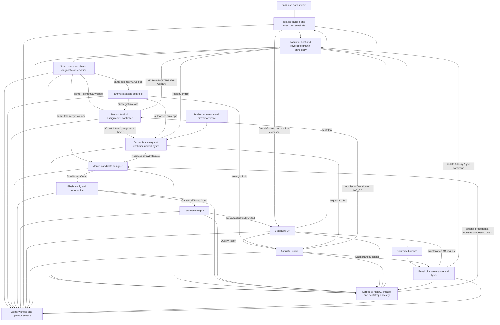

<!-- hld: simic HLD v4.1 chapter (ADR-0001 decomposition) · index: 00-INDEX.md -->
<!-- hld: source: v4.1 monolith lines 492–723 -->
## 7. System Context and Architectural Planes

The system operates inside nested learning and execution loops:

- Tolaria continuously runs ordinary host training against the task and data stream;
- Nissa publishes canonical observations at defined decision points;
- Narset acts at local developmental decision points;
- Tamiyo updates strategic envelopes at a slower cadence;
- Momir, Elesh and Tezzeret construct candidate artefacts;
- Urabrask defines QA plans and requests candidate trials in Tolaria;
- Augustin adjudicates the certified reports;
- Kasmina embodies admitted growth;
- Emrakul manages committed structure under continued-tenancy warrants;
- Sarpadia accumulates the complete causal history;
- and Oona exposes the account without becoming part of the control path.

| Plane | Subsystems | Purpose |
|---|---|---|
| **Constitutional infrastructure** | Leyline | Defines contracts, grammar profiles, compatibility, policy records and invariants |
| **Training and execution infrastructure** | Tolaria | Trains the live host and executes deterministic ordinary, replay and branch worlds |
| **Historical infrastructure** | Sarpadia | Retains lineages, reference ancestry, outcomes, failures and split-safe datasets |
| **Strategic agency** | Tamiyo | Allocates regional resources, permissions and risk over long horizons |
| **Tactical commissioning** | Narset | Decides whether and where to commission growth and manages pre-commit actions |
| **Observation** | Nissa | Publishes what the host is doing without prescribing what should be built |
| **Synthesis** | Momir, Elesh, Tezzeret | Designs, canonicalises and compiles growth |
| **Assurance and adjudication** | Urabrask, Augustin | Establishes empirical evidence, then judges it independently |
| **Embodiment and maintenance** | Kasmina, Emrakul | Introduces growth safely and removes obsolete committed structure |
| **Witness** | Oona | Exposes an auditable account without steering it |

### 7.1 Logical architecture



The two Nissa arrows to Narset and Momir are independent publications of the same observation identity. Narset is not a telemetry proxy. The request resolver is deterministic contract assembly, not a fifteenth agent: it applies Leyline compatibility rules to Narset's intent, Tamiyo's envelope, and Kasmina's region declaration.

### 7.2 Ordinary training loop

Tolaria owns the operational loop that trains the host:

```text
load or create TrainingRunSpec
        ↓
materialise data stream and device topology
        ↓
execute Kasmina host forward pass
        ↓
compute task loss
        ↓
perform host optimiser step
        ↓
advance schedulers and logical time
        ↓
Nissa captures and publishes a canonical observation
        ↓
invoke permitted strategic/tactical decision points
        ↓
checkpoint, snapshot or continue
```

Tamiyo and Narset govern developmental actions around this loop. They do not perform SGD. Kasmina supplies the model and its growth mechanics. Tolaria performs the execution.

### 7.3 Observation and commissioning loop

```text
Nissa observes Snapshot S at decision point T
        ↓
Nissa publishes TelemetryEnvelope O
        ├──→ Narset: should work be commissioned, where, and under what class?
        └──→ Momir: what structure would address this observed state?

Tamiyo supplies StrategicEnvelope E
Narset emits GrowthIntent I referencing O and E
Kasmina supplies RegionContract R
Leyline supplies compatible GrammarProfile G
        ↓
pure request resolution: (O, E, I, R, G) → GrowthRequest Q
        ↓
Momir receives O and Q separately
```

Momir rejects a call where the observation, snapshot, region, or compatibility identifiers do not reconcile. A `GrowthIntent` never contains a copy of telemetry.

### 7.4 Candidate assurance and adjudication loop

```text
Tezzeret artefact
        ↓
Urabrask builds a blinded TestPlan
        ↓
Tolaria restores a common Snapshot and executes:
        candidate branches + controls + mandatory no-op
        ↓
Urabrask verifies runtime conformance and certifies measurements
        ↓
QualityReport
        ↓
Augustin applies eligibility, budget, risk and utility policy
        ↓
ADMIT one / REJECT / DEFER / REQUIRE_RETEST / NO_OP
```

### 7.5 Control hierarchy

```text
Tamiyo
  └── establishes StrategicEnvelope
        └── Narset chooses local actions
              ├── WAIT
              ├── COMMISSION_GROWTH → GrowthIntent
              ├── BEGIN_MATURATION
              ├── REQUEST_QA
              ├── REQUEST_ADJUDICATION
              ├── BEGIN_BLEND
              ├── HOLD
              ├── ABORT
              └── COMMIT

After COMMIT:
  Narset relinquishes ordinary ownership
        └── Emrakul manages physical maintenance
              ├── REQUEST_REVIEW
              ├── HOLD
              ├── SEDATE
              ├── DECAY
              └── LYSE
```

Urabrask and Augustin are independent of this command hierarchy. Urabrask certifies evidence. Augustin issues admission and maintenance warrants. Neither performs Kasmina state transitions. Tolaria is beneath the hierarchy as neutral execution infrastructure.

### 7.6 The newsroom authority model

The newsroom analogy provides an explanatory overlay, not a second architecture:

```text
Nissa reports source material
Tamiyo funds the desk
Narset commissions the assignment
Momir authors the candidate
Elesh applies standards and canonical form
Tezzeret produces the executable edition
Urabrask fact-checks and proof-tests it in Tolaria
Augustin publishes, returns, defers, or spikes it
Kasmina integrates it into the live edition
Emrakul corrects, withdraws, or retires it later
Sarpadia preserves the complete archive
Oona presents the account
Leyline supplies the editorial constitution
```

The analogy is useful because it makes an authority leak audible. “The assignments editor rewrote the source notes before the writer saw them” is the same defect as Narset mediating Nissa's evidence. Appendix E provides the full mapping and review prompts.

## 8. Subsystem Map

| Subsystem | Primary responsibility | Key outputs | Explicitly does not own |
|---|---|---|---|
| **Leyline** | Typed contracts, schema versions, grammar profiles, request resolution, compatibility, policy record formats and ordering invariants | Versioned records, validators, warrants, rule vocabularies and resolved constraints | Case-specific policy, diagnosis or execution |
| **Tolaria** | Host training and deterministic execution: data, optimisers, devices, precision, distributed scheduling, snapshots, replay, branches and rollback | `TrainingRunState`, `Snapshot`, `BranchResult`, execution manifests | Utility weights, candidate preference or verdicts |
| **Sarpadia** | Append-only history, lineage, bootstrap reference population, outcomes, retrieval and split-safe datasets | `GrowthRecord`, `BootstrapAncestryContext`, retrieval sets, lineage graphs and blinded views | Live-host mutation or self-approval |
| **Tamiyo** | Strategic budgets, regional priorities, exploration quotas, cooldowns and long-horizon risk | `StrategicEnvelope` | Local action timing or candidate choice |
| **Narset** | Tactical commissioning and pre-commit lifecycle actions | `GrowthIntent`, `LifecycleCommand`, review requests and escalations | Diagnostic captions, ancestor choice, topology hints, unallocated budget or structural generation |
| **Nissa** | Ablated host telemetry, direct evidence publication and diagnostic provenance | `TelemetryEnvelope` | `should_grow`, structural recommendations, reward or verdicts |
| **Momir** | Raw candidate topology, parameters, mutation and recombination | `RawGrowthGraph` | Intervention timing, structural approval, testing or admission |
| **Elesh** | Static verification, canonicalisation, semantic hashing and structural legality | `CanonicalGrowthSpec`, structural reports | Runtime QA, task utility or lifecycle policy |
| **Tezzeret** | Lowering, kernel selection, fusion, memory planning and compilation | `ExecutableGrowthArtifact`, compilation manifest | Semantic topology changes, QA or admission |
| **Urabrask** | Dynamic QA, runtime conformance, regression, branch measurement and evidence certification | `TestPlan`, `QualityReport` | Admission, no-op policy or lifecycle commands |
| **Augustin** | Provider-blind admission and continued-tenancy adjudication | `AdmissionDecision`, `MaintenanceDecision`, warrants | Test execution, compilation or host mutation |
| **Kasmina** | Host model, insertion-region declarations, slots, gradient routing, maturation, blending and physical lifecycle | `RegionContract`, embodied state and lifecycle events | Stock blueprint ontology or whether a growth deserves admission |
| **Emrakul** | Safe post-commit sedation, decay, consolidation and lysis | Maintenance requests and warranted lifecycle commands | Candidate construction or judgement |
| **Oona** | Event projections, flight recorder, TUI/dashboard adapters, audit bundles and alerts | Operator views and audit records | Training control or source-of-truth schemas |

The deterministic request resolver is a Leyline application service operating over immutable `GrowthIntent`, `StrategicEnvelope`, `RegionContract`, and `GrammarProfile` records. It performs no diagnosis and has no learned policy.

<!-- hld: source: v4.1 monolith lines 1301–1569 -->
## 10. End-to-End Operating Flow

### 10.1 Ordinary host training in Tolaria

Tolaria materialises the `TrainingRunSpec`, constructs the data and device environment, and advances the Kasmina host through ordinary optimisation.

It owns:

- batch acquisition and deterministic ordering;
- host forward and backward execution;
- optimiser and scheduler stepping;
- precision and device policy;
- distributed execution;
- checkpointing;
- logical time;
- callback and decision-point scheduling;
- and measured execution spend.

Tamiyo is not “the trainer” in this sense. It is a strategic controller around a host that Tolaria trains.

### 10.2 Strategic allocation

At a slow cadence, Tamiyo consumes coarse host health, regional histories, current capacity, recent interventions and strategic objectives. It emits a `StrategicEnvelope` specifying:

- which regions may grow;
- how much parameter and compute capacity each may consume;
- maximum concurrent growth;
- acceptable risk and churn;
- exploration allowances;
- permitted grammar profiles;
- and cooldowns or embargoes.

Tamiyo may reserve capacity for anticipated future pressure, but it cannot select an immediate candidate, choose an ancestor, or issue a blend command.

### 10.3 Local observation and direct publication

Nissa observes the host at each local decision point. Germination telemetry is taken from the **ablated path**, so the condition describes the deficit without assistance from an existing growth.

Nissa constructs one canonical `TelemetryEnvelope` bound to the current Tolaria snapshot and publishes that same observation identity independently:

```text
Nissa
  ├── TelemetryEnvelope O ──→ Narset
  ├── TelemetryEnvelope O ──→ Momir
  ├── permitted summary  ───→ Tamiyo
  ├── append-only record ───→ Sarpadia
  └── event projection   ───→ Oona
```

Nissa emits measurements and provenance, not conclusions. Narset is not permitted to produce a second “designer telemetry” object.

### 10.4 Tactical commission

Narset receives Nissa's telemetry, the active `StrategicEnvelope`, Kasmina local lifecycle state, prior Augustin decisions, and compact operational history. It chooses among legal local actions:

```text
WAIT
COMMISSION_GROWTH
CONTINUE_MATURATION
REQUEST_QA
REQUEST_ADJUDICATION
BEGIN_BLEND
CONTINUE_BLEND
HOLD
ABORT
COMMIT
ESCALATE_TO_TAMIYO
```

A `COMMISSION_GROWTH` action creates a narrow `GrowthIntent`. Narset chooses whether intervention is warranted, which permitted insertion region owns the assignment, and what operational class applies. It does not select a seed family, ancestor, rank, width, operator, or diagnosis for Momir.

### 10.5 Deterministic request resolution

A pure resolver operating under Leyline combines:

```text
GrowthIntent
+ StrategicEnvelope
+ Kasmina RegionContract
+ active GrammarProfile
= GrowthRequest
```

The resolver:

- validates the intent against Tamiyo's active authority;
- obtains the region's tensor contract from Kasmina;
- selects only a grammar profile already permitted by the envelope and supported by Elesh and Tezzeret;
- derives exact bounded budgets from the requested resource class;
- binds observation, host state, snapshot, region and schema identities;
- canonicalises representation and field ordering;
- and fails closed on incompatibility.

It does not inspect task utility, choose a candidate family, or infer a structural solution.

### 10.6 Candidate design

Momir receives independent inputs with preserved provenance:

```text
TelemetryEnvelope               from Nissa
GrowthRequest                   from deterministic resolution under Leyline
ProposalBatchRequest            from orchestration
BootstrapAncestryContext | null from Sarpadia during the bootstrap curriculum
ordinary retrieval context      from Sarpadia where enabled
```

Momir may design:

- faithful reconstructions during structural literacy;
- bounded mutations of successful or failed ancestors;
- recombinations of compatible lineages;
- fresh candidates;
- deterministic proposals;
- or stochastic best-of-\(K\) pools.

Research controls such as stock Norm, Attention, Convolution, random, analytic, retrieval, online-optimised or human-designed candidates enter through the same downstream contracts and remain blinded during QA and judgement.

Momir never reads Narset hidden state or a Narset-authored diagnostic summary. Its output must remain valid when bootstrap ancestry is absent.

### 10.7 Structural conformance

Elesh performs:

- graph grammar validation;
- tensor shape inference and alignment;
- insertion-contract checks;
- cycle and reachability checks;
- gradient-flow analysis;
- zero-influence verification;
- static parameter and memory accounting;
- forbidden-operation detection;
- dead-node elimination;
- semantics-preserving graph simplification;
- deterministic ordering;
- canonical parameter layout;
- equivalence-class detection;
- and semantic hashing.

A failed candidate receives a structured rejection report and is stored in Sarpadia. A successful candidate becomes a `CanonicalGrowthSpec`.

Elesh may simplify only where semantic equivalence is established. Predicted usefulness is not structural equivalence.

### 10.8 Compilation

Tezzeret lowers each canonical specification for the target Tolaria runtime.

It may perform:

- kernel selection;
- operation fusion;
- layout planning;
- memory planning;
- device-specific lowering;
- eager or compiled realisation;
- and asynchronous build where supported.

It emits an `ExecutableGrowthArtifact` plus a compilation manifest linking it to the canonical semantic hash.

Compilation success does not imply runtime validity or admission.

### 10.9 QA planning and execution

Urabrask creates a blinded `TestPlan` covering:

- canonical-to-artefact runtime equivalence;
- finite outputs and gradients;
- gradient-routing conformance;
- zero-influence behaviour;
- determinism;
- budget adherence;
- immediate task effect;
- short- and longer-horizon trajectory effect;
- integration shock;
- regression tests;
- and mandatory no-op comparison.

Tolaria restores the complete snapshot and executes the requested branches over identical future data.

Urabrask certifies the returned evidence into a `QualityReport`. It may mark hard defects, incomplete evidence and uncertainty. It does not issue a verdict.

### 10.10 Independent adjudication

Augustin receives a blinded `QualityReport`, the resolved request, the active `StrategicEnvelope`, and the applicable policy version.

It first applies hard eligibility:

- structural and semantic identity valid;
- compilation conformance valid;
- runtime and gradient checks passed;
- required determinism passed;
- evidence complete enough for the assurance class;
- and measured spend inside declared budget.

It then computes policy utility, risk and uncertainty relative to no-op. It may:

```text
ADMIT
NO_OP
REJECT
DEFER
REQUIRE_RETEST
```

A growth is not entitled to publication merely because Narset commissioned it.

### 10.11 Germination and maturation

On admission, Narset issues a warranted command to Kasmina.

Kasmina:

- verifies the Augustin warrant;
- verifies the candidate semantic hash and artefact identity;
- instantiates the growth at zero influence;
- configures one-shot or nursery mode;
- isolates forward influence during maturation;
- applies the declared trainability mask;
- and records lifecycle state.

Tolaria executes any maturation steps. Maturation spend is charged to the growth.

### 10.12 Integration and commitment

Before blending, a nursery-matured growth is re-qualified against the current host state. If host drift has invalidated it, Narset aborts or requests fresh QA rather than integrating stale growth.

Kasmina applies the authorised blend schedule. Narset may hold, continue, reverse, abort or commit within its pre-commit authority and the Augustin warrant.

At commitment, ordinary ownership transfers from Narset to Emrakul.

### 10.13 Continued-tenancy review and maintenance

Emrakul schedules periodic or event-driven maintenance review.

Urabrask requests counterfactual evidence in Tolaria, including separate no-growth or re-adaptation branches where required. Augustin issues a `MaintenanceDecision`:

```text
RETAIN
RETEST
SEDATE
DECAY
LYSE
```

Emrakul executes the authorised safe physical transition through Kasmina. It cannot change the verdict or generate a replacement.

### 10.14 Memory and witness

Sarpadia stores:

- direct Nissa observation identity;
- Tamiyo envelope;
- Narset intent;
- resolved request;
- proposal-batch metadata;
- optional bootstrap ancestry;
- raw candidates and lineages;
- Elesh reports;
- Tezzeret manifests;
- Tolaria snapshots and branches;
- Urabrask plans and reports;
- Augustin decisions;
- lifecycle traces;
- spend and rent;
- determinism manifests;
- and terminal outcomes.

Oona presents the same causal chain to operators. It may show the newsroom view—source, assignment, draft, standards, production, fact check, publication decision, placement, correction and archive—but it remains read-only.

